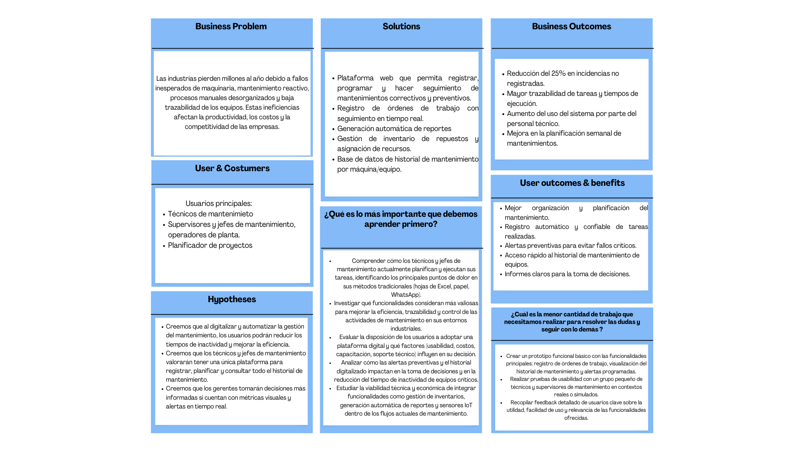

# 
Project Report

    <strong>Universidad Peruana de Ciencias Aplicadas</strong> 
    </img> 
    <strong>Ingeniería de Software - 2025-1</strong> 
    <strong>Desarrollo de Aplicaciones Open Source- 4304</strong> 
    <strong>Profesor: Efraín Ricardo Bautista Ubillús</strong> 
     <strong>Informe del Trabajo Final</strong>

    <strong>Startup: wiwiTech</strong> 
    <strong>Producto: Mecanet</strong>

    <h3>Team Members:</h3>
    <table align="center">
        <tr>
            <th style="text-align:center;">Member</th>
            <th style="text-align:center;">Code</th>
        </tr>
        <tr>
            <td>Ariana Cecilia Agreda Sobrino</td>
            <td>u202315044</td>
        </tr>
        <tr>
            <td>Claudia Valeria Belledonne Espinoza</td>
            <td>u202210259</td>
        </tr>
        <tr>
            <td>Mauricio Daniel Elera Rodríguez</td>
            <td>u202313702</td>
        </tr>
        <tr>
            <td>Jean Pool Huaman De La Cruz</td>
            <td>u20201e781</td>
        </tr>
        <tr>
            <td>Britney Delhy Qqueso Rodriguez</td>
            <td>u20211g671</td>
        </tr>
    </table>

    <strong>Abril, 2025</strong>

 

<h1 align="center">Registro de versiones del Informe</h1>
 
<table>
        <thead>
            <tr>
                <th>Versión</th>
                <th>Fecha</th>
                <th>Autor</th>
                <th>Descripción de modificaciones</th>
            </tr>
        </thead>
        <tbody>
            <tr>
                <th>TB1</th>
                <th></th>
                <td>
                    <ul>
          <li>..</li>
          <li>..</li>
          <li>..</li>
          <li>..</li>
                    <ul>
           </td>
      <td>            
             <ul>
          <li>Capítulo I: Introducción</li>
          <li>Capítulo II: Requirements Elicitation & Analysis</li>
          <li>Capítulo III: Requirements Specification</li>
          <li>Capítulo IV: Product Design</li>
          <li>Avance del Capítulo V: Product Implementation, Validation & Deployment hasta el punto 5.2.1.8</li>
          <li>Avance de Conclusiones, Bibliografía y Anexos</li>
        </ul>
      </td>
  </tr>
</tbody>
</table>

# Project Report Collaboration Insights
[Link de repositorio del reporte:](https://github.com/wiwitech1/Project-Report): https://github.com/wiwitech1/Project-Report.git

# Contenido
[Student Outcome](#student-outcome)

[Capítulo I: Introducción](#capítulo-i-introducción)
- [1.1. Startup Profile](#11-startup-profile)
  - [1.1.1. Descripción de la Startup](#111-descripción-de-la-startup)
  - [1.1.2. Perfiles de integrantes del equipo](#112-perfiles-de-integrantes-del-equipo)
- [1.2. Solution Profile](#12-solution-profile)
  - [1.2.1 Antecedentes y problemática](#121-antecedentes-y-problemática)
  - [1.2.2 Lean UX Process](#122-lean-ux-process)
    - [1.2.2.1. Lean UX Problem Statements](#1221-lean-ux-problem-statements)
    - [1.2.2.2. Lean UX Assumptions](#1222-lean-ux-assumptions)
    - [1.2.2.3. Lean UX Hypothesis Statements](#1223-lean-ux-hypothesis-statements)
    - [1.2.2.4. Lean UX Canvas](#1224-lean-ux-canvas)
- [1.3. Segmentos objetivo](#13-segmentos-objetivo)

[Capítulo II: Requirements Elicitation & Analysis](#capítulo-ii-requirements-elicitation--analysis)
- [COURSE PROJECT](#course-project)
- [Project Report Collaboration Insights](#project-report-collaboration-insights)
- [Contenido](#contenido)
- [Student Outcome](#student-outcome)
- [Capítulo I: Introducción](#capítulo-i-introducción)
  - [1.1. Startup Profile](#11-startup-profile)
    - [1.1.1. Descripción de la Startup](#111-descripción-de-la-startup)
    - [1.1.2. Perfiles de integrantes del equipo](#112-perfiles-de-integrantes-del-equipo)
  - [1.2. Solution Profile](#12-solution-profile)
    - [1.2.1 Antecedentes y problemática](#121-antecedentes-y-problemática)
    - [1.2.2 Lean UX Process](#122-lean-ux-process)
      - [1.2.2.1. Lean UX Problem Statements](#1221-lean-ux-problem-statements)
      - [1.2.2.2. Lean UX Assumptions](#1222-lean-ux-assumptions)
      - [1.2.2.3. Lean UX Hypothesis Statements](#1223-lean-ux-hypothesis-statements)
      - [1.2.2.4. Lean UX Canvas](#1224-lean-ux-canvas)
  - [1.3. Segmentos objetivo](#13-segmentos-objetivo)
- [Capítulo II: Requirements Elicitation \& Analysis](#capítulo-ii-requirements-elicitation--analysis)
  - [2.1. Competidores](#21-competidores)
    - [2.1.1. Análisis competitivo](#211-análisis-competitivo)
    - [2.1.2. Estrategias y tácticas frente a competidores](#212-estrategias-y-tácticas-frente-a-competidores)
  - [2.2. Entrevistas](#22-entrevistas)
    - [2.2.1. Diseño de entrevistas](#221-diseño-de-entrevistas)
    - [2.2.2. Registro de entrevistas](#222-registro-de-entrevistas)
    - [2.2.3. Análisis de entrevistas](#223-análisis-de-entrevistas)
  - [2.3. Needfinding](#23-needfinding)
    - [2.3.1. User Personas](#231-user-personas)
    - [2.3.2. User Task Matrix](#232-user-task-matrix)
    - [2.3.3. User Journey Mapping](#233-user-journey-mapping)
    - [2.3.4. Empathy Mapping](#234-empathy-mapping)
    - [2.3.5. As-is Scenario Mapping](#235-as-is-scenario-mapping)
  - [2.4. Ubiquitous Language](#24-ubiquitous-language)
- [Capítulo III: Requirements Specification](#capítulo-iii-requirements-specification)
  - [3.1. To-Be Scenario Mapping](#31-to-be-scenario-mapping)
  - [3.2. User Stories](#32-user-stories)
  - [3.3. Impact Mapping](#33-impact-mapping)
  - [3.4. Product Backlog](#34-product-backlog)
- [Capítulo IV: Product Design](#capítulo-iv-product-design)
  - [4.1. Style Guidelines](#41-style-guidelines)
    - [4.1.1. General Style Guidelines](#411-general-style-guidelines)
    - [4.1.2. Web Style Guidelines](#412-web-style-guidelines)
  - [4.2. Information Architecture](#42-information-architecture)
    - [4.2.1. Organization Systems.](#421-organization-systems)
    - [4.2.2. Labeling Systems.](#422-labeling-systems)
    - [4.2.3. SEO Tags and Meta Tags](#423-seo-tags-and-meta-tags)
    - [4.2.4. Searching Systems.](#424-searching-systems)
    - [4.2.5. Navigation Systems.](#425-navigation-systems)
  - [4.3. Landing Page UI Design.](#43-landing-page-ui-design)
    - [4.3.1. Landing Page Wireframe.](#431-landing-page-wireframe)
    - [4.3.2. Landing Page Mock-up.](#432-landing-page-mock-up)
  - [4.4. Web Applications UX/UI Design.](#44-web-applications-uxui-design)
    - [4.4.1. Web Applications Wireframes.](#441-web-applications-wireframes)
    - [4.4.2. Web Applications Wireflow Diagrams.](#442-web-applications-wireflow-diagrams)
    - [4.4.2. Web Applications Mock-ups.](#442-web-applications-mock-ups)
    - [4.4.3. Web Applications User Flow Diagrams.](#443-web-applications-user-flow-diagrams)
  - [4.5. Web Applications Prototyping.](#45-web-applications-prototyping)
  - [4.6. Domain-Driven Software Architecture.](#46-domain-driven-software-architecture)
    - [4.6.1. Software Architecture Context Diagram.](#461-software-architecture-context-diagram)
    - [4.6.2. Software Architecture Container Diagrams.](#462-software-architecture-container-diagrams)
    - [4.6.3. Software Architecture Components Diagrams.](#463-software-architecture-components-diagrams)
  - [4.7. Software Object-Oriented Design.](#47-software-object-oriented-design)
    - [4.7.1. Class Diagrams.](#471-class-diagrams)
    - [4.7.2. Class Dictionary.](#472-class-dictionary)
  - [4.8. Database Design.](#48-database-design)
    - [4.8.1. Database Diagram.](#481-database-diagram)
- [Capítulo V: Product Implementation, Validation \& Deployment](#capítulo-v-product-implementation-validation--deployment)
  - [5.1. Software Configuration Management.](#51-software-configuration-management)
    - [5.1.1. Software Development Environment Configuration.](#511-software-development-environment-configuration)
    - [5.1.2. Source Code Management.](#512-source-code-management)
    - [5.1.3. Source Code Style Guide \& Conventions.](#513-source-code-style-guide--conventions)
    - [5.1.4. Software Deployment Configuration.](#514-software-deployment-configuration)
  - [5.2. Landing Page, Services \& Applications Implementation](#52-landing-page-services--applications-implementation)
    - [5.2.1. Sprint 1](#521-sprint-1)
      - [5.2.1.1. Sprint Planning 1](#5211-sprint-planning-1)
      - [5.2.1.2. Aspect Leaders and Collaborators.](#5212-aspect-leaders-and-collaborators)
      - [5.2.1.3. Sprint Backlog n.](#5213-sprint-backlog-n)
      - [5.2.1.4. Development Evidence for Sprint Review.](#5214-development-evidence-for-sprint-review)
      - [5.2.1.5. Execution Evidence for Sprint Review.](#5215-execution-evidence-for-sprint-review)
      - [5.2.1.6. Services Documentation Evidence for Sprint Review.](#5216-services-documentation-evidence-for-sprint-review)
      - [5.2.1.7. Software Deployment Evidence for Sprint Review.](#5217-software-deployment-evidence-for-sprint-review)
      - [5.2.1.8. Team Collaboration Insights during Sprint.](#5218-team-collaboration-insights-during-sprint)
  - [5.3. Validation Interviews.](#53-validation-interviews)
    - [5.3.1. Diseño de Entrevistas.](#531-diseño-de-entrevistas)
    - [5.3.2. Registro de Entrevistas.](#532-registro-de-entrevistas)
    - [5.3.3. Evaluaciones según heurísticas.](#533-evaluaciones-según-heurísticas)
  - [5.4. Video About-the-Product.](#54-video-about-the-product)
- [Conclusiones](#conclusiones)
  - [Conclusiones y recomendaciones.](#conclusiones-y-recomendaciones)
- [Video About-the-Team.](#video-about-the-team)
- [Bibliografía](#bibliografía)
- [Anexos](#anexos)

[Capítulo III: Requirements Specification](#capítulo-iii-requirements-specification)
- [3.1. To-Be Scenario Mapping](#31-to-be-scenario-mapping)
- [3.2. User Stories](#32-user-stories)
- [3.3. Impact Mapping](#33-impact-mapping)
- [3.4. Product Backlog](#34-product-backlog)

[Capítulo IV: Product Design](#capítulo-iv-product-design)
- [COURSE PROJECT](#course-project)
- [Project Report Collaboration Insights](#project-report-collaboration-insights)
- [Contenido](#contenido)
- [Student Outcome](#student-outcome)
- [Capítulo I: Introducción](#capítulo-i-introducción)
  - [1.1. Startup Profile](#11-startup-profile)
    - [1.1.1. Descripción de la Startup](#111-descripción-de-la-startup)
    - [1.1.2. Perfiles de integrantes del equipo](#112-perfiles-de-integrantes-del-equipo)
  - [1.2. Solution Profile](#12-solution-profile)
    - [1.2.1 Antecedentes y problemática](#121-antecedentes-y-problemática)
    - [1.2.2 Lean UX Process](#122-lean-ux-process)
      - [1.2.2.1. Lean UX Problem Statements](#1221-lean-ux-problem-statements)
      - [1.2.2.2. Lean UX Assumptions](#1222-lean-ux-assumptions)
      - [1.2.2.3. Lean UX Hypothesis Statements](#1223-lean-ux-hypothesis-statements)
      - [1.2.2.4. Lean UX Canvas](#1224-lean-ux-canvas)
  - [1.3. Segmentos objetivo](#13-segmentos-objetivo)
- [Capítulo II: Requirements Elicitation \& Analysis](#capítulo-ii-requirements-elicitation--analysis)
  - [2.1. Competidores](#21-competidores)
    - [2.1.1. Análisis competitivo](#211-análisis-competitivo)
    - [2.1.2. Estrategias y tácticas frente a competidores](#212-estrategias-y-tácticas-frente-a-competidores)
  - [2.2. Entrevistas](#22-entrevistas)
    - [2.2.1. Diseño de entrevistas](#221-diseño-de-entrevistas)
    - [2.2.2. Registro de entrevistas](#222-registro-de-entrevistas)
    - [2.2.3. Análisis de entrevistas](#223-análisis-de-entrevistas)
  - [2.3. Needfinding](#23-needfinding)
    - [2.3.1. User Personas](#231-user-personas)
    - [2.3.2. User Task Matrix](#232-user-task-matrix)
    - [2.3.3. User Journey Mapping](#233-user-journey-mapping)
    - [2.3.4. Empathy Mapping](#234-empathy-mapping)
    - [2.3.5. As-is Scenario Mapping](#235-as-is-scenario-mapping)
  - [2.4. Ubiquitous Language](#24-ubiquitous-language)
- [Capítulo III: Requirements Specification](#capítulo-iii-requirements-specification)
  - [3.1. To-Be Scenario Mapping](#31-to-be-scenario-mapping)
  - [3.2. User Stories](#32-user-stories)
  - [3.3. Impact Mapping](#33-impact-mapping)
  - [3.4. Product Backlog](#34-product-backlog)
- [Capítulo IV: Product Design](#capítulo-iv-product-design)
  - [4.1. Style Guidelines](#41-style-guidelines)
    - [4.1.1. General Style Guidelines](#411-general-style-guidelines)
    - [4.1.2. Web Style Guidelines](#412-web-style-guidelines)
  - [4.2. Information Architecture](#42-information-architecture)
    - [4.2.1. Organization Systems.](#421-organization-systems)
    - [4.2.2. Labeling Systems.](#422-labeling-systems)
    - [4.2.3. SEO Tags and Meta Tags](#423-seo-tags-and-meta-tags)
    - [4.2.4. Searching Systems.](#424-searching-systems)
    - [4.2.5. Navigation Systems.](#425-navigation-systems)
  - [4.3. Landing Page UI Design.](#43-landing-page-ui-design)
    - [4.3.1. Landing Page Wireframe.](#431-landing-page-wireframe)
    - [4.3.2. Landing Page Mock-up.](#432-landing-page-mock-up)
  - [4.4. Web Applications UX/UI Design.](#44-web-applications-uxui-design)
    - [4.4.1. Web Applications Wireframes.](#441-web-applications-wireframes)
    - [4.4.2. Web Applications Wireflow Diagrams.](#442-web-applications-wireflow-diagrams)
    - [4.4.2. Web Applications Mock-ups.](#442-web-applications-mock-ups)
    - [4.4.3. Web Applications User Flow Diagrams.](#443-web-applications-user-flow-diagrams)
  - [4.5. Web Applications Prototyping.](#45-web-applications-prototyping)
  - [4.6. Domain-Driven Software Architecture.](#46-domain-driven-software-architecture)
    - [4.6.1. Software Architecture Context Diagram.](#461-software-architecture-context-diagram)
    - [4.6.2. Software Architecture Container Diagrams.](#462-software-architecture-container-diagrams)
    - [4.6.3. Software Architecture Components Diagrams.](#463-software-architecture-components-diagrams)
  - [4.7. Software Object-Oriented Design.](#47-software-object-oriented-design)
    - [4.7.1. Class Diagrams.](#471-class-diagrams)
    - [4.7.2. Class Dictionary.](#472-class-dictionary)
  - [4.8. Database Design.](#48-database-design)
    - [4.8.1. Database Diagram.](#481-database-diagram)
- [Capítulo V: Product Implementation, Validation \& Deployment](#capítulo-v-product-implementation-validation--deployment)
  - [5.1. Software Configuration Management.](#51-software-configuration-management)
    - [5.1.1. Software Development Environment Configuration.](#511-software-development-environment-configuration)
    - [5.1.2. Source Code Management.](#512-source-code-management)
    - [5.1.3. Source Code Style Guide \& Conventions.](#513-source-code-style-guide--conventions)
    - [5.1.4. Software Deployment Configuration.](#514-software-deployment-configuration)
  - [5.2. Landing Page, Services \& Applications Implementation](#52-landing-page-services--applications-implementation)
    - [5.2.1. Sprint 1](#521-sprint-1)
      - [5.2.1.1. Sprint Planning 1](#5211-sprint-planning-1)
      - [5.2.1.2. Aspect Leaders and Collaborators.](#5212-aspect-leaders-and-collaborators)
      - [5.2.1.3. Sprint Backlog n.](#5213-sprint-backlog-n)
      - [5.2.1.4. Development Evidence for Sprint Review.](#5214-development-evidence-for-sprint-review)
      - [5.2.1.5. Execution Evidence for Sprint Review.](#5215-execution-evidence-for-sprint-review)
      - [5.2.1.6. Services Documentation Evidence for Sprint Review.](#5216-services-documentation-evidence-for-sprint-review)
      - [5.2.1.7. Software Deployment Evidence for Sprint Review.](#5217-software-deployment-evidence-for-sprint-review)
      - [5.2.1.8. Team Collaboration Insights during Sprint.](#5218-team-collaboration-insights-during-sprint)
  - [5.3. Validation Interviews.](#53-validation-interviews)
    - [5.3.1. Diseño de Entrevistas.](#531-diseño-de-entrevistas)
    - [5.3.2. Registro de Entrevistas.](#532-registro-de-entrevistas)
    - [5.3.3. Evaluaciones según heurísticas.](#533-evaluaciones-según-heurísticas)
  - [5.4. Video About-the-Product.](#54-video-about-the-product)
- [Conclusiones](#conclusiones)
  - [Conclusiones y recomendaciones.](#conclusiones-y-recomendaciones)
- [Video About-the-Team.](#video-about-the-team)
- [Bibliografía](#bibliografía)
- [Anexos](#anexos)

[Capítulo V: Product Implementation, Validation & Deployment](#capítulo-v-product-implementation-validation--deployment)
- [COURSE PROJECT](#course-project)
- [Project Report Collaboration Insights](#project-report-collaboration-insights)
- [Contenido](#contenido)
- [Student Outcome](#student-outcome)
- [Capítulo I: Introducción](#capítulo-i-introducción)
  - [1.1. Startup Profile](#11-startup-profile)
    - [1.1.1. Descripción de la Startup](#111-descripción-de-la-startup)
    - [1.1.2. Perfiles de integrantes del equipo](#112-perfiles-de-integrantes-del-equipo)
  - [1.2. Solution Profile](#12-solution-profile)
    - [1.2.1 Antecedentes y problemática](#121-antecedentes-y-problemática)
    - [1.2.2 Lean UX Process](#122-lean-ux-process)
      - [1.2.2.1. Lean UX Problem Statements](#1221-lean-ux-problem-statements)
      - [1.2.2.2. Lean UX Assumptions](#1222-lean-ux-assumptions)
      - [1.2.2.3. Lean UX Hypothesis Statements](#1223-lean-ux-hypothesis-statements)
      - [1.2.2.4. Lean UX Canvas](#1224-lean-ux-canvas)
  - [1.3. Segmentos objetivo](#13-segmentos-objetivo)
- [Capítulo II: Requirements Elicitation \& Analysis](#capítulo-ii-requirements-elicitation--analysis)
  - [2.1. Competidores](#21-competidores)
    - [2.1.1. Análisis competitivo](#211-análisis-competitivo)
    - [2.1.2. Estrategias y tácticas frente a competidores](#212-estrategias-y-tácticas-frente-a-competidores)
  - [2.2. Entrevistas](#22-entrevistas)
    - [2.2.1. Diseño de entrevistas](#221-diseño-de-entrevistas)
    - [2.2.2. Registro de entrevistas](#222-registro-de-entrevistas)
    - [2.2.3. Análisis de entrevistas](#223-análisis-de-entrevistas)
  - [2.3. Needfinding](#23-needfinding)
    - [2.3.1. User Personas](#231-user-personas)
    - [2.3.2. User Task Matrix](#232-user-task-matrix)
    - [2.3.3. User Journey Mapping](#233-user-journey-mapping)
    - [2.3.4. Empathy Mapping](#234-empathy-mapping)
    - [2.3.5. As-is Scenario Mapping](#235-as-is-scenario-mapping)
  - [2.4. Ubiquitous Language](#24-ubiquitous-language)
- [Capítulo III: Requirements Specification](#capítulo-iii-requirements-specification)
  - [3.1. To-Be Scenario Mapping](#31-to-be-scenario-mapping)
  - [3.2. User Stories](#32-user-stories)
  - [3.3. Impact Mapping](#33-impact-mapping)
  - [3.4. Product Backlog](#34-product-backlog)
- [Capítulo IV: Product Design](#capítulo-iv-product-design)
  - [4.1. Style Guidelines](#41-style-guidelines)
    - [4.1.1. General Style Guidelines](#411-general-style-guidelines)
    - [4.1.2. Web Style Guidelines](#412-web-style-guidelines)
  - [4.2. Information Architecture](#42-information-architecture)
    - [4.2.1. Organization Systems.](#421-organization-systems)
    - [4.2.2. Labeling Systems.](#422-labeling-systems)
    - [4.2.3. SEO Tags and Meta Tags](#423-seo-tags-and-meta-tags)
    - [4.2.4. Searching Systems.](#424-searching-systems)
    - [4.2.5. Navigation Systems.](#425-navigation-systems)
  - [4.3. Landing Page UI Design.](#43-landing-page-ui-design)
    - [4.3.1. Landing Page Wireframe.](#431-landing-page-wireframe)
    - [4.3.2. Landing Page Mock-up.](#432-landing-page-mock-up)
  - [4.4. Web Applications UX/UI Design.](#44-web-applications-uxui-design)
    - [4.4.1. Web Applications Wireframes.](#441-web-applications-wireframes)
    - [4.4.2. Web Applications Wireflow Diagrams.](#442-web-applications-wireflow-diagrams)
    - [4.4.2. Web Applications Mock-ups.](#442-web-applications-mock-ups)
    - [4.4.3. Web Applications User Flow Diagrams.](#443-web-applications-user-flow-diagrams)
  - [4.5. Web Applications Prototyping.](#45-web-applications-prototyping)
  - [4.6. Domain-Driven Software Architecture.](#46-domain-driven-software-architecture)
    - [4.6.1. Software Architecture Context Diagram.](#461-software-architecture-context-diagram)
    - [4.6.2. Software Architecture Container Diagrams.](#462-software-architecture-container-diagrams)
    - [4.6.3. Software Architecture Components Diagrams.](#463-software-architecture-components-diagrams)
  - [4.7. Software Object-Oriented Design.](#47-software-object-oriented-design)
    - [4.7.1. Class Diagrams.](#471-class-diagrams)
    - [4.7.2. Class Dictionary.](#472-class-dictionary)
  - [4.8. Database Design.](#48-database-design)
    - [4.8.1. Database Diagram.](#481-database-diagram)
- [Capítulo V: Product Implementation, Validation \& Deployment](#capítulo-v-product-implementation-validation--deployment)
  - [5.1. Software Configuration Management.](#51-software-configuration-management)
    - [5.1.1. Software Development Environment Configuration.](#511-software-development-environment-configuration)
    - [5.1.2. Source Code Management.](#512-source-code-management)
    - [5.1.3. Source Code Style Guide \& Conventions.](#513-source-code-style-guide--conventions)
    - [5.1.4. Software Deployment Configuration.](#514-software-deployment-configuration)
  - [5.2. Landing Page, Services \& Applications Implementation](#52-landing-page-services--applications-implementation)
    - [5.2.1. Sprint 1](#521-sprint-1)
      - [5.2.1.1. Sprint Planning 1](#5211-sprint-planning-1)
      - [5.2.1.2. Aspect Leaders and Collaborators.](#5212-aspect-leaders-and-collaborators)
      - [5.2.1.3. Sprint Backlog n.](#5213-sprint-backlog-n)
      - [5.2.1.4. Development Evidence for Sprint Review.](#5214-development-evidence-for-sprint-review)
      - [5.2.1.5. Execution Evidence for Sprint Review.](#5215-execution-evidence-for-sprint-review)
      - [5.2.1.6. Services Documentation Evidence for Sprint Review.](#5216-services-documentation-evidence-for-sprint-review)
      - [5.2.1.7. Software Deployment Evidence for Sprint Review.](#5217-software-deployment-evidence-for-sprint-review)
      - [5.2.1.8. Team Collaboration Insights during Sprint.](#5218-team-collaboration-insights-during-sprint)
  - [5.3. Validation Interviews.](#53-validation-interviews)
    - [5.3.1. Diseño de Entrevistas.](#531-diseño-de-entrevistas)
    - [5.3.2. Registro de Entrevistas.](#532-registro-de-entrevistas)
    - [5.3.3. Evaluaciones según heurísticas.](#533-evaluaciones-según-heurísticas)
  - [5.4. Video About-the-Product.](#54-video-about-the-product)
- [Conclusiones](#conclusiones)
  - [Conclusiones y recomendaciones.](#conclusiones-y-recomendaciones)
- [Video About-the-Team.](#video-about-the-team)
- [Bibliografía](#bibliografía)
- [Anexos](#anexos)

[Conclusiones](#conclusiones)
- [Conclusiones y recomendaciones](#conclusiones-y-recomendaciones)
- [Video About-the-Team](#video-about-the-team)

[Bibliografía](#bibliografía)

[Anexos](#anexos)

# Student Outcome

ABET – EAC - Student Outcome 5

Criterio: La capacidad de funcionar efectivamente en un equipo cuyos miembros juntos proporcionan liderazgo, crean un entorno de colaboración e inclusivo, establecen objetivos, planifican tareas y cumplen objetivos.

<table>
  <tr>
    <td><b>Criterio específico</b></td>
    <td><b>Acciones realizadas</b></td>
    <td><b>Conclusiones</b></td>
  </tr>
    </thead>
  <tbody>
    <tr>
      <td><b>Comunica oralmente con
efectividad a diferentes rangos
de audiencia.</b></td>
      <td>
        
<b>name  </b>

        
<b>TB1:</b>

        
..

        
<b>TP1:</b>

        
,..

        
<b>TB2:</b>

        
.

        
<b>TF:</b>

        
.

        
<b>name</b>

       
<b>TB1:</b>

        

        
<b>TP1:</b>

        

        
<b>TB2:</b>

        

        
<b>TF:</b>

        
.

        
<b>name</b>

        
<b>TB1:</b>

        
     
        

        
<b>TP1:</b>

        
.

        
<b>TB2:</b>

        

        
<b>TF:</b>

        
.

        
<b></b>

       
<b>TB1:</b>

        

        
<b>TP1:</b>

        

        
<b>TB2:</b>

        

        
<b>TF:</b>

        

      </td>
      <td>
        
<strong>TB1:</strong>

        

        
<strong>TP1:</strong>

        
.

        
<strong>TB2:</strong>

        

        
<strong>TF:</strong>

        

      </td>
    </tr>
    <tr>
      <td>Comunica por escrito con
efectividad a diferentes rangos
de audiencia.</td>
      <td>
        
<b>name  </b>

        
<b>TB1:</b>

        
..

        
<b>TP1:</b>

        
..

        
<b>TB2:</b>

        
..

        
<b>TF:</b>

        
..

        
<b>name</b>

       
<b>TB1:</b>

        
..

        
<b>TP1:</b>

        
..

        
<b>TB2:</b>

        
...

        
<b>TF:</b>

        
.

        
<b>name</b>

        
<b>TB1:</b>

        
..
        

        
<b>TP1:</b>

        
..

        
<b>TB2:</b>

        
...

        
<b>TF:</b>

        
.

        
<b>name</b>

       
<b>TB1:</b>

        
...

        
<b>TP1:</b>

        
...

        
<b>TB2:</b>

        
...

        
<b>TF:</b>

        
...

      </td>
       <td>
        
<strong>TB1:</strong>

        
..

        
<strong>TP1:</strong>

        
...

        
<strong>TB2:</strong>

        
..

        
<strong>TF:</strong>

        
...

      </td>
    </tr>
  </tbody>
</table>

# Capítulo I: Introducción
## 1.1. Startup Profile
### 1.1.1. Descripción de la Startup
### 1.1.2. Perfiles de integrantes del equipo

## 1.2. Solution Profile
### 1.2.1 Antecedentes y problemática
### 1.2.2 Lean UX Process
#### 1.2.2.1. Lean UX Problem Statements
#### 1.2.2.2. Lean UX Assumptions
**User Assumptions**  

**¿Quién es mi usuario?**  
Nuestros usuarios son técnicos de mantenimiento, jefes de planta, supervisores industriales y responsables de inventario que necesitan controlar el estado operativo de las máquinas y ejecutar mantenimientos con eficacia.  

**¿Dónde encaja nuestro producto en su trabajo o vida?**  
Mecanaut se integra directamente en la rutina diaria de trabajo industrial: planificación de tareas, ejecución de mantenimientos, gestión de inventario y análisis de reportes operativos.  

**¿Qué problemas tiene nuestro producto que resolver?**  
El descontrol en los mantenimientos, la falta de trazabilidad de órdenes de trabajo, la ausencia de alertas para mantenimientos preventivos, y la gestión manual del inventario de repuestos.  

**¿Cuándo y cómo es usado nuestro producto?**  
Se usa al inicio de la jornada para revisar tareas asignadas, durante el día para registrar mantenimientos y repuestos utilizados, y al cierre de turnos para reportar avances o fallas detectadas.  

**¿Qué características son importantes?**  
Gestión de órdenes de servicio, agenda de citas, control de inventario de repuestos, historial de mantenimiento por vehículo, notificaciones automáticas, generación de presupuestos, seguimiento del progreso de trabajos y reportes de desempeño del taller.  

**¿Cómo debe verse nuestro producto y cómo debe comportarse?**  
Debe tener un diseño limpio y profesional, con navegación clara y flujos rápidos. Debe permitir operar fácilmente desde computadoras o dispositivos móviles, ofrecer acceso rápido a información clave y simplificar la digitalización de procesos técnicos.  

**Business Assumptions**  

Creemos que las empresas industriales necesitan una plataforma centralizada y fácil de usar para gestionar el mantenimiento de sus máquinas de forma eficiente. Mecanaut resolverá esta necesidad conectando activos, tareas, repuestos y personal técnico en una sola herramienta, mejorando así la planificación, ejecución y seguimiento de los mantenimientos.  

Nuestros primeros clientes serán medianas y grandes industrias que aún utilizan métodos manuales y buscan digitalizar sus procesos para reducir paros no programados y mejorar la productividad. Les ofreceremos una solución con precios escalables y accesibles, soporte técnico y capacitación especializada.  

#### 1.2.2.3. Lean UX Hypothesis Statements
#### 1.2.2.4. Lean UX Canvas

## 1.3. Segmentos objetivo

# Capítulo II: Requirements Elicitation & Analysis

## 2.1. Competidores
### 2.1.1. Análisis competitivo
### 2.1.2. Estrategias y tácticas frente a competidores
## 2.2. Entrevistas
### 2.2.1. Diseño de entrevistas
### 2.2.2. Registro de entrevistas 
### 2.2.3. Análisis de entrevistas
## 2.3. Needfinding
### 2.3.1. User Personas
### 2.3.2. User Task Matrix
### 2.3.3. User Journey Mapping
### 2.3.4. Empathy Mapping
### 2.3.5. As-is Scenario Mapping
En esta sección, se presenta el As-Is Scenario Mapping de los segmentos objetivo. Este mapeo nos permite identificar y comprender a fondo los puntos de contacto que tiene el usuario a lo largo de su interacción.

**Segmento #1: Administradores y Responsables de Producción**  

**Brainstorm individually:**  
  

**Identify the highs and lows:**  
  

**Áreas Positivas:**  
- Muestra interés activo por implementar soluciones tecnológicas para optimizar procesos.
- Ve el valor de una solución centralizada para el seguimiento del mantenimiento.

**Áreas Negativas:**  
- Experimenta frustración al comparar opciones sin poder validar cuál se adapta mejor a sus necesidades reales.
- No tiene visibilidad del impacto concreto que tiene el software en el trabajo diario de su equipo.

**Blank Areas (Áreas que requieren aprender más):**  
- Cómo recopila la información técnica y operativa para tomar decisiones.
- Cómo se comunica actualmente con los técnicos de mantenimiento para monitorear avances o problemas.
- Qué tan involucrado está en el seguimiento post-implementación de herramientas digitales.

**Segmento #2: Técnicos y Operarios de Mantenimiento**  

**Brainstorm individually:**  
  

**Identify the highs and lows:**  
  

**Áreas Positivas:**  
- Tiene disposición a usar herramientas tecnológicas si estas le facilitan el trabajo y ahorran tiempo.
- Sabe resolver problemas técnicos bajo presión, incluso con recursos limitados.

**Áreas Negativas:**  
- Se frustra al recibir tareas de manera informal y sin instrucciones claras.
- Tiene dificultades para registrar de manera organizada el trabajo que realiza.

**Blank Areas (Áreas que requieren aprender más):**  
- Cómo realiza el diagnóstico de fallas antes de ejecutar un mantenimiento.
- Cómo se coordina con sus superiores y otros departamentos.
- Qué espera exactamente de una herramienta digital en su día a día (usabilidad, funciones, soporte, etc.).

## 2.4. Ubiquitous Language

# Capítulo III: Requirements Specification

## 3.1. To-Be Scenario Mapping
## 3.2. User Stories
<table>
    <tr>
        <td>Story ID</td>
        <td>Título</td>
        <td>Descripción</td>
        <td>Criterios de aceptación</td>
        <td>Linked ID</td>
    </tr>
    <tr>
  <td>US01</td>
  <td>Registro de maquinarias</td>
  <td align="justify">
    Como administrador de mantenimiento, quiero registrar maquinarias en el sistema para llevar un control detallado de los equipos que operan en planta.
  </td>
  <td align="justify">
    <ul>
      <li><strong>Escenario 1: Registro exitoso</strong> 
      Given que el administrador accede al sistema desde el módulo de gestión de activos, 
      When completa todos los campos obligatorios del formulario de maquinaria (nombre, código, tipo, ubicación, estado, fabricante), 
      Then el sistema guarda la maquinaria correctamente y muestra una notificación de éxito.</li>
        
<li><strong>Escenario 2: Campos incompletos</strong> 
      Given que el administrador intenta registrar una maquinaria, 
      When omite uno o más campos obligatorios, 
      Then el sistema bloquea el registro y muestra un mensaje de error específico indicando qué campos faltan completar.</li>
        
<li><strong>Escenario 3: Código duplicado</strong> 
      Given que ya existe una maquinaria registrada con un código único, 
      When el administrador intenta registrar una nueva maquinaria con el mismo código, 
      Then el sistema impide el registro y muestra una advertencia indicando la duplicidad del código.</li>
    </ul>
  </td>
  <td>EP01</td>
</tr>
<tr>
  <td>US02</td>
  <td>Registro de líneas de producción</td>
  <td align="justify">
    Como administrador de mantenimiento, quiero registrar líneas de producción con prioridad asignada para poder planificar eficientemente las tareas de mantenimiento preventivo y correctivo.
  </td>
  <td align="justify">
    <ul>
      <li><strong>Escenario 1: Registro exitoso</strong> 
      Given que el administrador accede al módulo de líneas de producción, 
      When completa el formulario con el nombre, ubicación y selecciona una prioridad válida (Alta, Media, Baja), 
      Then el sistema registra la línea correctamente y la muestra en la lista de líneas activas.</li>
  
<li><strong>Escenario 2: Prioridad no asignada</strong> 
      Given que el administrador intenta registrar una nueva línea de producción, 
      When omite seleccionar una prioridad, 
      Then el sistema bloquea el registro y muestra un mensaje de error indicando que la prioridad es obligatoria.</li>
    </ul>
  </td>
  <td>EP01</td>
</tr>

<tr>
  <td>US03</td>
  <td>Generación de órdenes de trabajo correctivas</td>
  <td align="justify">
    Como administrador de mantenimiento, quiero generar órdenes de trabajo correctivas para responder a mantenimientos inesperados y garantizar la continuidad operativa.
  </td>
  <td align="justify">
    <ul>
      <li><strong>Escenario 1: Orden generada exitosamente</strong> 
      Given que un activo presenta una falla repentina, 
      When el administrador accede al sistema y crea manualmente una orden de trabajo correctiva especificando la maquinaria, tipo de falla y urgencia, 
      Then la orden queda registrada en el sistema, es visible en el calendario y notifica a los técnicos asignados.</li>
  
<li><strong>Escenario 2: Error de duplicación</strong> 
      Given que ya existe una orden activa para el mismo activo y tipo de falla, 
      When el administrador intenta generar otra orden igual, 
      Then el sistema detecta la duplicidad, bloquea la acción y muestra un mensaje indicando que ya existe una orden similar en curso.</li>
    </ul>
  </td>
  <td>EP02</td>
</tr>

<tr>
  <td>US04</td>
  <td>Asignación de personal técnico</td>
  <td align="justify">
    Como administrador de mantenimiento, quiero asignar técnicos a las órdenes de trabajo para asegurar que las tareas se ejecuten de manera efectiva y puntual.
  </td>
  <td align="justify">
    <ul>
      <li><strong>Escenario 1: Asignación exitosa</strong> 
      Given que una orden de trabajo está activa y aún no tiene técnicos asignados, 
      When el administrador selecciona uno o más técnicos disponibles y los asigna a la orden, 
      Then el sistema actualiza la orden con los técnicos asignados y les notifica automáticamente.</li>
  
<li><strong>Escenario 2: Técnicos no disponibles</strong> 
      Given que los técnicos seleccionados ya están asignados a otras órdenes en el mismo horario, 
      When el administrador intenta asignarlos a una nueva orden, 
      Then el sistema alerta sobre el conflicto de disponibilidad e impide la asignación hasta resolver el conflicto.</li>
    </ul>
  </td>
  <td>EP02</td>
</tr>

<tr>
  <td>US05</td>
  <td>Supervisión del calendario de plan de mantenimiento</td>
  <td align="justify">Como administrador de mantenimiento, quiero visualizar el calendario de los planes de mantenimiento para monitorear el avance y cumplimiento de las actividades programadas.</td>
  <td align="justify">
    <ul>
      <li><strong>Escenario 1: Visualización exitosa</strong> Given que el administrador accede al módulo de calendario, When se carga la vista mensual o semanal de los planes de mantenimiento, Then se muestran todas las órdenes planificadas con su estado actual: pendiente, en progreso o finalizada, diferenciadas visualmente con colores o íconos.</li>  
      <li><strong>Escenario 2: Error de carga</strong> Given que ocurre una falla técnica en el sistema, When el administrador intenta cargar el calendario, Then el sistema muestra un mensaje informando la indisponibilidad temporal y sugiere intentar más tarde o contactar al soporte técnico.</li>
    </ul>
  </td>
  <td>EP08</td>
</tr>

<tr>
  <td>US06</td>
  <td>Filtro de plan de mantenimiento</td>
  <td align="justify">Como administrador del sistema, quiero filtrar los planes de mantenimiento por criterios como tipo de activo, fecha o estado para visualizar únicamente los planes relevantes y facilitar la gestión.</td>
  <td align="justify">
    <ul>
      <li><strong>Escenario 1: Filtrar planes de mantenimiento</strong> Given que el administrador se encuentra en la vista del calendario de mantenimiento, When selecciona un tipo de filtro (por ejemplo: activo = "Compresor", estado = "Pendiente", fecha = "Abril"), And aplica la búsqueda, Then el sistema muestra únicamente los planes de mantenimiento que coinciden con los criterios seleccionados.</li>  
      <li><strong>Escenario 2: Filtro no válido</strong> Given que el administrador aplica un filtro con un valor que no tiene resultados asociados (por ejemplo, estado = "Cancelado" sin registros), When realiza la búsqueda, Then el sistema muestra un mensaje indicando que no se encontraron resultados para los criterios especificados.</li>
    </ul>
  </td>
  <td>EP08</td>
</tr>

<tr>
  <td>US07</td>
  <td>Visualización de KPIs</td>
  <td align="justify">Como administrador de mantenimiento, quiero acceder y analizar métricas clave como MTBF, MTTR y disponibilidad para evaluar el rendimiento del mantenimiento y tomar decisiones informadas.</td>
  <td align="justify">
    <ul>
      <li><strong>Escenario 1: Acceso a métricas</strong> Given que el administrador accede al módulo de KPIs desde el dashboard, When selecciona una métrica específica (por ejemplo, MTBF) y define un rango de fechas, Then el sistema carga un gráfico actualizado con los datos correspondientes y permite visualizar tendencias o comparativas.</li>  
      <li><strong>Escenario 2: Filtro no válido</strong> Given que el administrador aplica un filtro con valores incorrectos o fuera de rango (por ejemplo, fecha futura sin registros), When solicita la visualización de una métrica, Then el sistema muestra un mensaje de error claro explicando que no hay datos disponibles o que el filtro es inválido.</li>
    </ul>
  </td>
  <td>EP03</td>
</tr>

<tr>
  <td>US08</td>
  <td>Reporte de orden de trabajo</td>
  <td align="justify">Como técnico de mantenimiento, quiero generar un reporte final de una orden de trabajo para dejar constancia de la intervención realizada.</td>
  <td align="justify">
    <ul>
      <li><strong>Escenario 1: Reporte exitoso</strong> Given que el técnico ha finalizado una orden de trabajo, When sube la evidencia (fotos, notas, checklist) correspondiente al reporte, Then el sistema registra correctamente el reporte y lo asocia a la orden finalizada.</li>  
      <li><strong>Escenario 2: Formato de evidencia incorrecto</strong> Given que el técnico intenta subir un archivo como evidencia, When el archivo tiene un formato no permitido, Then el sistema rechaza el archivo y muestra un mensaje indicando los formatos válidos.</li>
    </ul>
  </td>
  <td>EP04</td>
</tr>

<tr>
  <td>US09</td>
  <td>Implementación de plan de mantenimiento</td>
  <td align="justify">Como administrador de mantenimiento, quiero crear un plan de mantenimiento para una línea de producción para programarlo en el calendario y organizar los recursos.</td>
  <td align="justify">
    <ul>
      <li><strong>Escenario 1: Agregación exitosa</strong> Given que el administrador accede al módulo de creación de planes, When completa los campos requeridos (línea, maquinaria, duración, fecha), Then el sistema agrega el plan al calendario y lo notifica a los técnicos asignados.</li>  
      <li><strong>Escenario 2: Falla en la agregación</strong> Given que el administrador omite uno o más campos requeridos, When intenta guardar el plan, Then el sistema bloquea el envío y solicita completar los campos obligatorios.</li>
    </ul>
  </td>
  <td>EP02</td>
</tr>

<tr>
  <td>US10</td>
  <td>Consulta de órdenes de trabajo diarias</td>
  <td align="justify">Como técnico, quiero visualizar las órdenes de trabajo asignadas en el día para planificar mi jornada de manera eficiente.</td>
  <td align="justify">
    <ul>
      <li><strong>Escenario 1: Consulta correcta</strong> Given que el técnico accede al calendario, When selecciona un día específico, Then el sistema muestra un listado ordenado con las órdenes asignadas para ese día, incluyendo estado, prioridad y duración estimada.</li>  
      <li><strong>Escenario 2: Sin tareas asignadas</strong> Given que el técnico no tiene tareas asignadas para ese día, When consulta el calendario, Then el sistema muestra un mensaje informando que no hay órdenes asignadas para la fecha seleccionada.</li>
    </ul>
  </td>
  <td>EP08</td>
</tr>

<tr>
  <td>US11</td>
  <td>Solicitud de repuestos</td>
  <td align="justify">Como técnico, quiero solicitar repuestos faltantes para poder completar una tarea de mantenimiento correctamente.</td>
  <td align="justify">
    <ul>
      <li><strong>Escenario 1: Solicitud correcta</strong> Given que una tarea está en ejecución, When el técnico detecta la falta de un repuesto, Then puede solicitar el material directamente desde la orden, y el sistema registra la solicitud en el módulo de inventario.</li>  
      <li><strong>Escenario 2: Solicitud duplicada</strong> Given que ya existe una solicitud activa para el mismo repuesto, When el técnico intenta solicitarlo nuevamente, Then el sistema notifica que hay una solicitud pendiente y evita la duplicación.</li>
    </ul>
  </td>
  <td>EP06</td>
</tr>

<tr>
  <td>US12</td>
  <td>Revisión de inventario</td>
  <td align="justify">Como administrador, quiero consultar el inventario actualizado en tiempo real para verificar la disponibilidad de herramientas y materiales.</td>
  <td align="justify">
    <ul>
      <li><strong>Escenario 1: Revisión exitosa</strong> Given que el administrador accede al módulo de inventario, When consulta una herramienta o material, Then el sistema muestra el stock actualizado en tiempo real, incluyendo ubicación y estado.</li>  
      <li><strong>Escenario 2: Error en la base de datos</strong> Given que ocurre una falla de conexión o error interno, When intenta revisar el inventario, Then el sistema muestra un mensaje de error indicando la falla y sugiere reintentar más tarde.</li>
    </ul>
  </td>
  <td>EP06</td>
</tr>

<tr>
  <td>US13</td>
  <td>Sección de beneficios del sistema</td>
  <td align="justify">Como usuario interesado, quiero conocer los beneficios del sistema para evaluar si se adapta a mis necesidades.</td>
  <td align="justify">
    <ul>
      <li><strong>Escenario 1: Acceso a sección</strong> Given que el visitante ingresa a la landing page, When accede a la sección de beneficios, Then visualiza una lista clara de beneficios organizados con íconos y descripciones breves.</li>  
      <li><strong>Escenario 2: Error de carga</strong> Given que hay una interrupción de red, When accede a la sección, Then el sistema muestra un mensaje indicando que no se pudo cargar el contenido.</li>
    </ul>
  </td>
  <td>EP08</td>
</tr>

<tr>
  <td>US14</td>
  <td>Sección precios del sitio web</td>
  <td align="justify">Como usuario interesado, quiero conocer los planes de precios disponibles para seleccionar el que mejor se adapte a mis necesidades.</td>
  <td align="justify">
    <ul>
      <li><strong>Escenario 1: Visualización correcta de planes</strong> Given que el visitante está en la landing page, When accede a la sección de precios, Then visualiza los tres planes disponibles (gratuito, corporativo, profesional) con sus características destacadas.</li> 
      <li><strong>Escenario 2: Error de carga de planes</strong> Given que ocurre una falla técnica, When accede a la sección, Then el sistema muestra un mensaje indicando que no se pudieron cargar los planes.</li>
    </ul>
  </td>
  <td>EP08</td>
</tr>

<tr>
  <td>US15</td>
  <td>Sección footer del sitio web</td>
  <td align="justify">Como usuario interesado, quiero acceder a información útil en el footer del sitio para consultar contacto, políticas y otros enlaces relevantes.</td>
  <td align="justify">
    <ul>
      <li><strong>Escenario 1: Footer accesible</strong> Given que el visitante navega hasta el final de la página, When visualiza el footer, Then encuentra secciones organizadas como contacto, redes sociales, políticas de privacidad y enlaces rápidos.</li> 
      <li><strong>Escenario 2: Footer incompleto</strong> Given que hay un error de carga, When el visitante intenta ver el footer, Then solo se muestran algunas secciones o enlaces no funcionales.</li>
    </ul>
  </td>
  <td>EP08</td>
</tr>

<tr>
  <td>US16</td>
  <td>Navegación en el sitio web</td>
  <td align="justify">Como usuario interesado, quiero contar con una barra de navegación para explorar fácilmente las secciones del sitio.</td>
  <td align="justify">
    <ul>
      <li><strong>Escenario 1: Navegación funcional</strong> Given que el visitante accede al sitio web, When utiliza la barra de navegación, Then puede moverse entre las secciones del sitio sin errores ni recargas innecesarias.</li> 
      <li><strong>Escenario 2: Barra no visible</strong> Given que el sitio no carga correctamente, When intenta navegar, Then la barra no aparece y no puede cambiar de sección.</li>
    </ul>
  </td>
  <td>EP08</td>
</tr>

<tr>
  <td>US17</td>
  <td>Sección dudas del sitio web</td>
  <td align="justify">Como usuario interesado, quiero consultar preguntas frecuentes para resolver mis dudas rápidamente.</td>
  <td align="justify">
    <ul>
      <li><strong>Escenario 1: Acceso a preguntas frecuentes</strong> Given que el visitante accede a la landing page, When entra a la sección de dudas, Then visualiza una lista organizada de preguntas y respuestas comunes.</li> 
      <li><strong>Escenario 2: Error al cargar contenido</strong> Given que hay un problema de conexión, When accede a la sección, Then se muestra un mensaje indicando que el contenido no está disponible.</li>
    </ul>
  </td>
  <td>EP08</td>
</tr>

<tr>
  <td>US18</td>
  <td>Registro de tareas realizadas</td>
  <td align="justify">Como técnico, quiero marcar las tareas que ya completé para llevar un seguimiento claro de mi progreso.</td>
  <td align="justify">
    <ul>
      <li><strong>Escenario 1: Registro exitoso de tarea</strong> Given que el técnico está trabajando en una orden, When marca una tarea como realizada, Then el sistema actualiza el estado de la tarea en tiempo real y la refleja como completada.</li> 
      <li><strong>Escenario 2: Fallo al guardar tarea</strong> Given que hay una pérdida de conexión o error técnico, When intenta marcar una tarea como realizada, Then el sistema muestra un mensaje de error y permite reintentar más adelante.</li>
    </ul>
  </td>
  <td>EP04</td>
</tr>

<tr>
  <td>US19</td>
  <td>Visualización de pantalla en dispositivos</td>
  <td align="justify">Como usuario, quiero que el sitio se vea correctamente en cualquier dispositivo para poder navegar cómodamente sin perder funcionalidad.</td>
  <td align="justify">
    <ul>
      <li><strong>Escenario 1: Visualización correcta en móvil</strong> Given que el visitante accede desde un teléfono móvil, When navega por el sitio, Then el contenido se adapta correctamente al tamaño de la pantalla, manteniendo legibilidad y funcionalidad.</li> 
      <li><strong>Escenario 2: Fallo en el diseño responsive</strong> Given que accede desde un dispositivo con pantalla pequeña, When navega por el sitio, Then el contenido se desborda o aparece desordenado, y el sistema sugiere utilizar otro dispositivo o recargar.</li>
    </ul>
  </td>
  <td>EP05</td>
</tr>

<tr>
  <td>US20</td>
  <td>Registro de cuenta</td>
  <td align="justify">Como administrador, quiero registrar una cuenta con los datos de la empresa, tipo y contacto para poder empezar a usar el sistema.</td>
  <td align="justify">
    <ul>
      <li><strong>Escenario 1: Registro exitoso</strong> Given que accede al formulario de registro, When completa todos los campos requeridos, Then el sistema crea la cuenta, envía una confirmación al correo ingresado y redirige al login.</li> 
      <li><strong>Escenario 2: Campos incompletos</strong> Given que el administrador deja campos obligatorios vacíos, When intenta registrar la cuenta, Then el sistema muestra mensajes de error específicos y no permite continuar.</li>
    </ul>
  </td>
  <td>EP09</td>
</tr>

<tr>
  <td>US21</td>
  <td>Registro de técnicos</td>
  <td align="justify">Como administrador, quiero registrar técnicos con sus datos personales y de contacto para poder asignarles tareas de mantenimiento.</td>
  <td align="justify">
    <ul>
      <li><strong>Escenario 1: Técnico registrado correctamente</strong> Given que el administrador dispone de la información del técnico, When completa el formulario y lo envía, Then el sistema registra al técnico y lo muestra como disponible.</li> 
      <li><strong>Escenario 2: Error en el formulario</strong> Given que se ingresan datos inválidos (email mal escrito, teléfono incompleto), When se intenta guardar, Then el sistema muestra mensajes de error y no permite el registro hasta corregirlos.</li>
    </ul>
  </td>
  <td>EP09</td>
</tr>

<tr>
  <td>US22</td>
  <td>Inicio de sesión</td>
  <td align="justify">Como administrador o técnico, quiero iniciar sesión en el sistema para acceder a mis funcionalidades asignadas.</td>
  <td align="justify">
    <ul>
      <li><strong>Escenario 1: Inicio de sesión exitoso</strong> Given que el usuario tiene credenciales válidas, When las ingresa correctamente, Then accede a su panel correspondiente según su rol.</li> 
      <li><strong>Escenario 2: Error en las credenciales</strong> Given que el usuario escribe mal su usuario o contraseña, When intenta iniciar sesión, Then el sistema informa que las credenciales son inválidas y ofrece opción de recuperación.</li>
    </ul>
  </td>
  <td>EP09</td>
</tr>

<tr>
  <td>US23</td>
  <td>Modificar plan de mantenimiento</td>
  <td align="justify">Como administrador, quiero modificar un plan de mantenimiento ya registrado para ajustarlo a nuevas fechas o condiciones.</td>
  <td align="justify">
    <ul>
      <li><strong>Escenario 1: Modificación exitosa</strong> Given que accede al calendario, When edita un plan y guarda los cambios, Then el sistema actualiza la planificación y notifica a los técnicos involucrados.</li> 
      <li><strong>Escenario 2: Campos inválidos al modificar</strong> Given que se deja un campo obligatorio vacío durante la edición, When intenta guardar los cambios, Then el sistema muestra los errores y bloquea la acción.</li>
    </ul>
  </td>
  <td>EP02</td>
</tr>

<tr>
  <td>US24</td>
  <td>Eliminar plan de mantenimiento</td>
  <td align="justify">Como administrador, quiero eliminar planes que ya no se ejecutarán para mantener el calendario limpio y actualizado.</td>
  <td align="justify">
    <ul>
      <li><strong>Escenario 1: Eliminación exitosa</strong> Given que accede a un plan de mantenimiento, When lo elimina, Then el sistema borra el plan y actualiza las asignaciones.</li> 
      <li><strong>Escenario 2: Error al eliminar plan inexistente</strong> Given que el plan fue eliminado previamente, When intenta eliminarlo, Then el sistema informa que no se encuentra el plan.</li>
    </ul>
  </td>
  <td>EP02</td>
</tr>

<tr>
  <td>US25</td>
  <td>Eliminar activo</td>
  <td align="justify">Como administrador, quiero eliminar activos que ya no están en uso para mantener actualizada la base de datos del sistema.</td>
  <td align="justify">
    <ul>
      <li><strong>Escenario 1: Eliminación exitosa</strong> Given que accede al listado de activos, When selecciona uno y confirma su eliminación, Then el sistema elimina el activo y actualiza todos los registros relacionados.</li> 
      <li><strong>Escenario 2: Error por dependencias activas</strong> Given que el activo está asociado a órdenes activas, When intenta eliminarlo, Then el sistema bloquea la acción y muestra una advertencia.</li>
    </ul>
  </td>
  <td>EP01</td>
</tr>

<tr>
  <td>US26</td>
  <td>Eliminar orden de trabajo repentina</td>
  <td align="justify">Como administrador, quiero eliminar órdenes creadas por error para evitar confusión en el calendario.</td>
  <td align="justify">
    <ul>
      <li><strong>Escenario 1: Eliminación correcta</strong> Given que accede a una orden de trabajo, When la elimina, Then el sistema la retira del calendario y del historial.</li> 
      <li><strong>Escenario 2: Orden ya finalizada</strong> Given que la orden ya está marcada como completada, When intenta eliminarla, Then el sistema indica que no se pueden eliminar órdenes cerradas.</li>
    </ul>
  </td>
  <td>EP02</td>
</tr>

<tr>
  <td>US27</td>
  <td>Visualización de perfil de administrador</td>
  <td align="justify">Como administrador, quiero visualizar mi perfil para revisar y actualizar mi información.</td>
  <td align="justify">
    <ul>
      <li><strong>Escenario 1: Visualización exitosa del perfil</strong> Given que inicia sesión correctamente, When accede a su perfil, Then el sistema muestra sus datos personales y de cuenta.</li> 
      <li><strong>Escenario 2: Error al cargar perfil</strong> Given que hay una falla técnica, When intenta abrir su perfil, Then el sistema muestra un mensaje temporal de error.</li>
    </ul>
  </td>
  <td>EP09</td>
</tr>

<tr>
  <td>US28</td>
  <td>Visualización de perfil de técnico</td>
  <td align="justify">Como técnico, quiero visualizar mi perfil para conocer mis datos personales y tareas recientes.</td>
  <td align="justify">
    <ul>
      <li><strong>Escenario 1: Acceso exitoso al perfil</strong> Given que el técnico inicia sesión, When accede a su perfil, Then ve sus datos personales y el historial de tareas asignadas.</li> 
      <li><strong>Escenario 2: Perfil no encontrado</strong> Given que hay un error de base de datos, When intenta acceder a su perfil, Then el sistema informa que no se pudo cargar.</li>
    </ul>
  </td>
  <td>EP09</td>
</tr>

<tr>
  <td>US29</td>
  <td>Eliminar técnico</td>
  <td align="justify">Como administrador, quiero eliminar técnicos que ya no forman parte del equipo para mantener la base de datos limpia.</td>
  <td align="justify">
    <ul>
      <li><strong>Escenario 1: Eliminación correcta</strong> Given que accede al listado de técnicos, When elimina a uno sin tareas pendientes, Then el sistema actualiza la base de datos y lo retira de las listas.</li> 
      <li><strong>Escenario 2: Técnico con tareas pendientes</strong> Given que el técnico aún tiene tareas asignadas, When intenta eliminarlo, Then el sistema bloquea la acción e informa del conflicto.</li>
    </ul>
  </td>
  <td>EP09</td>
</tr>

<tr>
  <td>US30</td>
  <td>Modificar perfil</td>
  <td align="justify">Como usuario (técnico o administrador), quiero editar los datos de mi perfil para mantener mi información personal actualizada.</td>
  <td align="justify">
    <ul>
      <li><strong>Escenario 1: Modificación exitosa</strong> Given que accede a su perfil, When modifica sus datos y guarda los cambios, Then el sistema actualiza la información y confirma la operación.</li> 
      <li><strong>Escenario 2: Error en formato de datos</strong> Given que ingresa datos inválidos (correo mal escrito, teléfono incompleto), When intenta guardar, Then el sistema muestra errores específicos y bloquea la acción.</li>
    </ul>
  </td>
  <td>EP09</td>
</tr>

<tr>
  <td>US31</td>
  <td>Actualización de inventario</td>
  <td align="justify">Como administrador, quiero actualizar las cantidades en el inventario para mantener la información actualizada y confiable.</td>
  <td align="justify">
    <ul>
      <li><strong>Escenario 1: Revisión de inventario</strong> Given que accede al módulo de inventario, When edita la cantidad de un material o herramienta, Then el sistema guarda los cambios y muestra un mensaje de confirmación.</li> 
      <li><strong>Escenario 2: Error en la base de datos</strong> Given que se intenta ingresar una cantidad negativa, When se guarda el valor, Then el sistema muestra un mensaje de error indicando que el número no es válido.</li>
    </ul>
  </td>
  <td>EP06</td>
</tr>

<tr>
  <td>US32</td>
  <td>Sección Hero del sitio web</td>
  <td align="justify">Como usuario interesado, quiero ver una presentación clara del servicio apenas ingreso, para entender rápidamente qué ofrece Mecanet y por qué me conviene usarlo.</td>
  <td align="justify">
  <ul>
    <li><strong>Escenario 1: Visualización inicial del servicio</strong> 
    Given que el usuario accede a la landing page,  
    When se carga la página,  
    Then se muestra el nombre del sistema, un subtítulo explicativo y una breve descripción del servicio en el centro de la pantalla.</li> 

<li><strong>Escenario 2: Métricas destacadas visibles</strong> 
    Given que el usuario hace scroll o visualiza la sección completa,  
    When observa los indicadores de impacto (ej. menos fallas, menos tiempo perdido, mantenimientos programados),  
    Then puede entender rápidamente los beneficios concretos de la plataforma.</li>
  </ul>
</td>

  <td>EP07</td>
</tr>

</table>

 
### Epics:

<table>
    <tr>
  <th>Epic ID</th>
  <th>Título</th>
  <th>Descripción</th>
  <th>HUs asociadas</th>
</tr>

<tr>
  <td>EP01</td>
  <td>Registro y organización inicial</td>
  <td align="justify">Como administrador, quiero registrar los elementos y categorías del sistema para organizar de manera estructurada la información base del mantenimiento.</td>
  <td>US01, US02, US25</td>
</tr>

<tr>
  <td>EP02</td>
  <td>Gestión y planificación del plan de mantenimiento</td>
  <td align="justify">Como administrador, quiero gestionar y planificar el plan de mantenimiento para asegurar que las tareas se ejecuten en tiempo y forma según lo programado.</td>
  <td>US03, US04, US23, US24, US26</td>
</tr>

<tr>
  <td>EP03</td>
  <td>Métricas de desempeño</td>
  <td align="justify">Como administrador, quiero visualizar indicadores clave del sistema para evaluar el rendimiento del equipo técnico y la eficiencia operativa.</td>
  <td>US07</td>
</tr>

<tr>
  <td>EP04</td>
  <td>Ejecución técnica</td>
  <td align="justify">Como técnico operativo, quiero recibir y completar las tareas de mantenimiento con claridad y respaldo para asegurar un trabajo eficiente y sin errores.</td>
  <td>US08, US18</td>
</tr>

<tr>
  <td>EP05</td>
  <td>Responsive Design</td>
  <td align="justify">Como usuario, quiero que la interfaz se adapte a cualquier dispositivo para navegar cómodamente desde móviles, tablets o PCs.</td>
  <td>US19</td>
</tr>

<tr>
  <td>EP06</td>
  <td>Gestión de inventario</td>
  <td align="justify">Como administrador o técnico, quiero revisar, actualizar y solicitar el inventario para asegurar la disponibilidad de insumos y mantener el control de materiales.</td>
  <td>US11, US12, US31</td>
</tr>

<tr>
  <td>EP07</td>
  <td>Sitio web informativo</td>
  <td align="justify">Como usuario interesado, quiero acceder a un sitio web con información clara del sistema para conocer su propuesta de valor.</td>
  <td>US13, US14, US15, US16, US17, US32</td>
</tr>

<tr>
  <td>EP08</td>
  <td>Monitoreo general del plan de mantenimiento</td>
  <td align="justify">Como administrador o técnico, quiero acceder al estado general del plan de mantenimiento para supervisar su avance y cumplimiento.</td>
  <td>US05, US06, US10</td>
</tr>

<tr>
  <td>EP09</td>
  <td>Gestión de cuentas e inicio de sesión</td>
  <td align="justify">Como usuario (administrador o técnico), quiero registrarme, iniciar sesión y gestionar mi cuenta para acceder al sistema de manera segura y mantener mis datos actualizados.</td>
  <td>US20, US21, US22, US27, US28, US29, US30</td>
</tr>

</table>
 

### Technical Stories:

<table>
    <table>
  <tr>
    <th>Story ID</th>
    <th>Título</th>
    <th>Descripción</th>
  </tr>

  <tr>
    <td>TS01</td>
    <td>Post Usuario</td>
    <td align="justify">Como desarrollador que trabaja en la aplicación MecaNet, quiero registrar un nuevo usuario mediante una API REST para que pueda autenticarse y utilizar las funcionalidades del sistema.</td>
  </tr>

  <tr>
    <td>TS02</td>
    <td>Get Usuario</td>
    <td align="justify">Como desarrollador que trabaja en la aplicación MecaNet, quiero obtener la información de un usuario mediante una API para mostrar sus datos personales y permisos en la interfaz del sistema.</td>
  </tr>

  <tr>
    <td>TS03</td>
    <td>Get Roles por Usuario</td>
    <td align="justify">Como desarrollador que trabaja en la aplicación MecaNet, quiero obtener los roles asignados a un usuario mediante una API para controlar su acceso a módulos y funcionalidades específicas.</td>
  </tr>

  <tr>
    <td>TS04</td>
    <td>Post Orden de Trabajo</td>
    <td align="justify">Como desarrollador que trabaja en la aplicación MecaNet, quiero registrar una nueva orden de trabajo mediante una API para llevar un seguimiento organizado de los mantenimientos realizados.</td>
  </tr>

  <tr>
    <td>TS05</td>
    <td>Get Órdenes de Trabajo</td>
    <td align="justify">Como desarrollador que trabaja en la aplicación MecaNet, quiero obtener las órdenes de trabajo existentes mediante una API para mostrar el historial y estado de cada tarea de mantenimiento.</td>
  </tr>

  <tr>
    <td>TS06</td>
    <td>Get Métricas de Mantenimiento</td>
    <td align="justify">Como desarrollador que trabaja en la aplicación MecaNet, quiero obtener las métricas generales de mantenimiento mediante una API para mostrar indicadores clave (como MTBF, MTTR) en el dashboard del sistema.</td>
  </tr>

  <tr>
    <td>TS07</td>
    <td>Post Inventory Item</td>
    <td align="justify">Como desarrollador que trabaja en la aplicación MecaNet, quiero registrar un nuevo ítem en el inventario mediante una API para mantener actualizado el stock de herramientas, repuestos y materiales.</td>
  </tr>

  <tr>
    <td>TS08</td>
    <td>Get Inventory Item</td>
    <td align="justify">Como desarrollador que trabaja en la aplicación MecaNet, quiero obtener los detalles de un ítem del inventario mediante una API para visualizar su disponibilidad, ubicación y cantidad actualizada.</td>
  </tr>

  <tr>
    <td>TS09</td>
    <td>Post Activo</td>
    <td align="justify">Como desarrollador que trabaja en la aplicación MecaNet, quiero registrar un nuevo activo (maquinaria, equipo) mediante una API para tenerlo disponible para programación de mantenimientos.</td>
  </tr>

  <tr>
    <td>TS10</td>
    <td>Get Activo</td>
    <td align="justify">Como desarrollador que trabaja en la aplicación MecaNet, quiero obtener la información detallada de un activo mediante una API para mostrarla en el módulo de gestión de activos del sistema.</td>
  </tr>
</table>

</table>

 

## 3.3. Impact Mapping
## 3.4. Product Backlog

<table>
  <tr>
    <th>#Orden</th>
    <th>User Story ID</th>
    <th>Título</th>
    <th>Descripción</th>
    <th>Story Points</th>
  </tr>

  <tr><td>1</td><td>US01</td><td>Registro de maquinarias</td><td>Como administrador de mantenimiento, quiero registrar maquinarias en el sistema para llevar un control detallado de los equipos que operan en planta.</td><td>5</td></tr>
<tr><td>2</td><td>US02</td><td>Registro de líneas de producción</td><td>Como administrador de mantenimiento, quiero registrar líneas de producción con prioridad asignada para poder planificar eficientemente las tareas de mantenimiento preventivo y correctivo.</td><td>5</td></tr>
<tr><td>3</td><td>US03</td><td>Generación de órdenes de trabajo correctivas</td><td>Como administrador de mantenimiento, quiero generar órdenes de trabajo correctivas para responder a mantenimientos inesperados y garantizar la continuidad operativa.</td><td>8</td></tr>
<tr><td>4</td><td>US04</td><td>Asignación de personal técnico</td><td>Como administrador de mantenimiento, quiero asignar técnicos a las órdenes de trabajo para asegurar que las tareas se ejecuten de manera efectiva y puntual.</td><td>5</td></tr>
<tr><td>5</td><td>US05</td><td>Supervisión del calendario de plan de mantenimiento.</td><td>Como administrador de mantenimiento, quiero visualizar el calendario de los planes de mantenimiento para monitorear el avance y cumplimiento de las actividades programadas.</td><td>3</td></tr>
<tr><td>6</td><td>US06</td><td>Filtro de plan de mantenimiento</td><td>Como administrador del sistema, quiero filtrar los planes de mantenimiento por criterios como tipo de activo, fecha o estado para visualizar únicamente los planes relevantes y facilitar la gestión.</td><td>2</td></tr>
<tr><td>7</td><td>US07</td><td>Visualización de KPIs</td><td>Como administrador de mantenimiento, quiero acceder y analizar métricas clave como MTBF, MTTR y disponibilidad para evaluar el rendimiento del mantenimiento y tomar decisiones informadas.</td><td>2</td></tr>
<tr><td>8</td><td>US08</td><td>Reporte de orden de trabajo</td><td>Como técnico de mantenimiento, quiero generar un reporte final de una orden de trabajo para dejar constancia de la intervención realizada.</td><td>3</td></tr>
<tr><td>9</td><td>US09</td><td>Implementación de plan de trabajo</td><td>Como administrador de mantenimiento, quiero crear un plan de mantenimiento para una línea de producción para programarlo en el calendario y organizar los recursos.</td><td>8</td></tr>
<tr><td>10</td><td>US10</td><td>Consulta de órdenes de trabajo diarias</td><td>Como técnico, quiero visualizar las órdenes de trabajo asignadas en el día para planificar mi jornada de manera eficiente.</td><td>3</td></tr>
<tr><td>11</td><td>US11</td><td>Solicitud de repuestos</td><td>Como técnico, quiero solicitar repuestos faltantes para poder completar una tarea de mantenimiento correctamente.</td><td>2</td></tr>
<tr><td>12</td><td>US12</td><td>Revisión de inventario</td><td>Como administrador, quiero consultar el inventario actualizado en tiempo real para verificar la disponibilidad de herramientas y materiales.</td><td>2</td></tr>
<tr><td>13</td><td>US13</td><td>Sección de beneficios del sistema</td><td>Como usuario interesado, quiero conocer los beneficios del sistema para evaluar si se adapta a mis necesidades.</td><td>2</td></tr>
<tr><td>14</td><td>US14</td><td>Sección precios del sitio web</td><td>Como usuario interesado, quiero conocer los planes de precios disponibles para seleccionar el que mejor se adapte a mis necesidades.</td><td>5</td></tr>
<tr><td>15</td><td>US15</td><td>Sección footer del sitio web</td><td>Como usuario interesado, quiero acceder a información útil en el footer del sitio para consultar contacto, políticas y otros enlaces relevantes.</td><td>1</td></tr>
<tr><td>16</td><td>US16</td><td>Navegación del sitio web</td><td>Como usuario interesado, quiero contar con una barra de navegación para explorar fácilmente las secciones del sitio.</td><td>2</td></tr>
<tr><td>17</td><td>US17</td><td>Sección dudas del sitio web</td><td>Como usuario interesado, quiero consultar preguntas frecuentes para resolver mis dudas rápidamente.</td><td>1</td></tr>
<tr><td>18</td><td>US18</td><td>Registro de tareas realizadas</td><td>Como técnico, quiero marcar las tareas que ya completé para llevar un seguimiento claro de mi progreso.</td><td>5</td></tr>
<tr><td>19</td><td>US19</td><td>Visualización de pantalla en dispositivos</td><td>Como usuario, quiero que el sitio se vea correctamente en cualquier dispositivo para poder navegar cómodamente sin perder funcionalidad.</td><td>2</td></tr>
<tr><td>20</td><td>US20</td><td>Registro de cuenta</td><td>Como administrador, quiero registrar una cuenta con los datos de la empresa, tipo y contacto para poder empezar a usar el sistema.</td><td>3</td></tr>
<tr><td>21</td><td>US21</td><td>Registro de técnicos</td><td>Como administrador, quiero registrar técnicos con sus datos personales y de contacto para poder asignarles tareas de mantenimiento.</td><td>3</td></tr>
<tr><td>22</td><td>US22</td><td>Inicio de sesión</td><td>Como administrador o técnico, quiero iniciar sesión en el sistema para acceder a mis funcionalidades asignadas.</td><td>3</td></tr>
<tr><td>23</td><td>US23</td><td>Modificar plan de mantenimiento</td><td>Como administrador, quiero modificar un plan de mantenimiento ya registrado para ajustarlo a nuevas fechas o condiciones.</td><td>5</td></tr>
<tr><td>24</td><td>US24</td><td>Eliminar plan de mantenimiento</td><td>Como administrador, quiero eliminar planes que ya no se ejecutarán para mantener el calendario limpio y actualizado.</td><td>5</td></tr>
<tr><td>25</td><td>US25</td><td>Eliminar activo</td><td>Como administrador, quiero eliminar activos que ya no están en uso para mantener actualizada la base de datos del sistema.</td><td>5</td></tr>
<tr><td>26</td><td>US26</td><td>Eliminar orden de trabajo repentina</td><td>Como administrador, quiero eliminar órdenes creadas por error para evitar confusión en el calendario.</td><td>5</td></tr>
<tr><td>27</td><td>US27</td><td>Visualización de perfil de administrador</td><td>Como administrador, quiero visualizar mi perfil para revisar y actualizar mi información.</td><td>3</td></tr>
<tr><td>28</td><td>US28</td><td>Visualización de perfil de técnico</td><td>Como técnico, quiero visualizar mi perfil para conocer mis datos personales y tareas recientes.</td><td>3</td></tr>
<tr><td>29</td><td>US29</td><td>Eliminar técnico</td><td>Como administrador, quiero eliminar técnicos que ya no forman parte del equipo para mantener la base de datos limpia.</td><td>5</td></tr>
<tr><td>30</td><td>US30</td><td>Modificar perfil</td><td>Como usuario (técnico o administrador), quiero editar los datos de mi perfil para mantener mi información personal actualizada.</td><td>2</td></tr>
<tr><td>31</td><td>US31</td><td>Actualización de inventario</td><td>Como administrador, quiero actualizar las cantidades en el inventario para mantener la información actualizada y confiable.</td><td>3</td></tr>
<tr><td>32</td><td>TS01</td><td>Post Usuario</td><td>Como desarrollador que trabaja en la aplicación de Mecanet, quiero registrar a un nuevo usuario mediante una API para que pueda autenticarse y utilizar las funcionalidades del sistema.</td><td>3</td></tr>
<tr><td>33</td><td>TS02</td><td>Get Usuario</td><td>Como desarrollador que trabaja en la aplicación de Mecanet, quiero obtener la información de un usuario mediante una API para mostrar sus datos y permisos dentro del sistema.</td><td>3</td></tr>
<tr><td>34</td><td>TS03</td><td>Get Roles por Usuario</td><td>Como desarrollador que trabaja en la aplicación de Mecanet, quiero obtener los roles asociados a un usuario mediante una API para controlar el acceso y las funcionalidades disponibles.</td><td>3</td></tr>
<tr><td>35</td><td>TS04</td><td>Post Orden de Trabajo</td><td>Como desarrollador que trabaja en la aplicación de Mecanet, quiero registrar una nueva orden de trabajo mediante una API para llevar control de los mantenimientos realizados.</td><td>3</td></tr>
<tr><td>36</td><td>TS05</td><td>Get Órdenes de Trabajo</td><td>Como desarrollador que trabaja en la aplicación de Mecanet, quiero obtener las órdenes de trabajo existentes mediante una API para mostrar el historial de mantenimientos.</td><td>3</td></tr>
<tr><td>37</td><td>TS06</td><td>Get Métricas de Mantenimiento</td><td>Como desarrollador que trabaja en la aplicación de Mecanet, quiero obtener las métricas generales de mantenimiento mediante una API para mostrar indicadores de desempeño en el dashboard.</td><td>
<tr><td>38</td><td>TS07</td><td>Post Inventory Item</td><td>Como desarrollador que trabaja en la aplicación de Mecanet, quiero registrar un nuevo ítem en el inventario mediante una API para mantener actualizado el stock de herramientas, materiales o equipos.</td><td>3</td></tr>
<tr><td>39</td><td>T08</td><td>Get Inventory Item</td><td>Como desarrollador que trabaja en la aplicación de Mecanet, quiero obtener los detalles de un ítem del inventario mediante una API para visualizar su disponibilidad, ubicación y cantidad.</td><td>3</td></tr>
<tr><td>40</td><td>TS09</td><td>Post Activo</td><td>Como desarrollador que trabaja en la aplicación de Mecanet, quiero registrar un activo mediante una API para tenerlo disponible para programación de mantenimientos.</td><td>3</td></tr>
<tr><td>41</td><td>TS10</td><td>Get Activo</td><td>Como desarrollador que trabaja en la aplicación de Mecanet, quiero obtener la información de un activo mediante una API para mostrarla en el módulo de activos.</td><td>3</td></tr>
<tr><td>42</td><td>US32</td><td>Sección Hero del sitio web</td><td>Como usuario interesado, quiero ver una presentación clara del servicio apenas ingreso, para entender rápidamente qué ofrece Mecanet y por qué me conviene usarlo.</td><td>5</td></tr>

</table>

# Capítulo IV: Product Design

## 4.1. Style Guidelines
### 4.1.1. General Style Guidelines
### 4.1.2. Web Style Guidelines
## 4.2. Information Architecture
### 4.2.1. Organization Systems.
### 4.2.2. Labeling Systems.
### 4.2.3. SEO Tags and Meta Tags
### 4.2.4. Searching Systems.
### 4.2.5. Navigation Systems.
## 4.3. Landing Page UI Design.
### 4.3.1. Landing Page Wireframe.
### 4.3.2. Landing Page Mock-up.
## 4.4. Web Applications UX/UI Design.
### 4.4.1. Web Applications Wireframes.
### 4.4.2. Web Applications Wireflow Diagrams.
### 4.4.2. Web Applications Mock-ups.
### 4.4.3. Web Applications User Flow Diagrams.
## 4.5. Web Applications Prototyping.
## 4.6. Domain-Driven Software Architecture.
### 4.6.1. Software Architecture Context Diagram.
### 4.6.2. Software Architecture Container Diagrams.
### 4.6.3. Software Architecture Components Diagrams.
## 4.7. Software Object-Oriented Design.
### 4.7.1. Class Diagrams.
### 4.7.2. Class Dictionary.
## 4.8. Database Design.
### 4.8.1. Database Diagram.

# Capítulo V: Product Implementation, Validation & Deployment

## 5.1. Software Configuration Management.
### 5.1.1. Software Development Environment Configuration.
### 5.1.2. Source Code Management.
### 5.1.3. Source Code Style Guide & Conventions.
### 5.1.4. Software Deployment Configuration.
## 5.2. Landing Page, Services & Applications Implementation
### 5.2.1. Sprint 1
#### 5.2.1.1. Sprint Planning 1
#### 5.2.1.2. Aspect Leaders and Collaborators.
#### 5.2.1.3. Sprint Backlog n.
#### 5.2.1.4. Development Evidence for Sprint Review.
#### 5.2.1.5. Execution Evidence for Sprint Review.
#### 5.2.1.6. Services Documentation Evidence for Sprint Review.
#### 5.2.1.7. Software Deployment Evidence for Sprint Review.
#### 5.2.1.8. Team Collaboration Insights during Sprint.
## 5.3. Validation Interviews.
### 5.3.1. Diseño de Entrevistas.
### 5.3.2. Registro de Entrevistas.
### 5.3.3. Evaluaciones según heurísticas.

## 5.4. Video About-the-Product.

# Conclusiones
## Conclusiones y recomendaciones.
# Video About-the-Team.
# Bibliografía
# Anexos
