# <center>Project Report</center>

<p align="center">
    <strong>Universidad Peruana de Ciencias Aplicadas</strong><br>
    </img><br>
    <strong>Ingeniería de Software - 2025-10</strong><br>
    <strong>Desarrollo de Aplicaciones Open Source - 4304</strong><br>
    <strong>Profesor: Efraín Ricardo Bautista Ubillús</strong><br>
    <br><strong>Informe del Trabajo Final</strong>
</p>

</p>

<p align="center">
    <strong>Startup: wiwiTech</strong><br>
    <strong>Producto: Mecanet</strong>
</p>

<div style="text-align:center;">
    <h3>Team Members:</h3>
    <table align="center">
        <tr>
            <th style="text-align:center;">Member</th>
            <th style="text-align:center;">Code</th>
        </tr>
        <tr>
            <td>Ariana Cecilia Agreda Sobrino</td>
            <td>u202315044</td>
        </tr>
        <tr>
            <td>Claudia Valeria Belledonne Espinoza</td>
            <td>u202210259</td>
        </tr>
        <tr>
            <td>Mauricio Daniel Elera Rodríguez</td>
            <td>u202313702</td>
        </tr>
        <tr>
            <td>Britney Delhy Qqueso Rodriguez</td>
            <td>u20211g671</td>
        </tr>
    </table>
</div>

<p align="center">
    <strong>Julio, 2025</strong>
</p>
<br>

<h1 align="center">Registro de versiones del Informe</h1>
</br>
<table>
            <tr>
                <th>Versión</th>
                <th>Fecha</th>
                <th>Autor</th>
                <th>Descripción de modificaciones</th>
            </tr>
<tr>
    <td>0</td>
    <td>18/04/2025</td>
    <td>Claudia Belledonne</td>
    <td>Creación del reporte.</td>
</tr>
<tr>
    <td>1.0</td>
    <td>26/04/2025</td>
    <td>Jean Pool Huaman De La Cruz</td>
    <td>Creación y redacción del Startup Profile</td>
</tr>
<tr>
    <td>1.1</td>
    <td>26/04/2025</td>
    <td>Jean Pool Huaman De La Cruz</td>
    <td>Creación y redacción de los segmentos objetivos</td>
</tr>
<tr>
    <td>1.2</td>
    <td>26/04/2025</td>
    <td>Claudia Belledonne</td>
    <td>Creación y redacción de los análisis competitivo asi como las propuesta de estrategias para enfrentarlo.</td>
</tr>
<tr>
    <td>1.3</td>
    <td>26/04/2025</td>
    <td>Britney Qqueso</td>
    <td>Documentación y análisis de las entrevistas a nuestros segmentos objetivos.</td>
</tr>
<tr>
    <td>1.4</td>
    <td>26/04/2025</td>
    <td>Britney Qqueso</td>
    <td>Creación y maquetación de la sección 'Needfinding' y sus diagramas. De la misma forma, se completo la redaccion de las historias de usuario y el to-be scenario mapping.</td>
</tr>
<tr>
    <td>1.5</td>
    <td>26/04/2025</td>
    <td>Jean Pool Huaman De La Cruz</td>
    <td>Creación del impact mapping asi como la asignacion de user story points en el product backlog.</td>
</tr>
<tr>
    <td>1.6</td>
    <td>26/04/2025</td>
    <td>Ariana Agreda, Claudia Belldonne</td>
    <td>Documentación de los style guidelines. Documentación de la seccion de la arquitectura de la información.</td>
</tr>
<tr>
    <td>1.7</td>
    <td>26/04/2025</td>
    <td>Ariana Agreda</td>
    <td>Creación y documentación del Landing Page UI Design, Web Applications UX/UI Design y Web Applications Prototyping.</td>
</tr>
<tr>
    <td>1.8</td>
    <td>26/04/2025</td>
    <td>Mauricio Elera, Claudia Belledonne</td>
    <td>Creación y documentación del la sección de Domain-Driven Software Architecture, Software Object-Oriented Design y Database Design.</td>
</tr>
<tr>
    <td>1.9</td>
    <td>26/04/2025</td>
    <td>Mauricio Elera</td>
    <td>Creación e implementación de la sección Software Configuration Management.</td>
</tr>
<tr>
    <td>1.10</td>
    <td>26/04/2025</td>
    <td>Claudia Belledonne</td>
    <td>Planeación y documentación del Sprint 1</td>
</tr>
<tr>
    <td>1.11</td>
    <td>06/05/2025</td>
    <td>Claudia Belledonne</td>
    <td>Corrección de la sección de versiones del reporte</td>
</tr>
<tr>
    <td>2.0</td>
    <td>13/05/2025</td>
    <td>Britney Delhy Qqueso Rodriguez</td>
    <td>Planeación y documentación del Sprint 2</td>
</tr>
<tr>
    <td>2.1</td>
    <td>13/05/2025</td>
    <td>Ariana Cecilia Agreda Sobrino y Claudia Belledonne</td>
    <td>Creación y redacción de Execution Evidence for Sprint Review.</td>
</tr>
<tr>
    <td>2.2</td>
    <td>13/05/2025</td>
    <td>Claudia Belledonne y Britney Delhy Qqueso Rodriguez</td>
    <td>Creación y redacción de Services Documentation Evidence for Sprint Review.</td>
</tr>
<tr>
    <td>2.3</td>
    <td>14/05/2025</td>
    <td>Mauricio Elera</td>
    <td>Creación y redacción de Software Deployment Evidence for Sprint Review</td>
</tr>
<tr>
    <td>2.4</td>
    <td>09/06/2025</td>
    <td>Claudia Belledonne</td>
    <td>Correción del diagrama de clases del Front y Students Outcomes</td>
</tr>
</tr>
    <td>3.0</td>
    <td>14/06/2025</td>
    <td>Britney Qqueso</td>
    <td>Documentación de Validation Interviews </td>
</tr>
</tr>
    <td>3.1</td>
    <td>16/06/2025</td>
    <td>Mauricio Elera, Claudia Belledonne</td>
    <td>Creación del Sprint 3 y documentación del Sprint Planning 3 y Aspect Leaders and Collaborators </td>
</tr>
</tr>
    <td>3.2</td>
    <td>16/06/2025</td>
    <td>Britney Qqueso</td>
    <td>Creación y documentación del Sprint Backlog 3 </td>
</tr>
</tr>
    <td>3.3</td>
    <td>17/06/2025</td>
    <td>Ariana Agreda</td>
    <td>Redacción de Development Evidence for Sprint Review </td>
</tr>
</tr>
    <td>3.4</td>
    <td>17/06/2025</td>
    <td>Britney Qqueso</td>
    <td>Documentación de Execution Evidence for Sprint Review </td>
</tr>
</tr>
    <td>3.6</td>
    <td>18/06/2025</td>
    <td>Claudia Belledonne</td>
    <td>Creación y redacción de Services Documentation Evidence for Sprint Review </td>
</tr>
</tr>
    <td>3.7</td>
    <td>18/06/2025</td>
    <td>Mauricio Elera, Ariana Agreda</td>
    <td>Redacción de Software Deployment Evidence for Sprint Review y Team Collaboration Insights during Sprint</td>
</tr>
</tr>
    <td>4.0</td>
    <td>03/07/2025</td>
    <td>Britney Qqueso</td>
    <td>Creación y redacción del Sprint 4</td>
</tr>
</tr>
    <td>4.1</td>
    <td>04/07/2025</td>
    <td>Claudia Belledonne</td>
    <td>Redacción y corrección del las observaciones en el Sprint 3</td>
</tr>
</tr>
    <td>4.2</td>
    <td>05/07/2025</td>
    <td>Mauricio Elera</td>
    <td>Documentación de Services Documentation Evidence for Sprint Review</td>
</tr>
</tr>
    <td>4.3</td>
    <td>06/07/2025</td>
    <td>Ariana Agreda</td>
    <td>Redacción de Software Deployment Evidence for Sprint Review</td>
</tr>
    
</table>

</br>


# Project Report Collaboration Insights
[Link de repositorio del reporte:](https://github.com/wiwitech1/Project-Report): https://github.com/wiwitech1/Project-Report.git
## TB1
En esta entrega, cada miembro del equipo contribuyó activamente al desarrollo del proyecto y a la implementación de la Landing Page, organizándose por secciones según el diseño y el contenido previamente establecidos. Las capturas de los analíticos de colaboración del repositorio oficial evidencian la participación de todos.
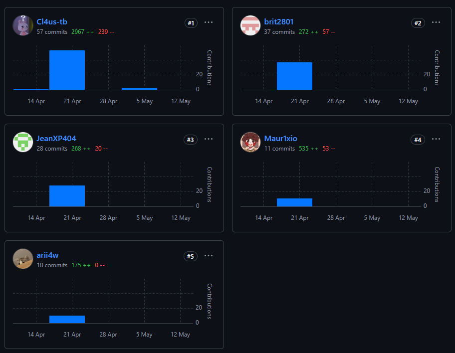

## TP1
En esta entrega, la estrecha colaboración del equipo permitió implementar las funcionalidades clave de la aplicación web. La asignación de tareas por secciones, en concordancia con el diseño y contenido predefinidos, facilitó este proceso. La participación activa de todos los miembros se evidencia en los analíticos de colaboración del repositorio oficial.


## TB2
En esta entrega, hemos implementado con éxito el backend de la aplicación web gracias a la estrecha colaboración del equipo. La clave fue la asignación estratégica de tareas por secciones, lo que facilitó el desarrollo de las funcionalidades principales en línea con el diseño predefinido. La participación activa de todos los miembros se evidencia en los analíticos de colaboración, demostrando el compromiso y la eficiencia logrados en este proceso crucial.


## TF1
En esta entrega, hemos integrado con éxito el backend y el frontend de la aplicación, lo cual representa un hito importante. Este logro fue posible gracias a la coordinación del equipo, asegurando una conexión fluida entre ambas capas y avanzando significativamente en la funcionalidad del proyecto.


# Contenido
[Student Outcome](#student-outcome)

- [COURSE PROJECT](#course-project)
- [Project Report Collaboration Insights](#project-report-collaboration-insights)
- [Contenido](#contenido)
- [Student Outcome](#student-outcome)
- [Capítulo I: Introducción](#capítulo-i-introducción)
  - [1.1. Startup Profile](#11-startup-profile)
    - [1.1.1. Descripción de la Startup](#111-descripción-de-la-startup)
    - [1.1.2. Perfiles de integrantes del equipo](#112-perfiles-de-integrantes-del-equipo)
  - [1.2. Solution Profile](#12-solution-profile)
    - [1.2.1 Antecedentes y problemática](#121-antecedentes-y-problemática)
    - [1.2.2 Lean UX Process](#122-lean-ux-process)
      - [1.2.2.1. Lean UX Problem Statements](#1221-lean-ux-problem-statements)
      - [1.2.2.2. Lean UX Assumptions](#1222-lean-ux-assumptions)
      - [1.2.2.3. Lean UX Hypothesis Statements](#1223-lean-ux-hypothesis-statements)
      - [1.2.2.4. Lean UX Canvas](#1224-lean-ux-canvas)
  - [1.3. Segmentos objetivo](#13-segmentos-objetivo)
- [Capítulo II: Requirements Elicitation \& Analysis](#capítulo-ii-requirements-elicitation--analysis)
  - [2.1. Competidores](#21-competidores)
    - [2.1.1. Análisis competitivo](#211-análisis-competitivo)
    - [2.1.2. Estrategias y tácticas frente a competidores](#212-estrategias-y-tácticas-frente-a-competidores)
  - [2.2. Entrevistas](#22-entrevistas)
    - [2.2.1. Diseño de entrevistas](#221-diseño-de-entrevistas)
    - [2.2.2. Registro de entrevistas](#222-registro-de-entrevistas)
    - [2.2.3. Análisis de entrevistas](#223-análisis-de-entrevistas)
  - [2.3. Needfinding](#23-needfinding)
    - [2.3.1. User Personas](#231-user-personas)
    - [2.3.2. User Task Matrix](#232-user-task-matrix)
    - [2.3.3. User Journey Mapping](#233-user-journey-mapping)
    - [2.3.4. Empathy Mapping](#234-empathy-mapping)
    - [2.3.5. As-is Scenario Mapping](#235-as-is-scenario-mapping)
  - [2.4. Ubiquitous Language](#24-ubiquitous-language)
- [Capítulo III: Requirements Specification](#capítulo-iii-requirements-specification)
  - [3.1. To-Be Scenario Mapping](#31-to-be-scenario-mapping)
  - [3.2. User Stories](#32-user-stories)
  - [3.3. Impact Mapping](#33-impact-mapping)
  - [3.4. Product Backlog](#34-product-backlog)
- [Capítulo IV: Product Design](#capítulo-iv-product-design)
  - [4.1. Style Guidelines](#41-style-guidelines)
    - [4.1.1. General Style Guidelines](#411-general-style-guidelines)
    - [4.1.2. Web Style Guidelines](#412-web-style-guidelines)
  - [4.2. Information Architecture](#42-information-architecture)
    - [4.2.1. Organization Systems.](#421-organization-systems)
    - [4.2.2. Labeling Systems.](#422-labeling-systems)
    - [4.2.3. SEO Tags and Meta Tags](#423-seo-tags-and-meta-tags)
    - [4.2.4. Searching Systems.](#424-searching-systems)
    - [4.2.5. Navigation Systems.](#425-navigation-systems)
  - [4.3. Landing Page UI Design.](#43-landing-page-ui-design)
    - [4.3.1. Landing Page Wireframe.](#431-landing-page-wireframe)
    - [4.3.2. Landing Page Mock-up.](#432-landing-page-mock-up)
  - [4.4. Web Applications UX/UI Design.](#44-web-applications-uxui-design)
    - [4.4.1. Web Applications Wireframes.](#441-web-applications-wireframes)
    - [4.4.2. Web Applications Wireflow Diagrams.](#442-web-applications-wireflow-diagrams)
    - [4.4.2. Web Applications Mock-ups.](#442-web-applications-mock-ups)
    - [4.4.3. Web Applications User Flow Diagrams.](#443-web-applications-user-flow-diagrams)
  - [4.5. Web Applications Prototyping.](#45-web-applications-prototyping)
  - [4.6. Domain-Driven Software Architecture.](#46-domain-driven-software-architecture)
    - [4.6.1. Software Architecture Context Diagram.](#461-software-architecture-context-diagram)
    - [4.6.2. Software Architecture Container Diagrams.](#462-software-architecture-container-diagrams)
    - [4.6.3. Software Architecture Components Diagrams.](#463-software-architecture-components-diagrams)
  - [4.7. Software Object-Oriented Design.](#47-software-object-oriented-design)
    - [4.7.1. Class Diagrams.](#471-class-diagrams)
    - [4.7.2. Class Dictionary.](#472-class-dictionary)
  - [4.8. Database Design.](#48-database-design)
    - [4.8.1. Database Diagram.](#481-database-diagram)
- [Capítulo V: Product Implementation, Validation \& Deployment](#capítulo-v-product-implementation-validation--deployment)
  - [5.1. Software Configuration Management.](#51-software-configuration-management)
    - [5.1.1. Software Development Environment Configuration.](#511-software-development-environment-configuration)
    - [5.1.2. Source Code Management.](#512-source-code-management)
    - [5.1.3. Source Code Style Guide \& Conventions.](#513-source-code-style-guide--conventions)
    - [5.1.4. Software Deployment Configuration.](#514-software-deployment-configuration)
  - [5.2. Landing Page, Services \& Applications Implementation](#52-landing-page-services--applications-implementation)
    - [5.2.1. Sprint 1](#521-sprint-1)
      - [5.2.1.1. Sprint Planning 1](#5211-sprint-planning-1)
      - [5.2.1.2. Aspect Leaders and Collaborators.](#5212-aspect-leaders-and-collaborators)
      - [5.2.1.3. Sprint Backlog 1.](#5213-sprint-backlog-n)
      - [5.2.1.4. Development Evidence for Sprint Review.](#5214-development-evidence-for-sprint-review)
      - [5.2.1.5. Execution Evidence for Sprint Review.](#5215-execution-evidence-for-sprint-review)
      - [5.2.1.6. Services Documentation Evidence for Sprint Review.](#5216-services-documentation-evidence-for-sprint-review)
      - [5.2.1.7. Software Deployment Evidence for Sprint Review.](#5217-software-deployment-evidence-for-sprint-review)
      - [5.2.1.8. Team Collaboration Insights during Sprint.](#5218-team-collaboration-insights-during-sprint)

    - [5.2.2. Sprint 2](#522-sprint-2)
      - [5.2.2.1. Sprint Planning 2](#5221-sprint-planning-2)
      - [5.2.2.2. Aspect Leaders and Collaborators.](#5222-aspect-leaders-and-collaborators)
      - [5.2.2.3. Sprint Backlog 2.](#5223-sprint-backlog-2)
      - [5.2.2.4. Development Evidence for Sprint Review.](#5224-development-evidence-for-sprint-review)
      - [5.2.2.5. Execution Evidence for Sprint Review.](#5225-execution-evidence-for-sprint-review)
      - [5.2.2.6. Services Documentation Evidence for Sprint Review.](#5226-services-documentation-evidence-for-sprint-review)
      - [5.2.2.7. Software Deployment Evidence for Sprint Review.](#5227-software-deployment-evidence-for-sprint-review)
      - [5.2.2.8. Team Collaboration Insights during Sprint.](#5228-team-collaboration-insights-during-sprint)

    - [5.2.3. Sprint 3](#523-sprint-3)
      - [5.2.3.1. Sprint Planning 3](#5231-sprint-planning-3)
      - [5.2.3.2. Aspect Leaders and Collaborators.](#5232-aspect-leaders-and-collaborators)
      - [5.2.3.3. Sprint Backlog 3.](#5233-sprint-backlog-3)
      - [5.2.3.4. Development Evidence for Sprint Review.](#5234-development-evidence-for-sprint-review)
      - [5.2.3.5. Execution Evidence for Sprint Review.](#5235-execution-evidence-for-sprint-review)
      - [5.2.3.6. Services Documentation Evidence for Sprint Review.](#5236-services-documentation-evidence-for-sprint-review)
      - [5.2.3.7. Software Deployment Evidence for Sprint Review.](#5237-software-deployment-evidence-for-sprint-review)
      - [5.2.3.8. Team Collaboration Insights during Sprint.](#5238-team-collaboration-insights-during-sprint)

    - [5.2.4. Sprint 4](#524-sprint-4)
      - [5.2.4.1. Sprint Planning 4](#5241-sprint-planning-4)
      - [5.2.4.2. Aspect Leaders and Collaborators.](#5242-aspect-leaders-and-collaborators)
      - [5.2.4.3. Sprint Backlog 4.](#5243-sprint-backlog-4)
      - [5.2.4.4. Development Evidence for Sprint Review.](#5244-development-evidence-for-sprint-review)
      - [5.2.4.5. Execution Evidence for Sprint Review.](#5245-execution-evidence-for-sprint-review)
      - [5.2.4.6. Services Documentation Evidence for Sprint Review.](#5246-services-documentation-evidence-for-sprint-review)
      - [5.2.4.7. Software Deployment Evidence for Sprint Review.](#5247-software-deployment-evidence-for-sprint-review)
      - [5.2.4.8. Team Collaboration Insights during Sprint.](#5248-team-collaboration-insights-during-sprint)

  - [5.3. Validation Interviews.](#53-validation-interviews)
    - [5.3.1. Diseño de Entrevistas.](#531-diseño-de-entrevistas)
    - [5.3.2. Registro de Entrevistas.](#532-registro-de-entrevistas)
    - [5.3.3. Evaluaciones según heurísticas.](#533-evaluaciones-según-heurísticas)
  - [5.4. Video About-the-Product.](#54-video-about-the-product)
- [Conclusiones](#conclusiones)
  - [Conclusiones y recomendaciones.](#conclusiones-y-recomendaciones)
- [Video About-the-Team.](#video-about-the-team)
- [Bibliografía](#bibliografía)
- [Anexos](#anexos)


# Student Outcome

ABET – EAC - Student Outcome 5

Criterio:  Capacidad de comunicarse efectivamente con un rango de audiencias.

<table>
  <tr>
    <td><b>Criterio específico</b></td>
    <td><b>Acciones realizadas</b></td>
    <td><b>Conclusiones</b></td>
  </tr>
    </thead>
  <tbody>
    <tr>
      <td><b>Comunica oralmente con efectividad a diferentes rangos de audiencia.</b></td>
      <td>
<p><b>Ariana Cecilia Agreda Sobrino</b></p>
        <p><b>TB1:</b></p>
        <p>Durante TB1, presenté y sustenté entregables clave como las Style Guidelines, Wireframes de la Landing Page y de la Aplicación Web, Wireflow Diagram, User Flow Diagram y Prototype. En cada exposición, adapté mi comunicación al tipo de audiencia: utilicé lenguaje técnico con mis compañeros de equipo y enfoques visuales y funcionales para que los docentes y evaluadores comprendieran con claridad el diseño propuesto.</p>
        <p><b>TP1:</b></p>
        <p>Durante el desarrollo del módulo de planificación de mantenimiento, comuniqué de forma clara y efectiva la estructura que propuse al equipo. Expliqué las decisiones de diseño y lógica funcional en reuniones orales, asegurándome de que todos comprendieran su integración con otros módulos. Esta comunicación facilitó una implementación coordinada y coherente entre todas las partes del sistema.</p>
        <p><b>TB2:</b></p>
        <p>Durante TB3, me encargué de corregir y refactorizar los bounded contexts de maquinarias e inventario en el frontend y backend. Para lograrlo, comuniqué claramente al equipo los cambios necesarios en la estructura del dominio, justificando las decisiones tomadas y resolviendo dudas en reuniones grupales. Además, adapté mi forma de explicar dependiendo del nivel técnico de cada integrante, facilitando el entendimiento tanto del impacto funcional como del diseño en capas, asegurando así una implementación coherente en ambos lados del sistema.</p>
        <p><b>TF:</b></p>
        <p>Durante la entrega final del proyecto, comuniqué de forma oral las decisiones relacionadas con la visualización del dashboard de métricas y el registro de técnicos. Coordiné con mis compañeros para asegurar que estas funcionalidades fueran correctamente integradas en el sistema, explicando con claridad el comportamiento esperado, los flujos de datos implicados y la validación funcional necesaria. Adapté mi lenguaje técnico y visual en función de los roles del equipo, facilitando la comprensión y la ejecución conjunta.</p>
          <br>

        
<p><b>Claudia Valeria Belledonne Espinoza</b></p>
       <p><b>TB1:</b></p>
        <p>Durante TB1, comuniqué de manera efectiva mis propuestas en el análisis competitivo y las estrategias clave del proyecto, facilitando discusiones claras y estructuradas en equipo. Lideré la redacción de historias de usuario, epics y la organización del product backlog, expresando con claridad los criterios de aceptación y prioridades. Asimismo, expuse el modelo de base de datos relacional, explicando su lógica y justificación técnica ante el equipo y docentes, adaptando el lenguaje según el público.</p>
        <p><b>TP1:</b></p>
        <p>Al desarrollar el módulo de inicio de sesión, expliqué su funcionalidad, flujos y puntos de integración con otras secciones, asegurándome de que todos los miembros entendieran su impacto en la arquitectura general. Guié reuniones breves para resolver dudas del sistema de autenticación y comuniqué con claridad tanto en términos técnicos como funcionales para facilitar la colaboración entre roles distintos.</p>
        <p><b>TB2:</b></p>
        <p>Durante TB2, presenté un modelo actualizado del diagrama de base de datos y del diagrama de clases, asegurando que su estructura fuera comprendida por todos los miembros del equipo. Me centré en el bounded context de mantenimiento, y comuniqué sus responsabilidades, entidades clave y relaciones de forma clara, contribuyendo a que tanto diseñadores como desarrolladores alinearan sus tareas con la lógica del dominio.</p>
        <p><b>TF:</b></p>
        <p>En la fase final del proyecto, lideré las reuniones técnicas para coordinar la integración del backend con el frontend. Me encargué de explicar el funcionamiento de los endpoints y su consumo desde las vistas, resolviendo dudas relacionadas con filtros, métricas, inventario y solicitudes. Esta comunicación constante con los distintos miembros del equipo permitió asegurar una integración exitosa y un entendimiento común del flujo de información en el sistema.</p>
          <br>

          
<p><b>Mauricio Daniel Elera Rodríguez</b></p>
        <p><b>TB1:</b></p>
        <p>Durante TB1, presenté con claridad los avances del diseño de la interfaz de la landing page mediante wireframes y mockups, explicando de forma visual y verbal las decisiones de estructura y estilo ante el equipo. Expuse los wireflows y user flows de la aplicación web, facilitando la comprensión del recorrido del usuario dentro del sistema. También guié demostraciones de los prototipos interactivos, adaptando el lenguaje técnico o funcional según los conocimientos del público (equipo de diseño, desarrolladores o docentes).</p>
        <p><b>TP1:</b></p>
        <p>Al implementar el módulo de órdenes de trabajo, comuniqué con precisión las decisiones técnicas sobre su estructura y funcionalidades, facilitando su correcta integración al sistema. Mediante reuniones orales y explicaciones en equipo, aseguré que las interfaces y servicios relacionados se alinearan, generando un desarrollo coordinado y comprensible para los demás integrantes.</p>
        <p><b>TB2:</b></p>
        <p>Durante TB2, expuse el diagrama de clases que elaboré, explicando la lógica detrás de la organización del modelo. Aporté también en la definición de la base de datos y me enfoqué en el bounded context de usuarios y gestión de activos (Asset Management), comunicando de manera efectiva sus entidades clave y relaciones, permitiendo que tanto diseñadores como programadores comprendieran e implementaran correctamente su estructura.</p>
        <p><b>TF:</b></p>
        <p>Durante la entrega final, presenté el diseño e implementación del módulo de reportes de órdenes de trabajo, detallando su lógica de consolidación de datos y la integración con el frontend. A través de explicaciones orales, coordiné ajustes necesarios con otros desarrolladores y validé con el equipo el correcto uso de la API de inventario. Mi participación permitió alinear expectativas y resolver interdependencias técnicas mediante un lenguaje claro y preciso.</p>
          <br>

          
<p><b>Britney Delhy Qqueso Rodriguez</b></p>
       <p><b>TB1:</b></p>
        <p>Durante TB1, colaboré activamente en la identificación de la problemática y en el desarrollo del Solution Profile, aplicando el enfoque de Lean UX. En cada entrega —como el Lean UX Canvas, los Hypothesis Statements o las entrevistas de usuario— comuniqué de forma clara las ideas y hallazgos, adaptando el lenguaje según el contexto: técnico con el equipo y empático con los usuarios entrevistados. También participé en la presentación de entregables como User Personas, Journey Mapping y Empathy Mapping, explicando su utilidad ante docentes y compañeros.</p>
        <p><b>TP1:</b></p>
        <p>Asumí un rol de liderazgo en la implementación del registro de cuentas y líneas de producción, explicando la estructura de datos y la lógica de negocio necesaria en reuniones del equipo. Me aseguré de comunicar de forma clara cómo estas funcionalidades se integraban con el resto del sistema, lo que facilitó el trabajo coordinado entre las distintas secciones del proyecto.</p>
        <p><b>TB2:</b></p>
        <p>Durante TB2, conduje entrevistas de validación y presenté los hallazgos obtenidos de manera clara y estructurada. Además, me encargué de documentar el Sprint 3, dejando registro del avance del equipo y comunicando oralmente los puntos clave del progreso y próximos pasos en las reuniones grupales.</p>
        <p><b>TF:</b></p>
        <p>En esta última etapa, comuniqué oralmente al equipo los detalles funcionales de la conexión entre el calendario de mantenimiento y el backend, así como la lógica detrás de la solicitud de repuestos y el manejo del inventario. También coordiné con los responsables de backend y frontend para asegurar la integración del Email Service, explicando con claridad los requisitos técnicos y verificaciones necesarias. Esta comunicación efectiva permitió una implementación sincrónica y funcional.</p>
      </td>
      <br>
      <td>
        <p><b>TB1:</b></p>
        <p>El equipo mostró una comunicación escrita clara y estructurada en documentos clave como el Lean UX Canvas, las historias de usuario y la planificación de sprints. Esta habilidad permitió establecer una base común de entendimiento y facilitar el seguimiento de tareas tanto entre integrantes del equipo como con los docentes.</p>
        <p><b>TP1:</b></p>
        <p>Durante esta fase, se mejoró la redacción técnica mediante la documentación de estructuras de base de datos, lógica de funcionalidades y definiciones de entidades. Esta comunicación por escrito fue esencial para guiar el desarrollo, registrar decisiones y facilitar la colaboración entre roles diversos dentro del equipo.</p>
        <p><b>TB2:</b></p>
        <p>Durante esta entrega, se continuó fortaleciendo la documentación técnica del sistema, en especial con la descripción detallada de bounded contexts, diagramas de clases actualizados y flujos de datos. El lenguaje empleado fue claro y preciso, permitiendo a todos los integrantes comprender las relaciones entre los módulos, las funcionalidades y su implementación.</p>
        <p><b>TF:</b></p>
        <p>Durante la entrega final del proyecto, la comunicación fue fundamental para coordinar eficientemente la integración del sistema Mecanet. A medida que conectamos el frontend con el backend y se implementaron funcionalidades clave como el dashboard de métricas, reportes y Email Service, cada miembro del equipo asumió un rol activo en reuniones técnicas y sesiones de validación. Esta comunicación efectiva permitió alcanzar una plataforma navegable, funcional y estable, alineada con la meta del sprint, y garantizó una experiencia de usuario fluida e integral.</p>
          <br>
      </td>
    </tr>

<tr>
      <td>Comunica por escrito con efectividad a diferentes rangos de audiencia</td>
      <td>
        <p><b>Ariana Cecilia Agreda Sobrino</b></p>
        <p><b>TB1:</b></p>
        <p>Durante esta etapa, redacté propuestas y descripciones claras para los entregables de la landing page y los objetivos del Sprint 1, facilitando que todos los miembros del equipo comprendieran la visión inicial del proyecto. Participé en la documentación de tareas y planificación, asegurándome de expresar de forma precisa y organizada nuestras decisiones en los reportes y documentos compartidos con el equipo y los docentes.</p>
        <p><b>TP1:</b></p>
        <p>Contribuí de manera escrita en la coordinación de actividades y en la definición de entregables clave, asegurándome de dejar registro claro de los avances y acuerdos tomados. Mis aportes facilitaron una comprensión común del trabajo en curso y aseguraron que todos estuviéramos alineados con los objetivos del equipo.</p>
        <p><b>TB2:</b></p>
        <p>Durante TB2, redacté explicaciones detalladas para los cambios realizados en los bounded contexts del sistema, tanto en el backend como en el frontend. Mi comunicación escrita ayudó a documentar las decisiones técnicas de forma clara, permitiendo que los miembros del equipo entendieran las correcciones estructurales necesarias para asegurar la coherencia del sistema.</p>
        <p><b>TF:</b></p>
        <p>Documenté el comportamiento esperado de las métricas (MTBF, MTTR, disponibilidad) y del registro de técnicos, incluyendo los endpoints consumidos y los datos mostrados en la interfaz. Esta documentación sirvió de referencia para el equipo de pruebas y facilitó la verificación cruzada de funcionalidades. También colaboré en la redacción de comentarios y observaciones en los canales de trabajo para guiar los ajustes necesarios.</p>
          <br>

          
<p><b>Claudia Valeria Belledonne Espinoza</b></p>
       <p><b>TB1:</b></p>
        <p>Contribuí a establecer un entorno de trabajo colaborativo mediante la redacción clara de metas para el Sprint 1 y la planificación de tareas. Elaboré la documentación del sprint y del informe general, cuidando que las ideas y acuerdos del equipo quedaran registrados de forma coherente, ordenada y comprensible tanto para los integrantes del equipo como para los docentes.</p>
        <p><b>TP1:</b></p>
        <p>Durante esta fase, me enfoqué en documentar con precisión el progreso técnico del equipo, organizando la información relevante de manera clara. Me aseguré de que todas las voces fueran reflejadas en los reportes escritos, lo que ayudó a mantener una comunicación efectiva entre todos los miembros, promoviendo una ejecución ordenada y bien estructurada del trabajo.</p>
        <p><b>TB2:</b></p>
        <p>En TB2, elaboré documentación técnica que explicaba las actualizaciones del diagrama de base de datos y del diagrama de clases. Además, escribí descripciones claras sobre el bounded context de mantenimiento, lo que permitió al equipo comprender fácilmente su estructura, relaciones internas y cómo debían implementarse en el sistema.</p>
        <p><b>TF:</b></p>
        <p>En esta entrega, elaboré documentación técnica sobre la integración de múltiples endpoints del backend con el frontend, registrando las rutas, parámetros y estructuras de respuesta esperadas. También documenté los casos de uso implementados para solicitud de repuestos, filtros y métricas. Este material fue clave para el equipo en el proceso de validación funcional y garantizó que todos comprendieran los detalles técnicos de las nuevas funcionalidades.</p>
          <br>

          
<p><b>Mauricio Daniel Elera Rodríguez</b></p>
        <p><b>TB1:</b></p>
        <p>Durante esta etapa, redacté observaciones claras y concisas sobre la implementación de la landing page, respetando los diseños establecidos por el equipo. Documenté el cumplimiento de tareas técnicas y colaboré en la planificación por escrito, dejando constancia de acuerdos y avances, lo cual facilitó una integración efectiva de ideas y un trabajo equitativo.</p>
        <p><b>TP1:</b></p>
        <p>Aporté a la documentación técnica del módulo de órdenes de trabajo, explicando la lógica de funcionamiento e integraciones necesarias con otros módulos. Redacté comentarios y notas útiles para el equipo, lo que ayudó a mantener una visión compartida del progreso técnico y asegurar una implementación coordinada.</p>
        <p><b>TB2:</b></p>
        <p>Durante TB2, participé en la elaboración del diagrama de clases y en la documentación relacionada con el bounded context de usuarios y gestión de activos. Me aseguré de dejar por escrito la estructura y relaciones entre entidades, facilitando que el equipo comprendiera la lógica implementada tanto en frontend como en backend.</p>
        <p><b>TF:</b></p>
        <p>Documenté el funcionamiento del módulo de reportes de órdenes de trabajo, describiendo su estructura técnica y los endpoints utilizados. Asimismo, dejé registros escritos de la conexión con el módulo de inventario, detallando las entidades implicadas y sus relaciones. Esta documentación ayudó al equipo a verificar la correcta integración de datos y facilitó el trabajo de pruebas.</p>
          <br>

          
<p><b>Britney Delhy Qqueso Rodriguez</b></p>
       <p><b>TB1:</b></p>
        <p>Durante esta fase, colaboré en la redacción de metas, planificación de tareas y organización del trabajo, dejando constancia escrita de nuestras decisiones en los entregables compartidos. Además, participé activamente en la elaboración de documentación como los user personas, journey maps y entrevistas, asegurando que toda la información recogida fuera expresada de forma clara y accesible para el equipo y los docentes.</p>
        <p><b>TP1:</b></p>
        <p>Documenté el desarrollo del módulo de registro de cuentas y líneas de producción, explicando la lógica utilizada y su integración con el sistema general. Además, apoyé en la organización escrita del trabajo en equipo, promoviendo una comunicación efectiva que ayudó a que cada miembro comprendiera su rol y contribuyera al cumplimiento de los objetivos.</p>
        <p><b>TB2:</b></p>
        <p>En TB2, redacté las observaciones obtenidas en entrevistas de validación, resumiendo los hallazgos y plasmándolos en un lenguaje claro y directo para orientar mejoras. También me encargué de la documentación del Sprint 3, registrando por escrito los avances del equipo y facilitando una visión compartida del progreso logrado.</p>
        <p><b>TF:</b></p>
        <p>Redacté la descripción funcional de la conexión entre el calendario de mantenimiento y la API correspondiente, así como de las vistas implementadas para solicitud de repuestos y revisión de inventario. Además, dejé constancia escrita de la lógica de validación implementada y participé en la documentación de la integración con el Email Service. Estas contribuciones facilitaron la comprensión compartida del funcionamiento del sistema final.</p>
      </td>
      
<td>
       <p><b>TB1:</b></p>
        <p>En esta entrega el equipo mostró una comunicación escrita clara y estructurada en documentos clave como el Lean UX Canvas, las historias de usuario y la planificación de sprints. Esta habilidad permitió establecer una base común de entendimiento y facilitar el seguimiento de tareas tanto entre integrantes del equipo como con los docentes.</p>
        <p><b>TP1:</b></p>
        <p>Durante esta fase, se mejoró la redacción técnica mediante la documentación de estructuras de base de datos, lógica de funcionalidades y definiciones de entidades. Esta comunicación por escrito fue esencial para guiar el desarrollo, registrar decisiones y facilitar la colaboración entre roles diversos dentro del equipo.</p>
        <p><b>TB2:</b></p>
        <p>En esta entrega, se continuó fortaleciendo la documentación técnica del sistema, en especial con la descripción detallada de bounded contexts, diagramas de clases actualizados y flujos de datos. El lenguaje empleado fue claro y preciso, permitiendo a todos los integrantes comprender las relaciones entre los módulos, las funcionalidades y su implementación.</p>
        <p><b>TF:</b></p>
        <p>En esta entrega, se implementaron y registraron de forma clara y precisa las rutas de los servicios RESTful, la lógica de consumo desde el frontend, el funcionamiento del Email Service, los filtros dinámicos, el dashboard de métricas y los reportes de órdenes de trabajo. Esta documentación fue compartida entre roles técnicos y no técnicos, facilitando validaciones cruzadas y pruebas funcionales. La capacidad para expresar nuestras decisiones y configuraciones por escrito contribuyó directamente al despliegue de una plataforma operativa, en concordancia con los objetivos establecidos del sprint.</p>
          <br>
      </td>
    </tr>
  </tbody>
</table>

# Capítulo I: Introducción
## 1.1. Startup Profile
### 1.1.1. Descripción de la Startup

<h2>Descripción de Mecanet</h2>
<p>Mecanet es un software especializado para la gestión de mantenimiento industrial, diseñado para empresas que operan con maquinaria crítica. Permite registrar activos, materiales, líneas de producción y organizar tanto órdenes de trabajo correctivas como planes de mantenimiento preventivo, fijos o dinámicos.</p>
<p>Con una interfaz intuitiva y flujos de trabajo optimizados, Mecanet ayuda a técnicos y administradores a mantener sus equipos operativos, reducir tiempos de inactividad y tomar decisiones basadas en indicadores clave como MTTR, MTBF y costos operativos.</p>

<h3>Misión</h3>
<p>Proveer a las empresas industriales una solución digital intuitiva y robusta que centralice el control de activos, tareas y recursos, facilitando la toma de decisiones técnicas basadas en datos para maximizar la disponibilidad operativa y reducir costos de mantenimiento.</p>

<h3>Visión</h3>
<p>Ser la plataforma líder en gestión de mantenimiento industrial en Latinoamérica, optimizando la operación de maquinaria crítica mediante tecnología accesible, eficiente y orientada a resultados.</p>


### 1.1.2. Perfiles de integrantes del equipo

<table align="center" border="1" cellspacing="0" cellpadding="8" style="width: 90%; border-collapse: collapse;">
  <tr>
    <td style="width: 150px; text-align: center;">
      </img>
    </td>
      <td>
          <p align="center"><strong>Ariana Agreda - u202315044</strong></p>
          <p align="justify">
            Mi nombre es Ariana Agreda, tengo 18 años y soy estudiante del 5to ciclo de Ingeniería de Software en la UPC. Me considero una persona creativa, responsable y comprometida con cada tarea. Por ello, estoy dispuesta a dedicar un gran esfuerzo y apoyo para que logremos los mejores resultados para el proyecto.
          </p>
    </td>
  </tr>
</table>

<table align="center" border="1" cellspacing="0" cellpadding="8" style="width: 90%; border-collapse: collapse;">
  <tr>
    <td style="width: 150px; text-align: center;">
      </img>
    </td>
      <td>
          <p align="center"><strong>Claudia Belledonne - u202210259</strong></p>
          <p align="justify">
            Mi nombre es Claudia Belledonne, tengo 20 años y me encuentro en mi segundo año de Ingeniería de Software en la UPC.
            En general, soy alguien creativa, responsable, dedicada y manejo bien el hacer muchas tareas a la vez.
            Para este trabajo, me comprometo a brindar mi máximo esfuerzo y dedicación.
          </p>
    </td>
  </tr>
</table>

<table align="center" border="1" cellspacing="0" cellpadding="8" style="width: 90%; border-collapse: collapse;">
  <tr>
    <td style="width: 150px; text-align: center;">
      </img>
    </td>
      <td>
          <p align="center"><strong>Mauricio Elera - u202313702</strong></p>
          <p align="justify">
            Mi nombre es Mauricio Elera, tengo 18 años y soy estudiante del 5to ciclo de Ingeniería de Software en la UPC. Me considero una persona proactiva, organizada y con muchas ganas de aprender. Estoy comprometido con el trabajo en equipo y dispuesto a aportar todo lo necesario para que nuestro proyecto sea exitoso.
          </p>
    </td>
  </tr>
</table>

<table align="center" border="1" cellspacing="0" cellpadding="8" style="width: 90%; border-collapse: collapse;">
  <tr>
    <td style="width: 150px; text-align: center;">
      </img>
    </td>
      <td>
          <p align="center"><strong>Britney Qqueso - u20211g671</strong></p>
          <p align="justify">
            Soy estudiante de la carrera de Ingeniería de Software en la Universidad Peruana de Ciencias Aplicadas (UPC). 
            Me considero una persona autodidacta, dedicada, creativa y responsable. 
            Me comprometo a  contribuir al equipo con mis conocimientos y habilidades, apoyar en lo que sea necesario y aprender en el proceso.
          </p>
    </td>
  </tr>
</table>


## 1.2. Solution Profile
### 1.2.1 Antecedentes y problemática
**What** <br/>
**¿Cuál es el problema?** <br/>
En muchas plantas industriales y empresas manufactureras, el mantenimiento de maquinaria se gestiona de forma manual o con herramientas dispersas, lo que genera falta de control, retrasos en tareas críticas, paradas no programadas y altos costos operativos. La ausencia de un sistema integral que permita planificar, ejecutar y dar seguimiento a las intervenciones de mantenimiento preventivo y correctivo limita la eficiencia operativa y reduce la vida útil de los activos. <br/>
**¿Cuál es la relación con la persona en cuestión?** <br/>
El usuario, que puede ser un técnico, jefe de mantenimiento o supervisor de planta, se enfrenta diariamente al reto de mantener en óptimas condiciones las máquinas de producción. Mecanet nace como una plataforma que les permite digitalizar todo el ciclo del mantenimiento, desde la planificación hasta la ejecución, facilitando la trazabilidad, la gestión de repuestos, la asignación de recursos y la generación de reportes técnicos. <br/>
**When** <br/>
**¿Cuándo sucede el problema?** <br/>
El problema ocurre de forma continua en las operaciones diarias, especialmente cuando se omiten mantenimientos por falta de registro o programación adecuada. Sucede cada vez que una máquina falla inesperadamente, cuando no se realiza mantenimiento preventivo a tiempo, o cuando no se tiene historial técnico disponible para tomar decisiones informadas. <br/>
**¿Cuándo utiliza el cliente el producto?** <br/>
El cliente utiliza Mecanet en diversas etapas del día: al inicio de su jornada para revisar tareas pendientes, durante la ejecución de mantenimientos, al gestionar inventario de repuestos o registrar fallos, y al final para analizar el estado de sus activos mediante reportes y métricas. <br/>
**Where** <br/>
**¿Dónde está el cliente cuando utiliza el producto?** <br/>
El usuario se encuentra en el entorno industrial: plantas de producción, áreas técnicas, talleres o salas de control. Mecanet está diseñado para ser accesible tanto desde una computadora de escritorio como desde un dispositivo móvil o tablet industrial en el piso de producción. <br/>
**¿A dónde se dirige?** <br/>
Se dirige hacia un modelo de mantenimiento más eficiente, preventivo y basado en datos, con reducción de tiempos de inactividad, optimización del uso de repuestos y mejora en la disponibilidad de los activos. <br/>
**¿Dónde surge el problema?** <br/>
Surge dentro de las operaciones industriales que carecen de herramientas digitales específicas para la gestión de mantenimiento, lo que produce desorganización, pérdida de información histórica y decisiones basadas en intuición más que en datos. <br/>
**Who** <br/>
**¿Quiénes están involucrados?** <br/>
Técnicos de mantenimiento, supervisores, ingenieros industriales, jefes de planta, operarios, responsables de inventario y directivos encargados de la eficiencia operativa. <br/>
**¿A quiénes les sucede el problema?** <br/>
Principalmente a los técnicos y supervisores encargados de ejecutar y planificar el mantenimiento, pero también afecta a los responsables de producción cuando una línea se detiene por una falla inesperada. <br/>
**¿Quién lo utiliza?** <br/>
Mecanet es utilizado por técnicos para registrar tareas y fallas, por supervisores para asignar mantenimientos y gestionar recursos, y por gerentes para monitorear indicadores como disponibilidad, tiempo medio entre fallos (MTBF), tiempo medio de reparación (MTTR), y cumplimiento de mantenimientos programados. <br/>
**Why** <br/>
**¿Cuál es la causa del problema?** <br/>
La raíz del problema está en la falta de digitalización y centralización de los procesos de mantenimiento. Muchas empresas todavía usan hojas de cálculo, libretas o múltiples herramientas desconectadas, lo que dificulta tener una visión clara, actualizada y confiable de los activos, sus mantenimientos y costos asociados. <br/>
**How** <br/>
**¿En qué condiciones nuestros clientes usan el producto?** <br/>
En entornos exigentes donde la producción depende fuertemente del estado operativo de las máquinas. Se requiere un sistema confiable, rápido, adaptable y accesible desde distintos dispositivos. Mecanet se adapta tanto a infraestructuras grandes como pequeñas, y puede operar en la nube o en entornos locales con acceso restringido. <br/>
**¿Cómo nos conocieron nuestros compradores?** <br/>
A través de recomendaciones de otros profesionales del sector, ferias de tecnología industrial, demostraciones en planta, publicaciones técnicas y búsqueda activa de soluciones para la mejora del mantenimiento industrial. <br/>
**¿Cómo prefieren nuestros consumidores acceder a nuestro producto?** <br/>
Prefieren una plataforma fácil de implementar, con una interfaz intuitiva, acceso desde dispositivos móviles y funcionalidades específicas para la gestión de mantenimiento industrial, incluyendo inventario, cronogramas, órdenes de trabajo y reportes técnicos. <br/>
**¿Qué llevó a la persona a esa situación?** <br/>
La necesidad de reducir fallas inesperadas, cumplir con normativas de calidad, asegurar la trazabilidad de las tareas, y optimizar la planificación de mantenimientos en un entorno de alta exigencia operativa y competencia. <br/>
**How Much** <br/>
El informe de McKinsey & Company (2021) sobre transformación digital en la industria destaca que el 70% de las empresas que adoptaron sistemas de mantenimiento inteligente lograron una mejora significativa en sus KPIs operativos. Por otro lado, se estima que más del 50% de las pequeñas y medianas industrias en Latinoamérica aún no utilizan un software especializado para la gestión del mantenimiento, lo que evidencia una gran oportunidad de impacto para herramientas como Mecanet. <br/>

### 1.2.2 Lean UX Process
#### 1.2.2.1. Lean UX Problem Statements
Nuestro servicio ofrece una plataforma digital integral para la gestión del mantenimiento industrial, permitiendo a las empresas registrar activos, planificar mantenimientos preventivos y correctivos, gestionar inventarios de repuestos, y hacer seguimiento en tiempo real de las órdenes de trabajo. A través de Mecanet, los usuarios tienen acceso a una vista centralizada de la información crítica de sus máquinas, facilitando la toma de decisiones técnicas y operativas para mejorar la eficiencia y reducir tiempos de inactividad. <br/>

Hemos observado un factor crítico que afecta a muchas industrias manufactureras: el mantenimiento de activos se gestiona todavía con herramientas desconectadas o procesos manuales, lo que genera pérdidas económicas por fallos inesperados, retrasos en producción y desorganización en los registros. Además, los técnicos y supervisores carecen de trazabilidad y reportes fiables que les permitan medir el rendimiento del mantenimiento a lo largo del tiempo. <br/>

¿Cómo podemos digitalizar y optimizar la gestión del mantenimiento en plantas industriales, facilitando a técnicos y supervisores el seguimiento de activos, la planificación eficiente de tareas, el control de inventario y la trazabilidad de intervenciones, para así reducir fallos, extender la vida útil de las máquinas y mejorar los indicadores operativos de la empresa? <br/>

#### 1.2.2.2. Lean UX Assumptions
**User Assumptions** <br/>

**¿Quién es mi usuario?** <br/>
Nuestros usuarios son técnicos de mantenimiento y administradores de mantenimiento que necesitan controlar el estado operativo de las máquinas y ejecutar mantenimientos con eficacia. <br/>

**¿Dónde encaja nuestro producto en su trabajo o vida?** <br/>
Mecanet se integra directamente en la rutina diaria de trabajo industrial: planificación de tareas, ejecución de mantenimientos, gestión de inventario y análisis de reportes operativos. <br/>

**¿Qué problemas tiene nuestro producto que resolver?** <br/>
El descontrol en los mantenimientos, la falta de trazabilidad de órdenes de trabajo, la ausencia de alertas para mantenimientos preventivos, y la gestión manual del inventario de repuestos. <br/>

**¿Cuándo y cómo es usado nuestro producto?** <br/>
Se usa al inicio de la jornada para revisar tareas asignadas, durante el día para registrar mantenimientos y repuestos utilizados, y al cierre de turnos para reportar avances o fallas detectadas. <br/>

**¿Qué características son importantes?** <br/>
Gestión de órdenes de servicio, agenda de citas, control de inventario de repuestos, historial de mantenimiento por maquinaria, notificaciones automáticas, generación de presupuestos, seguimiento del progreso de trabajos y reportes de desempeño del taller. <br/>

**¿Cómo debe verse nuestro producto y cómo debe comportarse?** <br/>
Debe tener un diseño limpio y profesional, con navegación clara y flujos rápidos. Debe permitir operar fácilmente desde computadoras o dispositivos móviles, ofrecer acceso rápido a información clave y simplificar la digitalización de procesos técnicos. <br/>

**Business Assumptions** <br/>

Creemos que las empresas industriales necesitan una plataforma centralizada y fácil de usar para gestionar el mantenimiento de sus máquinas de forma eficiente. Mecanet resolverá esta necesidad conectando activos, tareas, repuestos y personal técnico en una sola herramienta, mejorando así la planificación, ejecución y seguimiento de los mantenimientos. <br/>

Nuestros primeros clientes serán medianas y grandes industrias que aún utilizan métodos manuales y buscan digitalizar sus procesos para reducir paros no programados y mejorar la productividad. Les ofreceremos una solución con precios escalables y accesibles, soporte técnico y capacitación especializada. <br/>

#### 1.2.2.3. Lean UX Hypothesis Statements
**Creemos que** la integración del control del mantenimiento mediante Mecanet optimizará la eficiencia operativa y minimizará los tiempos de inactividad en las industrias.<br/>
**Sabremos que hemos tenido éxito cuando** veamos una disminución del 30% en los paros no programados y un aumento del 25% en la puntualidad de los mantenimientos en los primeros 6 meses.<br/>

**Creemos que** las empresas estarán dispuestas a digitalizar su proceso de mantenimiento si perciben beneficios claros en eficiencia y ahorro de costos.<br/>
**Sabremos que hemos tenido éxito cuando** al menos el 60% de las empresas contactadas acepten una demo del sistema y el 30% implementen un piloto.<br/>

**Creemos que** integrar un sistema de gestión de repuestos reducirá los retrasos por falta de materiales.<br/>
**Sabremos que hemos tenido éxito cuando** el tiempo promedio entre fallo y solución disminuya un 20%, y el 70% de los mantenimientos se realicen con repuestos disponibles al primer intento.<br/>

**Creemos que** ofrecer una interfaz intuitiva mejorará la adopción por parte de técnicos con poca experiencia en software.<br/>
**Sabremos que hemos tenido éxito cuando** al menos el 90% de los usuarios nuevos completen su primera orden de trabajo sin necesidad de asistencia en el primer mes.<br/>
#### 1.2.2.4. Lean UX Canvas

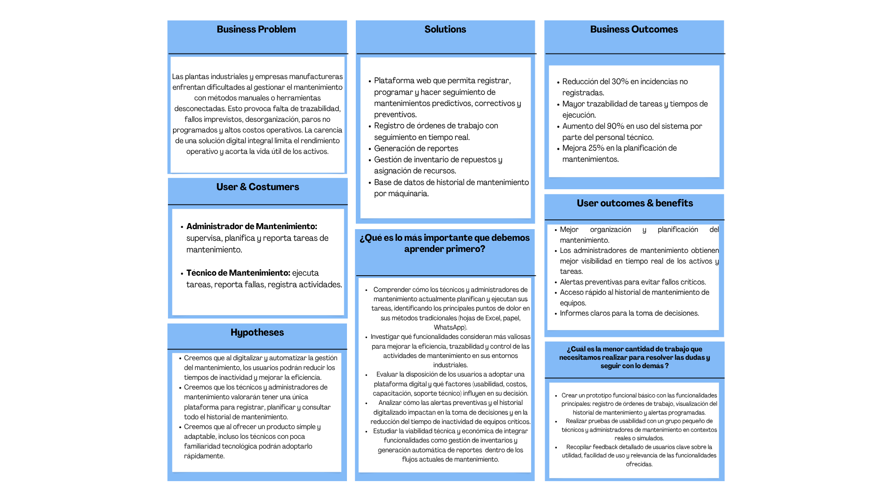

## 1.3. Segmentos objetivo
### Segmento 1: Empresas — Administrador de mantenimiento

**Descripción del perfil:**
Profesional encargado de la planificación, supervisión y control de las actividades de mantenimiento dentro de una planta industrial. Tiene a su cargo la gestión de recursos técnicos y humanos, la programación de mantenimientos preventivos y correctivos, y el seguimiento de indicadores de rendimiento (KPIs) como MTTR y MTBF.

**Características demográficas:**

* Edad: 25 a 55 años

* Formación: Ingeniería Mecánica, Industrial o afines

* Experiencia laboral: Generalmente entre 5 a 15 años en plantas industriales

* Ubicación: Predominantemente en zonas urbanas e industriales

* Nivel tecnológico: Medio a alto (uso habitual de herramientas digitales y software ERP)

**Datos de sustento:**

* Según datos del INEI (2023), más del 68% de medianas y grandes empresas industriales peruanas cuentan con un área de mantenimiento formalizada.

* El 52% de los encargados de mantenimiento en dichas empresas han adoptado sistemas digitales para planificación de órdenes de trabajo.

**Necesidades clave:**

* Control y trazabilidad de las órdenes de trabajo.

* Generación de reportes y métricas para toma de decisiones.

* Coordinación eficiente con técnicos y supervisores.

* Integración con calendarios y sistemas externos.

### Segmento 2: Trabajadores — Técnicos de mantenimiento

**Descripción del perfil:**
Profesional técnico operativo encargado de ejecutar las tareas de mantenimiento preventivo y correctivo, siguiendo las órdenes asignadas por el administrador. Utiliza herramientas físicas y digitales para el reporte de actividades, inspección de maquinaria y solicitud de repuestos.

**Características demográficas:**

* Edad: 20 a 40 años

* Formación: Técnico en mantenimiento industrial, electromecánica o afines

* Experiencia laboral: 1 a 10 años en plantas industriales o manufactureras

* Ubicación: Zonas industriales o aledañas

* Nivel tecnológico: Medio (uso de dispositivos móviles para lectura de órdenes y registro de tareas)

**Datos de sustento:**

* Según la Encuesta Nacional de Demanda Ocupacional (ENEDEO 2022), los técnicos de mantenimiento se encuentran entre los 10 perfiles más demandados por la industria manufacturera.

* El 63% de los técnicos en plantas de más de 50 trabajadores utilizan aplicaciones móviles o tabletas para reportar actividades.

**Necesidades clave:**

* Acceso rápido y claro a sus órdenes de trabajo asignadas.

* Posibilidad de registrar avances y observaciones en tiempo real.

* Visualización de inventario disponible.

* Registro y seguimiento de tareas realizadas.


# Capítulo II: Requirements Elicitation & Analysis

## 2.1. Competidores
### 2.1.1. Análisis competitivo


# Competitive Analysis Landscape

**¿Qué ventajas competitivas puede desarrollar Mecanet para diferenciarse en el mercado de software de mantenimiento frente a soluciones ya consolidadas?**

## Mecanet
- **Perfil:**
  - Solución integral de software enfocada en la gestión del mantenimiento de maquinaria, abarcando mantenimiento preventivo y correctivo.
- **Ventaja competitiva:**
  - Enfocada en necesidades específicas del mantenimiento de maquinaria.
  - Registro de líneas de producción y tiempos muertos para una planificación eficiente.
  - Control de inventario integrado para evitar desabastecimientos.
- **Mercado objetivo:**
  - Empresas que requieren soluciones especializadas para el mantenimiento de maquinaria (manufactura, transporte).
- **Estrategias de marketing:**
  - Posicionarse como una solución especializada para industrias operativas.
  - Flexibilidad e intuitividad para facilitar su uso desde el primer día.
- **Productos & Servicios:**
  - Visión completa de maquinaria y su relación con la producción.
  - Seguimiento detallado de intervenciones y análisis de KPIs para la mejora continua.
- **Precios & Costos:**
  - **Plan Gratuito:** Hasta 10 activos con mantenimiento básico.
  - **Plan Profesional:** Hasta 50 activos con mantenimiento preventivo y correctivo.
  - **Plan Enterprise:** Activos y administradores ilimitados, opciones de personalización.
- **Canales de distribución (Web y/o Móvil):**
  - Acceso desde navegadores para gestión completa y conexión con otras herramientas mediante APIs.
- **Análisis SWOT:**
  - **Fortalezas:**
    - Cobertura completa de mantenimiento preventivo y correctivo.
    - El seguimiento detallado de KPIs facilita la toma de decisiones basada en datos.
    - La gestión de inventario integrada optimiza la disponibilidad de repuestos y materiales.
  - **Debilidades:**
    - Al ser una startup, Mecanet aún no cuenta con una presencia consolidada en el mercado.
    - La ausencia de aplicaciones móviles puede limitar el acceso en campo y la eficiencia operativa.
  - **Oportunidades:**
    - Crear aplicaciones para iOS y Android para mejorar el acceso y la eficiencia en campo.
    - Adaptar la plataforma para pequeñas y medianas empresas en crecimiento que requieren soluciones especializadas.
    - Países con industrias en desarrollo necesitan herramientas para optimizar el mantenimiento.
  - **Amenazas:**
    - Empresas con soluciones más establecidas y mayor cantidad de recursos pueden representar una amenaza para la adopción de Mecanet.
    - Nuevas normativas en seguridad industrial podrían requerir ajustes costosos en el software.

## SafetyCulture
- **Perfil:**
  - Plataforma colaborativa para realizar inspecciones digitales, gestionar activos, asignar tareas correctivas y generar informes personalizados.
- **Ventaja competitiva:**
  - Transforma listas de verificación en papel en formularios digitales personalizables.
  - Ofrece paneles de control con estadísticas y tendencias para monitorear el rendimiento y cumplimiento.
  - Permite asignar tareas, capturar evidencias y comunicar acciones correctivas directamente desde la aplicación.
- **Mercado objetivo:**
  - Empresas de diversos sectores que buscan mejorar sus procesos de inspección y cumplimiento.
- **Estrategias de marketing:**
  - Permite a los usuarios experimentar las funcionalidades premium sin compromiso.
  - Ofrece una biblioteca de plantillas, guías y seminarios web para capacitar a los usuarios.
  - Mantiene una fuerte presencia en redes sociales y plataformas de reseñas para aumentar su visibilidad.
- **Productos & Servicios:**
  - Creación y gestión de listas de verificación personalizadas.
  - Registro y seguimiento del estado de equipos y maquinaria.
  - Generación de informes en múltiples formatos, incluyendo PDF, Word y Excel.
- **Precios & Costos:**
  - **Plan Gratuito:** Hasta 10 usuarios.
  - **Plan Premium:** $24 USD por usuario/mes.
  - **Plan Enterprise:** Precios personalizados.
  - **Licencias Lite:** $5 por usuario/mes.
- **Canales de distribución (Web y/o Móvil):**
  - Aplicaciones móviles, compatibles con iOS y Android.
  - Versión web.
  - Conexión con otras herramientas empresariales y sistemas mediante APIs y sensores IoT.
- **Análisis SWOT:**
  - **Fortalezas:**
    - Plataforma madura y consolidada.
    - Presente en múltiples industrias y países.
    - Interfaz fácil de usar y centrada en móviles.
    - Versión gratuita funcional para pequeños equipos.
    - Amplio catálogo de plantillas personalizables.
    - Gestión de tareas y seguimiento en tiempo real.
    - Capacidades de análisis (Analytics Dashboard).
    - Integraciones y compatibilidad con sensores IoT.
  - **Debilidades:**
    - No especializado 100% en mantenimiento industrial.
    - Menor profundidad técnica en KPIs de mantenimiento.
  - **Oportunidades:**
    - Expansión en el sector industrial y manufactura pesada.
    - Expansión en mercados emergentes (LatAm, Sudeste Asiático).
    - Integración con ERPs o CMMS especializados.
  - **Amenazas:**
    - Competidores más especializados en mantenimiento industrial.
    - Presión de precios en mercados con software open-source o más accesible.
    - Ciberseguridad y manejo de datos sensibles.

## Tofino
- **Perfil:**
  - Solución CMMS en la nube que integra mantenimiento, gestión de activos, inventario MRO y adquisiciones inteligentes.
- **Ventaja competitiva:**
  - Combina mantenimiento, inventario y adquisiciones en una sola plataforma, eliminando la necesidad de múltiples sistemas.
  - Su app para iOS y Android funciona sin conexión a internet, permitiendo operaciones en entornos con conectividad limitada.
  - Gestión de Inventario en Tiempo Real.
- **Mercado objetivo:**
  - Empresas medianas y grandes en sectores como manufactura, distribución, salud y gestión de instalaciones.
- **Estrategias de marketing:**
  - Ofrecen demos adaptadas a las necesidades del cliente.
  - Promueven Tofino como una herramienta que fortalece la relación entre distribuidores y sus clientes.
  - Presencia constante en Plataformas de Software.
- **Productos & Servicios:**
  - Programación automática de tareas, seguimiento de órdenes de trabajo y alertas.
  - Seguimiento en tiempo real, documentación centralizada y alertas de calibración.
  - Compras directas desde catálogos de proveedores.
- **Precios & Costos:**
  - **Suscripción Mensual:** $400 USD.
- **Canales de distribución (Web y/o Móvil):**
  - Aplicaciones móviles, compatibles con iOS y Android.
  - Versión web.
  - Compatibilidad con sistemas ERP y otros softwares empresariales.
- **Análisis SWOT:**
  - **Fortalezas:**
    - Combina CMMS, gestión de inventario y adquisiciones en una sola plataforma.
    - Aplicación móvil que opera sin conexión, ideal para entornos industriales.
    - Modelo de precios que permite acceso ilimitado, favoreciendo la colaboración.
  - **Debilidades:**
    - Sin Prueba Gratuita.
    - Altos precios de suscripción mensual.
    - Algunos usuarios reportan restricciones en la personalización de la plataforma.
    - La amplia gama de funcionalidades puede resultar abrumadora.
  - **Oportunidades:**
    - Adaptar la plataforma para pequeñas y medianas empresas en crecimiento.
    - Integración con IoT.
    - Colaborar con proveedores de ERP y otros software empresariales para ampliar su ecosistema.
  - **Amenazas:**
    - Sistemas CMMS enfocados exclusivamente en mantenimiento pueden ofrecer soluciones más profundas.
    - Empresas más pequeñas pueden optar por soluciones más económicas o con modelos freemium.

## ManagerPlus
- **Perfil:**
  - Solución CMMS en la nube para gestionar activos, órdenes de trabajo, mantenimiento preventivo y seguimiento de inventario.
- **Ventaja competitiva:**
  - Combina CMMS, gestión de inventario y adquisiciones en una sola plataforma.
  - Aplicación móvil que opera sin conexión, ideal para entornos industriales.
  - Modelo de precios que permite acceso ilimitado, favoreciendo la colaboración.
- **Mercado objetivo:**
  - Empresas de todos los tamaños en sectores como manufactura, construcción, hostelería, etc.
- **Estrategias de marketing:**
  - Ofrecen demos adaptadas a las necesidades del cliente para mostrar la funcionalidad del software.
  - Proporcionan acceso a capacitación, videos, seminarios en línea y tutoriales para facilitar la adopción del software.
  - Listados en sitios como Capterra y GetApp para aumentar visibilidad y credibilidad.
- **Productos & Servicios:**
  - Mantenimiento Preventivo y Correctivo.
  - Seguimiento en tiempo real, documentación centralizada y alertas de mantenimiento.
  - Supervisión de niveles de stock y pedidos de reabastecimiento.
- **Precios & Costos:**
  - **Modelo de Suscripción:** Precio personalizable.
  - **Prueba Gratuita:** Pequeñas demostraciones para testear el aplicativo.
- **Canales de distribución (Web y/o Móvil):**
  - Aplicaciones móviles, compatibles con iOS y Android.
  - Versión web.
  - Compatibilidad con sistemas ERP y otros softwares empresariales.
- **Análisis SWOT:**
  - **Fortalezas:**
    - Combina CMMS, gestión de inventario y adquisiciones en una sola plataforma.
    - Aplicación móvil que opera sin conexión, ideal para entornos industriales.
    - Modelo de precios que permite acceso ilimitado, favoreciendo la colaboración.
  - **Debilidades:**
    - Sin Prueba Gratuita.
    - Interfaz desactualizada y no intuitiva.
  - **Oportunidades:**
    - Adaptar la plataforma para pequeñas y medianas empresas en crecimiento.
    - Incorporar sensores y dispositivos inteligentes para mantenimiento predictivo.
    - Colaborar con proveedores de ERP y otros software empresariales para ampliar su ecosistema.
  - **Amenazas:**
    - Competencia de soluciones especializadas y emergentes.
    - La necesidad de mantenerse actualizado con las últimas tecnologías y tendencias del mercado.
    - En regiones con presupuestos más ajustados, las soluciones más económicas o freemium pueden ser una amenaza.


### 2.1.2. Estrategias y tácticas frente a competidores


#### Estrategia 1: Posicionamiento como solución especializada para la industria manufacturera
- <p align="justify">A diferencia de competidores generalistas o diseñados para múltiples sectores, Mecanet apuesta por un enfoque claro: ser el sistema de mantenimiento pensado exclusivamente para empresas con operaciones industriales o logísticas intensivas, como el sector textil, agroindustrial o de transporte interprovincial. Esta especialización le permite ofrecer flujos más adaptados al uso real en planta, términos técnicos familiares para los encargados de mantenimiento y configuraciones específicas para distintos tipos de maquinaria. Esta ventaja le otorga cercanía funcional y técnica con los procesos reales de producción.
</p>

#### Estrategia 2: Diferenciación por simplicidad de uso y adopción inmediata
- <p align="justify">Uno de los principales obstáculos para la digitalización del mantenimiento en empresas medianas es la complejidad y curva de aprendizaje de muchas soluciones. Mecanet convierte esto en una ventaja competitiva al diseñar una interfaz intuitiva, con lenguaje claro y flujos guiados que permiten a los usuarios empezar a usar la plataforma desde el primer día. El objetivo es reducir el tiempo necesario para capacitar al equipo, evitar barreras técnicas, y facilitar la incorporación del software al día a día sin fricciones.
</p>

#### Estrategia 3: Aprovechamiento del vacío entre soluciones simples y complejas
- <p align="justify">El análisis competitivo demuestra que existe un “espacio intermedio” poco atendido entre herramientas demasiado simples (que no cubren inventario ni KPIs) y herramientas demasiado complejas (difíciles de adoptar y costosas). Mecanet se posiciona justamente en ese espacio, con una propuesta que combina profundidad funcional (MTBF, control de stock, órdenes planificadas) con facilidad de uso. Esto le permite responder a necesidades reales de mantenimiento sin exigir una infraestructura TI avanzada ni grandes inversiones.
</p>

## 2.2. Entrevistas
### 2.2.1. Diseño de entrevistas

#### Segmento 1: Administrador de mantenimiento
**Dirigido a:**  
Personas encargadas de la gestión operativa y estratégica en empresas industriales, con poder de decisión sobre procesos, recursos y coordinación de áreas como producción y mantenimiento.

**Objetivo:**  
Conocer cómo gestionan actualmente el mantenimiento, cómo enfrentan las fallas, qué impacto tienen estas en la producción, cómo toman decisiones y qué esperan de una herramienta digital como Mecanet.

**Preguntas:**

1. Nombre completo:
2. Edad:
3. Cargo / Rol en la empresa:
4. Años de experiencia en el sector:
5. ¿Cuáles son las responsabilidades que tienes relacionadas con el mantenimiento industrial dentro de la empresa?
6. ¿Qué métodos o enfoques utilizan actualmente para planificar y gestionar el mantenimiento de las máquinas?
7. ¿Cuáles son los mayores desafíos o problemas que suelen enfrentar cuando se producen fallas en las máquinas?
8. ¿Cómo influye el tiempo de inactividad de las máquinas en el proceso productivo o en los objetivos operativos de la empresa?
9. ¿Cómo suelen coordinar las áreas de producción y mantenimiento para minimizar las interrupciones en la operación?
10. ¿Qué tipo de información consideras esencial para poder tomar decisiones rápidas y efectivas cuando se presenta una falla?
11. ¿Qué consecuencias ha tenido una falla crítica en la producción en el pasado y cómo lo resolvieron?
12. Si pudieras mejorar un aspecto del mantenimiento en tu empresa de manera inmediata, ¿cuál sería y por qué?
13. Imagina que tienes una plataforma como Mecanet a tu disposición, la cual te permite gestionar de manera digital el mantenimiento, las fallas y las órdenes de trabajo. ¿Qué funcionalidades crees que serían las más útiles para ti y tu equipo en la gestión del mantenimiento?


#### Segmento 2: Técnicos de mantenimiento
**Dirigido a:**  
Técnicos, mecánicos y operarios que trabajan directamente con las máquinas en planta. Suelen ser quienes detectan, reportan y resuelven fallas, así como quienes ejecutan el mantenimiento preventivo o correctivo.

**Objetivo:**  
Comprender su experiencia directa con las máquinas, cómo reportan fallas, qué obstáculos enfrentan en su trabajo diario y qué funcionalidades valoran en una herramienta digital para mantenimiento.

**Preguntas:**

1. Nombre completo:
2. Edad:
3. Puesto o función que desempeñas:
4. Años de experiencia en el área de mantenimiento:
5. ¿Qué tipo de maquinaria operas o mantienes habitualmente y qué tareas realizas en ese proceso?
6. ¿Qué herramientas o sistemas utilizan actualmente para registrar y hacer seguimiento de las fallas en las máquinas?
7. ¿Cuáles son los tipos de fallas más comunes que enfrentas y cómo suelen manejarse?
8. ¿Cómo te afecta, en tu trabajo diario, el tiempo que una máquina permanece fuera de servicio debido a una falla?
9. ¿Qué dificultades encuentras a la hora de reportar fallas o coordinar con otros departamentos para realizar las reparaciones necesarias?
10. ¿Qué tipo de información te gustaría tener de manera más accesible o visible para poder solucionar las fallas más rápidamente y de forma más eficiente?
11. ¿Alguna vez tuviste una situación difícil con una falla que no pudiste resolver a tiempo? ¿Qué pasó y qué te habría ayudado en ese momento?
12. ¿Qué harías diferente en tu rutina de trabajo si tuvieras una herramienta que te ahorre tiempo con los reportes y seguimiento de fallas?
13. Si pudieras contar con una herramienta como Mecanet para gestionar fallas, órdenes de trabajo y mantener un registro centralizado, ¿Qué características o funciones crees que serían más útiles para ti en el día a día?

### 2.2.2. Registro de entrevistas 

El registro de entrevistas es fundamental para recopilar la experiencia real de los técnicos y operarios en sus tareas de mantenimiento. Nos permite organizar y analizar mejor la información, identificar necesidades comunes y tomar decisiones basadas en lo que realmente viven los usuarios. Así, Mecanet puede adaptarse mejor a sus necesidades y aportar soluciones útiles.

### Segmento 1: Administradores de mantenimiento

#### Entrevista #1
- **Nombre completo:** Grisel Arones  
- **Edad:** 25 años  
- **Cargo / Rol en la empresa:** Asistente de Logística y Planta  
- **Enlace del video:** [Entrevista 1](https://upcedupe-my.sharepoint.com/:v:/g/personal/u20211g671_upc_edu_pe/EZ7oSsX0nrZDsIMT8lkDthsBA9RviiJDwZU5koSlpWHjHg?nav=eyJyZWZlcnJhbEluZm8iOnsicmVmZXJyYWxBcHAiOiJPbmVEcml2ZUZvckJ1c2luZXNzIiwicmVmZXJyYWxBcHBQbGF0Zm9ybSI6IldlYiIsInJlZmVycmFsTW9kZSI6InZpZXciLCJyZWZlcnJhbFZpZXciOiJNeUZpbGVzTGlua0NvcHkifX0&e=JQ6Yce)
- **Inicio:** 0:00 s
- **Fin:** 4:47 s
 

#### Entrevista #2
- **Nombre completo:** Arnold Vargas  
- **Edad:** 31 años  
- **Cargo / Rol en la empresa:** Administrador de mantenimiento  
- **Enlace del video:** [Entrevista 2](https://upcedupe-my.sharepoint.com/:v:/g/personal/u20211g671_upc_edu_pe/EZ7oSsX0nrZDsIMT8lkDthsBA9RviiJDwZU5koSlpWHjHg?nav=eyJyZWZlcnJhbEluZm8iOnsicmVmZXJyYWxBcHAiOiJPbmVEcml2ZUZvckJ1c2luZXNzIiwicmVmZXJyYWxBcHBQbGF0Zm9ybSI6IldlYiIsInJlZmVycmFsTW9kZSI6InZpZXciLCJyZWZlcnJhbFZpZXciOiJNeUZpbGVzTGlua0NvcHkifX0&e=JQ6Yce)
- **Inicio:** 4:48 s 
- **Fin:** 11:41 s
 


### Segmento 2: Técnicos de Mantenimiento

#### Entrevista #1
- **Nombre completo:** Jhohan De la Cruz  
- **Edad:** 23 años  
- **Puesto o función que desempeñas:** Técnico de Diagnóstico y Reparación  
- **Enlace del video:** [Entrevista 3](https://upcedupe-my.sharepoint.com/:v:/g/personal/u20211g671_upc_edu_pe/EZ7oSsX0nrZDsIMT8lkDthsBA9RviiJDwZU5koSlpWHjHg?nav=eyJyZWZlcnJhbEluZm8iOnsicmVmZXJyYWxBcHAiOiJPbmVEcml2ZUZvckJ1c2luZXNzIiwicmVmZXJyYWxBcHBQbGF0Zm9ybSI6IldlYiIsInJlZmVycmFsTW9kZSI6InZpZXciLCJyZWZlcnJhbFZpZXciOiJNeUZpbGVzTGlua0NvcHkifX0&e=JQ6Yce)
- **Inicio:** 11:42 s
- **Fin:** 17:05 s
 

#### Entrevista #2
- **Nombre completo:** César Gallo  
- **Edad:** 48 años  
- **Puesto o función que desempeñas:** Técnico de mantenimiento mecánico
- **Enlace del video:** [Entrevista 4](https://upcedupe-my.sharepoint.com/:v:/g/personal/u20211g671_upc_edu_pe/EZ7oSsX0nrZDsIMT8lkDthsBA9RviiJDwZU5koSlpWHjHg?nav=eyJyZWZlcnJhbEluZm8iOnsicmVmZXJyYWxBcHAiOiJPbmVEcml2ZUZvckJ1c2luZXNzIiwicmVmZXJyYWxBcHBQbGF0Zm9ybSI6IldlYiIsInJlZmVycmFsTW9kZSI6InZpZXciLCJyZWZlcnJhbFZpZXciOiJNeUZpbGVzTGlua0NvcHkifX0&e=JQ6Yce)
- **Inicio:** 17:06 s
- **Fin:** 25:31 s
 

#### Entrevista #3
- **Nombre completo:** Luis Fernandez  
- **Edad:** 25 años  
- **Puesto o función que desempeñas:** Técnico de mantenimiento mecánico  
- **Enlace del video:** [Entrevista 5](https://upcedupe-my.sharepoint.com/:v:/g/personal/u20211g671_upc_edu_pe/EZ7oSsX0nrZDsIMT8lkDthsBA9RviiJDwZU5koSlpWHjHg?nav=eyJyZWZlcnJhbEluZm8iOnsicmVmZXJyYWxBcHAiOiJPbmVEcml2ZUZvckJ1c2luZXNzIiwicmVmZXJyYWxBcHBQbGF0Zm9ybSI6IldlYiIsInJlZmVycmFsTW9kZSI6InZpZXciLCJyZWZlcnJhbFZpZXciOiJNeUZpbGVzTGlua0NvcHkifX0&e=JQ6Yce)
- **Inicio:** 25:32 s
- **Fin:** 29:56 s
 


<br>


### 2.2.3. Análisis de entrevistas

- **Gestión actual del mantenimiento**  
De acuerdo con lo expresado en las entrevistas, el mantenimiento se gestiona principalmente de manera manual, utilizando registros en papel y hojas de cálculo. Este sistema trae consigo varios inconvenientes, como errores al registrar la información, pérdida de datos importantes y la inexistencia de una plataforma central donde todo esté organizado. Esto hace que sea difícil rastrear fallas o reparaciones y genera confusión en la gestión diaria.

- **Principales dificultades**  
Una de las complicaciones más mencionadas es la falta de control sobre el estado de las fallas, ya que muchas veces no se sabe si fueron solucionadas o cuánto tiempo llevan pendientes. Además, se percibe una deficiencia en la comunicación entre áreas, especialmente entre producción y mantenimiento, lo que ocasiona demoras y desorganización en las reparaciones. También se señaló que no hay una metodología clara para coordinar las tareas, lo que genera duplicidad o mala distribución del trabajo.

- **Impacto del tiempo de inactividad**  
Todos coinciden en que las paradas de máquinas tienen un efecto muy negativo en la operación general. Cada vez que se detiene un equipo clave, como una trituradora o un horno, toda la producción se ve comprometida. Esto genera retrasos en la entrega de pedidos, incrementa los costos y añade presión al personal que debe resolver los inconvenientes rápidamente.

- **Necesidades de información**  
La falta de acceso a datos organizados y actualizados es un problema recurrente. Se señala que contar con un sistema que muestre en tiempo real el estado de los equipos, con historial de fallas, tareas pendientes y disponibilidad de repuestos, mejoraría significativamente la eficiencia. También se considera valioso poder incluir imágenes o notas que den más contexto a los técnicos antes de intervenir.

- **Funciones deseadas en Mecanet**  
Se espera que Mecanet tenga monitoreo en tiempo real, alertas automáticas y un historial de reparaciones. También se valora la capacidad de asignar tareas, controlar repuestos y adjuntar fotos o notas. Un sistema que genere reportes facilitaría el trabajo y aumentaría la eficiencia general.


## 2.3. Needfinding
### 2.3.1. User Personas

A continuación, se presentará los 2 user persona de acuerdo al segmento objetivo encontrado: <br/>

**User persona #1: Administradores de mantenimiento** <br/>

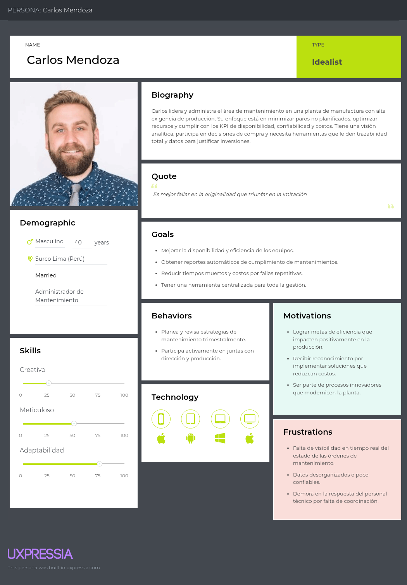

**User persona #2: Técnicos de mantenimiento** <br/>

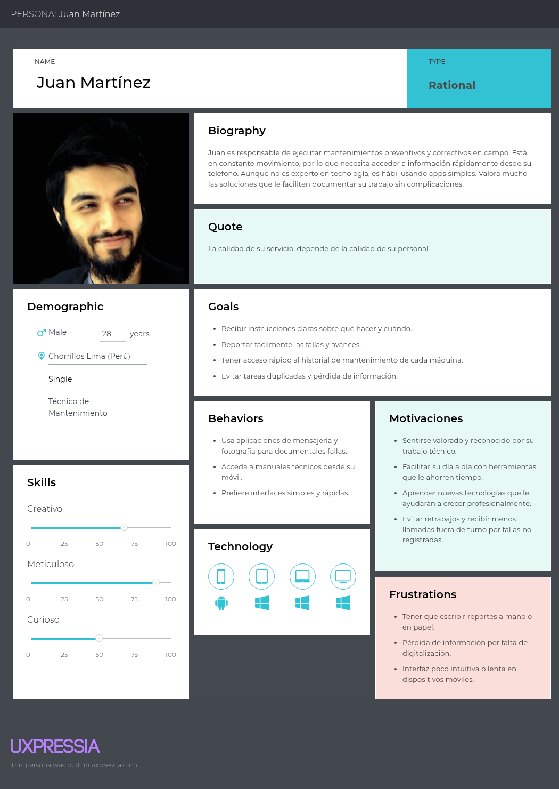

### 2.3.2. User Task Matrix

**Segmento #1: Administradores de mantenimiento** <br/>

|Tarea|Frecuencia|Importancia|
|-----|-----------|----------|
|Supervisar el cumplimiento del plan de trabajo preventivo|Often|High|
|Analizar indicadores de desempeño de equipos|Often|High|
|Autorizar órdenes de trabajo y asignar recursos|Sometimes|High|
|Generar reportes para auditorías o juntas directivas|Occasionally|Medium|
|Aprobar solicitudes de compra de repuestos o servicios externos|Occasionally|Medium|
|Definir estrategias para reducir costos operativos relacionados al mantenimiento|Sometimes|High|
<br/>

**Segmento #2: Técnicos de mantenimiento** <br/>

|Tarea|Frecuencia|Importancia|
|-------|---------|-----------|
|Ejecutar tareas de mantenimiento preventivo y correctivo|Often|High|
|Registrar incidencias, fallos y soluciones en el sistema|Often|High|
|Consultar órdenes de trabajo y actualizar su estado|Often|Medium|
|Solicitar repuestos o herramientas necesarias para una intervención|Sometimes|Medium|
|Subir evidencia visual (fotos/videos) de tareas realizadas|Occasionally|Medium|
|Recibir notificaciones de tareas asignadas o cambios en las órdenes de trabajo|Often|High|

### 2.3.3. User Journey Mapping
**Segmento #1: Administradores y Responsables de Producción** <br/>

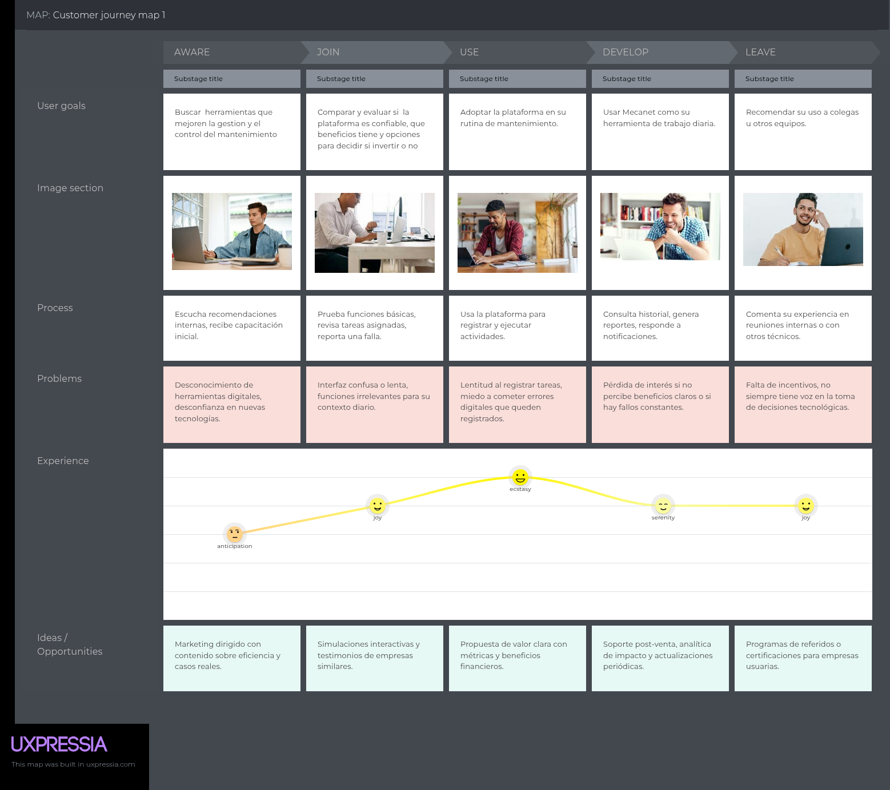
<br/>

**Segmento #2: Técnicos y Operarios de Mantenimiento** <br/>

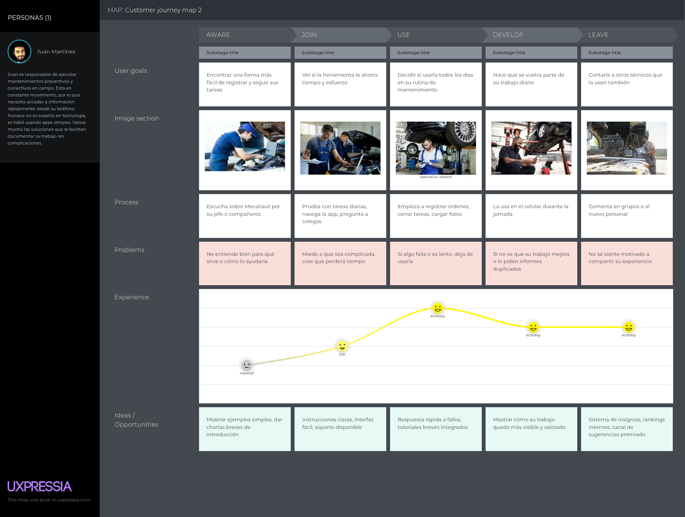

### 2.3.4. Empathy Mapping
A continuación, se mostrarán los Empathy Mapping creados para cada perfil de usuario identificado en nuestros dos segmentos objetivo. Estos mapas nos ayudarán a comprender mejor a nuestros clientes y, así, optimizar la aplicación. <br/>

**Segmento #1: Administradores de mantenimiento** <br/>
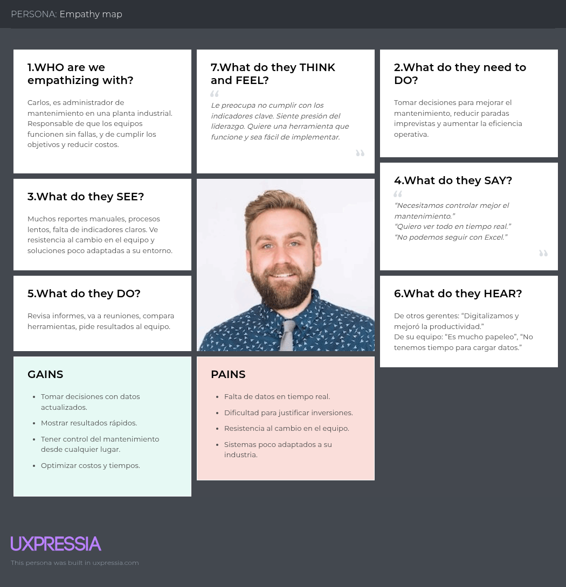 <br/>

**Segmento #2: Técnicos de mantenimiento** <br/>
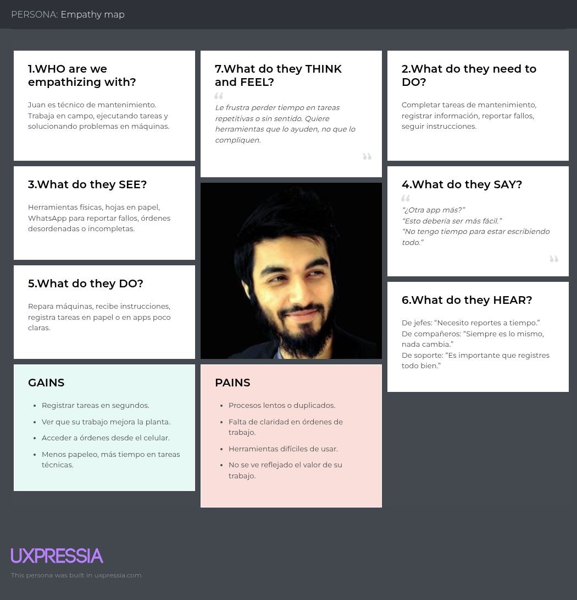 <br/>

### 2.3.5. As-is Scenario Mapping
En esta sección, se presenta el As-Is Scenario Mapping de los segmentos objetivo. Este mapeo nos permite identificar y comprender a fondo los puntos de contacto que tiene el usuario a lo largo de su interacción.

**Segmento #1: Administradores de mantenimiento** <br/>

**Brainstorm individually:** <br/>
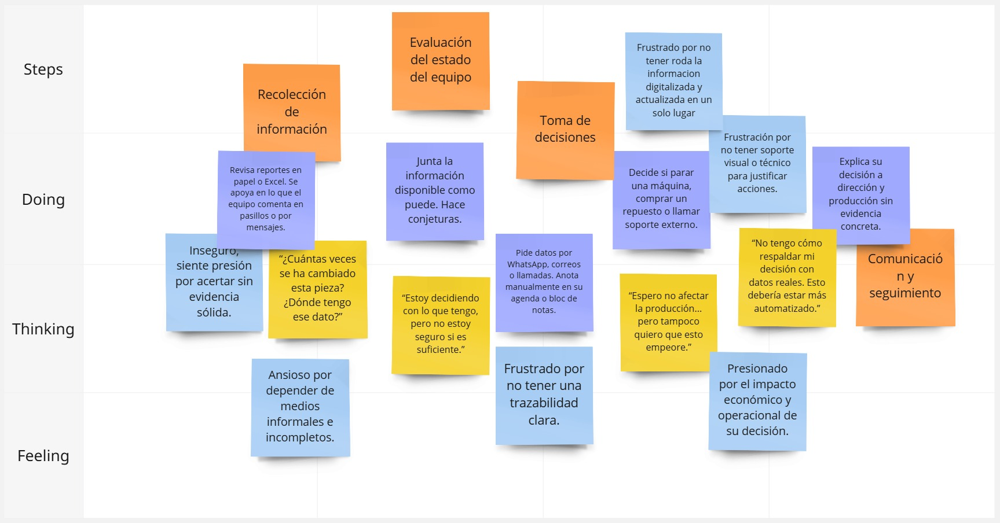 <br/>

**Identify the highs and lows:** <br/>
 <br/>

**Áreas Positivas:** <br/>
- Muestra interés activo por implementar soluciones tecnológicas para optimizar procesos.
- Ve el valor de una solución centralizada para el seguimiento del mantenimiento.

**Áreas Negativas:** <br/>
- Experimenta frustración al comparar opciones sin poder validar cuál se adapta mejor a sus necesidades reales.
- No tiene visibilidad del impacto concreto que tiene el software en el trabajo diario de su equipo.

**Blank Areas (Áreas que requieren aprender más):** <br/>
- Cómo recopila la información técnica y operativa para tomar decisiones.
- Cómo se comunica actualmente con los técnicos de mantenimiento para monitorear avances o problemas.
- Qué tan involucrado está en el seguimiento post-implementación de herramientas digitales.


**Segmento #2: Técnicos de mantenimiento** <br/>

**Brainstorm individually:** <br/>
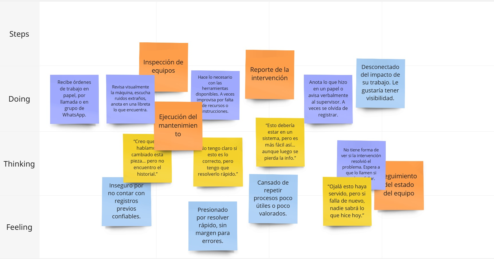 <br/>

**Identify the highs and lows:** <br/>
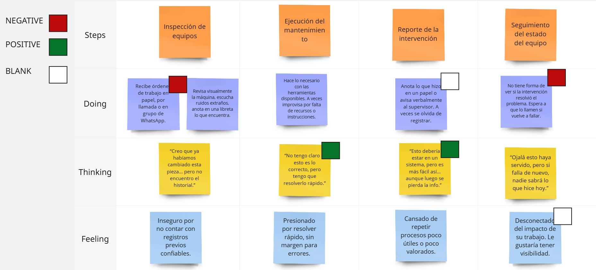 <br/>

**Áreas Positivas:** <br/>
- Tiene disposición a usar herramientas tecnológicas si estas le facilitan el trabajo y ahorran tiempo.
- Sabe resolver problemas técnicos bajo presión, incluso con recursos limitados.

**Áreas Negativas:** <br/>
- Se frustra al recibir tareas de manera informal y sin instrucciones claras.
- Tiene dificultades para registrar de manera organizada el trabajo que realiza.

**Blank Areas (Áreas que requieren aprender más):** <br/>
- Cómo realiza el diagnóstico de fallas antes de ejecutar un mantenimiento.
- Cómo se coordina con sus superiores y otros departamentos.
- Qué espera exactamente de una herramienta digital en su día a día (usabilidad, funciones, soporte, etc.).

## 2.4. Ubiquitous Language
Este glosario define los términos esenciales de nuestro sistema de gestión de mantenimiento industrial. Su objetivo es unificar el lenguaje técnico entre el equipo y los colaboradores, evitando confusiones y garantizando una comunicación clara durante el diseño, la construcción y la validación de nuestra solución. <br/>


|Término|Definición|
|-------|-----------|
|Orden de Trabajo|Instrucción formal que detalla una tarea de mantenimiento a realizar, asignando responsables, fechas y recursos necesarios.|
|Equipo Crítico|Maquinaria o sistema cuya falla puede detener la producción o causar pérdidas significativas. Tiene prioridad en las tareas de mantenimiento.|
|Plan de Mantenimiento|Programa que define las tareas preventivas y correctivas que deben ejecutarse en un periodo determinado para garantizar el funcionamiento de los equipos.|
|Incidencia|Evento inesperado que afecta el funcionamiento normal de un equipo y requiere atención inmediata o correctiva.|
|Técnico de Mantenimiento|Usuario operativo responsable de ejecutar tareas de mantenimiento y registrar información sobre el estado de los equipos.|
|Gerente de Mantenimiento|Usuario estratégico que supervisa el plan de mantenimiento, evalúa indicadores de rendimiento y toma decisiones de optimización.|
|Historial de Mantenimiento|Registro cronológico de todas las intervenciones realizadas sobre un equipo, incluyendo fechas, responsables, fallas detectadas y repuestos utilizados.|
|Notificación de Tarea|Alerta enviada al técnico o supervisor para informar sobre una nueva tarea asignada o cambios en una orden de trabajo existente.|
|Repuesto|Componente o pieza de recambio utilizada para reparar o mantener el funcionamiento de los equipos.|
|Mantenimiento Preventivo|Intervención programada que busca evitar fallas mediante inspecciones, ajustes o reemplazos planificados.|
|Mantenimiento Correctivo|Intervención realizada como respuesta a una falla ya ocurrida, con el objetivo de restaurar el funcionamiento del equipo.|
|Indicador de Rendimiento|Métrica utilizada para evaluar la efectividad de la gestión del mantenimiento, como MTTR (Tiempo Medio de Reparación) o MTBF (Tiempo Medio entre Fallas).|


# Capítulo III: Requirements Specification

## 3.1. To-Be Scenario Mapping

El *To-Be Scenario Mapping* describe cómo será el proceso ideal de gestión de mantenimiento con **Mecanet**, destacando mejoras respecto al estado actual. Este enfoque permite visualizar de forma clara y compartida el flujo de trabajo futuro, optimizado y más eficiente para los dos perfiles clave: **Administrador de mantenimiento** y **Técnico de mantenimiento**. Al anticipar este escenario, se identifican oportunidades de mejora, se alinean los objetivos del proyecto y se facilita la planificación, implementación y comunicación de los cambios necesarios.  
[Visualiza el escenario en Miro](https://miro.com/app/board/uXjVI-VfEvI=/?share_link_id=129646866929)


#### ● To-Be del Segmento 1: Administradores de mantenimiento

**Brainstorm individually:**

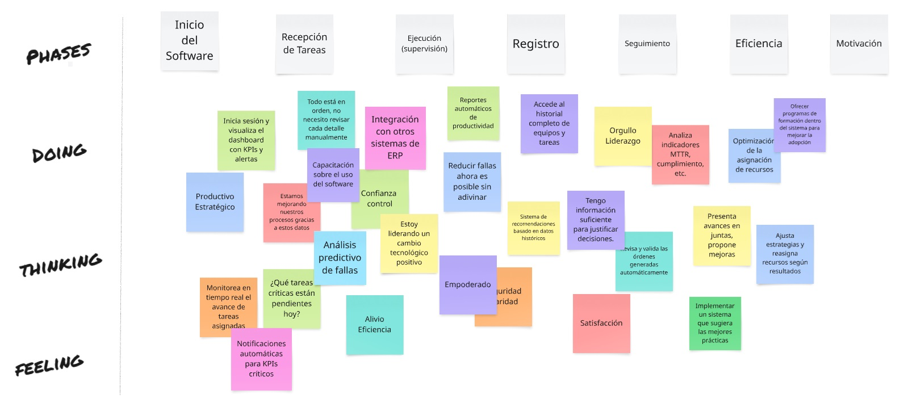

Las ideas seleccionadas para el Segmento 1 se centran en la **automatización de tareas** y la **visualización de KPIs**, lo cual mejora la eficiencia operativa, reduce tiempos de inactividad y permite tomar decisiones rápidas y basadas en datos. Estas soluciones optimizan la asignación de recursos y la toma de decisiones estratégicas.  
Se descartaron ideas como la capacitación continua dentro del software, ya que no eran prioritarias para los objetivos inmediatos del proyecto.
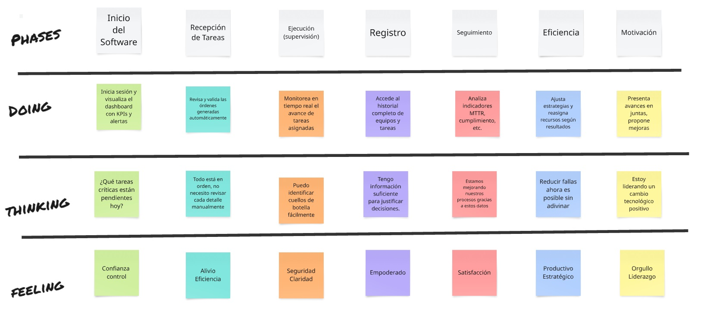

#### ● To-Be del Segmento 2: Técnicos de mantenimiento

**Brainstorm individually:**

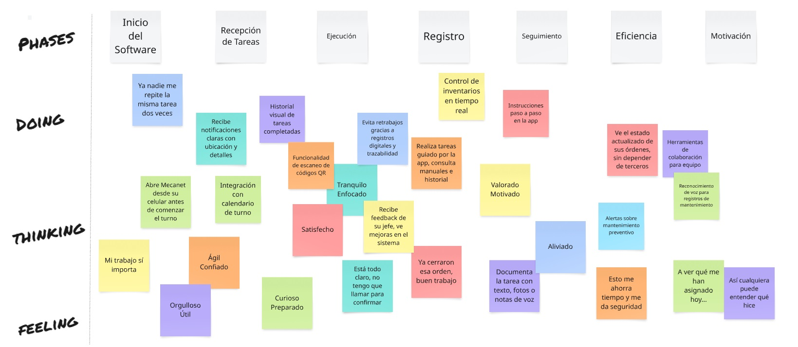

Para el Segmento 2, las ideas seleccionadas se enfocan en **mejorar la eficiencia operativa** de los técnicos, facilitando la **asignación de tareas**, el **seguimiento en tiempo real** y la **documentación digital** de las actividades. Estas soluciones permiten una mayor claridad en la comunicación, reducen retrabajos y mejoran la visibilidad de las tareas.  
Se descartaron propuestas como sistemas de retroalimentación complejos que no generaban valor inmediato, ya que el enfoque principal es optimizar los procesos operativos y aumentar la productividad en el corto plazo.

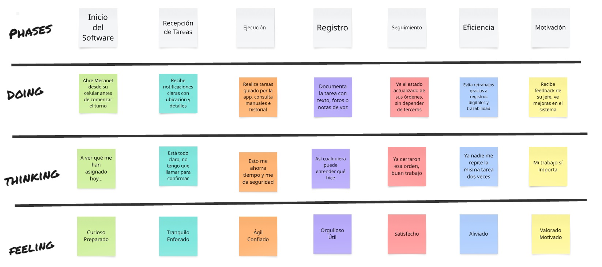


## 3.2. User Stories
<table>
    <tr>
        <td>Story ID</td>
        <td>Título</td>
        <td>Descripción</td>
        <td>Criterios de aceptación</td>
        <td>Linked ID</td>
    </tr>
    <tr>
  <td>US01</td>
  <td>Registro de maquinarias</td>
  <td align="justify">
    Como administrador de mantenimiento, quiero registrar maquinarias en el sistema para llevar un control detallado de los equipos que operan en planta.
  </td>
  <td align="justify">
    <ul>
      <li><strong>Escenario 1: Registro exitoso</strong><br>
      Given que el administrador accede al sistema desde el módulo de gestión de activos,<br>
      When completa todos los campos obligatorios del formulario de maquinaria (nombre, código, tipo, ubicación, estado, fabricante),<br>
      Then el sistema guarda la maquinaria correctamente y muestra una notificación de éxito.</li>
       <br>
<li><strong>Escenario 2: Campos incompletos</strong><br>
      Given que el administrador intenta registrar una maquinaria,<br>
      When omite uno o más campos obligatorios,<br>
      Then el sistema bloquea el registro y muestra un mensaje de error específico indicando qué campos faltan completar.</li>
       <br>
<li><strong>Escenario 3: Código duplicado</strong><br>
      Given que ya existe una maquinaria registrada con un código único,<br>
      When el administrador intenta registrar una nueva maquinaria con el mismo código,<br>
      Then el sistema impide el registro y muestra una advertencia indicando la duplicidad del código.</li>
    </ul>
  </td>
  <td>EP01</td>
</tr>
<tr>
  <td>US02</td>
  <td>Registro de líneas de producción</td>
  <td align="justify">
    Como administrador de mantenimiento, quiero registrar líneas de producción con prioridad asignada para poder planificar eficientemente las tareas de mantenimiento preventivo y correctivo.
  </td>
  <td align="justify">
    <ul>
      <li><strong>Escenario 1: Registro exitoso</strong><br>
      Given que el administrador accede al módulo de líneas de producción,<br>
      When completa el formulario con el nombre, ubicación y selecciona una prioridad válida (Alta, Media, Baja),<br>
      Then el sistema registra la línea correctamente y la muestra en la lista de líneas activas.</li>
 <br>
<li><strong>Escenario 2: Prioridad no asignada</strong><br>
      Given que el administrador intenta registrar una nueva línea de producción,<br>
      When omite seleccionar una prioridad,<br>
      Then el sistema bloquea el registro y muestra un mensaje de error indicando que la prioridad es obligatoria.</li>
    </ul>
  </td>
  <td>EP01</td>
</tr>

<tr>
  <td>US03</td>
  <td>Generación de órdenes de trabajo correctivas</td>
  <td align="justify">
    Como administrador de mantenimiento, quiero generar órdenes de trabajo correctivas para responder a mantenimientos inesperados y garantizar la continuidad operativa.
  </td>
  <td align="justify">
    <ul>
      <li><strong>Escenario 1: Orden generada exitosamente</strong><br>
      Given que un activo presenta una falla repentina,<br>
      When el administrador accede al sistema y crea manualmente una orden de trabajo correctiva especificando la maquinaria, tipo de falla y urgencia,<br>
      Then la orden queda registrada en el sistema, es visible en el calendario y notifica a los técnicos asignados.</li>
 <br>
<li><strong>Escenario 2: Error de duplicación</strong><br>
      Given que ya existe una orden activa para el mismo activo y tipo de falla,<br>
      When el administrador intenta generar otra orden igual,<br>
      Then el sistema detecta la duplicidad, bloquea la acción y muestra un mensaje indicando que ya existe una orden similar en curso.</li>
    </ul>
  </td>
  <td>EP02</td>
</tr>

<tr>
  <td>US04</td>
  <td>Asignación de personal técnico</td>
  <td align="justify">
    Como administrador de mantenimiento, quiero asignar técnicos a las órdenes de trabajo para asegurar que las tareas se ejecuten de manera efectiva y puntual.
  </td>
  <td align="justify">
    <ul>
      <li><strong>Escenario 1: Asignación exitosa</strong><br>
      Given que una orden de trabajo está activa y aún no tiene técnicos asignados,<br>
      When el administrador selecciona uno o más técnicos disponibles y los asigna a la orden,<br>
      Then el sistema actualiza la orden con los técnicos asignados y les notifica automáticamente.</li>
 <br>
<li><strong>Escenario 2: Técnicos no disponibles</strong><br>
      Given que los técnicos seleccionados ya están asignados a otras órdenes en el mismo horario,<br>
      When el administrador intenta asignarlos a una nueva orden,<br>
      Then el sistema alerta sobre el conflicto de disponibilidad e impide la asignación hasta resolver el conflicto.</li>
    </ul>
  </td>
  <td>EP02</td>
</tr>


<tr>
  <td>US05</td>
  <td>Supervisión del calendario de plan de mantenimiento</td>
  <td align="justify">Como administrador de mantenimiento, quiero visualizar el calendario de los planes de mantenimiento para monitorear el avance y cumplimiento de las actividades programadas.</td>
  <td align="justify">
    <ul>
      <li><strong>Escenario 1: Visualización exitosa</strong><br>Given que el administrador accede al módulo de calendario, When se carga la vista mensual o semanal de los planes de mantenimiento, Then se muestran todas las órdenes planificadas con su estado actual: pendiente, en progreso o finalizada, diferenciadas visualmente con colores o íconos.</li> <br>
      <li><strong>Escenario 2: Error de carga</strong><br>Given que ocurre una falla técnica en el sistema, When el administrador intenta cargar el calendario, Then el sistema muestra un mensaje informando la indisponibilidad temporal y sugiere intentar más tarde o contactar al soporte técnico.</li>
    </ul>
  </td>
  <td>EP08</td>
</tr>

<tr>
  <td>US06</td>
  <td>Filtro de plan de mantenimiento</td>
  <td align="justify">Como administrador del sistema, quiero filtrar los planes de mantenimiento por criterios como tipo de activo, fecha o estado para visualizar únicamente los planes relevantes y facilitar la gestión.</td>
  <td align="justify">
    <ul>
      <li><strong>Escenario 1: Filtrar planes de mantenimiento</strong><br>Given que el administrador se encuentra en la vista del calendario de mantenimiento, When selecciona un tipo de filtro (por ejemplo: activo = "Compresor", estado = "Pendiente", fecha = "Abril"), And aplica la búsqueda, Then el sistema muestra únicamente los planes de mantenimiento que coinciden con los criterios seleccionados.</li> <br>
      <li><strong>Escenario 2: Filtro no válido</strong><br>Given que el administrador aplica un filtro con un valor que no tiene resultados asociados (por ejemplo, estado = "Cancelado" sin registros), When realiza la búsqueda, Then el sistema muestra un mensaje indicando que no se encontraron resultados para los criterios especificados.</li>
    </ul>
  </td>
  <td>EP08</td>
</tr>

<tr>
  <td>US07</td>
  <td>Visualización de KPIs</td>
  <td align="justify">Como administrador de mantenimiento, quiero acceder y analizar métricas clave como MTBF, MTTR y disponibilidad para evaluar el rendimiento del mantenimiento y tomar decisiones informadas.</td>
  <td align="justify">
    <ul>
      <li><strong>Escenario 1: Acceso a métricas</strong><br>Given que el administrador accede al módulo de KPIs desde el dashboard, When selecciona una métrica específica (por ejemplo, MTBF) y define un rango de fechas, Then el sistema carga un gráfico actualizado con los datos correspondientes y permite visualizar tendencias o comparativas.</li> <br>
      <li><strong>Escenario 2: Filtro no válido</strong><br>Given que el administrador aplica un filtro con valores incorrectos o fuera de rango (por ejemplo, fecha futura sin registros), When solicita la visualización de una métrica, Then el sistema muestra un mensaje de error claro explicando que no hay datos disponibles o que el filtro es inválido.</li>
    </ul>
  </td>
  <td>EP03</td>
</tr>

<tr>
  <td>US08</td>
  <td>Reporte de orden de trabajo</td>
  <td align="justify">Como técnico de mantenimiento, quiero generar un reporte final de una orden de trabajo para dejar constancia de la intervención realizada.</td>
  <td align="justify">
    <ul>
      <li><strong>Escenario 1: Reporte exitoso</strong><br>Given que el técnico ha finalizado una orden de trabajo, When sube la evidencia (fotos, notas, checklist) correspondiente al reporte, Then el sistema registra correctamente el reporte y lo asocia a la orden finalizada.</li> <br>
      <li><strong>Escenario 2: Formato de evidencia incorrecto</strong><br>Given que el técnico intenta subir un archivo como evidencia, When el archivo tiene un formato no permitido, Then el sistema rechaza el archivo y muestra un mensaje indicando los formatos válidos.</li>
    </ul>
  </td>
  <td>EP04</td>
</tr>

<tr>
  <td>US09</td>
  <td>Implementación de plan de mantenimiento</td>
  <td align="justify">Como administrador de mantenimiento, quiero crear un plan de mantenimiento para una línea de producción para programarlo en el calendario y organizar los recursos.</td>
  <td align="justify">
    <ul>
      <li><strong>Escenario 1: Agregación exitosa</strong><br>Given que el administrador accede al módulo de creación de planes, When completa los campos requeridos (línea, maquinaria, duración, fecha), Then el sistema agrega el plan al calendario y lo notifica a los técnicos asignados.</li> <br>
      <li><strong>Escenario 2: Falla en la agregación</strong><br>Given que el administrador omite uno o más campos requeridos, When intenta guardar el plan, Then el sistema bloquea el envío y solicita completar los campos obligatorios.</li>
    </ul>
  </td>
  <td>EP02</td>
</tr>

<tr>
  <td>US10</td>
  <td>Consulta de órdenes de trabajo diarias</td>
  <td align="justify">Como técnico, quiero visualizar las órdenes de trabajo asignadas en el día para planificar mi jornada de manera eficiente.</td>
  <td align="justify">
    <ul>
      <li><strong>Escenario 1: Consulta correcta</strong><br>Given que el técnico accede al calendario, When selecciona un día específico, Then el sistema muestra un listado ordenado con las órdenes asignadas para ese día, incluyendo estado, prioridad y duración estimada.</li> <br>
      <li><strong>Escenario 2: Sin tareas asignadas</strong><br>Given que el técnico no tiene tareas asignadas para ese día, When consulta el calendario, Then el sistema muestra un mensaje informando que no hay órdenes asignadas para la fecha seleccionada.</li>
    </ul>
  </td>
  <td>EP08</td>
</tr>

<tr>
  <td>US11</td>
  <td>Solicitud de repuestos</td>
  <td align="justify">Como técnico, quiero solicitar repuestos faltantes para poder completar una tarea de mantenimiento correctamente.</td>
  <td align="justify">
    <ul>
      <li><strong>Escenario 1: Solicitud correcta</strong><br>Given que una tarea está en ejecución, When el técnico detecta la falta de un repuesto, Then puede solicitar el material directamente desde la orden, y el sistema registra la solicitud en el módulo de inventario.</li> <br>
      <li><strong>Escenario 2: Solicitud duplicada</strong><br>Given que ya existe una solicitud activa para el mismo repuesto, When el técnico intenta solicitarlo nuevamente, Then el sistema notifica que hay una solicitud pendiente y evita la duplicación.</li>
    </ul>
  </td>
  <td>EP06</td>
</tr>

<tr>
  <td>US12</td>
  <td>Revisión de inventario</td>
  <td align="justify">Como administrador, quiero consultar el inventario actualizado en tiempo real para verificar la disponibilidad de herramientas y materiales.</td>
  <td align="justify">
    <ul>
      <li><strong>Escenario 1: Revisión exitosa</strong><br>Given que el administrador accede al módulo de inventario, When consulta una herramienta o material, Then el sistema muestra el stock actualizado en tiempo real, incluyendo ubicación y estado.</li> <br>
      <li><strong>Escenario 2: Error en la base de datos</strong><br>Given que ocurre una falla de conexión o error interno, When intenta revisar el inventario, Then el sistema muestra un mensaje de error indicando la falla y sugiere reintentar más tarde.</li>
    </ul>
  </td>
  <td>EP06</td>
</tr>

<tr>
  <td>US13</td>
  <td>Sección de beneficios del sistema</td>
  <td align="justify">Como usuario interesado, quiero conocer los beneficios del sistema para evaluar si se adapta a mis necesidades.</td>
  <td align="justify">
    <ul>
      <li><strong>Escenario 1: Acceso a sección</strong><br>Given que el visitante ingresa a la landing page, When accede a la sección de beneficios, Then visualiza una lista clara de beneficios organizados con íconos y descripciones breves.</li> <br>
      <li><strong>Escenario 2: Error de carga</strong><br>Given que hay una interrupción de red, When accede a la sección, Then el sistema muestra un mensaje indicando que no se pudo cargar el contenido.</li>
    </ul>
  </td>
  <td>EP08</td>
</tr>


<tr>
  <td>US14</td>
  <td>Sección precios del sitio web</td>
  <td align="justify">Como usuario interesado, quiero conocer los planes de precios disponibles para seleccionar el que mejor se adapte a mis necesidades.</td>
  <td align="justify">
    <ul>
      <li><strong>Escenario 1: Visualización correcta de planes</strong><br>Given que el visitante está en la landing page, When accede a la sección de precios, Then visualiza los tres planes disponibles (gratuito, corporativo, profesional) con sus características destacadas.</li><br>
      <li><strong>Escenario 2: Error de carga de planes</strong><br>Given que ocurre una falla técnica, When accede a la sección, Then el sistema muestra un mensaje indicando que no se pudieron cargar los planes.</li>
    </ul>
  </td>
  <td>EP08</td>
</tr>

<tr>
  <td>US15</td>
  <td>Sección footer del sitio web</td>
  <td align="justify">Como usuario interesado, quiero acceder a información útil en el footer del sitio para consultar contacto, políticas y otros enlaces relevantes.</td>
  <td align="justify">
    <ul>
      <li><strong>Escenario 1: Footer accesible</strong><br>Given que el visitante navega hasta el final de la página, When visualiza el footer, Then encuentra secciones organizadas como contacto, redes sociales, políticas de privacidad y enlaces rápidos.</li><br>
      <li><strong>Escenario 2: Footer incompleto</strong><br>Given que hay un error de carga, When el visitante intenta ver el footer, Then solo se muestran algunas secciones o enlaces no funcionales.</li>
    </ul>
  </td>
  <td>EP08</td>
</tr>

<tr>
  <td>US16</td>
  <td>Navegación en el sitio web</td>
  <td align="justify">Como usuario interesado, quiero contar con una barra de navegación para explorar fácilmente las secciones del sitio.</td>
  <td align="justify">
    <ul>
      <li><strong>Escenario 1: Navegación funcional</strong><br>Given que el visitante accede al sitio web, When utiliza la barra de navegación, Then puede moverse entre las secciones del sitio sin errores ni recargas innecesarias.</li><br>
      <li><strong>Escenario 2: Barra no visible</strong><br>Given que el sitio no carga correctamente, When intenta navegar, Then la barra no aparece y no puede cambiar de sección.</li>
    </ul>
  </td>
  <td>EP08</td>
</tr>

<tr>
  <td>US17</td>
  <td>Sección dudas del sitio web</td>
  <td align="justify">Como usuario interesado, quiero consultar preguntas frecuentes para resolver mis dudas rápidamente.</td>
  <td align="justify">
    <ul>
      <li><strong>Escenario 1: Acceso a preguntas frecuentes</strong><br>Given que el visitante accede a la landing page, When entra a la sección de dudas, Then visualiza una lista organizada de preguntas y respuestas comunes.</li><br>
      <li><strong>Escenario 2: Error al cargar contenido</strong><br>Given que hay un problema de conexión, When accede a la sección, Then se muestra un mensaje indicando que el contenido no está disponible.</li>
    </ul>
  </td>
  <td>EP08</td>
</tr>

<tr>
  <td>US18</td>
  <td>Registro de tareas realizadas</td>
  <td align="justify">Como técnico, quiero marcar las tareas que ya completé para llevar un seguimiento claro de mi progreso.</td>
  <td align="justify">
    <ul>
      <li><strong>Escenario 1: Registro exitoso de tarea</strong><br>Given que el técnico está trabajando en una orden, When marca una tarea como realizada, Then el sistema actualiza el estado de la tarea en tiempo real y la refleja como completada.</li><br>
      <li><strong>Escenario 2: Fallo al guardar tarea</strong><br>Given que hay una pérdida de conexión o error técnico, When intenta marcar una tarea como realizada, Then el sistema muestra un mensaje de error y permite reintentar más adelante.</li>
    </ul>
  </td>
  <td>EP04</td>
</tr>

<tr>
  <td>US19</td>
  <td>Visualización de pantalla en dispositivos</td>
  <td align="justify">Como usuario, quiero que el sitio se vea correctamente en cualquier dispositivo para poder navegar cómodamente sin perder funcionalidad.</td>
  <td align="justify">
    <ul>
      <li><strong>Escenario 1: Visualización correcta en móvil</strong><br>Given que el visitante accede desde un teléfono móvil, When navega por el sitio, Then el contenido se adapta correctamente al tamaño de la pantalla, manteniendo legibilidad y funcionalidad.</li><br>
      <li><strong>Escenario 2: Fallo en el diseño responsive</strong><br>Given que accede desde un dispositivo con pantalla pequeña, When navega por el sitio, Then el contenido se desborda o aparece desordenado, y el sistema sugiere utilizar otro dispositivo o recargar.</li>
    </ul>
  </td>
  <td>EP05</td>
</tr>

<tr>
  <td>US20</td>
  <td>Registro de cuenta</td>
  <td align="justify">Como administrador, quiero registrar una cuenta con los datos de la empresa, tipo y contacto para poder empezar a usar el sistema.</td>
  <td align="justify">
    <ul>
      <li><strong>Escenario 1: Registro exitoso</strong><br>Given que accede al formulario de registro, When completa todos los campos requeridos, Then el sistema crea la cuenta, envía una confirmación al correo ingresado y redirige al login.</li><br>
      <li><strong>Escenario 2: Campos incompletos</strong><br>Given que el administrador deja campos obligatorios vacíos, When intenta registrar la cuenta, Then el sistema muestra mensajes de error específicos y no permite continuar.</li>
    </ul>
  </td>
  <td>EP09</td>
</tr>

<tr>
  <td>US21</td>
  <td>Registro de técnicos</td>
  <td align="justify">Como administrador, quiero registrar técnicos con sus datos personales y de contacto para poder asignarles tareas de mantenimiento.</td>
  <td align="justify">
    <ul>
      <li><strong>Escenario 1: Técnico registrado correctamente</strong><br>Given que el administrador dispone de la información del técnico, When completa el formulario y lo envía, Then el sistema registra al técnico y lo muestra como disponible.</li><br>
      <li><strong>Escenario 2: Error en el formulario</strong><br>Given que se ingresan datos inválidos (email mal escrito, teléfono incompleto), When se intenta guardar, Then el sistema muestra mensajes de error y no permite el registro hasta corregirlos.</li>
    </ul>
  </td>
  <td>EP09</td>
</tr>

<tr>
  <td>US22</td>
  <td>Inicio de sesión</td>
  <td align="justify">Como administrador o técnico, quiero iniciar sesión en el sistema para acceder a mis funcionalidades asignadas.</td>
  <td align="justify">
    <ul>
      <li><strong>Escenario 1: Inicio de sesión exitoso</strong><br>Given que el usuario tiene credenciales válidas, When las ingresa correctamente, Then accede a su panel correspondiente según su rol.</li><br>
      <li><strong>Escenario 2: Error en las credenciales</strong><br>Given que el usuario escribe mal su usuario o contraseña, When intenta iniciar sesión, Then el sistema informa que las credenciales son inválidas y ofrece opción de recuperación.</li>
    </ul>
  </td>
  <td>EP09</td>
</tr>

<tr>
  <td>US23</td>
  <td>Modificar plan de mantenimiento</td>
  <td align="justify">Como administrador, quiero modificar un plan de mantenimiento ya registrado para ajustarlo a nuevas fechas o condiciones.</td>
  <td align="justify">
    <ul>
      <li><strong>Escenario 1: Modificación exitosa</strong><br>Given que accede al calendario, When edita un plan y guarda los cambios, Then el sistema actualiza la planificación y notifica a los técnicos involucrados.</li><br>
      <li><strong>Escenario 2: Campos inválidos al modificar</strong><br>Given que se deja un campo obligatorio vacío durante la edición, When intenta guardar los cambios, Then el sistema muestra los errores y bloquea la acción.</li>
    </ul>
  </td>
  <td>EP02</td>
</tr>

<tr>
  <td>US24</td>
  <td>Eliminar plan de mantenimiento</td>
  <td align="justify">Como administrador, quiero eliminar planes que ya no se ejecutarán para mantener el calendario limpio y actualizado.</td>
  <td align="justify">
    <ul>
      <li><strong>Escenario 1: Eliminación exitosa</strong><br>Given que accede a un plan de mantenimiento, When lo elimina, Then el sistema borra el plan y actualiza las asignaciones.</li><br>
      <li><strong>Escenario 2: Error al eliminar plan inexistente</strong><br>Given que el plan fue eliminado previamente, When intenta eliminarlo, Then el sistema informa que no se encuentra el plan.</li>
    </ul>
  </td>
  <td>EP02</td>
</tr>

<tr>
  <td>US25</td>
  <td>Eliminar activo</td>
  <td align="justify">Como administrador, quiero eliminar activos que ya no están en uso para mantener actualizada la base de datos del sistema.</td>
  <td align="justify">
    <ul>
      <li><strong>Escenario 1: Eliminación exitosa</strong><br>Given que accede al listado de activos, When selecciona uno y confirma su eliminación, Then el sistema elimina el activo y actualiza todos los registros relacionados.</li><br>
      <li><strong>Escenario 2: Error por dependencias activas</strong><br>Given que el activo está asociado a órdenes activas, When intenta eliminarlo, Then el sistema bloquea la acción y muestra una advertencia.</li>
    </ul>
  </td>
  <td>EP01</td>
</tr>

<tr>
  <td>US26</td>
  <td>Eliminar orden de trabajo repentina</td>
  <td align="justify">Como administrador, quiero eliminar órdenes creadas por error para evitar confusión en el calendario.</td>
  <td align="justify">
    <ul>
      <li><strong>Escenario 1: Eliminación correcta</strong><br>Given que accede a una orden de trabajo, When la elimina, Then el sistema la retira del calendario y del historial.</li><br>
      <li><strong>Escenario 2: Orden ya finalizada</strong><br>Given que la orden ya está marcada como completada, When intenta eliminarla, Then el sistema indica que no se pueden eliminar órdenes cerradas.</li>
    </ul>
  </td>
  <td>EP02</td>
</tr>

<tr>
  <td>US27</td>
  <td>Visualización de perfil de administrador</td>
  <td align="justify">Como administrador, quiero visualizar mi perfil para revisar y actualizar mi información.</td>
  <td align="justify">
    <ul>
      <li><strong>Escenario 1: Visualización exitosa del perfil</strong><br>Given que inicia sesión correctamente, When accede a su perfil, Then el sistema muestra sus datos personales y de cuenta.</li><br>
      <li><strong>Escenario 2: Error al cargar perfil</strong><br>Given que hay una falla técnica, When intenta abrir su perfil, Then el sistema muestra un mensaje temporal de error.</li>
    </ul>
  </td>
  <td>EP09</td>
</tr>

<tr>
  <td>US28</td>
  <td>Visualización de perfil de técnico</td>
  <td align="justify">Como técnico, quiero visualizar mi perfil para conocer mis datos personales y tareas recientes.</td>
  <td align="justify">
    <ul>
      <li><strong>Escenario 1: Acceso exitoso al perfil</strong><br>Given que el técnico inicia sesión, When accede a su perfil, Then ve sus datos personales y el historial de tareas asignadas.</li><br>
      <li><strong>Escenario 2: Perfil no encontrado</strong><br>Given que hay un error de base de datos, When intenta acceder a su perfil, Then el sistema informa que no se pudo cargar.</li>
    </ul>
  </td>
  <td>EP09</td>
</tr>

<tr>
  <td>US29</td>
  <td>Eliminar técnico</td>
  <td align="justify">Como administrador, quiero eliminar técnicos que ya no forman parte del equipo para mantener la base de datos limpia.</td>
  <td align="justify">
    <ul>
      <li><strong>Escenario 1: Eliminación correcta</strong><br>Given que accede al listado de técnicos, When elimina a uno sin tareas pendientes, Then el sistema actualiza la base de datos y lo retira de las listas.</li><br>
      <li><strong>Escenario 2: Técnico con tareas pendientes</strong><br>Given que el técnico aún tiene tareas asignadas, When intenta eliminarlo, Then el sistema bloquea la acción e informa del conflicto.</li>
    </ul>
  </td>
  <td>EP09</td>
</tr>

<tr>
  <td>US30</td>
  <td>Modificar perfil</td>
  <td align="justify">Como usuario (técnico o administrador), quiero editar los datos de mi perfil para mantener mi información personal actualizada.</td>
  <td align="justify">
    <ul>
      <li><strong>Escenario 1: Modificación exitosa</strong><br>Given que accede a su perfil, When modifica sus datos y guarda los cambios, Then el sistema actualiza la información y confirma la operación.</li><br>
      <li><strong>Escenario 2: Error en formato de datos</strong><br>Given que ingresa datos inválidos (correo mal escrito, teléfono incompleto), When intenta guardar, Then el sistema muestra errores específicos y bloquea la acción.</li>
    </ul>
  </td>
  <td>EP09</td>
</tr>

<tr>
  <td>US31</td>
  <td>Actualización de inventario</td>
  <td align="justify">Como administrador, quiero actualizar las cantidades en el inventario para mantener la información actualizada y confiable.</td>
  <td align="justify">
    <ul>
      <li><strong>Escenario 1: Revisión de inventario</strong><br>Given que accede al módulo de inventario, When edita la cantidad de un material o herramienta, Then el sistema guarda los cambios y muestra un mensaje de confirmación.</li><br>
      <li><strong>Escenario 2: Error en la base de datos</strong><br>Given que se intenta ingresar una cantidad negativa, When se guarda el valor, Then el sistema muestra un mensaje de error indicando que el número no es válido.</li>
    </ul>
  </td>
  <td>EP06</td>
</tr>

<tr>
  <td>US32</td>
  <td>Sección Hero del sitio web</td>
  <td align="justify">Como usuario interesado, quiero ver una presentación clara del servicio apenas ingreso, para entender rápidamente qué ofrece Mecanet y por qué me conviene usarlo.</td>
  <td align="justify">
  <ul>
    <li><strong>Escenario 1: Visualización inicial del servicio</strong><br>
    Given que el usuario accede a la landing page,  
    When se carga la página,  
    Then se muestra el nombre del sistema, un subtítulo explicativo y una breve descripción del servicio en el centro de la pantalla.</li><br>

<li><strong>Escenario 2: Métricas destacadas visibles</strong><br>
    Given que el usuario hace scroll o visualiza la sección completa,  
    When observa los indicadores de impacto (ej. menos fallas, menos tiempo perdido, mantenimientos programados),  
    Then puede entender rápidamente los beneficios concretos de la plataforma.</li>
  </ul>
</td>

  <td>EP07</td>
</tr>

</table>

<br>

### Epics:

<table>
    <tr>
  <th>Epic ID</th>
  <th>Título</th>
  <th>Descripción</th>
  <th>HUs asociadas</th>
</tr>

<tr>
  <td>EP01</td>
  <td>Registro y organización inicial</td>
  <td align="justify">Como administrador, quiero registrar los elementos y categorías del sistema para organizar de manera estructurada la información base del mantenimiento.</td>
  <td>US01, US02, US25</td>
</tr>

<tr>
  <td>EP02</td>
  <td>Gestión y planificación del plan de mantenimiento</td>
  <td align="justify">Como administrador, quiero gestionar y planificar el plan de mantenimiento para asegurar que las tareas se ejecuten en tiempo y forma según lo programado.</td>
  <td>US03, US04, US23, US24, US26</td>
</tr>

<tr>
  <td>EP03</td>
  <td>Métricas de desempeño</td>
  <td align="justify">Como administrador, quiero visualizar indicadores clave del sistema para evaluar el rendimiento del equipo técnico y la eficiencia operativa.</td>
  <td>US07</td>
</tr>

<tr>
  <td>EP04</td>
  <td>Ejecución técnica</td>
  <td align="justify">Como técnico operativo, quiero recibir y completar las tareas de mantenimiento con claridad y respaldo para asegurar un trabajo eficiente y sin errores.</td>
  <td>US08, US18</td>
</tr>

<tr>
  <td>EP05</td>
  <td>Responsive Design</td>
  <td align="justify">Como usuario, quiero que la interfaz se adapte a cualquier dispositivo para navegar cómodamente desde móviles, tablets o PCs.</td>
  <td>US19</td>
</tr>

<tr>
  <td>EP06</td>
  <td>Gestión de inventario</td>
  <td align="justify">Como administrador o técnico, quiero revisar, actualizar y solicitar el inventario para asegurar la disponibilidad de insumos y mantener el control de materiales.</td>
  <td>US11, US12, US31</td>
</tr>

<tr>
  <td>EP07</td>
  <td>Sitio web informativo</td>
  <td align="justify">Como usuario interesado, quiero acceder a un sitio web con información clara del sistema para conocer su propuesta de valor.</td>
  <td>US13, US14, US15, US16, US17, US32</td>
</tr>

<tr>
  <td>EP08</td>
  <td>Monitoreo general del plan de mantenimiento</td>
  <td align="justify">Como administrador o técnico, quiero acceder al estado general del plan de mantenimiento para supervisar su avance y cumplimiento.</td>
  <td>US05, US06, US10</td>
</tr>

<tr>
  <td>EP09</td>
  <td>Gestión de cuentas e inicio de sesión</td>
  <td align="justify">Como usuario (administrador o técnico), quiero registrarme, iniciar sesión y gestionar mi cuenta para acceder al sistema de manera segura y mantener mis datos actualizados.</td>
  <td>US20, US21, US22, US27, US28, US29, US30</td>
</tr>

</table>
<br>


### Technical Stories:

<table>
    <table>
  <tr>
    <th>Story ID</th>
    <th>Título</th>
    <th>Descripción</th>
  </tr>

  <tr>
    <td>TS01</td>
    <td>Post Usuario</td>
    <td align="justify">Como desarrollador que trabaja en la aplicación MecaNet, quiero registrar un nuevo usuario mediante una API REST para que pueda autenticarse y utilizar las funcionalidades del sistema.</td>
  </tr>

  <tr>
    <td>TS02</td>
    <td>Get Usuario</td>
    <td align="justify">Como desarrollador que trabaja en la aplicación MecaNet, quiero obtener la información de un usuario mediante una API para mostrar sus datos personales y permisos en la interfaz del sistema.</td>
  </tr>

  <tr>
    <td>TS03</td>
    <td>Get Roles por Usuario</td>
    <td align="justify">Como desarrollador que trabaja en la aplicación MecaNet, quiero obtener los roles asignados a un usuario mediante una API para controlar su acceso a módulos y funcionalidades específicas.</td>
  </tr>

  <tr>
    <td>TS04</td>
    <td>Post Orden de Trabajo</td>
    <td align="justify">Como desarrollador que trabaja en la aplicación MecaNet, quiero registrar una nueva orden de trabajo mediante una API para llevar un seguimiento organizado de los mantenimientos realizados.</td>
  </tr>

  <tr>
    <td>TS05</td>
    <td>Get Órdenes de Trabajo</td>
    <td align="justify">Como desarrollador que trabaja en la aplicación MecaNet, quiero obtener las órdenes de trabajo existentes mediante una API para mostrar el historial y estado de cada tarea de mantenimiento.</td>
  </tr>

  <tr>
    <td>TS06</td>
    <td>Get Métricas de Mantenimiento</td>
    <td align="justify">Como desarrollador que trabaja en la aplicación MecaNet, quiero obtener las métricas generales de mantenimiento mediante una API para mostrar indicadores clave (como MTBF, MTTR) en el dashboard del sistema.</td>
  </tr>

  <tr>
    <td>TS07</td>
    <td>Post Inventory Item</td>
    <td align="justify">Como desarrollador que trabaja en la aplicación MecaNet, quiero registrar un nuevo ítem en el inventario mediante una API para mantener actualizado el stock de herramientas, repuestos y materiales.</td>
  </tr>

  <tr>
    <td>TS08</td>
    <td>Get Inventory Item</td>
    <td align="justify">Como desarrollador que trabaja en la aplicación MecaNet, quiero obtener los detalles de un ítem del inventario mediante una API para visualizar su disponibilidad, ubicación y cantidad actualizada.</td>
  </tr>

  <tr>
    <td>TS09</td>
    <td>Post Activo</td>
    <td align="justify">Como desarrollador que trabaja en la aplicación MecaNet, quiero registrar un nuevo activo (maquinaria, equipo) mediante una API para tenerlo disponible para programación de mantenimientos.</td>
  </tr>

  <tr>
    <td>TS10</td>
    <td>Get Activo</td>
    <td align="justify">Como desarrollador que trabaja en la aplicación MecaNet, quiero obtener la información detallada de un activo mediante una API para mostrarla en el módulo de gestión de activos del sistema.</td>
  </tr>
</table>

</table>

<br>

## 3.3. Impact Mapping

Impact Mapping es una herramienta muy útil que nos permite visualizar y planificar cómo nuestro proyecto puede generar un impacto positivo en los usuarios y en los objetivos finales. Nos ayuda a definir claramente los resultados que queremos lograr, los comportamientos que esperamos de los usuarios y las acciones necesarias para alcanzar esas metas. Al aplicar Impact Mapping, podremos alinear nuestras actividades con los objetivos de manera más efectiva, tomar decisiones más fundamentadas y optimizar el impacto de nuestro proyecto.

[Ver mapa en Miro](https://miro.com/app/board/uXjVI-Ud85A=/?share_link_id=366979847971)


- #### Segmento 1: Administrador de mantenimiento


  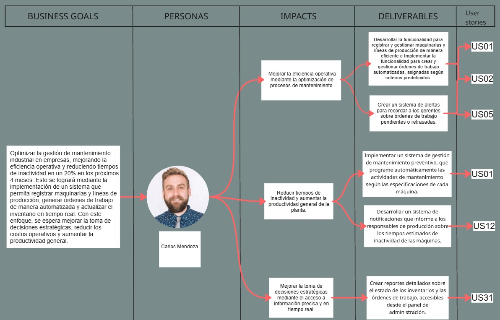


- #### Segmento 2: Técnico de mantenimiento
  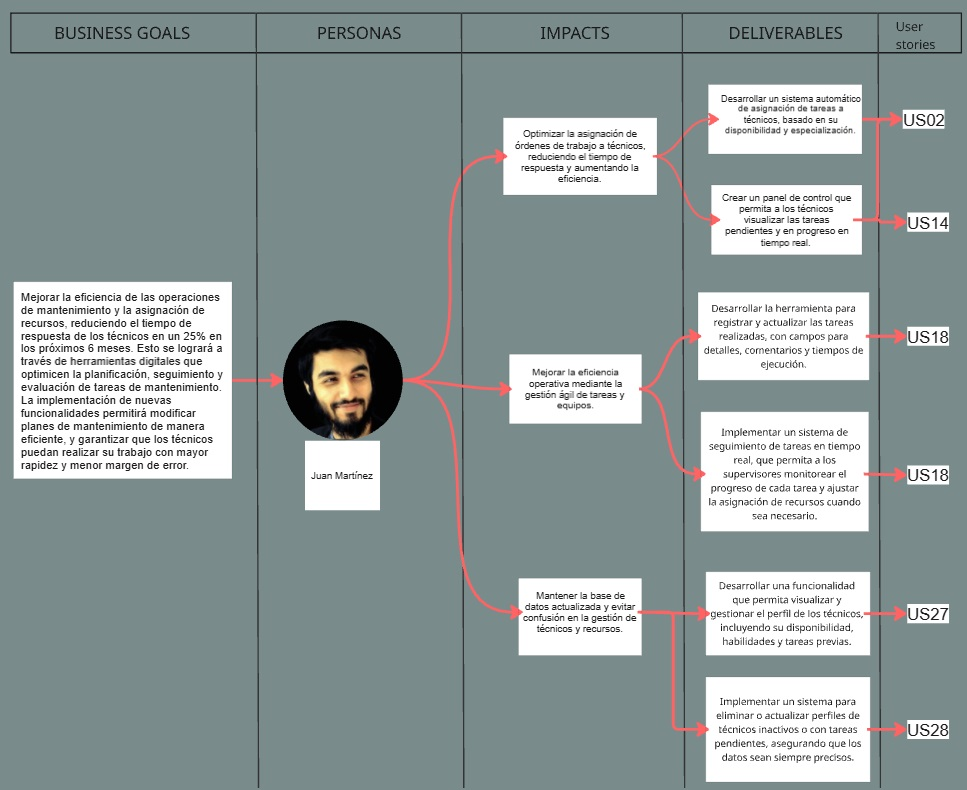


## 3.4. Product Backlog

<table>
  <tr>
    <th>#Orden</th>
    <th>User Story ID</th>
    <th>Título</th>
    <th>Descripción</th>
    <th>Story Points</th>
  </tr>

  <tr><td>1</td><td>US01</td><td>Registro de maquinarias</td><td>Como administrador de mantenimiento, quiero registrar maquinarias en el sistema para llevar un control detallado de los equipos que operan en planta.</td><td>5</td></tr>
<tr><td>2</td><td>US02</td><td>Registro de líneas de producción</td><td>Como administrador de mantenimiento, quiero registrar líneas de producción con prioridad asignada para poder planificar eficientemente las tareas de mantenimiento preventivo y correctivo.</td><td>5</td></tr>
<tr><td>3</td><td>US03</td><td>Generación de órdenes de trabajo correctivas</td><td>Como administrador de mantenimiento, quiero generar órdenes de trabajo correctivas para responder a mantenimientos inesperados y garantizar la continuidad operativa.</td><td>8</td></tr>
<tr><td>4</td><td>US04</td><td>Asignación de personal técnico</td><td>Como administrador de mantenimiento, quiero asignar técnicos a las órdenes de trabajo para asegurar que las tareas se ejecuten de manera efectiva y puntual.</td><td>5</td></tr>
<tr><td>5</td><td>US05</td><td>Supervisión del calendario de plan de mantenimiento.</td><td>Como administrador de mantenimiento, quiero visualizar el calendario de los planes de mantenimiento para monitorear el avance y cumplimiento de las actividades programadas.</td><td>3</td></tr>
<tr><td>6</td><td>US06</td><td>Filtro de plan de mantenimiento</td><td>Como administrador del sistema, quiero filtrar los planes de mantenimiento por criterios como tipo de activo, fecha o estado para visualizar únicamente los planes relevantes y facilitar la gestión.</td><td>2</td></tr>
<tr><td>7</td><td>US07</td><td>Visualización de KPIs</td><td>Como administrador de mantenimiento, quiero acceder y analizar métricas clave como MTBF, MTTR y disponibilidad para evaluar el rendimiento del mantenimiento y tomar decisiones informadas.</td><td>2</td></tr>
<tr><td>8</td><td>US08</td><td>Reporte de orden de trabajo</td><td>Como técnico de mantenimiento, quiero generar un reporte final de una orden de trabajo para dejar constancia de la intervención realizada.</td><td>3</td></tr>
<tr><td>9</td><td>US09</td><td>Implementación de plan de mantenimiento</td><td>Como administrador de mantenimiento, quiero crear un plan de mantenimiento para una línea de producción para programarlo en el calendario y organizar los recursos.</td><td>8</td></tr>
<tr><td>10</td><td>US10</td><td>Consulta de órdenes de trabajo diarias</td><td>Como técnico, quiero visualizar las órdenes de trabajo asignadas en el día para planificar mi jornada de manera eficiente.</td><td>3</td></tr>
<tr><td>11</td><td>US11</td><td>Solicitud de repuestos</td><td>Como técnico, quiero solicitar repuestos faltantes para poder completar una tarea de mantenimiento correctamente.</td><td>2</td></tr>
<tr><td>12</td><td>US12</td><td>Revisión de inventario</td><td>Como administrador, quiero consultar el inventario actualizado en tiempo real para verificar la disponibilidad de herramientas y materiales.</td><td>2</td></tr>
<tr><td>13</td><td>US13</td><td>Sección de beneficios del sistema</td><td>Como usuario interesado, quiero conocer los beneficios del sistema para evaluar si se adapta a mis necesidades.</td><td>2</td></tr>
<tr><td>14</td><td>US14</td><td>Sección precios del sitio web</td><td>Como usuario interesado, quiero conocer los planes de precios disponibles para seleccionar el que mejor se adapte a mis necesidades.</td><td>5</td></tr>
<tr><td>15</td><td>US15</td><td>Sección footer del sitio web</td><td>Como usuario interesado, quiero acceder a información útil en el footer del sitio para consultar contacto, políticas y otros enlaces relevantes.</td><td>1</td></tr>
<tr><td>16</td><td>US16</td><td>Navegación del sitio web</td><td>Como usuario interesado, quiero contar con una barra de navegación para explorar fácilmente las secciones del sitio.</td><td>2</td></tr>
<tr><td>17</td><td>US17</td><td>Sección dudas del sitio web</td><td>Como usuario interesado, quiero consultar preguntas frecuentes para resolver mis dudas rápidamente.</td><td>1</td></tr>
<tr><td>18</td><td>US18</td><td>Registro de tareas realizadas</td><td>Como técnico, quiero marcar las tareas que ya completé para llevar un seguimiento claro de mi progreso.</td><td>5</td></tr>
<tr><td>19</td><td>US19</td><td>Visualización de pantalla en dispositivos</td><td>Como usuario, quiero que el sitio se vea correctamente en cualquier dispositivo para poder navegar cómodamente sin perder funcionalidad.</td><td>2</td></tr>
<tr><td>20</td><td>US20</td><td>Registro de cuenta</td><td>Como administrador, quiero registrar una cuenta con los datos de la empresa, tipo y contacto para poder empezar a usar el sistema.</td><td>3</td></tr>
<tr><td>21</td><td>US21</td><td>Registro de técnicos</td><td>Como administrador, quiero registrar técnicos con sus datos personales y de contacto para poder asignarles tareas de mantenimiento.</td><td>3</td></tr>
<tr><td>22</td><td>US22</td><td>Inicio de sesión</td><td>Como administrador o técnico, quiero iniciar sesión en el sistema para acceder a mis funcionalidades asignadas.</td><td>3</td></tr>
<tr><td>23</td><td>US23</td><td>Modificar plan de mantenimiento</td><td>Como administrador, quiero modificar un plan de mantenimiento ya registrado para ajustarlo a nuevas fechas o condiciones.</td><td>5</td></tr>
<tr><td>24</td><td>US24</td><td>Eliminar plan de mantenimiento</td><td>Como administrador, quiero eliminar planes que ya no se ejecutarán para mantener el calendario limpio y actualizado.</td><td>5</td></tr>
<tr><td>25</td><td>US25</td><td>Eliminar activo</td><td>Como administrador, quiero eliminar activos que ya no están en uso para mantener actualizada la base de datos del sistema.</td><td>5</td></tr>
<tr><td>26</td><td>US26</td><td>Eliminar orden de trabajo repentina</td><td>Como administrador, quiero eliminar órdenes creadas por error para evitar confusión en el calendario.</td><td>5</td></tr>
<tr><td>27</td><td>US27</td><td>Visualización de perfil de administrador</td><td>Como administrador, quiero visualizar mi perfil para revisar y actualizar mi información.</td><td>3</td></tr>
<tr><td>28</td><td>US28</td><td>Visualización de perfil de técnico</td><td>Como técnico, quiero visualizar mi perfil para conocer mis datos personales y tareas recientes.</td><td>3</td></tr>
<tr><td>29</td><td>US29</td><td>Eliminar técnico</td><td>Como administrador, quiero eliminar técnicos que ya no forman parte del equipo para mantener la base de datos limpia.</td><td>5</td></tr>
<tr><td>30</td><td>US30</td><td>Modificar perfil</td><td>Como usuario (técnico o administrador), quiero editar los datos de mi perfil para mantener mi información personal actualizada.</td><td>2</td></tr>
<tr><td>31</td><td>US31</td><td>Actualización de inventario</td><td>Como administrador, quiero actualizar las cantidades en el inventario para mantener la información actualizada y confiable.</td><td>3</td></tr>
<tr><td>32</td><td>TS01</td><td>Post Usuario</td><td>Como desarrollador que trabaja en la aplicación de Mecanet, quiero registrar a un nuevo usuario mediante una API para que pueda autenticarse y utilizar las funcionalidades del sistema.</td><td>3</td></tr>
<tr><td>33</td><td>TS02</td><td>Get Usuario</td><td>Como desarrollador que trabaja en la aplicación de Mecanet, quiero obtener la información de un usuario mediante una API para mostrar sus datos y permisos dentro del sistema.</td><td>3</td></tr>
<tr><td>34</td><td>TS03</td><td>Get Roles por Usuario</td><td>Como desarrollador que trabaja en la aplicación de Mecanet, quiero obtener los roles asociados a un usuario mediante una API para controlar el acceso y las funcionalidades disponibles.</td><td>3</td></tr>
<tr><td>35</td><td>TS04</td><td>Post Orden de Trabajo</td><td>Como desarrollador que trabaja en la aplicación de Mecanet, quiero registrar una nueva orden de trabajo mediante una API para llevar control de los mantenimientos realizados.</td><td>3</td></tr>
<tr><td>36</td><td>TS05</td><td>Get Órdenes de Trabajo</td><td>Como desarrollador que trabaja en la aplicación de Mecanet, quiero obtener las órdenes de trabajo existentes mediante una API para mostrar el historial de mantenimientos.</td><td>3</td></tr>
<tr><td>37</td><td>TS06</td><td>Get Métricas de Mantenimiento</td><td>Como desarrollador que trabaja en la aplicación de Mecanet, quiero obtener las métricas generales de mantenimiento mediante una API para mostrar indicadores de desempeño en el dashboard.</td>5<td><tr>
<td>38</td><td>TS07</td><td>Post Inventory Item</td><td>Como desarrollador que trabaja en la aplicación de Mecanet, quiero registrar un nuevo ítem en el inventario mediante una API para mantener actualizado el stock de herramientas, materiales o equipos.</td><td>3</td></tr>
<tr><td>39</td><td>T08</td><td>Get Inventory Item</td><td>Como desarrollador que trabaja en la aplicación de Mecanet, quiero obtener los detalles de un ítem del inventario mediante una API para visualizar su disponibilidad, ubicación y cantidad.</td><td>3</td></tr>
<tr><td>40</td><td>TS09</td><td>Post Activo</td><td>Como desarrollador que trabaja en la aplicación de Mecanet, quiero registrar un activo mediante una API para tenerlo disponible para programación de mantenimientos.</td><td>5</td></tr>
<tr><td>41</td><td>TS10</td><td>Get Activo</td><td>Como desarrollador que trabaja en la aplicación de Mecanet, quiero obtener la información de un activo mediante una API para mostrarla en el módulo de activos.</td><td>3</td></tr>
<tr><td>42</td><td>US32</td><td>Sección Hero del sitio web</td><td>Como usuario interesado, quiero ver una presentación clara del servicio apenas ingreso, para entender rápidamente qué ofrece Mecanet y por qué me conviene usarlo.</td><td>5</td></tr>

</table>

# Capítulo IV: Product Design

## 4.1. Style Guidelines
### 4.1.1. General Style Guidelines
<h2>Logo</h2>

<h3>Isotipo</h3>
<p>El isotipo de <strong>Mecanet</strong> representa un robot estilizado fusionado con un engranaje, transmitiendo la idea de automatización, tecnología y mantenimiento industrial. En el centro del engranaje se encuentra una "M", inicial del nombre del proyecto, reforzando su identidad. El diseño es simétrico y minimalista, con un estilo amigable que refleja accesibilidad y eficiencia técnica.</p>

<h3>Logotipo</h3>
<p>El logotipo de <strong>Mecanet</strong> incorpora el nombre completo del proyecto en una tipografía moderna y legible. En algunas versiones, el isotipo se integra al inicio del logotipo, sustituyendo la letra "M", lo que genera una identidad visual cohesiva, versátil y memorable.</p>

<p>Se han desarrollado múltiples versiones del isotipo y logotipo para su correcta aplicación sobre diferentes fondos y en distintos formatos (claro, oscuro, con y sin nombre), garantizando la legibilidad y la consistencia visual de la marca en todos los entornos.</p>

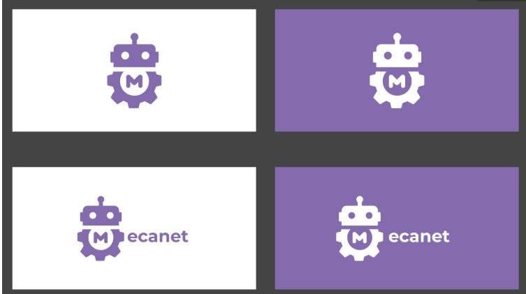</img>
<br>

<h2>Tipografía</h2>
<p><strong>Montserrat:</strong> Esta fuente, reconocida por su modernidad y legibilidad, continúa siendo la elección en la interfaz de la aplicación. Aunque inicialmente se orientaba a un público joven, su diseño limpio y profesional se adapta perfectamente a las exigencias de un público de mayor edad. La tipografía proyecta una imagen contemporánea, sin perder la elegancia y claridad que un usuario maduro valora, garantizando así una experiencia visual agradable y accesible para todos.</p>
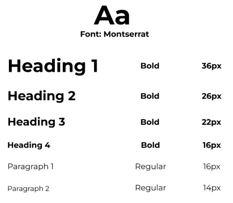</img>
<br>


<h2>Colores</h2>

<h3>Gamas de Morado y Azul</h3>
<p>Los tonos predominantes en la identidad visual de <strong>Mecanet</strong> combinan morados y azules en distintas intensidades, proyectando una imagen tecnológica, confiable y moderna. El morado comunica sofisticación e innovación, mientras que los matices de azul aportan estabilidad y profesionalismo. Esta combinación establece un vínculo visual fuerte con sectores industriales que valoran tanto la precisión como el diseño.</p>

<h3>Neutros y Contrastes</h3>
<p>La paleta incluye grises suaves y oscuros, blanco puro y negro cálido, que refuerzan la estructura visual de la interfaz. Estos colores actúan como base para generar jerarquía visual, aportan balance y mejoran la legibilidad en todos los entornos, tanto en pantallas claras como en modos oscuros.</p>

<h3>Toques de Rojo y Rosa</h3>
<p>El rojo vibrante y su versión más clara aportan un acento en la interfaz, utilizado estratégicamente para elementos de alerta, interacción crítica o llamados de atención. Este contraste no solo añade vitalidad, sino que también asegura que las acciones importantes sean percibidas con claridad inmediata por el usuario.</p>
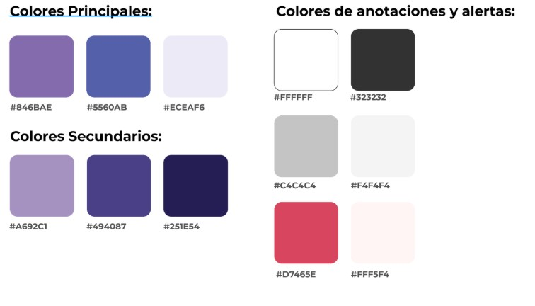</img>


<h2>Botones</h2>

<p>La interfaz de <strong>Mecanet</strong> emplea un sistema de botones visualmente claro, accesible y jerárquico, diseñado para facilitar la acción del usuario en entornos industriales y administrativos. Cada tipo de botón ha sido definido con un propósito específico, utilizando colores de la paleta institucional y formas consistentes para una experiencia coherente y eficiente.</p>

<h3>Botones Primarios</h3>
<p>Como el botón <em>“+ Nuevo Repuesto”</em>, destacan acciones principales. Su diseño de esquinas redondeadas, ícono de acción y texto blanco refuerzan su protagonismo visual y sugieren inmediatez.</p>

<h3>Botones Secundarios</h3>
<p>Representados por estilos contorneados o colores secundarios (como el morado), los botones como <em>“Guardar”</em> y <em>“Agregar Técnico”</em> brindan soporte a acciones relevantes pero no prioritarias. Se usan para completar flujos sin interferir con las acciones primarias.</p>

<h3>Botones de Advertencia o Críticos</h3>
<p>Botones como <em>“Eliminar”</em> emplean un rojo vibrante para denotar acciones destructivas o de alto impacto. Su visibilidad asegura que el usuario evalúe la decisión antes de continuar.</p>

<h3>Botones Neutros / de Estado</h3>
<p>El botón <em>“Marcar como Finalizada”</em>, con contorno negro y fondo blanco, comunica una acción intermedia o de estado. Su tono neutro evita confusión con acciones prioritarias o destructivas.</p>

<h3>Botones de Filtro y Herramientas</h3>
<p>Botones como <em>“Filtro”</em> utilizan íconos y contornos sutiles en morado, orientados a tareas auxiliares o de navegación. Refuerzan la funcionalidad sin competir visualmente con los botones principales.</p>
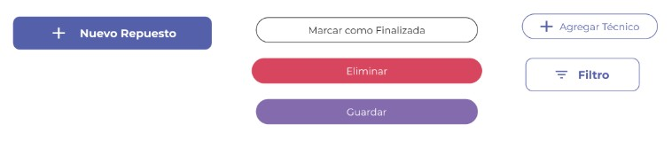</img>
<p>En conjunto, estos botones garantizan una experiencia clara, intuitiva y adaptable a distintos perfiles de usuario, manteniendo siempre la armonía visual y la funcionalidad del sistema.</p>


### 4.1.2. Web Style Guidelines
## 4.2. Information Architecture

<p align="justify">La arquitectura de información de Mecanet está diseñada para facilitar la navegación de dos tipos principales de usuarios: administradores y técnicos de mantenimiento. La organización de la plataforma permite registrar y gestionar maquinaria, materiales y tareas de mantenimiento de forma eficiente. Esta estructura ayuda a que los usuarios ejecuten sus tareas de forma rápida y visualicen con claridad las prioridades operativas.</p>
<br>

### 4.2.1. Organization Systems.

<p align="justify">Mecanet aplica diferentes tipos de organización según el tipo de información:</p>

- **Organización jerárquica visual:**  
  En la pantalla principal se muestran primero las opciones para registrar maquinaria y materiales, destacadas con botones llamativos.

- **Organización secuencial:**  
  Se utiliza tanto para la creación de órdenes de trabajo como para la creación de planes de mantenimiento.

- **Organización matricial:**  
  En vistas como el calendario o el panel de planes de trabajo, los datos pueden filtrarse según líneas de producción, frecuencia, tipo de mantenimiento y estado.
<br>
<p><strong>Sistemas de categorización</strong></p>

- **Por tópicos:**  
  Activos, órdenes de trabajo, planes de mantenimiento, repuestos, usuarios.

- **Cronológica:**  
  Ordenamiento de órdenes y planes según fecha de creación o activación.

- **Alfabética:**  
  Para buscar maquinaria o materiales por nombre o código.

- **Por audiencia:**  
  Accesos y vistas diferenciadas para administradores y técnicos.

<br>

### 4.2.2. Labeling Systems.
<p align="justify">Mecanet utiliza etiquetas claras, con el menor número de palabras necesario y una jerarquía visual consistente.</p>
<table border="1" cellspacing="0" cellpadding="6">
  <tr>
    <th>Etiqueta</th>
    <th>Descripción</th>
  </tr>
  <tr>
    <td>Inicio</td>
    <td>Acceso al panel principal.</td>
  </tr>
  <tr>
    <td>Maquinaria</td>
    <td>Registro y gestión de equipos.</td>
  </tr>
  <tr>
    <td>Materiales</td>
    <td>Registro de repuestos y recursos.</td>
  </tr>
  <tr>
    <td>Líneas de Producción</td>
    <td>Registro de líneas de producción.</td>
  </tr>
  <tr>
    <td>Crear orden de trabajo</td>
    <td>Flujo para crear una orden correctiva.</td>
  </tr>
  <tr>
    <td>Planes de Trabajo</td>
    <td>Creación y gestión de planes de mantenimiento fijos o dinámicos.</td>
  </tr>
  <tr>
    <td>Estadísticas</td>
    <td>Acceso a indicadores y exportes.</td>
  </tr>
  <tr>
    <td>Perfil</td>
    <td>Configuración de cuenta y roles.</td>
  </tr>
  <tr>
    <td>Ayuda</td>
    <td>Acceso a preguntas frecuentes o soporte técnico.</td>
  </tr>
</table>

<br>

### 4.2.3. SEO Tags and Meta Tags

<strong>Landing Page</strong>
- **Title:** Mecanet | Software de Mantenimiento Industrial  
- **Meta Description:** Plataforma para registrar maquinaria, materiales y gestionar mantenimiento preventivo y correctivo.  
- **Meta Keywords:** mantenimiento industrial, planes de mantenimiento, software para  
- **Meta Author:** AwawaTech

<strong>Aplicación Web</strong>
- **Title:** Mecanet  
- **Meta Description:** Registra activos, crea planes de mantenimiento y controla tus órdenes de trabajo fácilmente.  
- **Meta Keywords:** gestión de mantenimiento de maquinaria, mantenimiento preventivo, mantenimiento correctivo  
- **Meta Author:** AwawaTech

<br>

### 4.2.4. Searching Systems.

**Mecanet proporciona un sistema de búsqueda integrado en las secciones clave:**

- **Buscar maquinaria:**  
  Por nombre, código o línea de producción.

- **Buscar materiales:**  
  Por nombre, línea de producción, maquinaria o stock.

- **Buscar órdenes de trabajo:**  
  Por ID, tipo, plan de mantenimiento, prioridad o fecha.

- **Buscar planes de trabajo:**  
  Por frecuencia, tipo o activos asociados.

  
**Filtros disponibles:**

- Línea de producción
- Tipo de mantenimiento (preventivo, correctivo)
- Estado (pendiente, ejecutado, vencido)
- Técnico(s) asignado(s)
- Rango de fechas

Los resultados se presentan en tablas interactivas y visualizaciones tipo calendario, con opciones de ordenamiento y edición.

<br>

### 4.2.5. Navigation Systems.

### Flujos de navegación

- Desde el panel principal se accede directamente a los módulos clave: registro de activos, creación de órdenes, visualización de planes y seguimiento.

- El sistema guía paso a paso en la creación tanto de órdenes correctivas como de planes periódicos (fijos o dinámicos).

- Cada línea de producción tiene su vista detallada, con historial, máquinas asociadas y próximos mantenimientos generados a partir de sus planes.

<br>

## 4.3. Landing Page UI Design.
### 4.3.1. Landing Page Wireframe.

En el wireframe de la landing page se puede observar la estructura general del sitio web, donde destaca una cabecera fija agrupa el logotipo, la barra de navegación (Inicio, Producto, Beneficios, Planes, FAQ), el selector ES | EN y dos CTAs primarios: «Iniciar sesión» y «Crear cuenta». Justo debajo, el hero alinea un título (“Mecanet”), un eslogan corto y el mock-up de un portátil que servirá más adelante para mostrar la interfaz.
Principios de diseño
<ul>
    <li>Jerarquía visual. Logo, título y CTAs ocupan la zona “above the fold” para captar primero la atención.</li>
    <li>Consistencia. Rejilla uniforme, tipografía Montserrat y espaciados en todo el boceto.</li>
    <li>Espaciado. Separación generosa entre bloques que evita saturación y favorece el escaneo.</li>
</ul>
Arquitectura de la información
<ul>
    <li>Organización. Contenido en bloques temáticos claramente rotulados.</li>
    <li>Navegabilidad. La barra fija con anclas internas permite saltar a cada sección sin perder el contexto.</li>
</ul>

Heurísticas aplicadas
<ul>
    <li>Visibilidad del estado del sistema. Menú siempre visible indica la ubicación del usuario.</li>
    <li>Consistencia y estándares. Distribución clásica de landing empresarial; reduce curva de aprendizaje.</li>
    <li>Reconocimiento antes que recuerdo. Iconos y rótulos intuitivos evitan búsquedas innecesarias.</li>
</ul>
<p>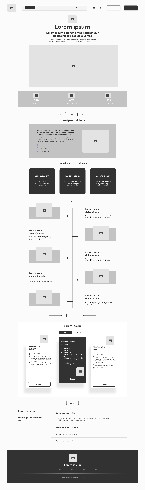</p>


<br><br>


### 4.3.2. Landing Page Mock-up.

En el mockup de la landing page se aprecia cómo el diseño visual refuerza la estructura vista en el wireframe. Se mantiene el logo en la parte superior con una breve descripción y las tarjetas de métrica se insertan en una banda de color que rompe la monotonía y aporta foco.. La barra de navegación fija sigue presente para facilitar el acceso a las secciones informativas, pero aquí destaca el uso de colores contrastantes y una tipografía moderna que mejora la experiencia de usuario.
Además, se mantienen las mismas secciones de la barra de navegación se mantienen, pero ahora con un diseño que se acopla mejor a la imagen de Mecanet y mejora la interacción del usuario.

Principios de diseño
<ul>
    <li>Contraste. Violeta intenso para elementos accionables; fondo blanco para contenido, garantiza una buena visibilidad de todos los elementos</li>
    <li>Jerarquía visual. Títulos de 48 px, subtítulos de 32 px y cuerpo de 16 px ordenan la información.</li>
    <li>Consistencia. Colores, iconos lineales y radios de 12 px se repiten en toda la interfaz.</li>
</ul>

Arquitectura de la información
<ul>
    <li>Claridad. Cada sección responde a un objetivo único (explicar, demostrar, convertir).</li>
    <li>Priorización. Los CTAs “Crear cuenta” aparecen tras exponer valor y precios, impulsando la conversión.</li>
</ul>

Heurísticas aplicadas
<ul>
    <li>Diseño estético y minimalista. Paleta reducida (violeta, blanco, acento lavanda) y abundante espacio en blanco evitan ruido visual.</li>
    <li>Consistencia y estándares. Botones y navegación siguen patrones web familiares, fortaleciendo la confianza.</li>
    <li>Reconocimiento antes que recuerdo. Iconos de llave inglesa, cronómetro o calendario ayudan a identificar secciones de un vistazo.</li>
</ul>

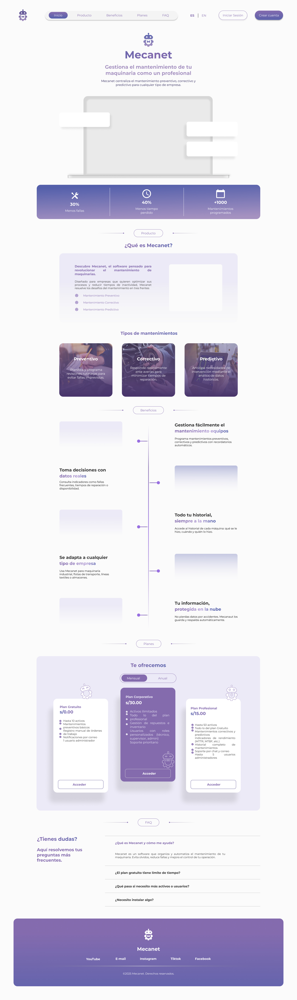

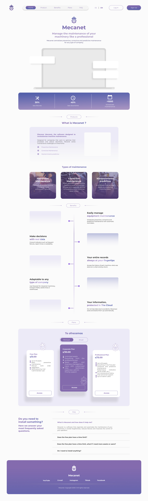


## 4.4. Web Applications UX/UI Design.
### 4.4.1. Web Applications Wireframes.


https://www.figma.com/design/DrWdD2WCsYdhWQ633erUJM/Mecanet?node-id=441-377&t=jNJo4wjbluVyQsOh-1


### 4.4.2. Web Applications Wireflow Diagrams.

User Goal: “Crear cuenta corporativa”
User persona: Empresas — Administrador
“Como administrador de la empresa, quiero crear una cuenta corporativa para empezar a usar Mecanet y centralizar la gestión de mantenimiento.”


User Goal: “Registrar nueva línea de producción”
User persona: Empresas — Administrador
“Como administrador de la empresa, quiero registrar una nueva línea de producción para organizar sus máquinas y supervisar sus programas de mantenimiento.”


User Goal: “Registrar nueva maquinaria”
User persona: Empresas — Administrador
“Como administrador de la empresa, quiero registrar una nueva máquina para tener actualizado el inventario de activos y poder planificar sus intervenciones.”


User Goal: “Generar plan mensual de mantenimiento”
User persona: Empresas — Administrador
“Como administrador de la empresa, quiero generar un plan mensual de mantenimiento para asegurar que todas las máquinas reciban servicio preventivo a tiempo y reducir fallos.”


User Goal: “Completar checklist de una orden de trabajo”
User persona: Trabajador— Técnico
“Como técnico de mantenimiento, quiero completar el checklist de una orden de trabajo para dejar constancia de la ejecución y las evidencias del servicio realizado.”


### 4.4.2. Web Applications Mock-ups.


https://www.figma.com/design/DrWdD2WCsYdhWQ633erUJM/Mecanet?node-id=441-377&t=jNJo4wjbluVyQsOh-1

### 4.4.3. Web Applications User Flow Diagrams.
User Goal: “Crear cuenta corporativa”
User persona: Empresas — Administrador


Happy paths:
El usuario ingresa a la aplicación y puede ver su perfil
Unhappy paths:


User Goal: “Registrar nueva línea de producción”
User persona: Empresas — Administrador


Happy paths:
El usuario ingresa a la pantalla de “Gestión Activos > línea de producción”
Selecciona “Nueva Línea”
El usuario completa los campos del formulario
Cuando el usuario esté conforme con los datos presiona guardar
Unhappy paths:
El usuario decide no continuar con el proceso de creación y presiona en cancelar

User Goal: “Registrar nueva maquinaria”
User persona: Empresas — Administrador


Happy paths:
El usuario ingresa a la pantalla de “Gestión Activos > maquinarias”
Selecciona “Nueva Línea”
El usuario completa los campos del formulario
Cuando el usuario esté conforme con los datos presiona guardar
Unhappy paths:
El usuario decide no continuar con el proceso de creación y presiona en cancelar

## 4.5. Web Applications Prototyping.

El prototipo web de Mecanet ha sido diseñado siguiendo principios de arquitectura de información, diseño centrado en el usuario y las heurísticas de usabilidad de Nielsen, con el objetivo de ofrecer una experiencia clara, funcional y accesible. La navegación se estructura de forma jerárquica, permitiendo a los usuarios acceder fácilmente a las distintas secciones informativas y funcionalidades del sistema.
La interfaz presenta una organización visual coherente, utilizando una paleta de colores sobria y una tipografía legible que refuerzan la identidad institucional. Los elementos clave, como botones de acceso, formularios y menús, se ubican estratégicamente para facilitar la interacción y reducir la carga cognitiva.
Cada componente del prototipo está pensado para mantener la consistencia visual y la visibilidad del estado del sistema, ofreciendo retroalimentación clara en cada acción del usuario. Además, se respetan los estándares de diseño web actuales para garantizar una experiencia fluida en diferentes dispositivos.

https://www.figma.com/proto/DrWdD2WCsYdhWQ633erUJM/Mecanet?node-id=344-4101&t=T8aZA1CjBy1z5Osa-1&scaling=min-zoom&content-scaling=fixed&page-id=344%3A4100&starting-point-node-id=344%3A4101&show-proto-sidebar=1

## 4.6. Domain-Driven Software Architecture.

## 4.6. Domain-Driven Software Architecture

El **Domain-Driven Design (DDD)** pretende que el software represente con exactitud el mundo de negocio, favoreciendo la cooperación fluida entre desarrolladores y especialistas del dominio. Para lograrlo, DDD introduce:

- **Lenguaje ubicuo**: un vocabulario compartido tanto en el código como en las conversaciones, que elimina interpretaciones ambiguas.  
- **Bounded Contexts**: división del dominio en zonas independientes, cada una con su propio modelo y límites claros.  
- **Patrones estratégicos** (Context Map, Anticorruption Layer) y **tácticos** (Entidades, Value Objects, Repositories, Domain Services) que orientan la estructura del código y la arquitectura general.

En Mecanet, esta filosofía permite separar responsabilidades (autenticación, facturación, recursos, planificación, ejecución y notificaciones) y evolucionar cada área por separado sin sacrificar la coherencia global.

### 4.6.1. Software Architecture Context Diagram

El siguiente diagrama presenta en una sola vista el sistema Mecanet, sus actores principales y los sistemas externos con los que se comunica:

<div>
  <p align="center">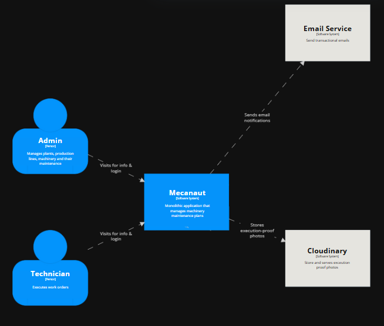</p>
</div>

### 4.6.2. Software Architecture Container Diagrams

El C2 hace “zoom” dentro del sistema y destaca los contenedores lógicos. Para mostrar cómo se aplica DDD, se representan seis contenedores en forma de hexágono —los bounded contexts— dentro del monolito API Application.

<div>
  <p align="center">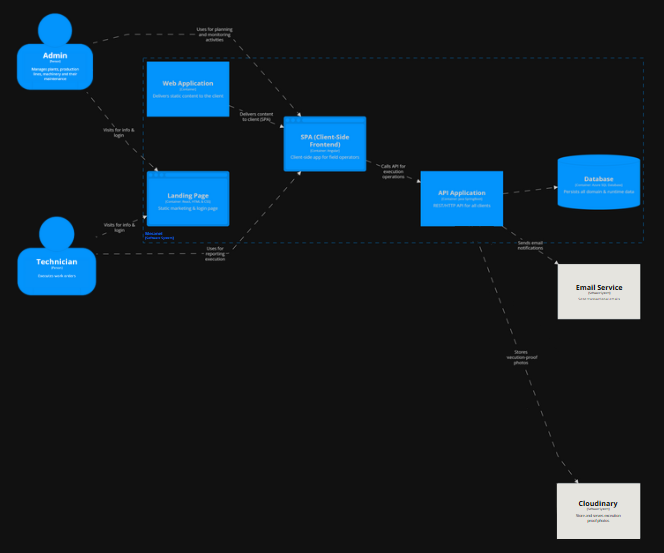</p>
</div>

### 4.6.3. Software Architecture Components Diagrams

En el nivel C3 profundizamos en cada contenedor. A continuación se muestran los C3 de los bounded contexts identificados:

* Work Order Context:  
  <div>
    <p align="center">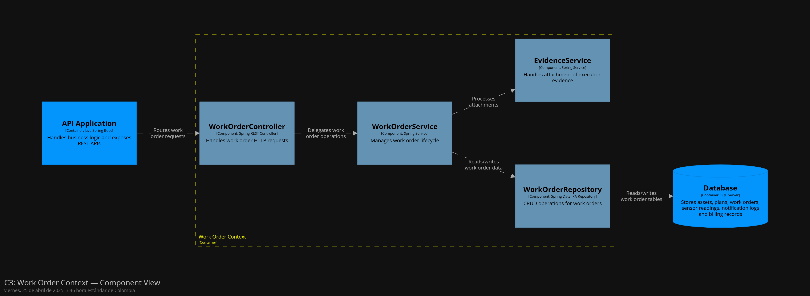</p>
  </div>

* Asset Management Context:  
  <div>
    <p align="center"></p>
  </div>

* Maintance Planning Context:  
  <div>
    <p align="center"></p>
  </div>

* Predictive Analysis Context:  
  <div>
    <p align="center"></p>
  </div>

* Notificaction Context:  
  <div>
    <p align="center"></p>
  </div>

* Billing Context:  
  <div>
    <p align="center"></p>
  </div>


A continuación, los diagramas de componentes a nivel de front.

* Work Order Context:


* Asset Management Context:  
    

* Maintance Planning Context:  
    

* Inventary Context:  
    

* Notificaction Context:  
      


## 4.7. Software Object-Oriented Design.
### 4.7.1. Class Diagrams.
Diagrama de clases del FrontEnd basado en bounded contexts

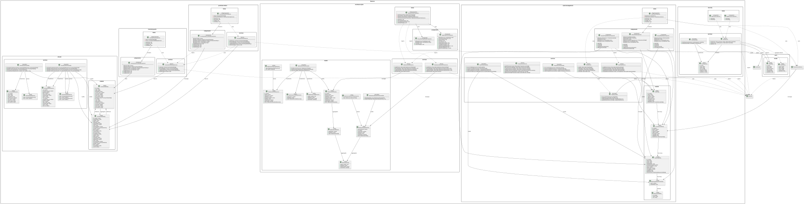

<br>

Diagrama de clases del BackEnd basado en bounded contexts

<p align="center">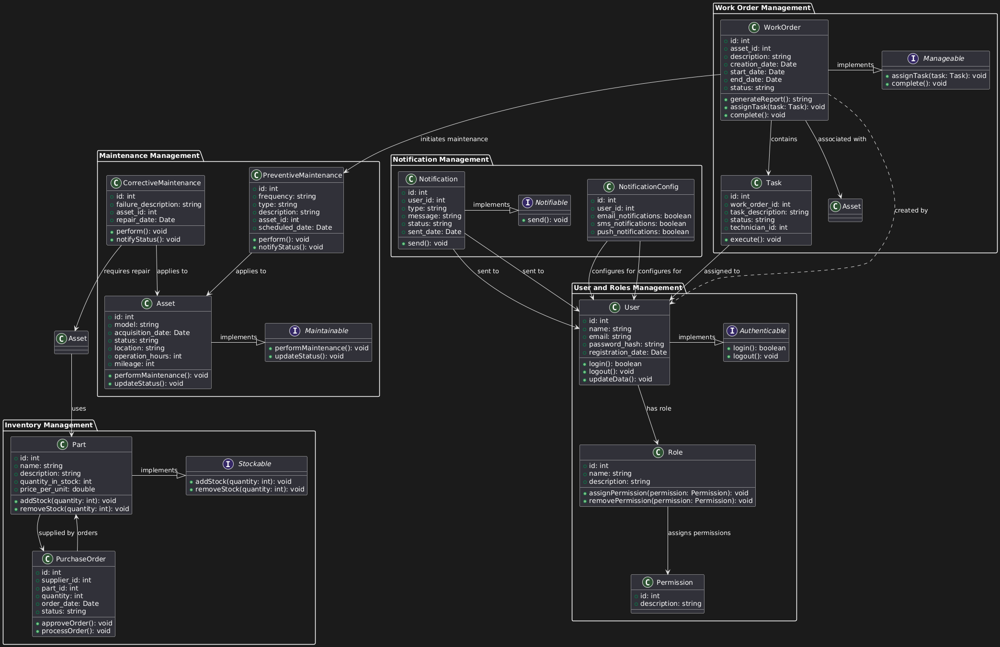</p>
    <br>

<br>

Diagrama de clases DDD

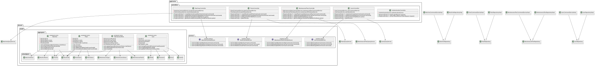

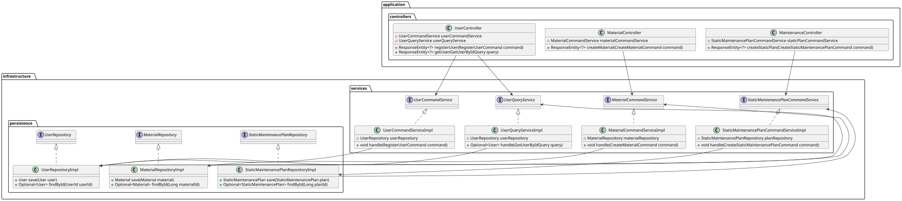


<br>
<br>


### Account
**Descripción**: Organización cliente suscrita a la plataforma, con límites de usuarios y activos definidos por su plan.

#### Atributos
| Nombre | Tipo | Visibilidad | Descripción |
| ------ | ---- | ----------- | ----------- |
| `id` | `UUID` | `private` | Identificador único |
| `name` | `String` | `private` | Nombre de la compañía |
| `plan` | `PlanType` | `private` | Plan de suscripción |
| `maxUsers` | `int` | `private` | Límite de usuarios permitidos |
| `maxAssets` | `int` | `private` | Límite de activos registrados |

#### Métodos
| Firma | Visibilidad | Descripción |
| ----- | ----------- | ----------- |
| `canAddUser(): boolean` | `public` | Devuelve **true** si aún no se alcanzó `maxUsers` |

---

### User
**Descripción**: Persona que accede al sistema en nombre de una cuenta.

#### Atributos
| Nombre | Tipo | Visibilidad | Descripción |
| ------ | ---- | ----------- | ----------- |
| `id` | `UUID` | `private` | Identificador único |
| `username` | `String` | `private` | Alias de inicio de sesión |
| `email` | `String` | `private` | Correo electrónico |
| `passwordHash` | `String` | `private` | Contraseña en hash |

#### Métodos
| Firma | Visibilidad | Descripción |
| ----- | ----------- | ----------- |
| `checkPassword(raw: String): boolean` | `public` | Valida `raw` contra `passwordHash` |

---

### Role
**Descripción**: Conjunto de permisos asignado a usuarios.

#### Atributos
| Nombre | Tipo | Visibilidad | Descripción |
| ------ | ---- | ----------- | ----------- |
| `id` | `UUID` | `private` | Identificador único |
| `name` | `String` | `private` | Nombre del rol (p. ej. `ADMIN`) |

#### Métodos
| Firma | Visibilidad | Descripción |
| ----- | ----------- | ----------- |
| `assignTo(user: User): void` | `public` | Asigna este rol a un usuario |

---

### Permission
**Descripción**: Permiso atómico para control de acceso.

#### Atributos
| Nombre | Tipo | Visibilidad | Descripción |
| ------ | ---- | ----------- | ----------- |
| `id` | `UUID` | `private` | Identificador único |
| `name` | `String` | `private` | Código del permiso |

---

### MenuItem
**Descripción**: Opción de menú visible según permisos.

#### Atributos
| Nombre | Tipo | Visibilidad | Descripción |
| ------ | ---- | ----------- | ----------- |
| `id` | `UUID` | `private` | Identificador único |
| `label` | `String` | `private` | Texto mostrado |
| `route` | `String` | `private` | Ruta/URL destino |

#### Métodos
| Firma | Visibilidad | Descripción |
| ----- | ----------- | ----------- |
| `isAccessibleBy(perms: List<Permission>): boolean` | `public` | **true** si el usuario posee los permisos requeridos |

---

#### Interfaces del Security Context
| Nombre | Métodos clave |
| ------ | ------------- |
| `IUserRepository` | `findByUsername(username): Optional<User>`<br>`save(user): User` |
| `IRoleRepository` | `findByName(name): Optional<Role>`<br>`save(role): Role` |
| `IJwtTokenProvider` | `generateToken(user): String`<br>`validateToken(token): boolean` |
| `IPasswordEncoder` | `encode(raw): String`<br>`matches(raw, encoded): boolean` |

---

## Asset Management Context

### Asset
**Descripción**: Maquinaria o equipo registrado en planta.

#### Atributos
| Nombre | Tipo | Visibilidad | Descripción |
| ------ | ---- | ----------- | ----------- |
| `id` | `UUID` | `private` | Identificador único |
| `name` | `String` | `private` | Nombre del activo |
| `model` | `String` | `private` | Modelo de fabricante |
| `serialNumber` | `String` | `private` | Número de serie |
| `status` | `AssetStatus` | `private` | Estado operativo |

#### Métodos
| Firma | Visibilidad | Descripción |
| ----- | ----------- | ----------- |
| `scheduleMaintenance(plan: MaintenancePlan): void` | `public` | Asocia un plan preventivo al activo |

---

### SparePart
**Descripción**: Repuesto utilizable por los activos.

#### Atributos
| Nombre | Tipo | Visibilidad | Descripción |
| ------ | ---- | ----------- | ----------- |
| `id` | `UUID` | `private` | Identificador único |
| `code` | `String` | `private` | Código interno |
| `stock` | `int` | `private` | Existencias |

#### Métodos
| Firma | Visibilidad | Descripción |
| ----- | ----------- | ----------- |
| `isLowStock(): boolean` | `public` | **true** si el stock está por debajo del mínimo |

---

**Enum**  
`AssetStatus { ACTIVE, INACTIVE, MAINTENANCE }`

#### Interfaces del Asset Management Context
| Nombre | Métodos clave |
| ------ | ------------- |
| `IAssetRepository` | `findById(id): Optional<Asset>`<br>`save(asset): Asset` |
| `ISparePartRepository` | `findLowStock(): List<SparePart>` |

---

## Maintenance Planning Context

### MaintenancePlan
**Descripción**: Definición de mantenimiento periódico.

#### Atributos
| Nombre | Tipo | Visibilidad | Descripción |
| ------ | ---- | ----------- | ----------- |
| `id` | `UUID` | `private` | Identificador |
| `name` | `String` | `private` | Título del plan |
| `frequency` | `Frequency` | `private` | Periodicidad |
| `nextRun` | `LocalDate` | `private` | Próxima ejecución |

#### Métodos
| Firma | Visibilidad | Descripción |
| ----- | ----------- | ----------- |
| `generateTasks(): List<MaintenanceTask>` | `public` | Crea tareas futuras |

---

### MaintenanceTask
**Descripción**: Tarea derivada de un plan.

#### Atributos
| Nombre | Tipo | Visibilidad | Descripción |
| ------ | ---- | ----------- | ----------- |
| `id` | `UUID` | `private` | Identificador |
| `plannedDate` | `LocalDate` | `private` | Fecha programada |

#### Métodos
| Firma | Visibilidad | Descripción |
| ----- | ----------- | ----------- |
| `assign(slot: ScheduleSlot): void` | `public` | Asigna la tarea a un horario dado |

---

### ScheduleSlot
**Descripción**: Franja de calendario disponible.

#### Atributos
| Nombre | Tipo | Visibilidad | Descripción |
| ------ | ---- | ----------- | ----------- |
| `date` | `LocalDate` | `private` | Día |
| `startTime` | `LocalTime` | `private` | Hora de inicio |
| `endTime` | `LocalTime` | `private` | Hora de fin |

#### Métodos
| Firma | Visibilidad | Descripción |
| ----- | ----------- | ----------- |
| `conflictsWith(other: ScheduleSlot): boolean` | `public` | Detecta solapamiento |

---

**Enum**  
`Frequency { DAILY, WEEKLY, MONTHLY, USAGE }`

#### Interfaces del Maintenance Planning Context
| Nombre | Métodos clave |
| ------ | ------------- |
| `IPlanRepository` | `save(plan): MaintenancePlan` |
| `ITaskRepository` | `save(task): MaintenanceTask` |

---

## Work Order Context

### WorkOrder
**Descripción**: Orden de trabajo derivada de una tarea planificada.

#### Atributos
| Nombre | Tipo | Visibilidad | Descripción |
| ------ | ---- | ----------- | ----------- |
| `id` | `UUID` | `private` | Identificador |
| `status` | `WorkOrderStatus` | `private` | Estado |
| `openedAt` | `LocalDateTime` | `private` | Fecha de creación |

#### Métodos
| Firma | Visibilidad | Descripción |
| ----- | ----------- | ----------- |
| `close(): void` | `public` | Cierra la orden |

---

### WorkOrderLine
**Descripción**: Detalle o paso de una orden.

| Nombre | Tipo | Visibilidad | Descripción |
| ------ | ---- | ----------- | ----------- |
| `description` | `String` | `private` | Texto descriptivo |

---

### Evidence
**Descripción**: Evidencia (foto/firma) de ejecución.

| Nombre | Tipo | Visibilidad | Descripción |
| ------ | ---- | ----------- | ----------- |
| `url` | `String` | `private` | Ubicación del archivo |
| `capturedAt` | `LocalDateTime` | `private` | Fecha de captura |

---

**Enum**  
`WorkOrderStatus { OPEN, IN_PROGRESS, CLOSED }`

#### Interfaces del Work Order Context
| Nombre | Métodos clave |
| ------ | ------------- |
| `IWorkOrderRepository` | `save(order): WorkOrder` |

---

## Predictive Analysis Context

### SensorReading
**Descripción**: Medición obtenida de un sensor IoT.

#### Atributos
| Nombre | Tipo | Visibilidad | Descripción |
| ------ | ---- | ----------- | ----------- |
| `id` | `UUID` | `private` | Identificador |
| `assetId` | `UUID` | `private` | FK → `Asset` |
| `metric` | `String` | `private` | Tipo de métrica |
| `value` | `double` | `private` | Valor |
| `timestamp` | `LocalDateTime` | `private` | Momento de la lectura |

---

### AnalysisResult
| Nombre | Tipo | Visibilidad | Descripción |
| ------ | ---- | ----------- | ----------- |
| `id` | `UUID` | `private` | Identificador |
| `risk` | `RiskLevel` | `private` | Nivel de riesgo |
| `predictedFailure` | `LocalDate` | `private` | Fecha estimada de fallo |

---

**Enum**  
`RiskLevel { LOW, MEDIUM, HIGH }`

#### Interfaces del Predictive Analysis Context
| Nombre | Métodos clave |
| ------ | ------------- |
| `ISensorGateway` | `fetch(assetId): List<SensorReading>` |
| `IAnalysisRepository` | `save(res): AnalysisResult` |

---

## Notification Context

### NotificationTemplate
| Nombre | Tipo | Visibilidad | Descripción |
| ------ | ---- | ----------- | ----------- |
| `id` | `UUID` | `private` | Identificador único |
| `channel` | `String` | `private` | `EMAIL` / `SMS` |
| `subject` | `String` | `private` | Asunto |
| `body` | `String` | `private` | Texto con *placeholders* |

---

### Notification
| Nombre | Tipo | Visibilidad | Descripción |
| ------ | ---- | ----------- | ----------- |
| `id` | `UUID` | `private` | Identificador |
| `status` | `NotificationStatus` | `private` | Estado actual |

---

**Enum**  
`NotificationStatus { PENDING, SENT, FAILED }`

#### Interfaces del Notification Context
| Nombre | Métodos clave |
| ------ | ------------- |
| `INotificationRepository` | `save(n): Notification` |
| `IEmailSender` / `ISmsSender` | `send(...): void` |

---

## Billing Context

### Subscription
| Nombre | Tipo | Visibilidad | Descripción |
| ------ | ---- | ----------- | ----------- |
| `id` | `UUID` | `private` | Identificador |
| `plan` | `PlanType` | `private` | Plan activo |
| `start` | `LocalDate` | `private` | Inicio |
| `end` | `LocalDate` | `private` | Fin |

#### Métodos
| Firma | Visibilidad | Descripción |
| ----- | ----------- | ----------- |
| `isActive(): boolean` | `public` | Verifica vigencia |

---

### Invoice
| Nombre | Tipo | Visibilidad | Descripción |
| ------ | ---- | ----------- | ----------- |
| `id` | `UUID` | `private` | Identificador |
| `total` | `BigDecimal` | `private` | Importe |
| `issuedAt` | `LocalDate` | `private` | Fecha de emisión |

---

### Payment
| Nombre | Tipo | Visibilidad | Descripción |
| ------ | ---- | ----------- | ----------- |
| `id` | `UUID` | `private` | Identificador |
| `amount` | `BigDecimal` | `private` | Monto |
| `paidAt` | `LocalDateTime` | `private` | Fecha de pago |

---

**Enum**  
`PlanType { BASIC, PRO, ENTERPRISE }`

#### Interfaces del Billing Context
| Nombre | Métodos clave |
| ------ | ------------- |
| `IBillingRepository` | `save(sub): Subscription` |
| `IPaymentGateway` | `charge(sub, amt): String` |


## 4.8. Database Design.

### 4.8.1. Database Diagram.

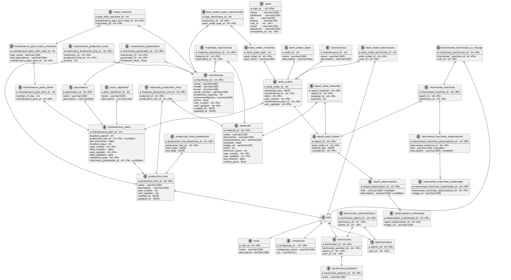

# Capítulo V: Product Implementation, Validation & Deployment

## 5.1. Software Configuration Management.
### 5.1.1. Software Development Environment Configuration.
<h2>1. Project Management</h2>
<p><strong>Trello:</strong> Plataforma visual de gestión Kanban que permite orquestar tareas, sprints y entregables mediante tableros dinámicos y tarjetas arrastrables. Ideal para mantener la cadencia del equipo y la transparencia en todo el ciclo de vida del proyecto. <a href="https://trello.com/es">https://trello.com/es</a></p>

<h2>2. Requirements Management</h2>
<p><strong>Pivotal Tracker:</strong> Herramienta de seguimiento ágil donde las historias de usuario se registran, priorizan y evolucionan en un backlog inteligente que mide el ritmo de desarrollo (velocity) y ayuda a predecir releases con mayor precisión. <a href="https://www.pivotaltracker.com/">https://www.pivotaltracker.com/</a></p>
<p><strong>Miro:</strong> Lienzo colaborativo online perfecto para mapear empatía, delinear user-flows y construir diagramas de alto impacto visual. Favorece la cocreación en tiempo real entre diseñadores, analistas y stakeholders. <a href="https://miro.com/signup">https://miro.com/signup</a></p>

<h2>3. Product UX/UI Design</h2>
<p><strong>Figma:</strong> Suite de diseño colaborativo en la nube que permite prototipar en alta fidelidad, generar mock-ups responsivos y validar interacciones con usuarios antes de escribir una sola línea de código. <a href="https://www.figma.com/login">https://www.figma.com/login</a></p>

<h2>4. Software Development</h2>
<p><strong>WebStorm:</strong> IDE especializado para ecosistemas Vue.js, Angular, JavaScript, CSS y HTML, con autocompletado inteligente, depuración avanzada y refactorizaciones seguras que aceleran la productividad del front-end. <a href="https://www.jetbrains.com/webstorm/download/">https://www.jetbrains.com/webstorm/download/</a></p>
<p><strong>IntelliJ IDEA Community / Ultimate:</strong> Entorno integral para Java y Spring Boot que ofrece análisis de código, refactorizaciones contextuales y compatibilidad nativa con Spring Tooling para crear backends robustos. <a href="https://www.jetbrains.com/idea/download/">https://www.jetbrains.com/idea/download/</a></p>
<p><strong>Maven / Gradle:</strong> Sistemas de build y gestión de dependencias que unifican el ciclo de vida del proyecto Spring Boot, simplificando compilación, pruebas y empaquetado.</p>
<p><strong>Java Development Kit (JDK 11+):</strong> Kit esencial para compilar y ejecutar aplicaciones Spring Boot con soporte a las últimas características del lenguaje.</p>
<p><strong>Node.js & npm:</strong> Runtime basado en V8 y gestor de paquetes indispensable para compilar, servir y mantener la SPA desarrollada en Vue.js. <a href="https://nodejs.org/">https://nodejs.org/</a></p>
<p><strong>Angular CLI:</strong> Utilidad de línea de comandos que genera scaffolding, ejecuta servidores de desarrollo (ng serve) y produce builds optimizados (ng build) con un solo comando. Instalación: npm install -g @angular/cli <a href="https://angular.io/cli">https://angular.io/cli</a></p>
<p><strong>Angular:</strong> Framework full-stack para SPAs que combina componentes declarativos, enrutamiento integrado y data-binding reactivo, ofreciendo una base sólida para aplicaciones de gran escala. <a href="https://angular.io/">https://angular.io/</a></p>
<p><strong>Vue.js:</strong> Framework progresivo y ligero para la construcción de interfaces interactivas que se integra gradualmente: puedes emplearlo desde un widget aislado hasta una SPA completa. Su motor de reactividad profundo, combinado con un Virtual DOM eficiente, garantiza actualizaciones de UI ultrarrápidas. <a href="https://vuejs.org">https://vuejs.org</a></p>
<p><strong>TypeScript, CSS y HTML:</strong> Tridente tecnológico que sustenta la capa de presentación.</p>
<ul>
  <li><strong>TS:</strong> <a href="https://www.typescriptlang.org">https://www.typescriptlang.org</a></li>
  <li><strong>CSS:</strong> <a href="https://developer.mozilla.org/es/docs/Web/CSS">https://developer.mozilla.org/es/docs/Web/CSS</a></li>
  <li><strong>HTML:</strong> <a href="https://developer.mozilla.org/es/docs/Web/HTML">https://developer.mozilla.org/es/docs/Web/HTML</a></li>
</ul>
<p><strong>Postman:</strong> Suite de pruebas para APIs REST que permite enviar peticiones, automatizar colecciones y validar especificaciones Swagger, asegurando la calidad de los endpoints antes de desplegarlos. <a href="https://www.postman.com/downloads/">https://www.postman.com/downloads/</a></p>

<h2>5. Software Deployment</h2>
<p><strong>Azure CLI:</strong> Cliente de línea de comandos todo-en-uno que te permite orquestar despliegues, aprovisionar y gestionar cualquier recurso de Azure mediante scripts automatizados, alias personalizados y perfiles de autenticación. <a href="https://docs.microsoft.com/cli/azure/install-azure-cli">https://docs.microsoft.com/cli/azure/install-azure-cli</a></p>
<p><strong>Azure Resources:</strong> Portal centralizado y panel de control intuitivo donde se exhiben todos tus servicios en la nube, permitiendo crear, configurar y escalar infraestructura con unos pocos clics. <a href="https://portal.azure.com/">https://portal.azure.com/</a></p>
<p><strong>Azure App Service (Web Service):</strong> Servicio PaaS que aloja tu API ASP.NET Core con despliegues automáticos desde GitHub o Azure DevOps, autoescalado configurable, certificados SSL integrados y diagnósticos en tiempo real.</p>
<p><strong>Azure Static Web Apps:</strong> Plataforma especializada en sitios estáticos y SPAs que combina CDN global de baja latencia, integración nativa con repositorios Git y funciones serverless ligeras (Azure Functions). Facilita la publicación instantánea de tu landing page. </p>
<p><strong>Azure SQL Database:</strong> Motor de base de datos relacional en la nube con elasticidad bajo demanda, replicación geo-redundante, backups automáticos y seguridad avanzada. </p>

<h2>6. Software Documentation</h2>
<p><strong>Git:</strong> Sistema distribuido de control de versiones que permite gestionar historiales de cambios, ramificaciones (GitFlow) y fusiones de código con precisión milimétrica. <a href="https://git-scm.com/">https://git-scm.com/</a></p>
<p><strong>GitHub:</strong> Plataforma SaaS líder que combina repositorios Git alojados en la nube con herramientas integradas de revisión de código, gestión de incidencias y pipelines de CI/CD. <a href="https://github.com">https://github.com</a></p>
<p><strong>PlantUML:</strong> Herramienta basada en texto para generar diagramas UML de forma rápida y reproducible. Ideal para documentar arquitecturas, modelos de dominio y flujos técnicos dentro del código.</p>
<p><strong>VisualParadigm Online:</strong> Edición en la nube de la suite Visual Paradigm, especializada en diseño de software y modelado de procesos (UML, BPMN, C4). <a href="https://online.visual-paradigm.com">https://online.visual-paradigm.com</a></p>

<br>

### 5.1.2. Source Code Management.

<h2>Modelo GitFlow y Repositorios en GitHub</h2>

<p>Nuestro proyecto se regirá por el elegante tejido de ramas que propone GitFlow, garantizando un desarrollo organizado, colaborativo y predecible, mientras GitHub actúa como el custodio de nuestro código y el escenario donde converge cada contribución.</p>

<h3>Repositorios de GitHub:</h3>
<ul>
  <li><strong>Organización en GitHub:</strong> <a href="https://github.com/wiwitech1">https://github.com/wiwitech1</a></li>
  <li><strong>Informe del Proyecto:</strong> <a href="https://github.com/wiwitech1/Project-Report">https://github.com/wiwitech1/Project-Report</a></li>
  <li><strong>Landing Page:</strong> <a href="https://github.com/wiwitech1/mecanet-l4nding-page">https://github.com/wiwitech1/mecanet-l4nding-page</a></li>
  <li><strong>SPA Frontend:</strong> <a href="https://github.com/wiwitech1/mecanet-frontend">https://github.com/wiwitech1/mecanet-frontend</a></li>
  <li><strong>Backend API:</strong> <a href="https://github.com/wiwitech1/mecanet-backend.git">https://github.com/wiwitech1/mecanet-backend.git</a></li>
</ul>

<h3>Flujo de Trabajo GitFlow</h3>

<p>GitFlow, concebido por Vincent Driessen, es un modelo de ramas cuidadosamente diseñado para fomentar la colaboración sin fricciones. Su estructura bien definida habilita a los equipos a desarrollar nuevas funcionalidades, preparar lanzamientos estables y atender emergencias sin perder el rumbo ni comprometer la calidad del código.</p>

<h4>Estructura de ramas:</h4>
<ul>
  <li><strong>Master (main) branch:</strong> La cabeza de serie de nuestro proyecto. Aquí descansan únicamente las versiones 100 % estables, depuradas y listas para llegar a producción.</li>
  <li><strong>Develop branch:</strong> Núcleo palpitante del desarrollo. En esta rama convergen todas las funcionalidades en curso, brindando un panorama continuo del estado del código antes de cada posible lanzamiento.</li>
  <li><strong>Feature branches:</strong> Ramas efímeras dedicadas a crear nuevas capacidades o mejoras puntuales. Se derivan de develop y, al completarse, regresan a él con fusiones limpias y comentarios descriptivos.</li>
  <li><strong>Release branches:</strong> Espacios de pulido previo al lanzamiento. En estas ramas se ajustan configuraciones, se corrigen bugs menores y se actualizan metadatos (números de versión, changelogs), preparando el terreno para publicar una versión impecable.</li>
  <li><strong>Hotfix branches:</strong> Vía rápida para reparar incidencias críticas en producción. Se bifurcan directamente de main, y tras solventar la urgencia, se integran tanto a main como a develop para no perder consistencia en futuras entregas.</li>
</ul>

<h3>Versionamiento Semántico</h3>

<p>Para asignar identificadores claros a cada release, abrazamos el Semantic Versioning (<code>MAJOR.MINOR.PATCH</code>). Este esquema intuitivo comunica al instante la naturaleza de cada actualización—sea un cambio drástico, una mejora incremental o una corrección puntual—y aporta transparencia a nuestros usuarios y colaboradores.</p>

<h3>Convenciones de Commits</h3>

<p>Adoptamos Conventional Commits, inspirados en las Angular Commit Guidelines, para que cada mensaje de commit sea un faro de claridad. Mediante un prefijo estandarizado (<code>feat</code>, <code>fix</code>, <code>chore</code>, <code>docs</code>, etc.) y una sintaxis uniforme, facilitamos la generación automática de changelogs, la trazabilidad de cambios y la colaboración ordenada.</p>

<br>

### 5.1.3. Source Code Style Guide & Conventions.

<p>Todos los identificadores — archivos, clases, métodos, variables, etc. — deben redactarse exclusivamente en inglés para garantizar coherencia y evitar ambigüedades entre equipos multilingües.</p>

<h3>1. HTML</h3>
<ul>
  <li>Etiquetas y atributos en minúsculas. Ejemplo: <code>&lt;section id="task-list"&gt;&lt;/section&gt;</code></li>
  <li>Siempre cerrar los elementos: <code>&lt;img src="photo.jpg" alt="field-operation" /&gt;</code></li>
  <li>Usar comillas dobles en los atributos: <code>&lt;button type="button" class="btn-primary"&gt;&lt;/button&gt;</code></li>
  <li>Atributo <code>alt</code> obligatorio, usar <code>width</code> y <code>height</code> si aplica.</li>
  <li>Indentación de 2 espacios.</li>
</ul>

<h3>2. CSS</h3>
<ul>
  <li>Clases e IDs en kebab-case: <code>.task-item</code>, <code>#map-container</code></li>
  <li>Usar BEM para componentes complejos: <code>.card__header--highlight</code></li>
</ul>

<h3>3. TypeScript (Angular)</h3>
<ul>
  <li>Guía oficial de Angular Style Guide</li>
  <li>Convenciones:
    <ul>
      <li>Clases/Servicios: <code>PascalCase → UserService</code></li>
      <li>Interfaces/Tipos: <code>IUser</code></li>
      <li>Variables y métodos: <code>camelCase → getUserData()</code></li>
      <li>Constantes: <code>UPPER_SNAKE_CASE → MAX_RETRIES</code></li>
    </ul>
  </li>
  <li>Archivos en kebab-case: <code>user-profile.component.ts</code></li>
  <li>Siempre usar punto y coma.</li>
  <li>Orden de imports: externos → internos → relativos</li>
  <li>Evitar <code>any</code>, usar tipado estricto</li>
  <li>Usar ESLint + Prettier con pre-commit hook</li>
</ul>

<h3>4. Java (Spring Boot)</h3>
<ul>
  <li>Seguir Google Java Style Guide</li>
  <li>Convenciones:
    <ul>
      <li>Clases/Enums: <code>PascalCase → ShipmentOrder</code></li>
      <li>Métodos/Variables: <code>camelCase → calculateEta()</code></li>
      <li>Constantes: <code>UPPER_SNAKE_CASE → DEFAULT_TIMEOUT</code></li>
    </ul>
  </li>
  <li>Indentación de 4 espacios</li>
  <li>Llaves en la misma línea:
    <pre><code>public class VehicleLoader {
    public void load() {
        // ...
    }
}</code></pre>
  </li>
  <li>Una instrucción por línea</li>
</ul>

<h3>5. Vue.js (Vue 3 + Vite)</h3>
<ul>
  <li>Usar <code>&lt;script setup&gt;</code> (Composition API)</li>
  <li>Nomenclatura:
    <ul>
      <li>Componentes: <code>InventoryCard.vue</code></li>
      <li>Archivos: <code>inventory-card.vue</code></li>
      <li>Stores Pinia: <code>useInventoryStore</code></li>
      <li>Constantes: <code>UPPER_SNAKE_CASE</code></li>
      <li>Variables: <code>camelCase</code></li>
    </ul>
  </li>
  <li>Orden en SFC: template → script → style</li>
  <li>defineProps/defineEmits con interfaces</li>
  <li>Orden de imports: externos → utils → stores → componentes</li>
  <li>Pinia para estado; solo persistir lo necesario</li>
  <li>Lint con eslint-plugin-vue + Prettier + pre-commit</li>
  <li>Plantillas accesibles: kebab-case, aria-* y sin lógica compleja en el template</li>
</ul>

<br>

### 5.1.4. Software Deployment Configuration.

<h2>Requisitos Previos Unificados</h2>

<p>Antes de empezar a desplegar, asegúrate de tener todo en orden. Una base sólida evitará sustos cuando el pipeline empiece a crear recursos en la nube.</p>

<ul>
  <li><strong>Suscripción activa de Azure + permisos adecuados:</strong> Confirma que tu cuenta posee los roles necesarios (al menos <code>Contributor</code>) para levantar, modificar y eliminar recursos. Sin estos privilegios, tu infraestructura se quedará a medio camino.</li>
  <li><strong>Repositorios bien organizados:</strong> Mantén tres repos separados — <code>landing-page</code>, <code>frontend</code> y <code>backend</code> — cada uno con su rama principal (por ejemplo, <code>main</code> o <code>master</code>) claramente establecida. Esto facilita la integración continua y permite aplicar reglas de protección específicas por proyecto.</li>
  <li><strong>Herramientas de administración listas:</strong> Ten instalado y autenticado el Azure CLI (<code>az login</code>) o abre sesión en el <a href="https://portal.azure.com">Portal de Azure</a> con la cuenta adecuada. Trabajarás más rápido si puedes alternar entre la línea de comandos y la interfaz gráfica.</li>
</ul>

<h3>Creación del grupo de recursos</h3>
<p>Centralizar todos los servicios en un solo Resource Group simplifica la vida: podrás aplicar reglas de CORS, etiquetas de coste y políticas de seguridad una sola vez, además de agilizar la limpieza cuando termine el ciclo de pruebas.</p>

<ol>
  <li><strong>Accede al Portal de Azure:</strong> Desde el panel lateral izquierdo, selecciona <strong>Resource groups</strong>.</li>
  <li><strong>Inicia la creación:</strong> Haz clic en <strong>+ Create</strong> (o <strong>+ Add</strong>) y rellena el formulario:
    <ul>
      <li><strong>Subscription:</strong> elige tu suscripción activa.</li>
      <li><strong>Resource group name:</strong> usa un nombre claro, por ejemplo: <code>mecanet-dev-rg</code>.</li>
      <li><strong>Region:</strong> selecciona la misma región para todos los recursos (ej. <code>East US</code>) para minimizar latencia y costes de salida.</li>
    </ul>
  </li>
  <li><strong>Revisa y crea:</strong> Pulsa <strong>Review + Create</strong>. Azure validará los parámetros. Al ver el mensaje de éxito, tendrás un contenedor lógico donde residirán web apps, bases de datos y cualquier otro servicio necesario.</li>
</ol>

<p><em>Aquí es donde crearemos cada uno de los recursos necesarios.</em></p>

<h3>Landing Page Deployment</h3>

<ol>
  <li><strong>Paso 1:</strong> En el Portal de Azure, vamos a crear un recurso y buscamos la opción <strong>Static Web Application</strong>.</li>
  <li><strong>Paso 2:</strong> Seleccionamos <strong>Crear</strong> y asignamos la suscripción y el grupo de recursos creado previamente. Además, asignamos el nombre del recurso.</li>
  <li>Seleccionamos el <strong>plan gratuito</strong> por fines académicos y en <strong>Detalles de implementación</strong> elegimos <strong>GitHub</strong>.</li>
  <li>Iniciamos sesión en nuestra cuenta de GitHub y damos acceso a la organización.</li>
  <li>Seleccionamos el repositorio correspondiente a la landing page y configuramos la ubicación de salida siguiendo la estructura de ramas definida por GitFlow.</li>
  <li><strong>Paso 3:</strong> Al seleccionar la opción <strong>Revisar y crear</strong>, Azure realizará un commit automático sobre la rama <code>main</code> añadiendo un archivo <code>.yml</code> que habilita la publicación continua <strong>(on-push)</strong>.</li>
</ol>


## 5.2. Landing Page, Services & Applications Implementation
### 5.2.1. Sprint 1
#### 5.2.1.1. Sprint Planning 1

<table>
    <tr>
        <td>Sprint #</td>
        <td>1</td>
    </tr>
    <tr>
        <th colspan="2"><strong>Sprint Planning Background</strong></th>
    </tr>
    <tr>
        <td>Date</td>
        <td>22/04/2025</td>
    </tr>
     <tr>
        <td>Time</td>
        <td>10:00 AM</td>
    </tr>
     <tr>
        <td>Location</td>
        <td>Reunión virtual – Discord</td>
    </tr>
    <tr>
        <td>Prepared By</td>
        <td>Claudia Belledonne</td>
    </tr>
    <tr>
        <td>Attendees (to planning meeting)</td>
        <td>

- Ariana Cecilia Agreda Sobrino
            
- Claudia Valeria Belledonne Espinoza
            
- Mauricio Daniel Elera Rodríguez
            
- Jean Pool Huaman De La Cruz
            
- Britney Delhy Qqueso Rodriguez
   </td>
    </tr>
    <tr>
        <td>Sprint 0 Review Summary</td>
        <td>No aplica al ser el primer sprint entregado</td>
    </tr>
    <tr>
        <td>Sprint 0 Retrospective Summary</td>
        <td>No aplica al ser el primer sprint entregado</td>
    </tr>
    <tr>
        <th colspan="2"><strong>Sprint Goal & User Stories</strong></th>
    </tr>
    <tr>
        <td>Sprint 1 Goal</td>
        <td>
<strong>Nuestra meta fue</strong> desplegar el landing page que presente claramente los beneficios, procesos y precios del sistema. 

<strong>Creemos que</strong> esto genera comprensión y confianza en los clientes potenciales. 

<strong>Esto se confirmará</strong> cuando los usuarios puedan acceder a la página de destino y navegar por todas las secciones informativas (beneficios, precios, preguntas frecuentes, pie de página, etc.) desde múltiples dispositivos.
    </td>
    </tr>
     <tr>
        <td>Sprint 1 Velocity  </td>
        <td>18 Story Points.</td>
    </tr>
     <tr>
        <td>Sum of Story Points  </td>
        <td>18 Story Points.</td>
    </tr>
</table>

#### 5.2.1.2. Aspect Leaders and Collaborators.

<table>
  <tr>
    <th>Team Member (Last Name, First Name)</th>
    <th>GitHub Username</th>
    <th>Sección de beneficios del sistema<br/>Leader (L) / Collaborator (C)</th>
    <th>Sección precios del sitio web<br/>Leader (L) / Collaborator (C)</th>
    <th>Sección dudas del sitio web<br/>Leader (L) / Collaborator (C)</th>
    <th>Navegación del sitio web<br/>Leader (L) / Collaborator (C)</th>
    <th>Sección footer del sitio web<br/>Leader (L) / Collaborator (C)</th>
    <th>Sección Hero del sitio web<br/>Leader (L) / Collaborator (C)</th>
  </tr>
  <tr>
    <td>Agreda, Ariana</td>
    <td>arii4w</td>
    <td>C</td>
    <td>C</td>
    <td>C</td>
    <td>L</td>
    <td>C</td>
    <td>L</td>
  </tr>
  <tr>
    <td>Belledonne, Claudia</td>
    <td>Cl4us-tb</td>
    <td>L</td>
    <td>C</td>
    <td>C</td>
    <td>C</td>
    <td>C</td>
    <td>C</td>
  </tr>
  <tr>
    <td>Elera, Mauricio</td>
    <td>Maur1xio</td>
    <td>C</td>
    <td>C</td>
    <td>L</td>
    <td>C</td>
    <td>C</td>
    <td>C</td>
  </tr>
  <tr>
    <td>Huaman, Jean</td>
    <td>JeanXP404</td>
    <td>C</td>
    <td>C</td>
    <td>C</td>
    <td>C</td>
    <td>L</td>
    <td>C</td>
  </tr>
  <tr>
    <td>Qqueso, Britney</td>
    <td>brit2801</td>
    <td>C</td>
    <td>L</td>
    <td>C</td>
    <td>C</td>
    <td>C</td>
    <td>C</td>
  </tr>
</table>


#### 5.2.1.3. Sprint Backlog 1
<p>El objetivo de este primer sprint fue desarrollar la primera versión de la Landing Page de nuestro sistema Mecanet, enfocada en presentar la propuesta de valor del producto a potenciales usuarios. Esta versión incluye las secciones clave que comunican los beneficios, planes, preguntas frecuentes, footer y navegación general.</p>
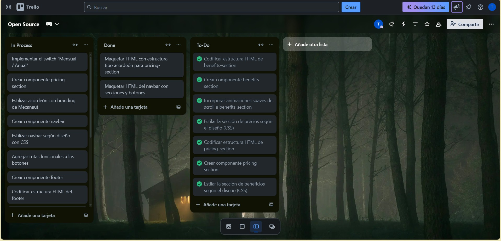
<p>link:https://trello.com/invite/b/680a6cc7e8740865732b2289/ATTI0f0d254cd7c3649f29efcc5f9b5924a54D385D43/open-source</p>
<table>
  <tr>
    <th colspan="2">Sprint #</th>
    <th colspan="6">Sprint 1</th>
  </tr>
  <tr>
    <th colspan="2">User Story</th>
    <th colspan="6">Work-Item / Task</th>
  </tr>
  <tr>
    <th>Id</th>
    <th>Title</th>
    <th>Id</th>
    <th>Title</th>
    <th>Description</th>
    <th>Estimation (Hours)</th>
    <th>Assigned To</th>
    <th>Status</th>
  </tr>

    
<tr>
    <th rowspan="4">US13</th>
    <th rowspan="4">Sección de beneficios del sistema</th>
    <td>1</td>
    <td align="justify">Crear componente BenefitsComponent</td>
    <td align="justify">Generar el componente BenefitsComponent para esta sección.</td>
    <td>0.3 hr</td>
    <td>Claudia Belledonne</td>
    <td>Done</td>
</tr>
<tr>
    <td>2</td>
    <td align="justify">Codificar estructura HTML de BenefitsComponent</td>
    <td align="justify">Maquetar columnas, puntos de separación y alineación de textos e íconos.</td>
    <td>1.5 hr</td>
    <td>Claudia Belledonne</td>
    <td>Done</td>
</tr>
<tr>
    <td>3</td>
    <td align="justify">Estilar la sección de beneficios según el diseño (CSS)</td>
    <td align="justify">Colores, fuentes (por ejemplo Montserrat), márgenes y hover effects si aplica.</td>
    <td>1 hr</td>
    <td>Claudia Belledonne</td>
    <td>Done</td>
</tr>
<tr>
    <td>4</td>
    <td align="justify">Incorporar animaciones suaves de scroll a BenefitsComponent</td>
    <td align="justify">Agregar animaciones al hacer scroll o al cargar los beneficios para mejorar la experiencia visual.</td>
    <td>0.5 hr</td>
    <td>Claudia Belledonne</td>
    <td>Done</td>
</tr>


<tr>
    <th rowspan="4">US14</th>
    <th rowspan="4">Sección precios del sitio web</th>
    <td>5</td>
    <td align="justify">Crear componente pricing-section</td>
    <td align="justify">Generar el componente pricing-section para esta sección.</td>
    <td>0.3 hr</td>
    <td>Britney Qqueso</td>
    <td>Done</td>
</tr>
<tr>
    <td>6</td>
    <td align="justify">Codificar estructura HTML de pricing-section</td>
    <td align="justify">Maqueta la estructura visual con tarjetas (cards) en un contenedor principal que mantenga alineación responsiva.</td>
    <td>1 hr</td>
    <td>Britney Qqueso</td>
    <td>Done</td>
</tr>
<tr>
    <td>7</td>
    <td align="justify">Estilar la sección de precios según el diseño (CSS)</td>
    <td align="justify">Colores, fuentes (por ejemplo Montserrat), márgenes y hover effects si aplica.</td>
    <td>1 hr</td>
    <td>Britney Qqueso</td>
    <td>Done</td>
</tr>
<tr>
    <td>8</td>
    <td align="justify">Implementar el switch “Mensual / Anual</td>
    <td align="justify">Desarrolla el botón deslizante de alternancia entre pago mensual/anual de forma visual y funcional.</td>
    <td>0.5 hr</td>
    <td>Britney Qqueso</td>
    <td>Done</td>
</tr>


<tr>
    <th rowspan="3">US17</th>
    <th rowspan="3">Sección dudas del sitio web</th>
    <td>9</td>
    <td align="justify">Crear componente faq-section</td>
    <td align="justify">Generar el componente que contendrá la sección de preguntas frecuentes.</td>
    <td>0.3 hr</td>
    <td>e</td>
    <td>Done</td>
</tr>
<tr>
    <td>10</td>
    <td align="justify">Maquetar HTML con estructura tipo acordeón</td>
    <td align="justify">Mostrar preguntas con comportamiento colapsable (mostrar/ocultar respuesta).</td>
    <td>1.5 hr</td>
    <td>Mauricio Elera</td>
    <td>Done</td>
</tr>
<tr>
    <td>11</td>
    <td align="justify">Estilizar acordeón con branding de Mecanet</td>
    <td align="justify">Colores, fuentes (por ejemplo Montserrat), márgenes y hover effects.</td>
    <td>1 hr</td>
    <td>Mauricio Elera</td>
    <td>Done</td>
</tr>


<tr>
    <th rowspan="4">US16</th>
    <th rowspan="4">Navegación del sitio web</th>
    <td>12</td>
    <td align="justify">Crear componente navbar</td>
    <td align="justify">Generar el componente modular navbar para integrarlo en el layout general del sitio.</td>
    <td>0.3 hr</td>
    <td>Mauricio Elera</td>
    <td>Done</td>
</tr>
<tr>
    <td>13</td>
    <td align="justify">Maquetar HTML del navbar con secciones y botones</td>
    <td align="justify">Maquetar el logo, menú de navegación (Home, Producto, Beneficios, Planes, FAQ) y botones de sesión ("Iniciar sesión", "Crear cuenta").</td>
    <td>1 hr</td>
    <td>Mauricio Elera</td>
    <td>Done</td>
</tr>
<tr>
    <td>14</td>
    <td align="justify">Estilizar navbar según diseño con CSS</td>
    <td align="justify">Aplicar estilos: tipografía, resaltado del ítem activo, separación de botones, borde suave, fondo translúcido con sombra sutil.</td>
    <td>1 hr</td>
    <td>Mauricio Elera</td>
    <td>Done</td>
</tr>
<tr>
    <td>15</td>
    <td align="justify">Agregar rutas funcionales a los botones</td>
    <td align="justify">Vincular los ítems de navegación a sus rutas internas.</td>
    <td>1 hr</td>
    <td>Mauricio Elera</td>
    <td>Done</td>
</tr>


<tr>
  <th rowspan="4">US15</th>
  <th rowspan="4">Sección footer del sitio web</th>
  <td>8</td>
  <td align="justify">Crear componente footer</td>
  <td align="justify">Generar un componente exclusivo para el footer.</td>
  <td>0.3 hr</td>
  <td>Jean Huaman</td>
  <td>Done</td>
</tr>
<tr>
  <td>9</td>
  <td align="justify">Codificar estructura HTML del footer</td>
  <td align="justify">Maquetar el footer en base al diseño visual.</td>
  <td>1 hr</td>
  <td>Jean Huaman</td>
  <td>Done</td>
</tr>
<tr>
  <td>10</td>
  <td align="justify">Estilizar fondo degradado, íconos y tipografía con CSS</td>
  <td align="justify">Colores, fuentes (por ejemplo Montserrat), márgenes y hover effects.</td>
  <td>1 hr</td>
  <td>Jean Huaman</td>
  <td>Done</td>
</tr>
<tr>
  <td>11</td>
  <td align="justify">Agregar enlaces funcionales o placeholders</td>
  <td align="justify">Asignar rutas internas o externas a los enlaces del footer, o usar placeholders si aún no están definidas.</td>
  <td>1 hr</td>
  <td>Jean Huaman</td>
  <td>Done</td>
</tr>


<tr>
  <th rowspan="3">US32</th>
  <th rowspan="3">Sección Hero del sitio web</th>
  <td>16</td>
  <td align="justify">Crear componente Hero</td>
  <td align="justify">Generar el componente principal de bienvenida para la landing page.</td>
  <td>1 hr</td>
  <td>Ariana Agreda</td>
  <td>Done</td>
</tr>
<tr>
  <td>17</td>
  <td align="justify">Codificar estructura HTML del hero</td>
  <td align="justify">Generar el componente principal de bienvenida para la landing page.</td>
  <td>1 hr</td>
  <td>Ariana Agreda</td>
  <td>Done</td>
</tr>
<tr>
  <td>18</td>
  <td align="justify">Estilizar fondo degradado, íconos y tipografía con CSS.</td>
  <td align="justify">Aplicar estilos visuales como colores, fuentes e íconos para resaltar el impacto visual del hero.</td>
  <td>1 hr</td>
  <td>Ariana Agreda</td>
  <td>Done</td>
</tr>

</table>


#### 5.2.1.4. Development Evidence for Sprint Review.

| Repository                                                                 | Branch   | Commit Id             | Commit Message                              | Commit Message Body                                                                 | Committed on (Date) |
|----------------------------------------------------------------------------|----------|------------------------|----------------------------------------------|--------------------------------------------------------------------------------------|----------------------|
| https://github.com/wiwitech1/mecanet-l4nding-page                          | main     | 50cb013               | Setup commit: Vue project                    | Initial project scaffold created with Vue CLI and pushed to main                    | 25/04/2025           |
|                                                                            | develop  | a19fe32               | feat(hero): implement hero section           | Added HTML and CSS for the HeroComponent with responsive design                     | 25/04/2025           |
|                                                                            | develop  | 5c8ae91               | feat(navbar): add top navigation bar         | Created a reusable NavbarComponent with anchor links to sections                    | 25/04/2025           |
|                                                                            | develop  | 8b7d2ac               | style(global): add font and color variables  | Set up global SCSS variables for font family, primary and secondary colors          | 25/04/2025           |
|                                                                            | main     | 50cb013…a52b2c8       | chore(release): merge release 1.0.0 into main | First release containing Hero, Navbar and base styling                              | 25/04/2025           |
|                                                                            | develop  | c7adf4e               | ci: configure GitHub Actions for deploy      | Set up CI/CD workflow for automatic deployment to Azure Static Web Apps             | 25/04/2025           |


Durante este Sprint no se desarrollaron ni documentaron Web Services, ya que el objetivo principal fue la implementación de la Landing Page como primer entregable del sistema. Por ello, en esta fase del proyecto no se dispone de endpoints disponibles ni de documentación OpenAPI.

La elaboración de la documentación de servicios está prevista para los próximos Sprints, cuando comience el desarrollo del backend y se defina la estructura inicial de la API que permitirá la integración con las vistas web implementadas.

La documentación de servicios será considerada en los siguientes Sprints, una vez que se inicie el desarrollo del backend y se establezca la estructura básica de la API que permitirá la integración con las vistas web implementadas.


#### 5.2.1.5. Execution Evidence for Sprint Review.
Durante este Sprint se logró implementar de forma completa la Landing Page del proyecto Macanet. Esta vista inicial permite a los usuarios conocer las funcionalidades clave del sistema, resolver dudas frecuentes y visualizar la propuesta de valor. Se trabajó en secciones como el header, sección de producto, sección de preguntas frecuentes (FAQ) y el footer, garantizando una navegación fluida y una presentación clara de los objetivos del producto.

A continuación, se presentan capturas de pantalla de las vistas desarrolladas:

Inicio:


Producto:


Beneficios:


Planes:


Faq:


Footer:


Video de Demostración e Implementación:
[Ver video de Demostración e Implementación](https://upcedupe-my.sharepoint.com/:f:/g/personal/u202315044_upc_edu_pe/ElEzvPegLThJuJq3nIyFwB0BASzKXkKKbALgeuaPbHs2-w?e=Og9J2a) 

<p>Para este primer sprint no se contempló la evidencia de documentación de los servicios.</p>

#### 5.2.1.6. Services Documentation Evidence for Sprint Review.
En este primer sprint, el enfoque principal fue el desarrollo de la estructura y la presentación visual del Landing Page. Por lo tanto, la documentación en esta etapa se centró en la arquitectura de componentes y la guía de estilos utilizada para asegurar la coherencia y mantenibilidad del sitio. <br />

A continuación, se presenta una tabla que resume la documentación generada para los principales componentes del Landing Page:

|Componente	 | Descripción	 | Documentación Asociada|
|-------------|--------------|-----------------------|
|Navbar	| Componente de navegación principal del sitio.	| [Lading page](https://github.com/wiwitech1/mecanet-l4nding-page.git) |
|Hero Section |	Sección principal de bienvenida con el mensaje clave. |	[Lading page](https://github.com/wiwitech1/mecanet-l4nding-page.git) |
|Benefits Section |	Sección que detalla los beneficios del sistema. |	[Lading page](https://github.com/wiwitech1/mecanet-l4nding-page.git) |
|Pricing Section |	Sección que presenta los planes y precios del sistema. |	[Lading page](https://github.com/wiwitech1/mecanet-l4nding-page.git) |
|FAQ Section  |	Sección de preguntas frecuentes. |	[Lading page](https://github.com/wiwitech1/mecanet-l4nding-page.git) |
|Footer  |Sección del pie de página con información de contacto y enlaces útiles. |	[Lading page](https://github.com/wiwitech1/mecanet-l4nding-page.git) |


#### 5.2.1.7. Software Deployment Evidence for Sprint Review.
Durante este Sprint se logró exitosamente el despliegue de la Landing Page de la solución **Mecanaut** a través del servicio **Azure Static Web Apps**, en línea con el enfoque de entrega incremental del producto.

##### Actividades ejecutadas:
- Se creó una cuenta en **Azure** y se configuró un **grupo de recursos compartido** para optimizar la gestión de los servicios asociados.
- Se realizó el **despliegue** de la Landing Page desde su **repositorio de GitHub** mediante **Azure Static Web Apps**, habilitando así un flujo automatizado de publicación a través de **GitHub Actions**.
- Se implementó y verificó el flujo de **CI/CD** (Integración y Entrega Continua), asegurando que cada **commit** realizado sobre la rama **main** actualice automáticamente la aplicación desplegada.
- Se validó la **disponibilidad** y el **correcto funcionamiento** del producto accediendo al **dominio asignado por Azure**.


#### 5.2.1.8. Team Collaboration Insights during Sprint.

Durante el desarrollo del Sprint, cada miembro del equipo participó activamente en la implementación de la **Landing Page**, dividiéndose por secciones según el diseño y el contenido definido previamente.

A continuación, se detalla la participación específica de cada integrante del equipo:

| **Nombre**                       | **Actividad** |
| ---------------------------------|------------|
| Agreda Sobrino, Ariana Cecilia   | Implementación de las secciones "Navbar" y "Hero" |
| Belledone Espinoza, Claudia      | Implementación de las secciones "Products" y "Benefits" |
| Elera Rodríguez, Mauricio Daniel | Implenmentación de las secciones "Benefits" e inicialización del setup |
| Huamán , Jean                    | Implementación de la sección "Plans" y "FAQ" |
| Qqueso, Britney                   | Implementación de la sección "Footer"  |

> **Nota:** Algunos integrantes colaboraron en secciones compartidas para asegurar consistencia en diseño y funcionalidad.

##### Evidencia de colaboración en GitHub

A continuación, se presentan capturas de los analíticos de colaboración desde el repositorio oficial, donde se evidencia la participación activa de todos los miembros del equipo.


##### Repositorio de trabajo:

- Repositorio de la Landing Page en GitHub : https://github.com/wiwitech1/mecanet-l4nding-page.git

Como se evidencia, el equipo ha trabajado colaborativamente respetando el flujo de trabajo y asegurando que cada producto del Sprint cuente con participación de todos los miembros del equipo.

### 5.2.2. Sprint 2
#### 5.2.2.1. Sprint Planning 2
<table>
    <tr>
        <td>Sprint #</td>
        <td>2</td>
    </tr>
    <tr>
        <th colspan="2"><strong>Sprint Planning Background</strong></th>
    </tr>
    <tr>
        <td>Date</td>
        <td>13/05/2025</td>
    </tr>
     <tr>
        <td>Time</td>
        <td> 3:00 PM</td>
    </tr>
     <tr>
        <td>Location</td>
        <td>Reunión virtual – Discord</td>
    </tr>
    <tr>
        <td>Prepared By</td>
        <td>Claudia Belledonne</td>
    </tr>
    <tr>
        <td>Attendees (to planning meeting)</td>
        <td>

- Ariana Cecilia Agreda Sobrino
            
- Claudia Valeria Belledonne Espinoza
            
- Mauricio Daniel Elera Rodríguez
            
- Britney Delhy Qqueso Rodriguez
   </td>
    </tr>
    <tr>
        <td>Sprint 1 Review Summary</td>
        <td>Durante la revisión del Sprint 1, se demostró la funcionalidad del landing page, incluyendo las secciones de beneficios, procesos y precios. Se recibieron comentarios positivos sobre la claridad de la información y la navegación.</td>
    </tr>
    <tr>
        <td>Sprint 1 Retrospective Summary</td>
        <td>En la retrospectiva del Sprint 1, identificamos como puntos fuertes la buena comunicación del equipo y coodinación. Como áreas de mejora, se señaló mejorar la gesión del tiempo.</td>
    </tr>
    <tr>
        <th colspan="2"><strong>Sprint Goal & User Stories</strong></th>
    </tr>
    <tr>
        <td>Sprint 2 Goal</td>
        <td>
<strong>Nuestra meta para este sprint es</strong> desarrollar e implementar las funcionalidades esenciales en la página web para la gestión de usuarios (creación e inicio de sesión para cuentas corporativas y de usuario), la administración de activos (maquinarias), la gestión de la línea de producción, la planificación del mantenimiento y el menú de órdenes de trabajo. 

<strong>Creemos que</strong> esto proporcionará una base sólida para la interacción de los usuarios con el sistema y la gestión de sus operaciones clave. 

<strong>Esto se confirmará</strong> cuando los usuarios puedan crear e iniciar sesión en sus respectivas cuentas, administrar los activos, visualizar y gestionar la línea de producción, acceder a la planificación del mantenimiento y utilizar el menú de órdenes de trabajo desde la página web.
    </td>
    </tr>
     <tr>
        <td>Sprint 2 Velocity  </td>
        <td>35 Story Points.</td>
    </tr>
     <tr>
        <td>Sum of Story Points  </td>
        <td>35 Story Points.</td>
    </tr>
</table>

#### 5.2.2.2. Aspect Leaders and Collaborators.
<table>
  <tr>
    <th>Team Member (Last Name, First Name)</th>
    <th>GitHub Username</th>
    <th>Sección de inicio de sesión<br/>Leader (L) / Collaborator (C)</th>
    <th>Sección de crear cuenta (corporativa y usuario)<br/>Leader (L) / Collaborator (C)</th>
    <th>Sección de gestión de activos (maquinarias)<br/>Leader (L) / Collaborator (C)</th>
    <th>Sección plan de mantenimiento<br/>Leader (L) / Collaborator (C)</th>
    <th>Sección de gestión de línea de producción<br/>Leader (L) / Collaborator (C)</th>
    <th>Sección de ordenes de trabajo<br/>Leader (L) / Collaborator (C)</th>
  </tr>
  <tr>
    <td>Agreda, Ariana</td>
    <td>arii4w</td>
    <td>C</td>
    <td>C</td>
    <td>C</td>
    <td>L</td>
    <td>C</td>
    <td>L</td>
  </tr>
  <tr>
    <td>Belledonne, Claudia</td>
    <td>Cl4us-tb</td>
    <td>L</td>
    <td>C</td>
    <td>C</td>
    <td>C</td>
    <td>C</td>
    <td>C</td>
  </tr>
  <tr>
    <td>Elera, Mauricio</td>
    <td>Maur1xio</td>
    <td>C</td>
    <td>C</td>
    <td>L</td>
    <td>C</td>
    <td>C</td>
    <td>C</td>
  </tr>
  <tr>
    <td>Qqueso, Britney</td>
    <td>brit2801</td>
    <td>C</td>
    <td>L</td>
    <td>C</td>
    <td>C</td>
    <td>C</td>
    <td>C</td>
  </tr>
</table>

#### 5.2.2.3. Sprint Backlog 2.
<p>El objetivo de este segundo sprint es desarrollar las funcionalidades esenciales para la gestión de usuarios (creación e inicio de sesión para cuentas corporativas y de usuario), la administración de activos (maquinarias), la gestión de la línea de producción, la planificación del mantenimiento y el menú de órdenes de trabajo en la página web. Esto proporcionará una base sólida para la interacción de los usuarios con el sistema y la gestión de sus operaciones clave.</p>
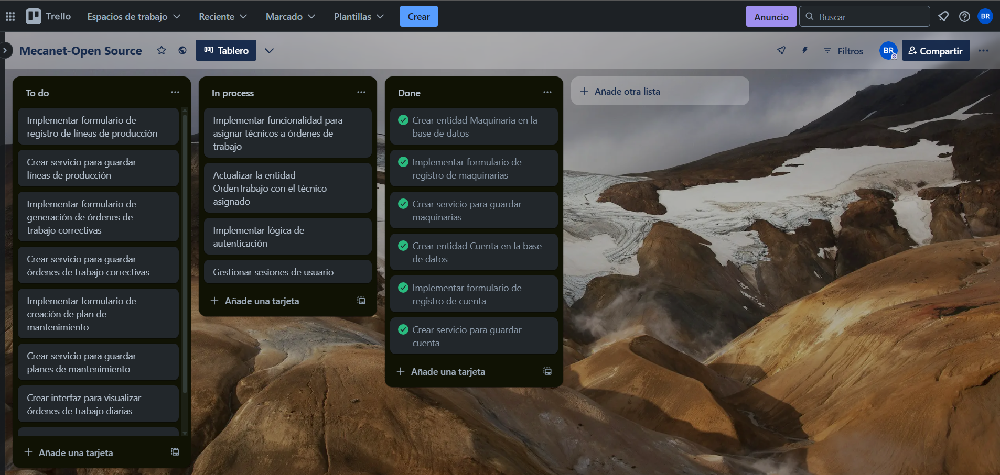
<p>link:https://trello.com/b/pRzRlW59/mecanet-open-source</p>

<table>
  <tr>
    <th colspan="2">Sprint #</th>
    <th colspan="6">Sprint 2</th>
  </tr>
  <tr>
    <th colspan="2">User Story</th>
    <th colspan="6">Work-Item / Task</th>
  </tr>
  <tr>
    <th>Id</th>
    <th>Title</th>
    <th>Id</th>
    <th>Title</th>
    <th>Description</th>
    <th>Estimation (Hours)</th>
    <th>Assigned To</th>
    <th>Status</th>
  </tr>

    
<tr>
    <th rowspan="3">US01</th>
    <th rowspan="3">Registro de maquinarias</th>
    <td>1</td>
    <td align="justify">Crear entidad Maquinaria</td>
    <td align="justify">Definir la estructura de maquinaria (interfaces, assemblers, servicios, etc) para almacenar la información de las maquinarias (nombre, modelo, serie, etc.) en el frontend</td>
    <td>4 hr</td>
    <td>Claudia Belledonne</td>
    <td>Done</td>
</tr>
<tr>
    <td>2</td>
    <td align="justify">Implementar formulario de registro de maquinarias</td>
    <td align="justify">Desarrollar la interfaz para que el administrador pueda ingresar los datos de las nuevas maquinarias.</td>
    <td>6 hr</td>
    <td>Claudia Belledonne</td>
    <td>Done</td>
</tr>
<tr>
    <td>3</td>
    <td align="justify">Implementar servicio para guardar maquinarias</td>
    <td align="justify">Implementar la lógica para recibir los datos del formulario y guardar dicha información.</td>
    <td>5 hr</td>
    <td>Claudia Belledonne</td>
    <td>Done</td>
</tr>


<tr>
    <th rowspan="3">US02</th>
    <th rowspan="3">Registro de líneas de producción</th>
    <td>4</td>
    <td align="justify">Crear entidad Línea_Producción</td>
    <td align="justify">Definir la estructura de línea de producción para almacenar la información de las líneas de producción (nombre, prioridad, descripción, etc.)</td>
    <td>4 hr</td>
    <td>Britney Qqueso</td>
    <td>Done</td>
</tr>
<tr>
    <td>5</td>
    <td align="justify">Implementar formulario de registro de líneas de producción</td>
    <td align="justify">Desarrollar la interfaz para que el administrador pueda ingresar los datos de las nuevas líneas de producción, incluyendo la asignación de prioridad.</td>
    <td>6 hr</td>
    <td>Britney Qqueso</td>
    <td>Done</td>
</tr>
<tr>
    <td>6</td>
    <td align="justify">Implementar el servicio para guardar líneas de producción</td>
    <td align="justify">Implementar la lógica para recibir los datos del formulario y guardarlos dichos datos.</td>
    <td>5 hr</td>
    <td>Britney Qqueso</td>
    <td>Done</td>
</tr>


<tr>
    <th rowspan="3">US03</th>
    <th rowspan="3">Generación de órdenes de trabajo correctivas</th>
    <td>7</td>
    <td align="justify">Crear y definir la estructura de la entidad OrdenTrabajo en el frontend.</td>
    <td align="justify">Definir la estructura de la entidad para almacenar la información de las órdenes de trabajo entre otros (tipo, descripción, fecha de creación, estado, etc.).</td>
    <td>2 hr</td>
    <td>Britney Qqueso</td>
    <td>Done</td>
</tr>
<tr>
    <td>8</td>
    <td align="justify">Implementar formulario de generación de órdenes de trabajo correctivas</td>
    <td align="justify">Desarrollar la interfaz para que el administrador pueda crear órdenes de trabajo correctivas, especificando la maquinaria afectada y la descripción del problema.</td>
    <td>4 hr</td>
    <td>Mauricio Elera</td>
    <td>Done</td>
</tr>
<tr>
    <td>9</td>
    <td align="justify">Implementar servicio para guardar órdenes de trabajo correctivas</td>
    <td align="justify">Implementar la lógica para recibir los datos del formulario y guardarlos, marcándolos como "correctivas".</td>
    <td>3 hr</td>
    <td>Mauricio Elera</td>
    <td>Done</td>
</tr>


<tr>
    <th rowspan="2">US04</th>
    <th rowspan="2">Asignación de personal técnico</th>
    <td>10</td>
    <td align="justify">Implementar funcionalidad para asignar técnicos a órdenes de trabajo</td>
    <td align="justify">Desarrollar la interfaz que permita al administrador seleccionar uno o varios técnicos para asignar a una orden de trabajo existente.</td>
    <td>5 hr</td>
    <td>Mauricio Elera</td>
    <td>Done</td>
</tr>
<tr>
    <td>13</td>
    <td align="justify">Actualizar la entidad OrdenTrabajo con el técnico asignado</td>
    <td align="justify">Modificar la lógica para guardar la información del técnico asignado en la tabla de órdenes de trabajo.</td>
    <td>3 hr</td>
    <td>Mauricio Elera</td>
    <td>Done</td>
</tr>


<tr>
  <th rowspan="3">US09</th>
  <th rowspan="3">Implementación de plan de mantenimiento</th>
  <td>8</td>
  <td align="justify">Crear y estructurar la entidad PlanMantenimiento en el frontend</td>
  <td align="justify">Definir la estructura de la entidad para almacenar los planes de mantenimiento (línea de producción, descripción, frecuencia, etc.).</td>
  <td>5 hr</td>
  <td>Ariana Agreda</td>
  <td>Done</td>
</tr>
<tr>
  <td>9</td>
  <td align="justify">Implementar formulario de creación de plan de mantenimiento</td>
  <td align="justify">Desarrollar la interfaz para que el administrador pueda crear planes de mantenimiento para una línea de producción específica, definiendo las tareas y la frecuencia.</td>
  <td>5 hr</td>
  <td>Ariana Agreda</td>
  <td>Done</td>
</tr>
<tr>
  <td>10</td>
  <td align="justify">Crear servicio para guardar planes de mantenimiento</td>
  <td align="justify">Implementar la lógica para recibir los datos del formulario y guardarlos.</td>
  <td>3 hr</td>
  <td>Ariana Agreda</td>
  <td>Done</td>
</tr>


<tr>
  <th rowspan="1">US10</th>
  <th rowspan="1">Consulta de órdenes de trabajo diarias</th>
  <td>11</td>
  <td align="justify">Crear interfaz para visualizar órdenes de trabajo diarias</td>
  <td align="justify">Desarrollar una vista para que los técnicos puedan ver las órdenes de trabajo que les han sido asignadas para el día actual.</td>
  <td>4 hr</td>
  <td>Claudia Belledonne</td>
  <td>Done</td>
</tr>


<tr>
  <th rowspan="3">US20</th>
  <th rowspan="3">Implementación de plan de mantenimiento</th>
  <td>13</td>
  <td align="justify">Crear entidad Empresa</td>
  <td align="justify">Definir la estructura de la tabla para almacenar la información de la empresa (nombre, tipo, contacto, etc.).</td>
  <td>4 hr</td>
  <td>Ariana Agreda</td>
  <td>Done</td>
</tr>
<tr>
  <td>14</td>
  <td align="justify">Implementar formulario de registro de cuenta</td>
  <td align="justify">Desarrollar la interfaz para que el administrador pueda registrar una nueva cuenta con los datos solicitados.</td>
  <td>5 hr</td>
  <td>Ariana Agreda</td>
  <td>Done</td>
</tr>
<tr>
  <td>15</td>
  <td align="justify">Crear servicio para guardar cuenta</td>
  <td align="justify">Implementar la lógica para recibir los datos del formulario y guardarlos.</td>
  <td>4 hr</td>
  <td>Mauricio Elera</td>
  <td>Done</td>
</tr>


<tr>
  <th rowspan="3">US22</th>
  <th rowspan="3">Inicio de sesión</th>
  <td>16</td>
  <td align="justify">Implementar formulario de inicio de sesión</td>
  <td align="justify">Desarrollar la interfaz para que los usuarios puedan ingresar sus credenciales (usuario/correo y contraseña).</td>
  <td>3 hr</td>
  <td>Claudia Belledonne</td>
  <td>Done</td>
</tr>
<tr>
  <td>17</td>
  <td align="justify">Implementar lógica de autenticación</td>
  <td align="justify">Desarrollar la lógica para verificar las credenciales ingresadas con la información almacenada.</td>
  <td>4 hr</td>
  <td>Ariana Agreda</td>
  <td>Done</td>
</tr>
<tr>
  <td>18</td>
  <td align="justify">Gestionar sesiones de usuario</td>
  <td align="justify">Implementar la gestión de sesiones para mantener al usuario autenticado durante su uso del sistema y redirigirlo a las funcionalidades correspondientes según su rol (administrador o técnico).</td>
  <td>4 hr</td>
  <td>Mauricio Elera</td>
  <td>Done</td>
</tr>

</table>

#### 5.2.2.4. Development Evidence for Sprint Review.
En este sprint, se realizaron avances significativos en la implementación de las funcionalidades core de la aplicación web, sentando las bases para la interacción de los usuarios y la gestión de sus operaciones. Los principales logros incluyen la creación de las entidades de base de datos y las interfaces iniciales para el registro de maquinarias, el registro de líneas de producción, la generación de órdenes de trabajo correctivas, la implementación de la lógica de asignación de personal técnico, la creación de la estructura para los planes de mantenimiento, la visualización de órdenes de trabajo diarias para técnicos, el registro de cuentas corporativas y de usuario, y la implementación del sistema de inicio de sesión.<br/>

A continuación, se presenta una tabla con los commits relacionados con la implementación de estas funcionalidades: <br/>

| Repository        | Branch   | Commit Id       | Commit Message         | Commit Message Body             | Committed on (Date) |
|----------------------------------------------------------------------------|----------|------------------------|----------------------------------------------|--------------------------------------------------------------------------------------|----------------------|
| https://github.com/wiwitech1/mecanet-frontend.git    | develop     | c12e9fa               | feat(maintenance): add maintenance planning UI                   | Created UI for maintenance planning section with form inputs and dynamic validation                    | 11/05/2025           |
| https://github.com/wiwitech1/mecanet-frontend.git   | develop  | d98a3b2              | feat(auth): implement login and auth logic          | Developed login screen with form validation and integrated authentication flow                     | 11/05/2025       |
| https://github.com/wiwitech1/mecanet-frontend.git | develop  | a53e7c1              | feat(orders): add corrective work orders flow        | Implemented UI and logic to register and assign corrective work orders to technical staff                    | 12/05/2025        |
| https://github.com/wiwitech1/mecanet-frontend.git    | develop  | b17f00c             | feat(account): add production line creation | Added section for production line registration linked to user account context          | 12/05/2025        |
| https://github.com/wiwitech1/mecanet-frontend.git   | main     | e6a82d3           | feat(order-entity): implement work order entity | Developed the base model for work orders including type, priority, status and technician assignment                              | 12/05/2025        |
| https://github.com/wiwitech1/mecanet-frontend.git | develop  | f5c9b11              | ci: update deploy workflow for release preview     | Updated CI/CD GitHub Actions to deploy Sprint 2 features to Azure Static Web Apps preview environment             | 13/05/2025        |
| https://github.com/wiwitech1/mecanet-frontend.git    | main     | c12e9fa…f5c9b11              | chore(release): merge release 1.1.0 into main                    | Merged Sprint 2 release including login, maintenance planning, production lines and corrective orders                    | 14/05/2025           |


#### 5.2.2.5. Execution Evidence for Sprint Review.
En este sprint, hemos logrado implementar las funcionalidades fundamentales para la gestión inicial del sistema Mecanet. Esto incluye la capacidad de registrar y gestionar maquinarias y líneas de producción, generar órdenes de trabajo correctivas y asignar personal técnico a ellas, establecer planes de mantenimiento para las líneas de producción, y permitir a los técnicos consultar sus órdenes de trabajo diarias.<br/>

A continuación, se presentan capturas de pantalla de las principales vistas implementadas durante este sprint:<br/>

#### Plants Manager View  
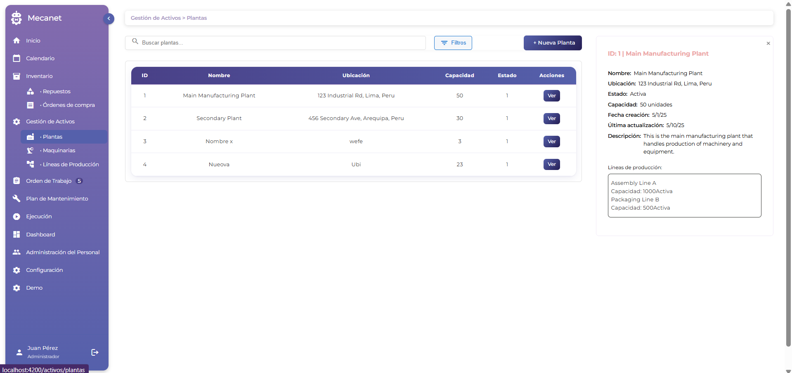

#### New Plant View  
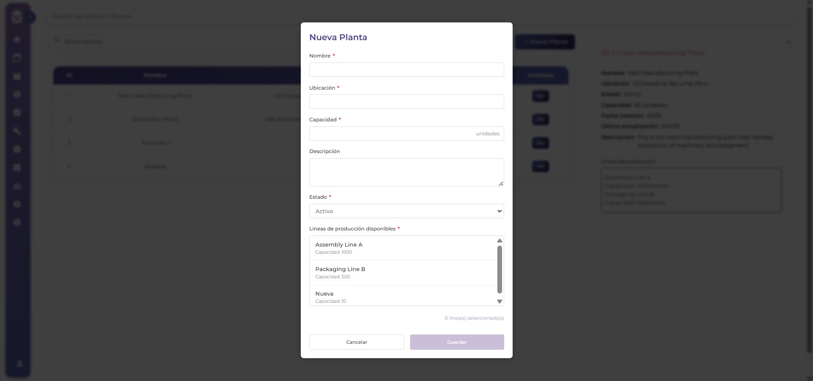

#### Production Line Manager View  
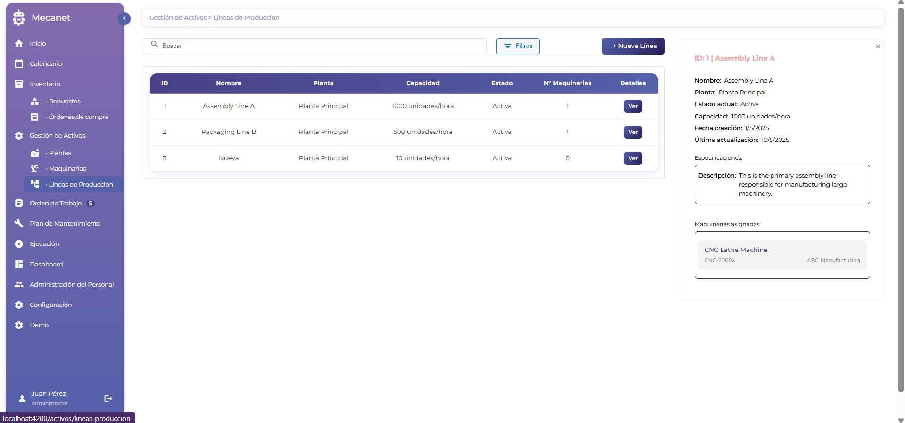

#### New Production Line View  
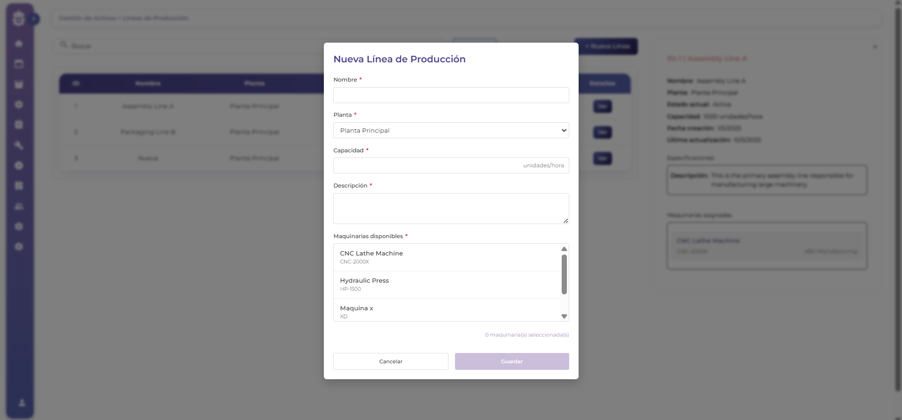

#### Machinery Manager View  
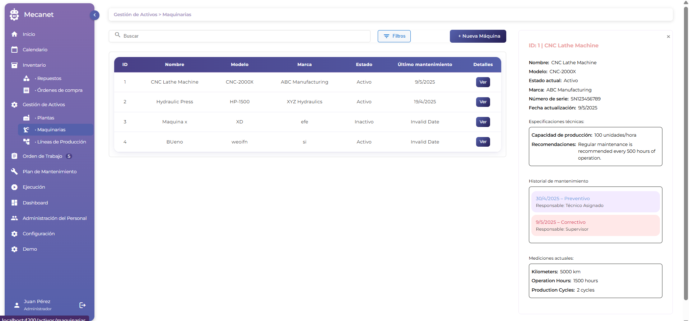

#### Maintanice Plan View  
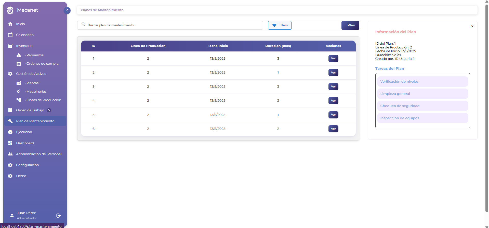

#### New Plan View  
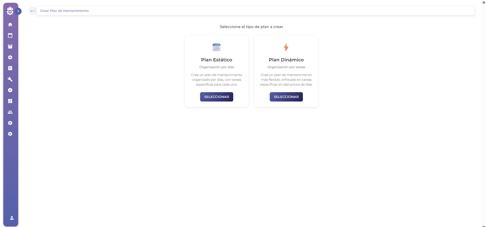

#### New Plan Static View  
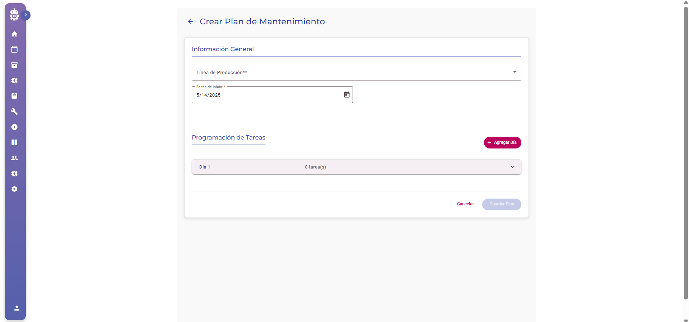

#### New Plan Dynamic View  
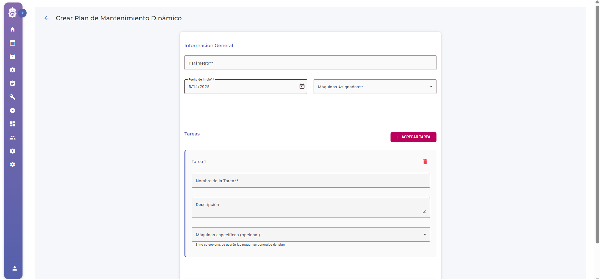

#### Spare Parts View  
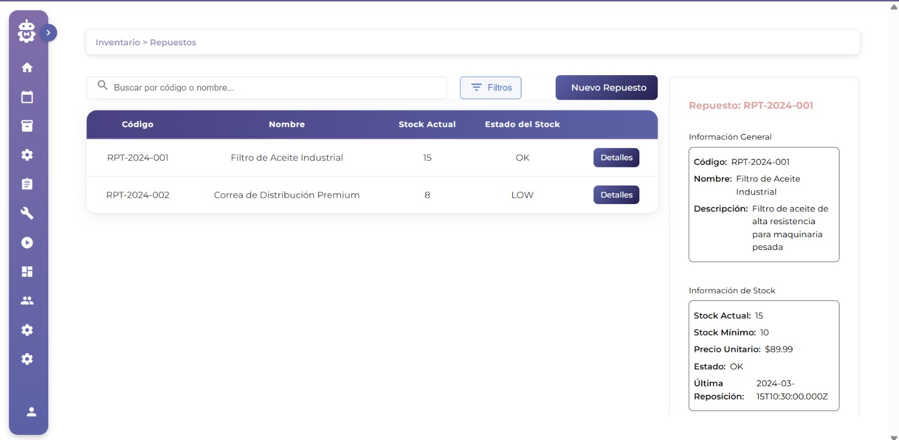

#### Edit Spare Parts View  
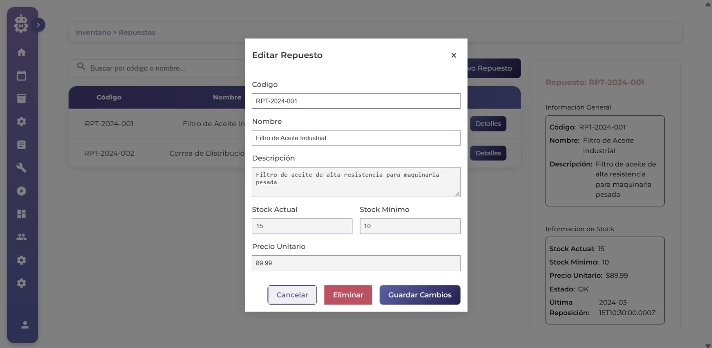


#### 5.2.2.6. Services Documentation Evidence for Sprint Review.
Durante este Sprint no se desarrollaron ni documentaron Web Services, dado que el enfoque principal estuvo en la implementación del FrontEnd de la Aplicación Web, con todas sus vistas. Por lo tanto, no se cuenta con endpoints disponibles ni documentación generada en OpenAPI en esta etapa del proyecto.

La documentación de servicios será considerada en los siguientes Sprints, una vez que se inicie el desarrollo del backend y se establezca la estructura básica de la API que permitirá la integración con las vistas web implementadas.


#### 5.2.2.7. Software Deployment Evidence for Sprint Review.
Durante este Sprint, se avanzó de manera significativa en el proceso de Deployment de los principales componentes del sistema, incluyendo la Landing Page, las Aplicaciones Web y los Servicios Web (API). A continuación, se describen las acciones realizadas y se documentan con capturas y explicaciones técnicas.

##### 1. Crear nuevo recurso SPA dentro de mismo grupo de recursos
Se seleccionó Azure como plataforma de despliegue por su facilidad de integración con herramientas de desarrollo y CI/CD. Las principales acciones realizadas fueron:


Captura 1: Configuración del proyecto en Azure

##### 2. Configuración de Repositorios y Automatización de Deployment (CI/CD)
Se integraron los repositorios de GitHub con el servicio de despliegue, permitiendo una integración continua y despliegue automático tras cada push a las ramas principales:

- Se conectaron los repositorios de GitHub a Azure.
- Se configuró un pipeline de CI/CD para que se realicen los siguientes pasos:
    - Instalación de dependencias.
    - Ejecución de pruebas.
    - Construcción del proyecto.


  

Captura 2: Registro de despliegue exitoso tras push en rama main

##### 3. Deployment de la Aplicación Web
La App Web fue desplegada como una SPA (Single Page Application), asegurando el correcto enrutamiento y carga de componentes dinámicos. El build se generó con npm run build y fue subido al entorno de producción.


##### 4. Deployment de los Servicios Web (API)
Se simuló el backend utilizando MockAPI, el cual proporcionó soporte para peticiones REST y autenticación básica. Se verificó la correcta funcionalidad de las rutas implementadas mediante pruebas exhaustivas con Postman. <br/>

Solo creamos 2 recursos (ya que es el límite gratiuto que tiene mockapi).


Lo probamos en Postman o Thuder Client:


#### 5.2.2.8. Team Collaboration Insights during Sprint.
Durante el desarrollo de este Sprint, el equipo colaboró estrechamente en la implementación de las funcionalidades clave de la aplicación web. La colaboración se centró en la creación de las entidades de la base de datos, el desarrollo de las interfaces de usuario iniciales y la implementación de la lógica de negocio fundamental. <br/>

A continuación, se detalla la participación específica de cada integrante del equipo en las principales áreas funcionales:

| **Nombre**                       | **Actividad** |
| ---------------------------------|------------|
| Agreda Sobrino, Ariana Cecilia   |Líder en planificación de mantenimiento. Desarrolló planes de mantenimiento, registro de cuentas y lógica de autenticación.|
| Belledone Espinoza, Claudia      |Líder en inicio de sesión. Desarrolló el login, consulta de órdenes diarias y registro de maquinarias.|
| Elera Rodríguez, Mauricio Daniel |Líder en órdenes de trabajo. Implementó órdenes correctivas, asignación de técnicos y gestión de sesiones.|
| Qqueso Rodriguez, Britney Delhy  |Líder en creación de cuentas. Desarrolló líneas de producción y entidad de órdenes de trabajo.|

##### Evidencia de colaboración en GitHub
A continuación, se presentan capturas de los analíticos de colaboración desde el repositorio oficial, donde se evidencia la participación activa de todos los miembros del equipo. <br/>

Captura de colaboracion en github:


##### Repositorio de trabajo:

- Repositorio del FrontEnd en github: https://github.com/wiwitech1/mecanet-frontend.git

El equipo colaboró activamente, siguiendo el flujo de trabajo y logrando que cada producto del Sprint 2 reflejara la participación de todos sus miembros.

### 5.2.3. Sprint 3
#### 5.2.3.1. Sprint Planning 3
<table>
    <tr>
        <td>Sprint #</td>
        <td>3</td>
    </tr>
    <tr>
        <th colspan="2"><strong>Sprint Planning Background</strong></th>
    </tr>
    <tr>
        <td>Date</td>
        <td>10/06/2025</td>
    </tr>
     <tr>
        <td>Time</td>
        <td> 11:00 AM</td>
    </tr>
     <tr>
        <td>Location</td>
        <td>Reunión virtual – Discord</td>
    </tr>
    <tr>
        <td>Prepared By</td>
        <td>Claudia Belledonne</td>
    </tr>
    <tr>
        <td>Attendees (to planning meeting)</td>
        <td>

- Ariana Cecilia Agreda Sobrino
            
- Claudia Valeria Belledonne Espinoza
            
- Mauricio Daniel Elera Rodríguez
            
- Britney Delhy Qqueso Rodriguez
   </td>
    </tr>
    <tr>
        <td>Sprint 2 Review Summary</td>
        <td>Durante la revisión del Sprint 2, se logró desarrollar e implementar las funcionalidades esenciales de la página web para una gestión integral. Esto incluyó la gestión de usuarios (creación e inicio de sesión para cuentas corporativas y de usuario), la administración de activos (maquinarias), la gestión de la línea de producción, la planificación del mantenimiento y el menú de órdenes de trabajo. Se recibieron comentarios positivos sobre la claridad de la información y la navegación de estas nuevas funcionalidades.</td>
    </tr>
    <tr>
        <td>Sprint 2 Retrospective Summary</td>
        <td>En la retrospectiva del Sprint 2, se destacó como aspectos positivos la buena comunicación y coordinación durante el sprint, así como una mayor claridad en la definición de tareas desde la planificación. Sin embargo, se identificaron oportunidades de mejora, como refinar la estimación de tiempos para evitar retrasos en tareas complejas y distribuir mejor la carga de trabajo.</td>
    </tr>
    <tr>
        <th colspan="2"><strong>Sprint Goal & User Stories</strong></th>
    </tr>
    <tr>
        <td>Sprint 3 Goal</td>
        <td>
<strong>Nuestra meta para este sprint es</strong> desarrollar e implementar las funcionalidades esenciales del backend para la aplicación MecaNet, enfocándonos en la creación de APIs REST para la gestión de usuarios (registro y consulta), administración de roles, manejo de órdenes de trabajo (creación y seguimiento), control de inventario (registro y consulta de ítems) y gestión de activos (maquinarias y equipos).

<strong>Creemos que</strong> esto proporcionará una base técnica sólida para el correcto funcionamiento del sistema, permitiendo el almacenamiento seguro de datos y la comunicación efectiva entre el frontend y el backend.

<strong>Esto se confirmará</strong> cuando las APIs de usuarios permitan registrar y consultar datos correctamente. Se validará que las APIs de órdenes de trabajo faciliten la creación y listado de órdenes sin errores, mientras que las APIs de inventario soporten el registro de ítems y la consulta de su información. Finalmente, se confirmará cuando las APIs de activos permitan el registro y consulta de detalles de equipos, y las métricas de mantenimiento puedan generarse y consultarse adecuadamente, garantizando que los usuarios gestionen eficientemente sus operaciones desde la página web.
    </td>
    </tr>
     <tr>
        <td>Sprint 3 Velocity  </td>
        <td>35 Story Points.</td>
    </tr>
     <tr>
        <td>Sum of Story Points  </td>
        <td>34 Story Points.</td>
    </tr>
</table>

#### 5.2.3.2. Aspect Leaders and Collaborators.
<table>
  <tr>
    <th>Team Member (Last Name, First Name)</th>
    <th>GitHub Username</th>
    <th>Sección API Gestión de Usuarios<br/>Leader (L) / Collaborator (C)</th>
    <th>Sección API Órdenes de Trabajo<br/>Leader (L) / Collaborator (C)</th>
    <th>Sección API Inventario<br/>Leader (L) / Collaborator (C)</th>
    <th>Sección API Plan de Mantenimiento<br/>Leader (L) / Collaborator (C)</th>
    <th>Sección API Gestión de Activos<br/>Leader (L) / Collaborator (C)</th>
    <th>Sección API Métricas<br/>Leader (L) / Collaborator (C)</th>
  </tr>
  <tr>
    <td>Agreda, Ariana</td>
    <td>arii4w</td>
    <td>C</td>
    <td>C</td>
    <td>L</td>
    <td>C</td>
    <td>C</td>
    <td>L</td>
  </tr>
  <tr>
    <td>Belledonne, Claudia</td>
    <td>Cl4us-tb</td>
    <td>L</td>
    <td>C</td>
    <td>C</td>
    <td>C</td>
    <td>L</td>
    <td>C</td>
  </tr>
  <tr>
    <td>Elera, Mauricio</td>
    <td>Maur1xio</td>
    <td>L</td>
    <td>L</td>
    <td>C</td>
    <td>C</td>
    <td>C</td>
    <td>C</td>
  </tr>
  <tr>
    <td>Qqueso, Britney</td>
    <td>brit2801</td>
    <td>C</td>
    <td>L</td>
    <td>C</td>
    <td>L</td>
    <td>C</td>
    <td>C</td>
  </tr>
</table>

#### 5.2.3.3. Sprint Backlog 3.
<p>El objetivo de este tercer sprint es desarrollar las APIs esenciales del backend para la gestión de usuarios (registro y autenticación), administración de inventario (registro y consulta de ítems), control de activos (maquinarias y equipos), generación de órdenes de trabajo y reportes de métricas de mantenimiento. Esto proporcionará la base técnica para el funcionamiento integral del sistema y la futura integración con el frontend.</p>

<p>link: https://trello.com/b/pRzRlW59/mecanet-open-source</p>

<table>
  <tr>
    <th colspan="2">Sprint #</th>
    <th colspan="6">Sprint 3</th>
  </tr>
  <tr>
    <th colspan="2">User Story</th>
    <th colspan="6">Work-Item / Task</th>
  </tr>
  <tr>
    <th>Id</th>
    <th>Title</th>
    <th>Id</th>
    <th>Title</th>
    <th>Description</th>
    <th>Estimation (Hours)</th>
    <th>Assigned To</th>
    <th>Status</th>
  </tr>
    
<tr>
    <th rowspan="2">TS01</th>
    <th rowspan="2">Post Usuario</th>
    <td>1</td>
    <td align="justify">Crear endpoint POST para registrar usuario</td>
    <td align="justify">Implementar el endpoint en el backend que permita registrar nuevos usuarios en la base de datos, validando los datos requeridos (nombre, correo, contraseña, tipo de usuario).</td>
    <td>4 hr</td>
    <td>Mauricio Elera</td>
    <td>Done</td>
</tr>
<tr>
    <td>2</td>
    <td align="justify">Configurar validaciones y seguridad para el registro</td>
    <td align="justify">Agregar validaciones (campos requeridos, formato de correo, hash de contraseña) y medidas de seguridad básicas para proteger el endpoint.</td>
    <td>3 hr</td>
    <td>Claudia Belledonne</td>
    <td>Done</td>
</tr>

<tr>
    <th rowspan="2">TS02</th>
    <th rowspan="2">Get Usuario</th>
    <td>3</td>
    <td align="justify">Crear endpoint GET para consultar usuario por ID</td>
    <td align="justify">Permitir obtener la información básica de un usuario específico mediante su ID, retornando datos personales y roles asociados.</td>
    <td>4 hr</td>
    <td>Mauricio Elera</td>
    <td>Done</td>
</tr>
<tr>
    <td>4</td>
    <td align="justify">Conectar consulta a base de datos y estructurar respuesta</td>
    <td align="justify">Realizar la consulta a la base de datos y retornar la información estructurada en formato JSON para el frontend.</td>
    <td>3 hr</td>
    <td>Claudia Belledonne</td>
    <td>Done</td>
</tr>

<tr>
    <th rowspan="1">TS03</th>
    <th rowspan="1">Get Roles por Usuario</th>
    <td>5</td>
    <td align="justify">Implementar endpoint GET de roles por usuario</td>
    <td align="justify">Permitir recuperar los roles asignados a un usuario autenticado para establecer los permisos del sistema.</td>
    <td>3 hr</td>
    <td>Ariana Agreda</td>
    <td>Done</td>
</tr>

<tr>
    <th rowspan="2">TS04</th>
    <th rowspan="2">Post Plan de mantenimiento</th>
    <td>6</td>
    <td align="justify">Diseñar modelo de plan de mantenimiento</td>
    <td align="justify">Definir la estructura de datos para registrar un nuevo plan de mantenimiento (dinámico o estático).</td>
    <td>4 hr</td>
    <td>Britney Qqueso</td>
    <td>Done</td>
</tr>
<tr>
    <td>7</td>
    <td align="justify">Crear endpoint POST para orden de trabajo</td>
    <td align="justify">Desarrollar el endpoint que reciba los datos del plan de mantenimiento y los almacene correctamente en la base de datos.</td>
    <td>5 hr</td>
    <td>Britney Qqueso</td>
    <td>Done</td>
</tr>

<tr>
    <th rowspan="1">TS05</th>
    <th rowspan="1">Get Plan de mantenimiento</th>
    <td>8</td>
    <td align="justify">Desarrollar endpoint GET para obtener un Plan de Mantenimiento</td>
    <td align="justify">Permitir obtener un Plan de Mantenimiento filtrado por ID.</td>
    <td>4 hr</td>
    <td>Mauricio Elera</td>
    <td>Done</td>
</tr>

<tr>
    <th rowspan="1">TS06</th>
    <th rowspan="1">Get Métricas de Maquinarias</th>
    <td>9</td>
    <td align="justify">Implementar endpoint de métricas</td>
    <td align="justify">Desarrollar una API que calcule y entregue indicadores clave de mantenimiento utilizando los datos históricos de órdenes completadas.</td>
    <td>5 hr</td>
    <td>Ariana Agreda</td>
    <td>Done</td>
</tr>

<tr>
    <th rowspan="2">TS07</th>
    <th rowspan="2">Post Inventory Item</th>
    <td>10</td>
    <td align="justify">Diseñar modelo de ítem de inventario</td>
    <td align="justify">Definir los atributos requeridos para registrar herramientas y materiales (nombre, código, cantidad, ubicación).</td>
    <td>3 hr</td>
    <td>Claudia Belledonne</td>
    <td>Done</td>
</tr>
<tr>
    <td>11</td>
    <td align="justify">Crear endpoint POST para ítems de inventario</td>
    <td align="justify">Crear API que registre ítems en el sistema, permitiendo su uso posterior en tareas de mantenimiento.</td>
    <td>4 hr</td>
    <td>Claudia Belledonne</td>
    <td>Done</td>
</tr>

<tr>
    <th rowspan="1">TS08</th>
    <th rowspan="1">Get Inventory Item</th>
    <td>12</td>
    <td align="justify">Desarrollar endpoint GET para consultar ítems</td>
    <td align="justify">Obtener información detallada de cada ítem del inventario para verificar su disponibilidad.</td>
    <td>3 hr</td>
    <td>Britney Qqueso</td>
    <td>Done</td>
</tr>

<tr>
    <th rowspan="2">TS09</th>
    <th rowspan="2">Post Activo</th>
    <td>13</td>
    <td align="justify">Diseñar modelo de activo</td>
    <td align="justify">Definir los atributos y relaciones necesarias de activos como maquinaria, para su programación en mantenimientos.</td>
    <td>3 hr</td>
    <td>Claudia Belledonne</td>
    <td>Done</td>
</tr>
<tr>
    <td>14</td>
    <td align="justify">Crear endpoint POST para registrar activo</td>
    <td align="justify">Permitir el registro de nuevos activos mediante API, validando la unicidad de cada registro.</td>
    <td>4 hr</td>
    <td>Claudia Belledonne</td>
    <td>Done</td>
</tr>

<tr>
    <th rowspan="1">TS10</th>
    <th rowspan="1">Get Activo</th>
    <td>15</td>
    <td align="justify">Desarrollar API para obtener datos de activo</td>
    <td align="justify">Permitir visualizar datos específicos de un activo registrado, como tipo, estado y uso actual.</td>
    <td>3 hr</td>
    <td>Mauricio Elera</td>
    <td>Done</td>
</tr>


</table>

#### 5.2.3.4. Development Evidence for Sprint Review.
En este sprint, se lograron avances fundamentales en la construcción de la lógica del backend para Mecanet, priorizando la gestión de usuarios, activos, órdenes de trabajo, métricas y elementos de inventario. Se implementaron múltiples endpoints REST para el registro y recuperación de datos clave, permitiendo sentar las bases para una interacción fluida con el frontend y asegurar la persistencia de la información operativa. Las validaciones, modelos de datos y estructuras de control fueron diseñadas con énfasis en escalabilidad y mantenibilidad.<br/>

A continuación, se presenta una tabla con los commits relacionados con la implementación de estas funcionalidades:  <br/>

| Repository                                                                                           | Branch  | Commit Id | Commit Message                                 | Commit Message Body                                                              | Committed on (Date) |
| ---------------------------------------------------------------------------------------------------- | ------- | --------- | ---------------------------------------------- | -------------------------------------------------------------------------------- | ------------------- |
| [https://github.com/wiwitech1/mecanet-backend.git](https://github.com/wiwitech1/mecanet-backend.git) | develop | 81f3a1c   | feat(user): implement POST user registration   | Added endpoint for user creation with validation and password hashing            | 10/06/2025          |
| [https://github.com/wiwitech1/mecanet-backend.git](https://github.com/wiwitech1/mecanet-backend.git) | develop | 94b2e8d   | feat(user): add GET user by ID                 | Implemented GET endpoint to retrieve user information with role mapping          | 17/06/2025          |
| [https://github.com/wiwitech1/mecanet-backend.git](https://github.com/wiwitech1/mecanet-backend.git) | develop | a72d3c7   | feat(order): implement POST maintenance plan         | Created model and controller logic to register new work orders in DB             | 17/06/2025          |
| [https://github.com/wiwitech1/mecanet-backend.git](https://github.com/wiwitech1/mecanet-backend.git) | develop | b51f2a9   | feat(order): add GET a maintenance plan          | Endpoint to retrieve and filter work orders by date, status, and priority        | 18/06/2025          |
| [https://github.com/wiwitech1/mecanet-backend.git](https://github.com/wiwitech1/mecanet-backend.git) | develop | c12ff9b   | feat(metrics): implement machinery metrics | Developed metric calculation logic from completed orders                         | 18/06/2025          |
| [https://github.com/wiwitech1/mecanet-backend.git](https://github.com/wiwitech1/mecanet-backend.git) | develop | d72ca6e   | feat(inventory): add POST inventory item       | Enabled registration of inventory tools and materials with validation rules      | 18/06/2025          |
| [https://github.com/wiwitech1/mecanet-backend.git](https://github.com/wiwitech1/mecanet-backend.git) | develop | e49d8f0   | feat(asset): implement POST asset registration | Created data structure and API for adding new equipment or machines              | 19/06/2025          |
| [https://github.com/wiwitech1/mecanet-backend.git](https://github.com/wiwitech1/mecanet-backend.git) | develop | f28c9ad   | ci: update CI pipeline for backend deployment  | Modified GitHub Actions for backend automatic deployment on sprint release       | 19/06/2025          |
| [https://github.com/wiwitech1/mecanet-backend.git](https://github.com/wiwitech1/mecanet-backend.git) | main    | f28c9ad   | chore(release): merge Sprint 3 backend to main | Merged all Sprint 3 backend features including users, assets, orders and metrics | 19/06/2025          |


#### 5.2.3.5. Execution Evidence for Sprint Review.
En este sprint, hemos logrado implementar las funcionalidades fundamentales para la gestión inicial del sistema Mecanet. Esto incluye la capacidad de registrar y gestionar maquinarias y líneas de producción, establecer planes de mantenimiento para las líneas de producción entre otros.<br/>

A continuación, se presentan capturas de pantalla de las principales funcionalidades implementadas durante este sprint:<br/>

#### Evidencia 1: Registro de Plantas


#### Evidencia 2: Listado de maquinarias registradas


#### Evidencia 3: Registro de línea de producción


#### Evidencia 4: Obtener métricas de maquinaria


#### 5.2.3.6. Services Documentation Evidence for Sprint Review.
Durante este Sprint, se avanzó significativamente en la documentación de los servicios web desarrollados para el backend del sistema MecaNet, utilizando OpenAPI (Swagger). Esta documentación permite la visualización, prueba e integración futura con el frontend y facilita la validación de la estructura de los endpoints REST implementados.

Los endpoints documentados corresponden a las funcionalidades clave desarrolladas durante el Sprint, incluyendo el registro y consulta de maquinarias, líneas de producción, órdenes de trabajo, métricas de mantenimiento y gestión de usuarios. A través de Swagger UI, los desarrolladores pueden interactuar con cada uno de estos servicios, visualizar sus parámetros, realizar llamadas HTTP con datos de ejemplo y observar las respuestas correspondientes.

| Módulo               | Acción                        | Método | Endpoint                  | Parámetros (ejemplo)                                                         | Respuesta (ejemplo)                                                         |
| -------------------- | ----------------------------- | ------ | ------------------------- | ---------------------------------------------------------------------------- | --------------------------------------------------------------------------- |
| Maquinarias          | Registrar maquinaria          | POST   | `/api/maquinarias`        | `{"nombre": "Compresora", "modelo": "XK-120", "serie": "A1234"}`             | `{"id": 1, "nombre": "Compresora", "modelo": "XK-120", "serie": "A1234"}`   |
|                      | Listar maquinarias            | GET    | `/api/maquinarias`        | -                                                                            | `[{"id": 1, "nombre": "Compresora", "modelo": "XK-120", "serie": "A1234"}]` |
| Líneas de Producción | Registrar línea de producción | POST   | `/api/lineas-produccion`  | `{"nombre": "Línea 1", "prioridad": 2}`                                      | `{"id": 1, "nombre": "Línea 1", "prioridad": 2}`                            |
|                      | Consultar líneas              | GET    | `/api/lineas-produccion`  | -                                                                            | `[{"id": 1, "nombre": "Línea 1", "prioridad": 2}]`                          |
| Planes de Mantenimiento   | Crear plan de mantenimiento        | POST   | `/api/maintenance-plan` | `{"name": "Plan Prueba", "startDate": "2025-06-20", "endDate": "2025-06-20", "productionLineId": 1, "cyclePeriodInDays": 10, "durationInDays": 1}` | `{"id": 1, "name": "Plan Prueba", "startDate": "2025-06-20", "endDate": "2025-06-20", "status": "ACTIVE", "productionLineId": 1, "cyclePeriodInDays": 10, "durationInDays": 1, "items": []}`                    |
|                      | Consultar plan             | GET    | `/api/maintenance-plan`            | -                                                                            | `[{"id": 1, "estado": "ACTIVE"}]`                  |
| Métricas (MTTR/MTBF) | Obtener métricas              | GET    | `/api/metricas/mttr-mtbf` | -                                                                            | `{"mttr": 5.2, "mtbf": 48.3}`                                               |
| Autenticación        | Login de usuario              | POST   | `/api/auth/login`         | `{"email": "admin@mecanet.com", "password": "123456"}`                       | `{"token": "eyJhbGciOi..."}`                                                |

#### Capturas de la documentación OpenAPI/Swagger

- Endpoint GET /api/v1/roles – Obtener todos los roles


- Endpoint POST /api/v1/authentication/sign-up – Registro de usuario


- Endpoint GET /api/v1/metric-definitions – Obtener todas las definiciones de métricas


  
- Endpoint POST /api/maquinarias – Registro de maquinaria


- Endpoint POST /api/v1/maintenance-plans/dynamic – Crear plan de mantenimiento estático


- Endpoint GET /api/v1/maintenance-plans/static/{planId} – Obtener plan de mantenimiento dinámico


#### 5.2.3.7. Software Deployment Evidence for Sprint Review.
Durante este Sprint, se avanzó en el proceso de Deployment del backend de la aplicación Mecanet, enfocándose en el despliegue inicial de los Web Services en un entorno de desarrollo accesible, con el objetivo de facilitar la validación funcional por parte del equipo y sentar las bases para futuras integraciones con el frontend.

#### Actividades realizadas en el Sprint 3:
# Despliegue de **Mecanet-Backend** – Guía Resumida (Windows 10/11)

1. **Configuración de repositorio remoto:**  
   * **Sistema de control de versiones:** Git + GitHub  
   * **Repositorio oficial del backend:** [mecanet-backend](https://github.com/wiwitech1/mecanet-backend)

2. **Creación de entorno de despliegue local:**  
   * **Stack:** Spring Boot 3, Swagger UI, MySQL, Docker  
   * **Archivo `docker-compose.yml`:**  
     ```yml
     services:
       mecanet-db:
         image: mysql:8
         environment:
           MYSQL_ROOT_PASSWORD: 123456789
           MYSQL_DATABASE: mecanet
           MYSQL_USER: dev
         ports:
           - "3306:3306"

       mecanet-backend:
         image: mecanet-backend:0.0.1
         build:
           context: .
           dockerfile: Dockerfile
         ports:
           - "8080:8080"
         environment:
           - SPRING_PROFILES_ACTIVE=dev
           - DB_PASSWORD=123456789
         depends_on:
           - mecanet-db
     ```

3. **Ejecución local exitosa:**  
   * **Comando para levantar el entorno:**  
     ```powershell
     docker-compose up --build
     ```  
   * **Acceso al Swagger:** [http://localhost:8080/swagger-ui.html](http://localhost:8080/swagger-ui.html)

4. **Variables de entorno de Spring Profiles:**  
   * **Variables a configurar en Windows:**  
     ```powershell
     setx SPRING_PROFILES_ACTIVE "prod"
     setx DB_PASSWORD "123456789"
     ```  
   * **Configuración de `application-dev.properties` y `application-prod.properties` para MySQL.**

5. **Empaquetado y dockerización:**  
   * **Generación del JAR:**  
     ```powershell
     mvn clean package
     ```  
   * **Dockerfile:**  
     ```dockerfile
     FROM openjdk:17-jdk-slim
     VOLUME /tmp
     EXPOSE 8080
     COPY target/mecanet-backend-0.0.1-SNAPSHOT.jar app.jar
     ENTRYPOINT ["java","-Djava.security.egd=file:/dev/./urandom","-jar","/app.jar"]
     ```  
   * **Ignorar archivos de build:**  
     ```
     .git
     target/
     .mvn/
     mvnw*
     ```

6. **Recursos de Azure (CLI Windows PowerShell):**  
   * **Pasos para la configuración de Azure:**  
     ```powershell
     az login
     az group create --name MecanetRG --location "Central US"
     az provider register --namespace Microsoft.ContainerRegistry
     az acr create -g MecanetRG -n mecanetacr --sku Basic --admin-enabled true
     az acr login -n mecanetacr
     ```

7. **Publicación de la imagen Docker:**  
   * **Etiquetar y subir la imagen Docker a ACR:**  
     ```powershell
     docker tag mecanet-backend:0.0.1 mecanetacr.azurecr.io/mecanet-backend:0.0.1
     docker push mecanetacr.azurecr.io/mecanet-backend:0.0.1
     ```

8. **Creación de Azure Web App for Containers:**  
   * **Crear App Service Plan + Web App:**  
     ```powershell
     az appservice plan create --name MecanetPlan --resource-group MecanetRG --is-linux --sku B1
     az webapp create --resource-group MecanetRG --plan MecanetPlan --name mecanet-api --deployment-container-image-name mecanetacr.azurecr.io/mecanet-backend:0.0.1
     ```

   * **Vincular ACR & actualizar variables de entorno:**  
     ```powershell
     az webapp config container set --name mecanet-api --resource-group MecanetRG --docker-custom-image-name mecanetacr.azurecr.io/mecanet-backend:0.0.1 --docker-registry-server-url https://mecanetacr.azurecr.io
     az webapp config appsettings set --name mecanet-api --resource-group MecanetRG --settings SPRING_PROFILES_ACTIVE=prod DB_PASSWORD=123456789 PORT=8080
     ```

   * **Desactivar soporte Sidecar y configurar puerto 8080.**

9. **Verificación en producción:**  
   * **URL de prueba:**  
     https://mecanetbackend-hjexa7d8bkfybmfv.centralus-01.azurewebsites.net/swagger-ui/index.html
   Confirmar que la aplicación esté funcionando con el perfil **prod** y la conexión a Azure MySQL.

#### Capturas del Proceso de Deployment


#### 5.2.3.8. Team Collaboration Insights during Sprint.
Durante el desarrollo de este Sprint, el equipo colaboró de forma activa y coordinada en la implementación de las funcionalidades principales del backend del sistema Mecanet. La colaboración se centró en la creación de entidades de dominio, el desarrollo de controladores REST, la configuración del entorno de desarrollo con Spring Boot y MySQL, y la documentación de servicios con Swagger (OpenAPI).<br/>

A continuación, se detalla la participación específica de cada integrante del equipo en las principales áreas funcionales del backend:

| **Nombre**                       | **Actividad**                                                                                                                                                              |
| -------------------------------- | -------------------------------------------------------------------------------------------------------------------------------------------------------------------------- |
| Agreda Sobrino, Ariana Cecilia   | Responsable del modelado de entidades principales y configuración de la base de datos MySQL. Participó en la definición de relaciones entre entidades y persistencia. |
| Belledone Espinoza, Claudia      | Encargada de la lógica de negocio y servicios de autenticación. Desarrolló la estructura de seguridad, generación de tokens JWT y configuración de rutas protegidas.       |
| Elera Rodríguez, Mauricio Daniel | Implementó los controladores REST y validaciones. Participó activamente en la construcción de endpoints para entidades como usuarios, técnicos y órdenes.                  |
| Qqueso Rodriguez, Britney Delhy  | Responsable de la documentación con Swagger. Estructuró el despliegue local del backend con Docker.      |


#### Evidencia de colaboración en GitHub
A continuación, se presentan capturas de los analíticos de colaboración desde el repositorio oficial del backend, donde se evidencia la participación activa de todos los miembros del equipo en el Sprint 3. <br/>

Captura de colaboracion en github:


#### Repositorio de trabajo:
* Repositorio del Backend en GitHub: https://github.com/wiwitech1/mecanet-backend.git

El equipo mantuvo una comunicación constante durante todo el Sprint, utilizando herramientas colaborativas como GitHub y reuniones breves, permitiendo una integración progresiva de los módulos desarrollados y asegurando que cada funcionalidad contara con aportes técnicos y revisiones cruzadas por parte de todos los miembros.


### 5.2.4. Sprint 4
#### 5.2.4.1. Sprint Planning 4
<table>
    <tr>
        <td>Sprint #</td>
        <td>4</td>
    </tr>
    <tr>
        <th colspan="2"><strong>Sprint Planning Background</strong></th>
    </tr>
    <tr>
        <td>Date</td>
        <td>01/07/2025</td>
    </tr>
     <tr>
        <td>Time</td>
        <td> 08:00 AM</td>
    </tr>
     <tr>
        <td>Location</td>
        <td>Reunión presencial – Salón: UH:51</td>
    </tr>
    <tr>
        <td>Prepared By</td>
        <td>Claudia Belledonne</td>
    </tr>
    <tr>
        <td>Attendees (to planning meeting)</td>
        <td>

- Ariana Cecilia Agreda Sobrino
            
- Claudia Valeria Belledonne Espinoza
            
- Mauricio Daniel Elera Rodríguez
            
- Britney Delhy Qqueso Rodriguez
   </td>
    </tr>
    <tr>
        <td>Sprint 3 Review Summary</td>
        <td>Durante la revisión del Sprint 3, se completó el desarrollo de los servicios RESTful del backend de Mecanet, cubriendo la gestión de usuarios, órdenes de trabajo, activos, métricas e inventario. Estas funcionalidades están listas para ser integradas con la interfaz web desarrollada en los sprints anteriores. Se verificó el correcto funcionamiento de los endpoints mediante documentación OpenAPI y pruebas con datos reales.</td>
    </tr>
    <tr>
        <td>Sprint 3 Retrospective Summary</td>
        <td>En la retrospectiva del Sprint 3, destacamos la buena comunicación y coordinación como factores clave que nos permitieron cumplir satisfactoriamente con los objetivos propuestos. Como área de mejora, identificamos la necesidad de optimizar la distribución de tareas y la puntualidad.</td>
    </tr>
    <tr>
        <th colspan="2"><strong>Sprint Goal & User Stories</strong></th>
    </tr>
    <tr>
        <td>Sprint 4 Goal</td>
        <td>
<strong>Nuestra meta para este sprint es</strong> completar el desarrollo funcional de la aplicación Mecanet, integrando el frontend y el backend, incluyendo la implementación de servicios externos como el envío de correos electrónicos (Email Service), y desplegar una versión navegable y funcional del sistema.<br/><br/>
<strong>Creemos que</strong> esto nos permitirá presentar una plataforma completamente operativa, en la cual los módulos de usuarios, activos, mantenimiento, inventario, reportes y funcionalidades externas trabajen en conjunto de forma fluida a través de una interfaz web intuitiva.<br/><br/>

<strong>Esto se confirmará</strong> cuando el frontend pueda consumir satisfactoriamente los servicios RESTful desarrollados, el sistema registre y muestre información en tiempo real, y se verifique el correcto funcionamiento del envío automático de correos electrónicos como confirmaciones o alertas, garantizando una experiencia integral para el usuario final.
    </td>
    </tr>
     <tr>
        <td>Sprint 4 Velocity  </td>
        <td>22 Story Points.</td>
    </tr>
     <tr>
        <td>Sum of Story Points  </td>
        <td>22 Story Points.</td>
    </tr>
</table>

#### 5.2.4.2. Aspect Leaders and Collaborators.
<table>
  <tr>
    <th>Team Member (Last Name, First Name)</th>
    <th>GitHub Username</th>
    <th>Integración Frontend-Backend<br/>Leader (L) / Collaborator (C)</th>
    <th>Sección de gestión de usuarios<br/>Leader (L) / Collaborator (C)</th>
    <th>Sección de calendario de plan de mantenimiento<br/>Leader (L) / Collaborator (C)</th>
    <th>Integración con Email Service<br/>Leader (L) / Collaborator (C)</th>
    <th>Sección de registro de técnicos<br/>Leader (L) / Collaborator (C)</th>
    <th>Gestión de órdenes de trabajo<br/>Leader (L) / Collaborator (C)</th>
  </tr>
  <tr>
    <td>Agreda, Ariana</td>
    <td>arii4w</td>
    <td>C</td>
    <td>C</td>
    <td>C</td>
    <td>L</td>
    <td>C</td>
    <td>C</td>
  </tr>
  <tr>
    <td>Belledonne, Claudia</td>
    <td>Cl4us-tb</td>
    <td>L</td>
    <td>L</td>
    <td>C</td>
    <td>C</td>
    <td>C</td>
    <td>L</td>
  </tr>
  <tr>
    <td>Elera, Mauricio</td>
    <td>Maur1xio</td>
    <td>C</td>
    <td>C</td>
    <td>L</td>
    <td>C</td>
    <td>C</td>
    <td>C</td>
  </tr>
  <tr>
    <td>Qqueso, Britney</td>
    <td>brit2801</td>
    <td>L</td>
    <td>C</td>
    <td>C</td>
    <td>C</td>
    <td>L</td>
    <td>C</td>
  </tr>
</table>

#### 5.2.4.3. Sprint Backlog 4.
<p>El objetivo de este cuarto sprint fue completar el desarrollo e integración de todas las funcionalidades restantes de la aplicación Mecanet, uniendo el frontend con el backend para lograr una experiencia completamente funcional. Además, se implementó la integración con un servicio externo (Email Service), autenticación mediante tokens y la conexión de todas las vistas de usuario con sus respectivos endpoints.</p>
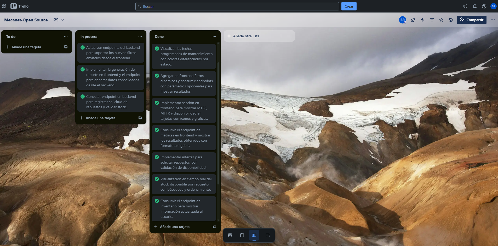

[Link de Trello](https://trello.com/invite/b/6823ecc85a57e53ae9e33162/ATTI3e961727f24253b6a3f3437eb8f5a37fA12F1C68/mecanet-open-source)

<table>
  <tr>
    <th colspan="2">Sprint #</th>
    <th colspan="6">Sprint 4</th>
  </tr>
  <tr>
    <th colspan="2">User Story</th>
    <th colspan="6">Work-Item / Task</th>
  </tr>
  <tr>
    <th>Id</th>
    <th>Title</th>
    <th>Id</th>
    <th>Title</th>
    <th>Description</th>
    <th>Estimation (Hours)</th>
    <th>Assigned To</th>
    <th>Status</th>
  </tr>
  <tr>
    <th rowspan="2">US05</th>
    <th rowspan="2">Supervisión del calendario de plan de mantenimiento</th>
    <td>1</td>
    <td align="justify">Conectar vista de calendario con backend</td>
    <td align="justify">Implementar la integración del componente de calendario con los planes de mantenimiento registrados mediante API.</td>
    <td>4 hr</td>
    <td>Britney Qqueso</td>
    <td>Done</td>
  </tr>
  <tr>
    <td>2</td>
    <td align="justify">Mostrar eventos en calendario</td>
    <td align="justify">Visualizar las fechas programadas de mantenimiento con colores diferenciados por estado.</td>
    <td>4 hr</td>
    <td>Claudia Belledonne</td>
    <td>Done</td>
  </tr>
  <tr>
    <th rowspan="2">US06</th>
    <th rowspan="2">Filtro de plan de mantenimiento</th>
    <td>3</td>
    <td align="justify">Desarrollar filtros por tipo, estado y fecha</td>
    <td align="justify">Agregar en frontend filtros dinámicos y consumir endpoints con parámetros opcionales para mostrar resultados.</td>
    <td>4 hr</td>
    <td>Ariana Agreda</td>
    <td>Done</td>
  </tr>
  <tr>
    <td>4</td>
    <td align="justify">Validar filtros en el backend</td>
    <td align="justify">Actualizar endpoints del backend para soportar los nuevos filtros enviados desde el frontend.</td>
    <td>3 hr</td>
    <td>Claudia Belledonne</td>
    <td>Done</td>
  </tr>
  <tr>
    <th rowspan="2">US07</th>
    <th rowspan="2">Visualización de KPIs</th>
    <td>5</td>
    <td align="justify">Crear componente visual de dashboard</td>
    <td align="justify">Implementar sección en frontend para mostrar MTBF, MTTR y disponibilidad en tarjetas con iconos y gráficas.</td>
    <td>5 hr</td>
    <td>Ariana Agreda</td>
    <td>Done</td>
  </tr>
  <tr>
    <td>6</td>
    <td align="justify">Conectar API de métricas al dashboard</td>
    <td align="justify">Consumir el endpoint de métricas en frontend y mostrar los resultados obtenidos con formato amigable.</td>
    <td>4 hr</td>
    <td>Claudia Belledonne</td>
    <td>Done</td>
  </tr>
  <tr>
    <th rowspan="1">US08</th>
    <th rowspan="1">Reporte de orden de trabajo</th>
    <td>7</td>
    <td align="justify">Desarrollar vista y endpoint para generar reportes</td>
    <td align="justify">Implementar la generación de reporte en frontend y el endpoint para generar datos consolidados desde el backend.</td>
    <td>6 hr</td>
    <td>Mauricio Elera</td>
    <td>Done</td>
  </tr>
  <tr>
    <th rowspan="2">US11</th>
    <th rowspan="2">Solicitud de repuestos</th>
    <td>8</td>
    <td align="justify">Implementar vista de solicitud</td>
    <td align="justify">Implementar interfaz para solicitar repuestos, con validación de disponibilidad.</td>
    <td>5 hr</td>
    <td>Britney Qqueso</td>
    <td>Done</td>
  </tr>
  <tr>
    <td>9</td>
    <td align="justify">Conectar endpoint POST de solicitud</td>
    <td align="justify">Conectar endpoint en backend para registrar solicitud de repuestos y validar stock.</td>
    <td>4 hr</td>
    <td>Claudia Belledonne</td>
    <td>Done</td>
  </tr>
  <tr>
    <th rowspan="2">US12</th>
    <th rowspan="2">Revisión de inventario</th>
    <td>10</td>
    <td align="justify">Implementar vista de revisión  de inventario</td>
    <td align="justify">Visualización en tiempo real del stock disponible por repuesto, con búsqueda y ordenamiento.</td>
    <td>5 hr</td>
    <td>Britney Qqueso</td>
    <td>Done</td>
  </tr>
  <tr>
    <td>11</td>
    <td align="justify">Conexión con API de inventario</td>
    <td align="justify">Consumir el endpoint de inventario para mostrar información actualizada al usuario.</td>
    <td>4 hr</td>
    <td>Mauricio Elera</td>
    <td>Done</td>
  </tr>
  <tr>
    <th rowspan="1">US18</th>
    <th rowspan="1">Registro de tareas realizadas</th>
    <td>12</td>
    <td align="justify">Marcar tareas como completadas</td>
    <td align="justify">Permitir al técnico actualizar el estado de sus tareas y almacenar este cambio vía API.</td>
    <td>5 hr</td>
    <td>Claudia Belledonne</td>
    <td>Done</td>
  </tr>
  <tr>
    <th rowspan="1">US21</th>
    <th rowspan="1">Registro de técnicos</th>
    <td>13</td>
    <td align="justify">Desarrollar formulario de registro técnico</td>
    <td align="justify">Crear vista de registro con campos de contacto y rol, y conexión al endpoint del backend.</td>
    <td>5 hr</td>
    <td>Ariana Agreda</td>
    <td>Done</td>
  </tr>
</table> 


#### 5.2.4.4. Development Evidence for Sprint Review.
Durante este sprint, el equipo logró culminar el desarrollo completo del backend de Mecanet, integrándolo exitosamente con el frontend. Todas las vistas de usuario fueron conectadas con sus respectivos endpoints RESTful, asegurando el flujo correcto de información y la operación integral del sistema. Se cumplió con los principios de mantenibilidad, escalabilidad y seguridad. Además, se implementó la integración con Email Service, permitiendo el envío automático de notificaciones por correo electrónico, lo cual mejora la interacción del usuario y la automatización del sistema.

A continuación, se presenta una tabla con los commits relevantes del repositorio backend y frontend asociados al desarrollo e integración final en el Sprint 4:<br/>

| Repository                                                                                             | Branch  | Commit Id | Commit Message                                   | Commit Message Body                                                                | Committed on (Date) |
| ------------------------------------------------------------------------------------------------------ | ------- | --------- | ------------------------------------------------ | ---------------------------------------------------------------------------------- | ------------------- |
| [https://github.com/wiwitech1/mecanet-backend.git](https://github.com/wiwitech1/mecanet-backend.git)   | develop | 901ab33   | feat(auth): implement authentication         | Authentication  and role verification per endpoint                  | 02/07/2025          |
| [https://github.com/wiwitech1/mecanet-backend.git](https://github.com/wiwitech1/mecanet-backend.git)   | develop | b33ef45   | feat: metrics API              | Endpoint for availability, and efficiency metrics                     | 03/07/2025          |
| [https://github.com/wiwitech1/mecanet-backend.git](https://github.com/wiwitech1/mecanet-backend.git)   | develop | c17df21   | feat(report): implement order report generation  | technical report endpoint with execution summary and parts used       | 04/07/2025          |
| [https://github.com/wiwitech1/mecanet-backend.git](https://github.com/wiwitech1/mecanet-backend.git)   | develop | d45ae01   | feat(integration): connect backend with frontend | Final adjustments for communication between views and RESTful API            | 05/07/2025          |
| [https://github.com/wiwitech1/mecanet-frontend.git](https://github.com/wiwitech1/mecanet-frontend.git) | main    | 223cf11   | feat(ui): consume all API endpoints from backend | Full connection between frontend and backend, including authentication and forms | 05/07/2025          |
| [https://github.com/wiwitech1/mecanet-backend.git](https://github.com/wiwitech1/mecanet-backend.git)   | main    | e78cd19   | chore(release): merge Sprint 4 to main           | Sprint 4 Release: complete backend integrated with frontend                    | 07/07/2025          |


#### 5.2.4.5. Execution Evidence for Sprint Review.
Durante este sprint, se completó con éxito la integración del frontend y backend del sistema Mecanet, logrando una plataforma funcional que permite la gestión de usuarios, activos, inventario, planes de mantenimiento, órdenes de trabajo y solicitudes de repuestos. Además, se implementó la autenticación por roles y la integración con un servicio externo de envío de correos electrónicos (Email Service), lo que mejora la experiencia del usuario y automatiza las notificaciones clave del sistema.<br/>

A continuación, se presentan evidencias visuales de las funcionalidades integradas:<br/>

#### Evidencia 1: Visualización de calendario de mantenimiento


#### Evidencia 2: Generación de reporte técnico de órdenes de trabajo


#### Evidencia 3: Solicitud de repuestos 


#### Evidencia 4: Integración con Email Service


#### Evidencia 5: Registro de técnicos 


#### Enlace al repositorio del frontend: [mecanet-frontend](https://github.com/wiwitech1/mecanet-frontend.git)


#### 5.2.4.6. Services Documentation Evidence for Sprint Review.
Durante este sprint, se completó la documentación de todos los servicios RESTful implementados en el backend de Mecanet, utilizando la herramienta Swagger UI para facilitar la validación e interacción con los endpoints desde el navegador. Esta documentación incluye descripciones claras de las rutas, parámetros requeridos, estructuras de respuesta, posibles códigos de error y ejemplos de uso.

La documentación fue generada automáticamente desde las anotaciones del código fuente en los controladores y servicios de la API, y se encuentra disponible para su consulta en el entorno de desarrollo.

A continuación, se muestran capturas de evidencia de la documentación de servicios:

<br>

#### Evidencia 1: Documentación Swagger - Autenticación y gestión de usuarios

##### Tenant Registration (POST)

| Endpoint | Verbo HTTP | Sintaxis |
|----------|-------------|----------|
| `/api/tenants/register` | POST | `/api/tenants/register` |

---

**Parámetros (Request Body):**  
```
{
  "ruc": "12345678901",
  "legalName": "ClauTech Solutions S.A.C.",
  "commercialName": "ClauTech",
  "address": "Av. Siempre Viva 123",
  "city": "Lima",
  "country": "Perú",
  "tenantPhone": "+51 987654321",
  "tenantEmail": "contacto@clautech.com",
  "website": "https://www.clautech.com",
  "subscriptionPlanId": 1,
  "username": "clau",
  "password": "clau",
  "email": "clau@clautech.com",
  "firstName": "Claudia",
  "lastName": "Ramírez"
}
```

**Ejemplo Response (200 OK):**  
```
{
  "id": 1,
  "username": "clau",
  "name": "Claudia Ramírez",
  "email": "clau@clautech.com",
  "roles": [
    "ROLE_ADMIN"
  ]
}
```

**Descripción:**  
Permite registrar una nueva compañía (Tenant) junto con su usuario administrador, asignando el plan de suscripción y generando credenciales de acceso iniciales.


<br>


##### Authentication Sign-In (POST)

| Endpoint | Verbo HTTP | Sintaxis |
|----------|-------------|----------|
| `/api/v1/authentication/sign-in` | POST | `/api/v1/authentication/sign-in` |

---

**Parámetros (Request Body):**  
```
{
  "username": "clau",
  "password": "clau"
}
```

**Ejemplo Response (200 OK):**  
```
{
  "id": 1,
  "username": "clau",
  "token": "eyJhbGciOiJIUzM4NCJ9.eyJzdWIiOiJjbGF1In0..."
}
```

**Descripción:**  
Permite autenticar un usuario mediante sus credenciales (`username` y `password`) y devuelve un **token JWT** para autorización de futuras peticiones.


<br>

##### Users (GET)

| Endpoint | Verbo HTTP | Sintaxis |
|----------|-------------|----------|
| `/api/v1/users` | GET | `/api/v1/users` |

---

**Parámetros:**  
_No requiere parámetros._

**Ejemplo Response (200 OK):**  
```
[
  {
    "id": 1,
    "username": "clau",
    "name": "Claudia Ramírez",
    "email": "clau@clautech.com",
    "roles": [
      "ROLE_ADMIN"
    ]
  }
]
```

**Descripción:**  
Devuelve la lista de usuarios registrados para el tenant actual, mostrando información básica y roles asociados.


<br>

#### Evidencia 2: Documentación Swagger - Gestión de activos y órdenes de trabajo


<br>

#### Evidencia 3: Documentación Swagger - Inventario y solicitudes de repuestos

##### Inventory Items (POST)

| Endpoint | Verbo HTTP | Sintaxis |
|----------|-------------|----------|
| `/api/v1/inventory-items` | POST | `/api/v1/inventory-items` |

---

**Parámetros (Request Body):**  
```
{
  "sku": "string",
  "name": "string",
  "description": "string",
  "category": "string",
  "unit": "string",
  "unitPrice": 0,
  "minimumStock": 0,
  "location": "string",
  "plantId": 0,
  "compatibleMachineIds": [
    0
  ]
}
```

**Ejemplo Response (200 OK):**  
```
{
  "id": 0,
  "sku": "string",
  "name": "string",
  "description": "string",
  "category": "string",
  "unit": "string",
  "unitPrice": 0,
  "currentStock": 0,
  "minimumStock": 0,
  "location": "string",
  "compatibleMachineIds": [
    0
  ],
  "status": "string",
  "createdAt": "2025-07-07T05:40:21.209Z",
  "updatedAt": "2025-07-07T05:40:21.209Z"
}
```

**Descripción:**  
Crea un nuevo ítem de inventario con los datos especificados, incluyendo datos de ubicación, stock mínimo, precio unitario y máquinas compatibles.


<br>

##### Inventory Items - Add Inventory Stock (POST)

Este endpoint permite **agregar stock** a un ítem de inventario existente. Es útil para registrar ingresos de materiales, compras o devoluciones de piezas.

| Endpoint | Verbo HTTP | Sintaxis |
|----------|-------------|----------|
| `/api/v1/inventory-items/{itemId}/add-stock` | POST | `/api/v1/inventory-items/1/add-stock` |

---

**Parámetros Path:**  
- `itemId` (integer): ID del ítem de inventario al que se le agregará stock.

**Parámetros (Request Body):**
```json
{
  "quantity": 10,
  "reason": "string",
  "unitCost": 10,
  "reference": "11"
}
```

**Ejemplo Response:**
```json
{
  "id": 1,
  "sku": "ABC123",
  "name": "Motor Eléctrico 5HP",
  "description": "Motor eléctrico de 5 caballos de fuerza, ideal para maquinaria industrial.",
  "category": "REPUESTO",
  "unit": "pieza",
  "unitPrice": 1500,
  "currentStock": 10,
  "minimumStock": 10,
  "location": "A1-B2-3",
  "compatibleMachineIds": [
    201,
    202
  ],
  "status": "ACTIVE",
  "createdAt": "2025-07-07T00:43:24.727Z",
  "updatedAt": "2025-07-07T00:49:09.591Z"
}
```


<br>

##### Inventory Items - Remove Stock (POST)

| Endpoint | Verbo HTTP | Sintaxis |
|----------|-------------|----------|
| `/api/v1/inventory-items/{itemId}/remove-stock` | POST | `/api/v1/inventory-items/{itemId}/remove-stock` |

---

**Parámetros Path:**  
- `itemId`: ID del ítem de inventario (integer)

**Parámetros (Request Body):**  
```
{
  "quantity": 0,
  "reason": "string",
  "reference": "string",
  "machineId": 0
}
```

**Ejemplo Response (200 OK):**  
```
{
  "id": 1,
  "sku": "ABC123",
  "name": "Motor Eléctrico 5HP",
  "description": "Motor eléctrico de 5 caballos de fuerza, ideal para maquinaria industrial.",
  "category": "REPUESTO",
  "unit": "pieza",
  "unitPrice": 1500,
  "currentStock": 10,
  "minimumStock": 10,
  "location": "A1-B2-3",
  "compatibleMachineIds": [
    201,
    202
  ],
  "status": "ACTIVE",
  "createdAt": "2025-07-07T00:43:24.727Z",
  "updatedAt": "2025-07-07T00:49:09.591Z"
}
```

**Descripción:**  
Remueve stock del ítem de inventario indicado. Requiere `quantity`, `reason` de retiro, `reference` de operación y `machineId` relacionada si aplica.


<br>

#### Evidencia 4: Documentación Swagger - Métricas y reportes

##### Metric Definitions - Get All Metrics (GET)

Devuelve el catálogo global de métricas registradas en el sistema, con su nombre, unidad de medida e identificador. Útil para cargar listas de métricas en formularios o reportes.

| Endpoint | Verbo HTTP | Sintaxis |
|----------|-------------|----------|
| `/api/v1/metric-definitions` | GET | `/api/v1/metric-definitions` |

---

**Parámetros Path:**  
_No aplica._

**Parámetros (Request Body):**  
_No aplica._

**Ejemplo Response:**
```
[
  {
    "id": 1,
    "name": "Kilometraje",
    "unit": "km"
  },
  {
    "id": 2,
    "name": "Horas de uso",
    "unit": "h"
  },
  {
    "id": 3,
    "name": "Ciclos de trabajo",
    "unit": "ciclos"
  },
  {
    "id": 4,
    "name": "Horas de motor",
    "unit": "h"
  },
  {
    "id": 5,
    "name": "Temperatura",
    "unit": "°C"
  }
]
```


<br>

##### Machine Metrics - Record Metric (POST)

Este endpoint permite **registrar una nueva medición** (valor y timestamp) para una máquina específica y una métrica específica. Se utiliza para actualizar lecturas operativas como kilometraje, horas de uso, ciclos, etc.

| Endpoint | Verbo HTTP | Sintaxis |
|----------|-------------|----------|
| `/api/v1/machines/{machineId}/metrics` | POST | `/api/v1/machines/1/metrics` |

---

**Parámetros Path:**  
- `machineId` (integer): ID de la máquina a la que se le registra la métrica.

**Parámetros (Request Body):**
```json
{
  "metricId": 1,
  "value": 0.1,
  "measuredAt": "2025-07-07T06:06:21.093Z"
}
```

**Ejemplo Response:**  
`201 Created` (Sin cuerpo en respuesta, solo cabeceras de confirmación)

**Descripción:**  
Permite almacenar una nueva lectura de métrica para una máquina. Requiere `metricId` existente, `value` numérico de la lectura y `measuredAt` como fecha ISO8601.


<br>

##### Machine Metrics - Get Current Metrics (GET)

Obtiene el valor más reciente de cada métrica actualmente registrada para la máquina especificada.

| Endpoint | Verbo HTTP | Sintaxis |
|----------|-------------|----------|
| `/api/v1/machines/{machineId}/metrics` | GET | `/api/v1/machines/1/metrics` |

---

**Parámetros Path:**  
- `machineId` (integer): ID de la máquina de la cual se desea consultar las métricas actuales.

**Parámetros (Request Body):**  
_No aplica para este método GET._

**Ejemplo Response:**
```json
{
  "metricId": 1,
  "metricName": "Kilometraje",
  "unit": "km",
  "value": 0.1,
  "measuredAt": "2025-07-07T06:06:21.093Z"
}
```

**Descripción:**  
Este endpoint retorna un listado con el último valor registrado de cada métrica vinculada a la máquina especificada. Es útil para monitorear en tiempo real indicadores como kilometraje, horas de uso, temperatura, entre otros.


<br>

#### 5.2.4.7. Software Deployment Evidence for Sprint Review.
Durante el Sprint 4, se llevó a cabo el despliegue exitoso de la aplicación completa Mecanet, incluyendo tanto el backend como el frontend integrados. El sistema quedó alojado en servidores accesibles a través de Internet, permitiendo la navegación completa por todas las funcionalidades implementadas: gestión de usuarios, activos, planes de mantenimiento, inventario, métricas y reportes.

El despliegue se realizó utilizando GitHub Actions para automatizar los flujos de integración continua (CI) y entrega continua (CD), garantizando así que cada cambio aprobado en las ramas principales se refleje en el entorno de producción de manera controlada.

A continuación, se presentan las evidencias correspondientes al despliegue del sistema:

#### Evidencia 1: Repositorio backend con configuración de GitHub Actions para despliegue continuo


#### Evidencia 2: Confirmación del build exitoso y despliegue automático


#### Evidencia 3: Aplicación frontend desplegada en entorno accesible vía navegador


#### Evidencia 4: URL del entorno productivo


#### 5.2.4.8. Team Collaboration Insights during Sprint.
Durante el Sprint 4, el equipo colaboró de manera eficiente en la integración final de la aplicación Mecanet, uniendo frontend y backend, asegurando así una plataforma navegable, funcional y estable. Se implementaron nuevas funcionalidades clave como la visualización de métricas en dashboard, el reporte de órdenes de trabajo, el registro de técnicos y la integración con servicios externos como Email Service. La colaboración fue fundamental para coordinar tareas interdependientes y lograr una entrega cohesiva.

A continuación, se detalla la participación específica de cada integrante del equipo en las áreas funcionales trabajadas durante el sprint:

| **Nombre**                           | **Actividad**                                                                                                                                                             |
| ------------------------------------ | ------------------------------------------------------------------------------------------------------------------------------------------------------------------------- |
| **Agreda Sobrino, Ariana Cecilia**   | Implementó componentes visuales del dashboard de métricas y el formulario de registro de técnicos en el frontend. Participó en la validación de filtros de mantenimiento. |
| **Belledonne Espinoza, Claudia**     | Encargada de la integración del backend con el frontend, así como de conectar múltiples endpoints. También colaboró en el consumo de métricas y solicitud de repuestos.   |
| **Elera Rodríguez, Mauricio Daniel** | Responsable del desarrollo del módulo de reportes de órdenes de trabajo y conexión con la API de inventario. Apoyó en validaciones y pruebas de integración.              |
| **Qqueso Rodríguez, Britney Delhy**  | Lideró la conexión del calendario de mantenimiento con el backend y el desarrollo de la vista de inventario. Participó en la integración con el Email Service.            |


#### Evidencia de colaboración en GitHub
A continuación, se presentan capturas del repositorio oficial del proyecto que muestran la actividad y contribución de todos los miembros del equipo durante el Sprint 4:<br/>

Captura de colaboracion en github:

Repositorio del Backend:


Repositorio del Frontend:


#### Repositorio de trabajo:
* Repositorio del Backend en GitHub: https://github.com/wiwitech1/mecanet-backend.git

Durante todo el Sprint, se mantuvo una comunicación continua entre los integrantes mediante reuniones de seguimiento, planificación y revisión. Se utilizaron herramientas como GitHub, Trello y Discord para coordinar las tareas, revisar avances y resolver bloqueos de forma inmediata. La sinergia del equipo fue clave para alcanzar con éxito los objetivos planteados en el Sprint 4.


## 5.3. Validation Interviews.
### 5.3.1. Diseño de Entrevistas.
Se realizarán entrevistas a los usuarios finales para validar la funcionalidad de la aplicación. Se realizarán entrevistas a los administradores y técnicos de mantenimiento que son altamente beneficiados con nuestra solución.

Para estas entrevistas de validación, se mostrará la Landing Page desarrollada y la aplicación web.

**Preguntas sobre la Landing Page** 

1. ¿Encuentras útil la información presentada en la landing page de Mecanet?

2. ¿La sección “Sobre Nosotros” te ayuda a confiar en la plataforma?

3. ¿Consideras que la información proporcionada es clara y concisa, o sientes que hay demasiada o muy poca?

4. ¿Qué opinas sobre el aspecto visual de la página?¿Consideras que es atractivo y apropiado para una solución de software industrial como Mecanet?

5. ¿Comprendes de inmediato cuál es el propósito de Mecanet al revisar la página?

6. ¿Te animarías a solicitar una demo o registrarte a un plan gratuito después de navegar por esta página? ¿Por qué?

**Preguntas sobre la aplicación**

**Para Administrador de mantenimiento**
Se considerará los userflows de:

* Creación de cuenta e inicio de sesión

* Registrar nueva línea de producción

* Registrar nueva maquinaria

* Generar plan mensual de mantenimiento

1. ¿Te pareció clara y sencilla la experiencia de creación de cuenta para tu empresa?

2. ¿Qué agregarías o quitarías para facilitar este registro inicial?

3. ¿Te resultó intuitivo el proceso para agregar una nueva línea de producción?

4. ¿Fue fácil identificar dónde registrar una nueva máquina?

5. ¿La funcionalidad para generar el plan mensual es clara y fácil de usar?

6. ¿Te parece que la organización de la aplicación se entiende y comprende fácilmente?

**Para Técnicos de Mantenimiento**
Se considerará los userflows de:

* Creación de cuenta e inicio de sesión

* Completar checklist de orden de trabajo

1. ¿Te resultó claro qué debías hacer al ver la orden de trabajo?

2. ¿El checklist que aparece refleja las tareas típicas que ejecutas en el mantenimiento?

3. ¿Pudiste completar fácilmente los campos requeridos para cerrar la orden?

4. ¿Te gustaría poder subir imágenes o comentarios como evidencia adicional del trabajo realizado?

5. ¿Qué mejorarías para que esta experiencia sea más rápida y cómoda durante tu jornada?

### 5.3.2. Registro de Entrevistas.
### Segmento 1: Administradores de Producción

#### Entrevista #1
- **Nombre completo:** Cesar Gonzales
- **Edad:** 28
- **Cargo / Rol en la empresa:**  Administrador de producción
- **Enlace del video:** [Entrevista 1](https://upcedupe-my.sharepoint.com/:v:/g/personal/u20211g671_upc_edu_pe/EUiXdf_6LnZIiGxwJgROXkcBURzF0AMJ_nUwZndGzflvUw?nav=eyJyZWZlcnJhbEluZm8iOnsicmVmZXJyYWxBcHAiOiJPbmVEcml2ZUZvckJ1c2luZXNzIiwicmVmZXJyYWxBcHBQbGF0Zm9ybSI6IldlYiIsInJlZmVycmFsTW9kZSI6InZpZXciLCJyZWZlcnJhbFZpZXciOiJNeUZpbGVzTGlua0NvcHkifX0&e=9qA2Bl)
- **Inicio:** 0:00 s
- **Fin:** 9:46 s
 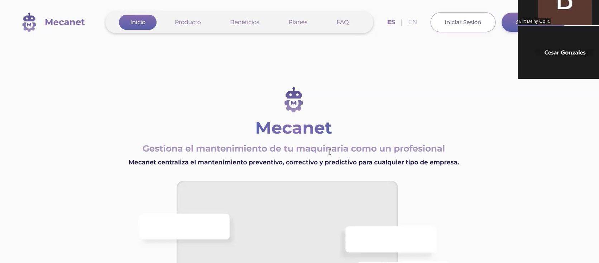 

**Resumen de entrevista:** En esta entrevista con Cesar Gonzales, administrador de producción, se presentó la landing page y la aplicación web de Mecanet. Cesar encontró la landing page muy clara y con un diseño profesional que transmitía seriedad y le generó interés en solicitar una demo. Respecto a la aplicación web, la creación de cuenta le pareció clara y sencilla. Además, destacó la facilidad del proceso para agregar maquinaria y para generar planes mensuales. En general, consideró la organización de la aplicación muy intuitiva y de fácil comprensión.


#### Entrevista #2
- **Nombre completo:** Edward Rodriguez
- **Edad:** 28
- **Cargo / Rol en la empresa:** Administrador de mantenimiento
- **Enlace del video:** [Entrevista 2](https://upcedupe-my.sharepoint.com/:v:/g/personal/u20211g671_upc_edu_pe/EUiXdf_6LnZIiGxwJgROXkcBURzF0AMJ_nUwZndGzflvUw?nav=eyJyZWZlcnJhbEluZm8iOnsicmVmZXJyYWxBcHAiOiJPbmVEcml2ZUZvckJ1c2luZXNzIiwicmVmZXJyYWxBcHBQbGF0Zm9ybSI6IldlYiIsInJlZmVycmFsTW9kZSI6InZpZXciLCJyZWZlcnJhbFZpZXciOiJNeUZpbGVzTGlua0NvcHkifX0&e=9qA2Bl)
- **Inicio:** 9:47 s
- **Fin:** 22:52 s
 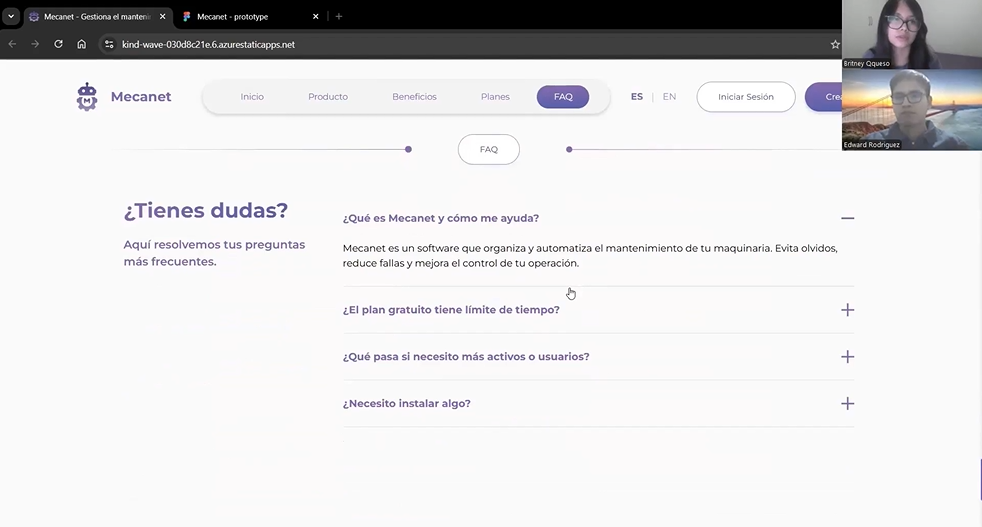

 **Resumen de entrevista:** Edward consideró la landing page útil, clara y concisa, aunque sugirió orientar más el aspecto visual hacia lo industrial con imágenes específicas. Comprendió el propósito de Mecanet de inmediato y mostró interés en probar la aplicación. En cuanto a la aplicación web, la experiencia de creación de cuenta le resultó sencilla e intuitiva, y calificó el proceso para agregar maquinaria como muy fácil y amigable. Resaltó la facilidad para identificar las opciones de registro y la claridad de la funcionalidad para generar planes mensuales, confirmando que la organización general de la aplicación es fácil de entender y comprender.

#### Entrevista #3
- **Nombre completo:** Yvania Ortiz
- **Edad:** 25
- **Cargo / Rol en la empresa:** Administradora de producción
- **Enlace del video:** [Entrevista 3](https://upcedupe-my.sharepoint.com/:v:/g/personal/u20211g671_upc_edu_pe/EUiXdf_6LnZIiGxwJgROXkcBURzF0AMJ_nUwZndGzflvUw?nav=eyJyZWZlcnJhbEluZm8iOnsicmVmZXJyYWxBcHAiOiJPbmVEcml2ZUZvckJ1c2luZXNzIiwicmVmZXJyYWxBcHBQbGF0Zm9ybSI6IldlYiIsInJlZmVycmFsTW9kZSI6InZpZXciLCJyZWZlcnJhbFZpZXciOiJNeUZpbGVzTGlua0NvcHkifX0&e=9qA2Bl)
- **Inicio:** 22:53 s
- **Fin:** 33:53 s
 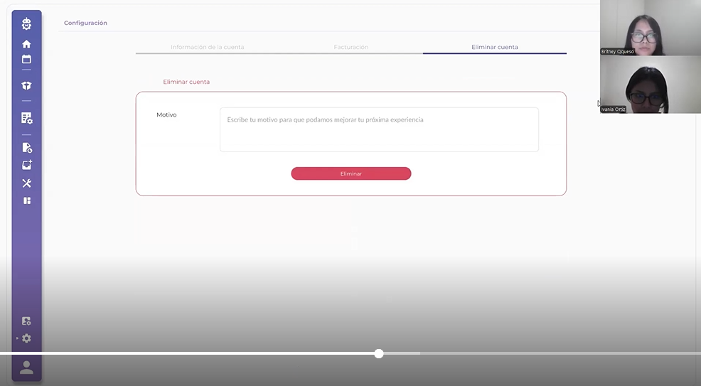

 **Resumen de entrevista:** Yvania encontró la landing page útil, pero sugirió añadir más casos de éxito y detalles en la información. Propuso incluir imágenes reales de talleres en el diseño visual para una mejor conexión con el usuario. Respecto a la aplicación web, la creación de cuenta le pareció sencilla e intuitiva, sugiriendo la opción de registro con LinkedIn. El proceso para agregar maquinaria le resultó fácil y claro, y aunque la organización de la aplicación le generó una leve confusión inicial, la encontró muy intuitiva y fácil de usar al explorarla.

### Segmento 2: Técnicos de Mantenimiento

#### Entrevista #1
- **Nombre completo:**  Antony Ramos
- **Edad:**  27
- **Puesto o función que desempeñas:** Técnico de mantenimiento predictivo
- **Enlace del video:** [Entrevista 4](https://upcedupe-my.sharepoint.com/:v:/g/personal/u20211g671_upc_edu_pe/EUiXdf_6LnZIiGxwJgROXkcBURzF0AMJ_nUwZndGzflvUw?nav=eyJyZWZlcnJhbEluZm8iOnsicmVmZXJyYWxBcHAiOiJPbmVEcml2ZUZvckJ1c2luZXNzIiwicmVmZXJyYWxBcHBQbGF0Zm9ybSI6IldlYiIsInJlZmVycmFsTW9kZSI6InZpZXciLCJyZWZlcnJhbFZpZXciOiJNeUZpbGVzTGlua0NvcHkifX0&e=9qA2Bl)
- **Inicio:** 33:54 s
- **Fin:** 42:36 s
 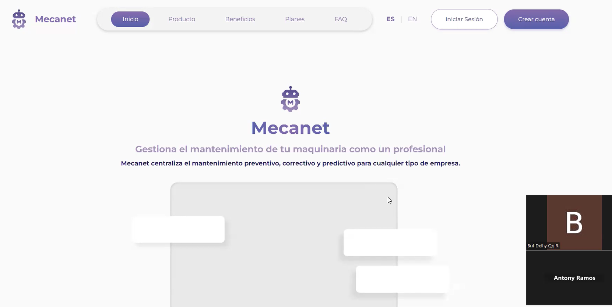

**Resumen de entrevista:** Antony encontró la landing page clara y con la información adecuada, y percibió su aspecto visual como apropiado para el sector, comprendiendo fácilmente el propósito del software. Se mostró interesado en usarlo, a pesar de utilizar SAP. Respecto a la aplicación web, el proceso de creación de cuenta le pareció sencillo. Las órdenes de trabajo le resultaron claras y el checklist reflejó las tareas típicas. Pudo completar los campos fácilmente y consideró muy importante la opción de subir imágenes o comentarios como evidencia. Para mejorar la experiencia, sugirió que la aplicación fuera rápida, accesible desde dispositivos móviles.

#### Entrevista #2
- **Nombre completo:** Darlin Castillo
- **Edad:** 23
- **Puesto o función que desempeñas:** Técnico de mantenimiento 
- **Enlace del video:** [Entrevista 5](https://upcedupe-my.sharepoint.com/:v:/g/personal/u20211g671_upc_edu_pe/EUiXdf_6LnZIiGxwJgROXkcBURzF0AMJ_nUwZndGzflvUw?nav=eyJyZWZlcnJhbEluZm8iOnsicmVmZXJyYWxBcHAiOiJPbmVEcml2ZUZvckJ1c2luZXNzIiwicmVmZXJyYWxBcHBQbGF0Zm9ybSI6IldlYiIsInJlZmVycmFsTW9kZSI6InZpZXciLCJyZWZlcnJhbFZpZXciOiJNeUZpbGVzTGlua0NvcHkifX0&e=9qA2Bl)
- **Inicio:** 42:37 s
- **Fin:** 52:26 s
 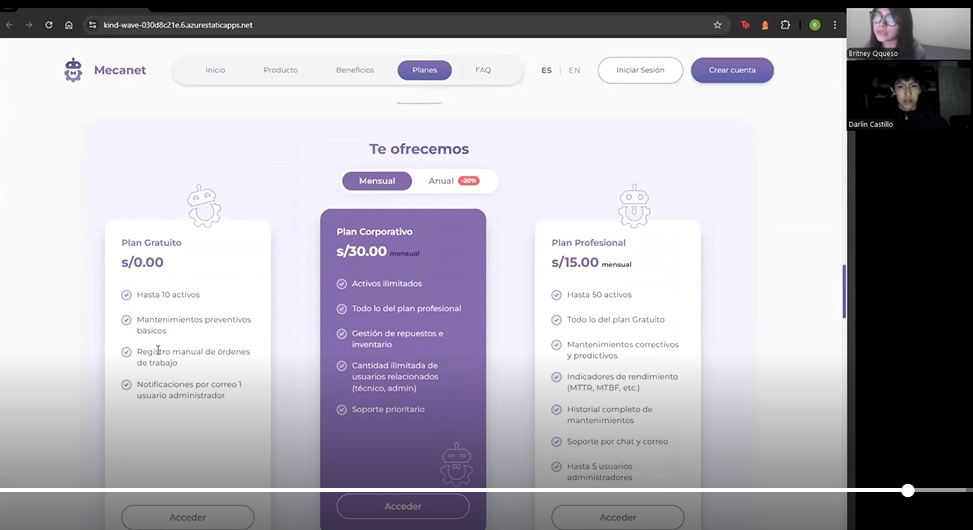

 **Resumen de entrevista:** Darlin consideró la información de la landing page bastante útil. Aunque la información era clara, le gustaría ver más detalles sobre su funcionamiento y beneficios diarios. El aspecto visual le pareció profesional, pero le faltaban información e imágenes relacionadas con el mantenimiento. Respecto a la aplicación web, la creación de cuenta fue clara. Las órdenes de trabajo le quedaron claras, pero sugirió que las ordenes de trabajo críticas aparecieran en rojo o con una alarma. El checklist reflejó sus tareas y pudo completar campos fácilmente. Confirmó la importancia de subir imágenes o comentarios y deseó acceder a la aplicación desde cualquier dispositivo, para una experiencia más rápida y cómoda.

#### Entrevista #3
- **Nombre completo:** Leonardo Ramirez
- **Edad:** 25 años  
- **Puesto o función que desempeñas:** Técnico de mantenimiento mecánico  
- **Enlace del video:** [Entrevista 6](https://upcedupe-my.sharepoint.com/:v:/g/personal/u20211g671_upc_edu_pe/EUiXdf_6LnZIiGxwJgROXkcBURzF0AMJ_nUwZndGzflvUw?nav=eyJyZWZlcnJhbEluZm8iOnsicmVmZXJyYWxBcHAiOiJPbmVEcml2ZUZvckJ1c2luZXNzIiwicmVmZXJyYWxBcHBQbGF0Zm9ybSI6IldlYiIsInJlZmVycmFsTW9kZSI6InZpZXciLCJyZWZlcnJhbFZpZXciOiJNeUZpbGVzTGlua0NvcHkifX0&e=9qA2Bl)
- **Inicio:** 52:27 s
- **Fin:** 1:02:06 s
 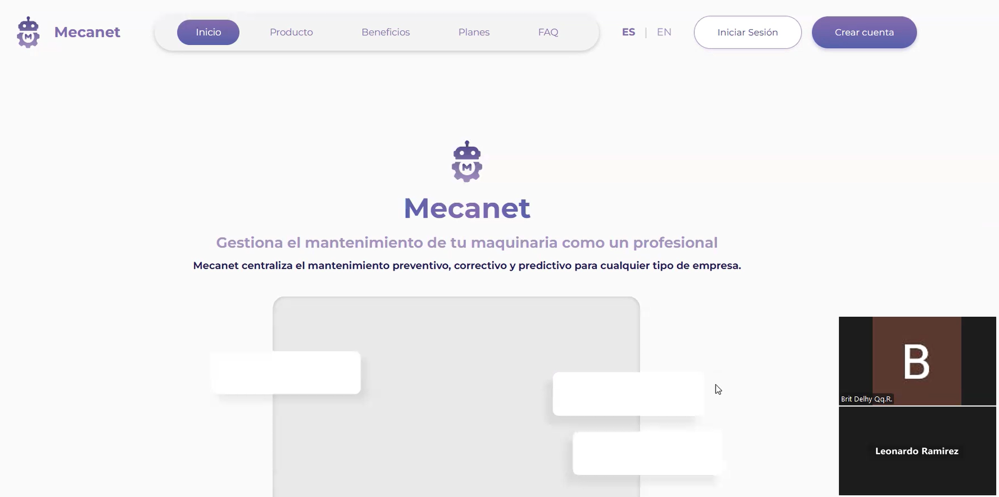

 **Resumen de entrevista:** Leonardo consideró la información de la landing page útil,pero le gustaría más detalles sobre la aplicación. El diseño le pareció profesional y comprendió que el propósito era gestionar el mantenimiento, pero le faltó especificación sobre tipos de equipos. Se animaría a usarla si otros compañeros la utilizaran o si hubiera un video corto demostrando su uso. En la aplicación web, la creación de cuenta y la gestión de órdenes de trabajo le parecieron muy claras. El checklist reflejó sus tareas típicas y pudo completar campos fácilmente. Finalmente, expresó la importancia de subir fotos o archivos como evidencia.


### 5.3.3. Evaluaciones según heurísticas.
**Site o App a Evaluar:** MecaNet

**Tareas a evaluar:**

El alcance de esta evaluación incluye la revisión de usabilidad de las siguientes tareas:

* Acceder a la aplicación desde la landing page

* Crear cuenta en la aplicación

* Inicio de sesión

* Visualización de la página de inicio

* Visualización del calendario

* Visualización del inventario (repuestos, órdenes de compra)

* Gestión de activos (maquinarias y líneas de producción)

* Visualización de órdenes de trabajo

* Visualización y ejecución de planes de mantenimiento

* Administración de personal técnico

* Configuración de cuenta

No están incluidas en esta versión de la evaluación las siguientes tareas:

* Recuperación de cuenta

* Visualización de reportes y métricas

* Acciones desde la vista técnica

**ESCALA DE SEVERIDAD:**
*Los errores serán puntuados tomando en cuenta la siguiente escala de severidad*
|***Nivel***|***Descripción***|
| :-: | :-: |
|*1*|*Problema superficial: puede ser fácilmente superado por el usuario o ocurre con muy poca frecuencia. No necesita ser arreglado a no ser que exista disponibilidad de tiempo.*|
|*2*|*Problema menor: puede ocurrir un poco más frecuentemente o es un poco más difícil de superar para el usuario. Se le debería asignar una prioridad baja resolverlo de cara al siguiente reléase*|
|*3*|*Problema mayor: ocurre frecuentemente o los usuarios no son capaces de resolverlos. Es importante que sean corregidos y se les debe asignar una prioridad alta.*|
|*4*|*Problema muy grave: un error de gran impacto que impide al usuario continuar con el uso de la herramienta. Es imperativo que sea corregido antes del lanzamiento.*|

**TABLA DE RESUMEN:**

|**#**|**Problema**|**Escala de severidad**|**Heurística/principio violada(o)**|
| :- | :- | :- | :- |
|1| No hay formulario de contacto en la landing page | 3 | Usability: Help and documentation |
|2| El formulario de registro solicita muy poca información del usuario | 2 | Usability: Aesthetic and minimalist design |

**DESCRIPCIÓN DE PROBLEMAS:**

**PROBLEMA #1:** No hay formulario de contacto en la landing page

**Severidad:** 3

**Heurística violada:** Usability: Help and documentation

**Problema**: Aunque la landing page incluye una sección de preguntas frecuentes (FAQs), no se ofrece un canal directo para que los usuarios envíen otras consultas. La ausencia de un formulario de contacto puede limitar el soporte al usuario y generar frustración si sus dudas no están entre las FAQs.

**Imagen:**

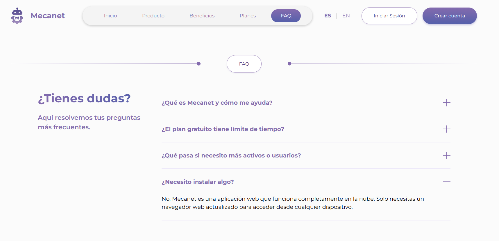


**Recomendación:** Incluir un formulario de contacto con campos básicos (nombre, correo, mensaje) y una confirmación visual del envío. Esto permitirá que los usuarios se comuniquen directamente con el equipo de soporte para resolver inquietudes que no estén en la sección de preguntas frecuentes.

-----

**PROBLEMA #2:** El formulario de registro solicita muy poca información del usuario

**Severidad:** 2

**Heurística violada:** Usability: Aesthetic and minimalist design

**Problema**: En el formulario de registro actualmente solo se solicitan campos básicos como nombre de empresa, ruc, correo y contraseña. Esto resulta insuficiente para capturar información relevante que podría ser útil para la personalización del sistema o la gestión administrativa. 

**Imagen:**

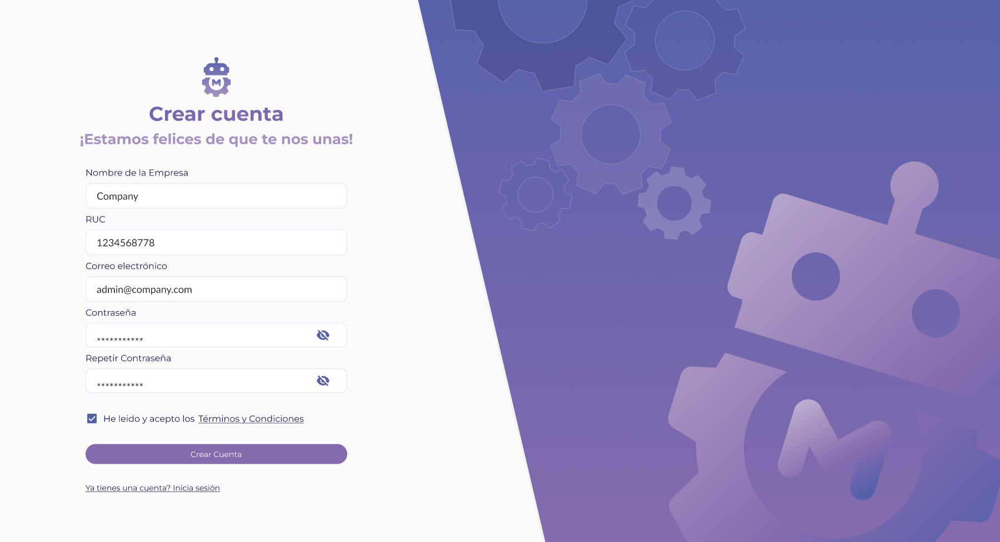

**Recomendación:** Ampliar el formulario de registro para incluir campos adicionales como ciudad, país, dirección, etc, utilizando una estructura visual clara que no sature al usuario.

## 5.4. Video About-the-Product
En el vídeo se proporciona información sobre el producto Mecanet. Se mencionan las diferentes funcionalidades de la aplicación como son el registro y autenticación de usuarios, gestión de activos (maquinarias y líneas de producción), administración del inventario, etc.

Imagen del Video About The Product:
<br>

link: https://www.youtube.com/watch?v=QKpEu8YCnMQ&ab_channel=Mayo

Enlace al vídeo de Microsoft Stream: [Video About The Product]()

# Conclusiones y recomendaciones.
## Conclusiones: 
 ### Problema Principal
En la actualidad, muchas empresas industriales enfrentan problemas debido al uso de métodos manuales y herramientas dispersas para gestionar el mantenimiento de sus activos. Esto genera ineficiencias, paros no programados y decisiones basadas en información incompleta o errónea.

### La Solución de Mecanet
Mecanet proporciona una plataforma digital integral para gestionar el mantenimiento de activos de forma centralizada. Esto incluye la planificación de mantenimientos, gestión de inventarios, generación de reportes técnicos y registro de activos, todo en una sola interfaz amigable y fácil de usar.

### Beneficios Clave para los Usuarios

- **Administradores**: Mejor toma de decisiones gracias a la automatización de procesos y visualización clara de KPIs. Esto permite una mayor eficiencia en la planificación y ejecución de mantenimiento.
  
- **Técnicos**: Acceso en tiempo real a las órdenes de trabajo, tareas asignadas y un sistema claro para registrar y hacer seguimiento de las actividades. Esto optimiza la productividad y reduce los errores operativos.

### Optimización de Procesos
La plataforma de Mecanet mejora la eficiencia operativa al automatizar tareas repetitivas y ofrecer una visibilidad clara de los indicadores clave de rendimiento (KPIs), lo que permite decisiones más rápidas y basadas en datos.

### Enfoque en la Simplicidad
Mecanet ha sido diseñado para ofrecer soluciones prácticas y de impacto inmediato. Se han evitado características que no generaban un valor directo, como sistemas de retroalimentación complejos, para centrarse en lo esencial.

### Accesibilidad y Facilidad de Uso
La interfaz ha sido pensada para ser intuitiva, incluso para usuarios con poca experiencia en tecnología. El diseño visual con colores y tipografía claras facilita la navegación, especialmente en entornos industriales.

### Enfoque Centrado en el Usuario
Las mejoras están alineadas con las necesidades reales de los usuarios, basadas en entrevistas y en un análisis detallado de los flujos de trabajo actuales. La plataforma se adapta a las tareas diarias de los usuarios sin sobrecargarlo de funciones innecesarias.

### Mercado Potencial
Mecanet tiene un mercado claro entre medianas empresas industriales de Latinoamérica que no han adoptado soluciones digitales completas para la gestión de mantenimiento, pero que buscan aumentar su eficiencia sin recurrir a sistemas demasiado complejos o costosos.

### Visión a Futuro
Mecanet no solo resuelve los problemas inmediatos de las empresas, sino que tiene el potencial de transformar la manera en que se gestionan los procesos de mantenimiento en la industria, ofreciendo una solución escalable que puede adaptarse al crecimiento de las empresas.

### Sprint 1
- Durante el Sprint 1, el equipo logró desplegar la primera versión funcional de la Landing Page de Mecanet, cumpliendo con el objetivo de presentar de forma clara y atractiva la propuesta de valor del sistema. Se implementaron secciones clave —como el Hero, Navbar, Benefits, Pricing, FAQ y Footer— garantizando coherencia visual, navegación intuitiva y compatibilidad en distintos dispositivos.
- Gracias a este entregable, Mecanet ya cuenta con una vitrina digital que comunica sus beneficios, planes y funcionalidades, lo cual sienta las bases para captar la atención de clientes potenciales y validar la propuesta frente a usuarios reales.
- Además, el equipo demostró un alto nivel de coordinación y colaboración, distribuyendo tareas específicas por componente y manteniendo un flujo de integración y despliegue continuo (CI/CD) mediante GitHub Actions y Azure Static Web Apps.
- El enfoque de este primer Sprint fue totalmente orientado a la presentación visual y estructura base, por lo que la integración con backend y la documentación de servicios quedan planificadas para los próximos Sprints.

### Sprint 2
- Durante el Sprint 2, el equipo logró avances significativos en el desarrollo e integración de los componentes del sistema. Se cumplió con el Sprint Backlog priorizado, incluyendo funcionalidades clave y su despliegue exitoso en entornos cloud. Las siguientes conclusiones resumen los aprendizajes y resultados:
- Se consolidó la colaboración entre los líderes de aspecto y los integrantes del equipo, lo que permitió una mayor fluidez en la comunicación y ejecución de tareas.
- Se logró el despliegue completo de la Landing Page, la Aplicación Web y los Servicios Web, lo que marca un hito en la visibilidad externa y validación de funcionalidades mínimas del producto.
- La documentación de los servicios y el código fue completada de forma satisfactoria, facilitando el entendimiento común del proyecto entre los miembros actuales y futuros.
- El equipo mostró mejoras en la capacidad de estimación y asignación de tareas, logrando entregar dentro del tiempo previsto.

### Sprint 3
- Durante el Sprint 3, el equipo desarrolló e implementó la lógica principal del backend de Mecanet, cumpliendo con el Backlog priorizado de endpoints REST para usuarios, roles, activos, inventario, órdenes de trabajo y métricas.
- Se validó la correcta comunicación entre módulos mediante pruebas locales y despliegue en la nube (Azure), sentando la base técnica para la integración con el frontend.
- La documentación de los servicios se completó usando Swagger, garantizando que los endpoints puedan ser consultados y probados fácilmente por el equipo de desarrollo.
- Se reforzó la estructura de seguridad básica del sistema, incorporando validaciones y control de acceso mediante autenticación y hash de contraseñas.
- El equipo mantuvo una coordinación efectiva para el modelado de entidades, controladores REST y pipeline de despliegue, asegurando la escalabilidad y mantenibilidad del backend.

### Sprint 4

- Durante el Sprint 4, el equipo completó la integración total entre frontend y backend, asegurando una versión navegable y funcional de Mecanet.
- Se validó la conexión en tiempo real de todos los módulos clave: usuarios, activos, inventario, mantenimiento, métricas y reportes.
- Se implementó y probó el servicio externo de envío de correos, ampliando la interacción y notificaciones automáticas para los usuarios.
- Se consolidó la documentación técnica de todos los servicios RESTful con Swagger, garantizando su consulta y prueba directa.
- Se logró el despliegue final en producción con flujos CI/CD, validando que el sistema opera correctamente en un entorno real y accesible.

El proyecto Mecanet permitió validar que muchas empresas industriales aún dependen de métodos manuales y herramientas dispersas para gestionar el mantenimiento de activos, confirmando el Problem Statement inicial.

A través de los Sprints, se demostró que una plataforma centralizada es viable técnica y funcionalmente, facilitando la planificación de mantenimientos, la gestión de activos, inventario y órdenes de trabajo, alineándose con los Hypotheses Statements y cumpliendo los criterios de éxito definidos en Lean UX.

La implementación incremental y validación de cada módulo evidenció que los segmentos de usuarios (administradores y técnicos) valoran la simplicidad, la automatización de procesos clave y la visualización clara de información, confirmando varios assumptions del diseño inicial.

El despliegue en entornos reales y la integración de servicios externos (como Email Service) reforzaron la escalabilidad y sostenibilidad del modelo, sentando las bases para la evolución futura del producto digital.


## Recomendaciones 

**Fomentar la Colaboración Constante**: Es importante mantener una comunicación fluida entre todos los miembros del equipo durante todo el proceso de desarrollo. Utilizar herramientas de gestión de proyectos y reuniones regulares para asegurar que todos estén alineados con los objetivos y plazos.

**Priorizar la Simplicidad en el Diseño**: Aunque la plataforma tiene múltiples funcionalidades, debemos asegurar que cada función esté diseñada de manera intuitiva y accesible para los usuarios, especialmente aquellos con poca experiencia tecnológica. El diseño debe ser limpio y fácil de navegar. <br/>

Optimizar la gestión del tiempo y recursos en tareas críticas, especialmente aquellas relacionadas con la integración y pruebas de funcionalidades entre los distintos componentes. <br/>

Continuar promoviendo las retrospectivas internas de equipo al final de cada Sprint, lo que ha demostrado ser útil para identificar obstáculos y mejorar la dinámica de trabajo. <br/>

Fomentar aún más la documentación técnica paso a paso, especialmente en las tareas relacionadas con infraestructura y despliegue, para facilitar el onboarding de nuevos miembros o el traspaso de responsabilidades. 

Continuar con pruebas de usuario más amplias para recoger feedback real de empresas objetivo, mejorando flujos de uso, reportes y notificaciones según la experiencia directa de los técnicos y administradores.

Desarrollar módulos complementarios como métricas avanzadas (predictivas) y tableros de BI que potencien la toma de decisiones estratégicas de mantenimiento.

Explorar integraciones con IoT o sensores en tiempo real para automatizar aún más la captura de datos de activos y líneas de producción.

Definir un Roadmap de funcionalidades priorizando la mejora continua de la interfaz, la automatización de tareas repetitivas y la ampliación de servicios externos como pagos, alertas SMS o integraciones con ERPs.

Mantener el flujo de CI/CD y despliegue en la nube, revisando periódicamente la arquitectura para sostener escalabilidad y seguridad conforme crezca la base de usuarios.

Extender la integración con sistemas de autenticación corporativa (SSO) para facilitar la adopción en medianas y grandes empresas.

Explorar modelos de suscripción escalable, integrando pasarelas de pago que permitan monetizar nuevas funciones premium.

Implementar dashboards personalizables para que cada rol (admin, técnico, supervisor) tenga métricas y vistas adaptadas a sus tareas diarias.

Potenciar la automatización de alertas vía email o SMS ante incidencias críticas, mantenimiento pendiente o baja de inventario.

Ampliar las pruebas de estrés y seguridad para validar la robustez del backend frente a picos de uso y posibles vulnerabilidades.

Mantener actualizado el entorno de documentación técnica, con diagramas de arquitectura y ejemplos de integración, para apoyar la escalabilidad del equipo y facilitar auditorías externas.

<br/>

# Video About-the-Team.

link: https://www.youtube.com/watch?v=I3xC4kqr_JM&ab_channel=Mayo


# Bibliografía
McKinsey & Company. (2021). Innovación a través de la disrupción digital en servicio a clientes. [https://www.mckinsey.com/pe/our-insights/innovation-through-the-digital-disruption-of-customer-service](https://www.mckinsey.com/pe/our-insights/innovation-through-the-digital-disruption-of-customer-service) 
# Anexos


Link del Frontend Desplegado: https://agreeable-moss-0b81a851e.6.azurestaticapps.net/

Link del Backend del proyecto desplegado: https://mecanetbackend-hjexa7d8bkfybmfv.centralus-01.azurewebsites.net/swagger-ui/index.html

Link de la Landing Page: https://kind-wave-030d8c21e.6.azurestaticapps.net/

Link del Repositorio del Proyecto: https://github.com/wiwitech1/mecanet-frontend

Link del Repositorio del informe: https://github.com/wiwitech1/Project-Report?tab=readme-ov-file

Link del Respositorio de la Landing Page: https://github.com/wiwitech1/mecanet-l4nding-page

Link del Repositorio del frontend: https://github.com/wiwitech1/mecanet-frontend.git

Link del Repositorio del backend: https://github.com/wiwitech1/mecanet-backend.git

Link del Figma: https://www.figma.com/design/DrWdD2WCsYdhWQ633erUJM/Mecanet?node-id=0-1&t=TNttHot2q3YOT97v-1

Link del Prototipo: https://www.figma.com/proto/DrWdD2WCsYdhWQ633erUJM/Mecanet?node-id=344-4101&p=f&t=TNttHot2q3YOT97v-0&scaling=scale-down-width&content-scaling=fixed&page-id=344%3A4100&starting-point-node-id=344%3A4101&show-proto-sidebar=1

Link del Video About the Product 
- Youtube: https://www.youtube.com/watch?v=QKpEu8YCnMQ&t=1s&ab_channel=Mayo
- Microsoft Stream: https://upcedupe-my.sharepoint.com/:v:/g/personal/u202210259_upc_edu_pe/EQBg5fvni5RItoLVHdwa7wUBntB9q7JdxX9SudQ-9-9Mmg?nav=eyJyZWZlcnJhbEluZm8iOnsicmVmZXJyYWxBcHAiOiJPbmVEcml2ZUZvckJ1c2luZXNzIiwicmVmZXJyYWxBcHBQbGF0Zm9ybSI6IldlYiIsInJlZmVycmFsTW9kZSI6InZpZXciLCJyZWZlcnJhbFZpZXciOiJNeUZpbGVzTGlua0NvcHkifX0&e=S4oQ5W

Link del Video About the Team: 
- Youtube: https://youtu.be/hPjQ2KmTaJc
- Microsoft Stream: https://upcedupe-my.sharepoint.com/:v:/g/personal/u202210259_upc_edu_pe/EX76tS-Dm4dLrL-p8kWQry0BvFrJg5E_LhOPLoCTAmDbVA?nav=eyJyZWZlcnJhbEluZm8iOnsicmVmZXJyYWxBcHAiOiJPbmVEcml2ZUZvckJ1c2luZXNzIiwicmVmZXJyYWxBcHBQbGF0Zm9ybSI6IldlYiIsInJlZmVycmFsTW9kZSI6InZpZXciLCJyZWZlcnJhbFZpZXciOiJNeUZpbGVzTGlua0NvcHkifX0&e=DWtFV9

Video de Exposición TF: https://upcedupe-my.sharepoint.com/:f:/g/personal/u202315044_upc_edu_pe/ElPzoam4P69JnQw_Xb0NQjsB-xNWCkOJnwn8TIbYh0_tjg?e=xfiiNU

Link de las entrevivistas de validación: https://upcedupe-my.sharepoint.com/:v:/g/personal/u20211g671_upc_edu_pe/EUiXdf_6LnZIiGxwJgROXkcBURzF0AMJ_nUwZndGzflvUw?nav=eyJyZWZlcnJhbEluZm8iOnsicmVmZXJyYWxBcHAiOiJPbmVEcml2ZUZvckJ1c2luZXNzIiwicmVmZXJyYWxBcHBQbGF0Zm9ybSI6IldlYiIsInJlZmVycmFsTW9kZSI6InZpZXciLCJyZWZlcnJhbFZpZXciOiJNeUZpbGVzTGlua0NvcHkifX0&e=UyjdRf

Link de las entrevistas de análisis a segmentos objetivos: https://upcedupe-my.sharepoint.com/:v:/g/personal/u20211g671_upc_edu_pe/EZ7oSsX0nrZDsIMT8lkDthsBicpEDLUrGZinZpFjJkpgwQ?nav=eyJyZWZlcnJhbEluZm8iOnsicmVmZXJyYWxBcHAiOiJPbmVEcml2ZUZvckJ1c2luZXNzIiwicmVmZXJyYWxBcHBQbGF0Zm9ybSI6IldlYiIsInJlZmVycmFsTW9kZSI6InZpZXciLCJyZWZlcnJhbFZpZXciOiJNeUZpbGVzTGlua0NvcHkifX0&e=b8T3iv

